---
markmap:
  colorFreezeLevel: 2
  initialExpandLevel: 1
---

# 第五章 根及根茎类中药
- 根(radix)与根茎(rhizoma)为植物两种不同器官，因多数中药兼具二者，故并入一章

## 第一节 概述

### 一、根类中药

#### (一) 性状鉴别
- 双子叶植物根：多为直根系，主根发达呈圆柱形（甘草/防风/牛膝）、圆锥形肉质（桔梗/白芷）、纺锤形块根（何首乌）；外表常有栓皮
- 单子叶植物根：多为须根系，前中部膨大成块根呈纺锤形（麦冬/郁金）；外表无栓皮
- 横断面区分：双子叶植物根有形成层环纹，木质部范围大于皮部，无髓部，有放射状纹理；单子叶植物根有内皮层环纹，皮部宽广，中柱小于皮部，有髓部，无放射状纹理
- 特殊断面构造：何首乌"云锦花纹"、商陆"罗盘纹"

#### (二) 显微鉴别
- 双子叶植物根：一般具次生构造，最外层为周皮（木栓层/木栓形成层/栓内层）；少数无周皮而有表皮（龙胆、威灵仙）或"后生表皮"（细辛）或"后生皮层"（川乌）
  - 维管束为无限外韧型；初生木质部位于中央呈星角状，束数2～6（牛膝为二原型）
  - 异常构造：多环性同心环维管束（牛膝、商陆）；附加维管柱（何首乌）；内涵韧皮部（华山参）；木间木栓（黄芩、甘松）
- 单子叶植物根：一般具初生构造，最外层为表皮（少数形成根被，如百部、麦冬）；皮层宽厚分外皮层/皮层薄壁组织/内皮层；维管束为辐射型无形成层；髓部明显

### 二、根茎类中药

#### (一) 性状鉴别
- 类型：根状茎（节间明显，如苍术/白术/川芎/石菖蒲/黄精）、块茎（半夏/天麻）、球茎（荸荠）、鳞茎（川贝母/百合；假鳞茎如山慈菇）
- 横断面区分：双子叶植物根茎中央有明显髓部、形成层环、木部放射状纹理；单子叶植物根茎有内皮层环纹、无形成层环、维管束小点散布、髓部不明显
- 特殊构造：大黄"星点"（异型维管束）

#### (二) 显微鉴别
- 双子叶植物根茎：具次生构造，与地上茎相似；异常构造有髓维管束（大黄星点）、内生韧皮部（茄科/葫芦科）、木间木栓（甘松）
- 单子叶植物根茎：具初生构造，维管束多为有限外韧型散布，髓部不明显；少数后生皮层（藜芦）
- 蕨类植物根茎：初生构造，多具网状中柱（分体中柱排列为鉴定依据，如绵马贯众），或双韧管状中柱（狗脊）；木质部多无导管而有梯纹管胞
- 常见分泌组织：油室（川芎、苍术）、油细胞（石菖蒲、干姜）、黏液细胞含草酸钙针晶（半夏、白及）；厚壁组织如石细胞带（苍术木栓层、黄连皮层及中柱鞘）

## 第二节 药材（饮片）鉴定

### 狗脊 Cibotii Rhizoma
- 来源：蚌壳蕨科植物金毛狗脊 *Cibotium barometz* (L.) J.Sm. 的干燥根茎
- 产地：主产福建、四川、广西、云南
- 采收加工：秋冬采挖；削去硬根叶柄及金黄色茸毛切厚片晒干为"生狗脊片"；蒸后晒至六七成干切片为"熟狗脊片"
- 性状鉴别：不规则长块状，表面深棕色被金黄色茸毛，上部有棕红色叶柄残基，下部有黑色细根，质坚硬难折断，味淡微涩
  - 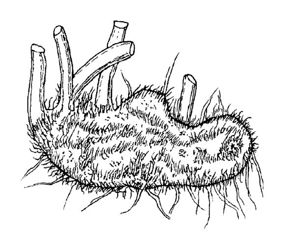
- 显微鉴别：根茎横切面表皮残存金黄色非腺毛；棕黄色厚壁细胞10余列；双韧管状中柱，木质部环状由管胞组成；叶柄基部分体中柱多呈"U"字形30余个双卷状排列
  - 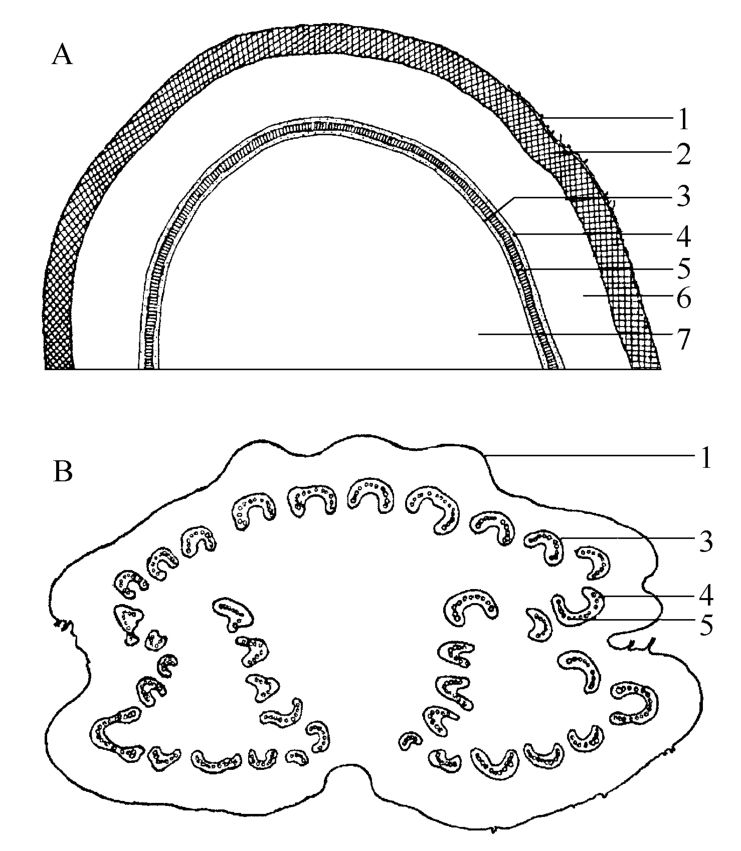
- 成分：淀粉(约30%)、绵马酚、棕榈酸、原儿茶酸、原儿茶醛等
- 理化鉴别：紫外光灯(254nm)断面显淡紫色荧光，木质部环显黄色荧光；薄层色谱与原儿茶醛/原儿茶酸对照
- 功效：性温，味苦、甘。祛风湿，补肝肾，强腰膝
- 附注：狗脊蕨、蜈蚣草等多种蕨类根茎曾混作狗脊（黑狗脊），均非正品

### 绵马贯众 Dryopteridis Crassirhizomatis Rhizoma（附：紫萁贯众）
- 来源：鳞毛蕨科植物粗茎鳞毛蕨 *Dryopteris crassirhizoma* Nakai 的干燥根茎和叶柄残基
- 产地：主产黑龙江、吉林、辽宁
- 采收加工：秋季采挖，削去叶柄须根，晒干
- 性状鉴别：倒卵形稍弯曲，外表黄棕色至黑褐色，密被叶柄残基及鳞片；叶柄残基断面有黄白色维管束小点5～13个排列成环；味初淡微涩后渐苦辛
  - 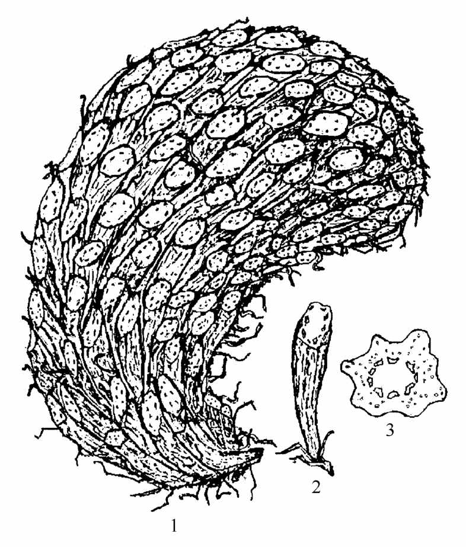
- 显微鉴别：叶柄基部横切面下皮10余列棕色厚壁细胞；具单细胞间隙腺毛；周韧维管束（分体中柱）5～13个环列
  - 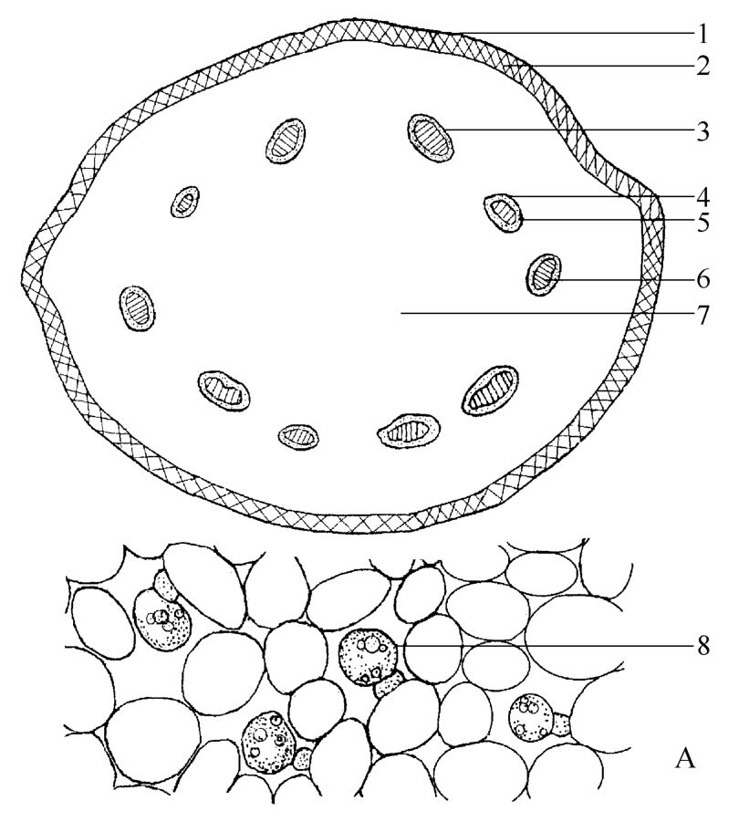
- 成分：间苯三酚类化合物（绵马酸类、黄绵马酸类、白绵马素类、去甲绵马素类、绵马酚等），为抗肿瘤及杀虫有效成分
- 理化鉴别：薄层色谱对照绵马贯众对照药材；间隙腺毛遇1%香草醛+盐酸显红色
- 功效：性微寒，味苦；有小毒。清热解毒，杀虫
- 附注：商品贯众有6科31种，正品外混淆品有狗脊贯众、荚果蕨贯众、蛾眉蕨贯众等，均以分体中柱数目和排列方式区分，均非正品
- 【附】紫萁贯众：紫萁科植物紫萁 *Osmunda japonica* Thunb. 的干燥根茎和叶柄残基，叶柄基部断面有"U"形筋脉纹；性微寒味苦有小毒，清热解毒、止血、杀虫

### 骨碎补 Drynariae Rhizoma
- 来源：水龙骨科植物槲蕨 *Drynaria fortunei* (Kunze) J.Sm. 的干燥根茎
- 产地：主产湖北、浙江，西南地区亦产
- 性状鉴别：扁平长条状多弯曲，密被深棕色至暗棕色小鳞片柔软如毛，断面红棕色维管束黄色点状排列成环，味淡微涩
- 显微鉴别：分体中柱17～28个环列，维管束周韧型，薄壁细胞壁波状弯曲
- 成分：黄酮类（橙皮苷、柚皮苷）、四环三萜类、β-谷甾醇、豆甾醇
- 功效：性温，味苦。疗伤止痛，补肾强骨；外用消风祛斑
- 附注：中华槲蕨（青海）、崖姜"大骨碎补"、大叶骨碎补"硬骨碎补"、海州骨碎补等混淆品，均非正品

### 细辛 Asari Radix et Rhizoma
- 来源：马兜铃科植物北细辛 *Asarum heterotropoides* Fr.Schmidt var. *mandshuricum* (Maxim.) Kitag.、汉城细辛 *A. sieboldii* Miq.var. *seoulense* Nakai 或华细辛 *A. sieboldii* Miq. 的干燥根和根茎（前两种习称"辽细辛"）
- 产地：北细辛与汉城细辛主产东北；华细辛主产陕西、河南、山东、浙江
- 采收加工：夏季果熟期或初秋采挖，阴干
- 性状鉴别：根茎横生不规则圆柱状具环节，根细长密生节上，断面黄白色，气辛香，味辛辣麻舌
  - 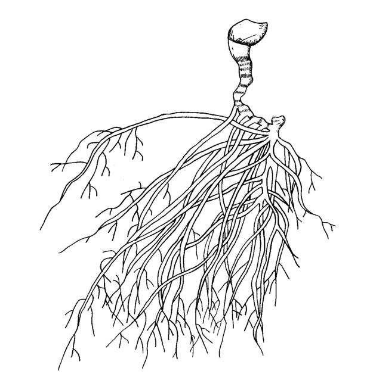
- 显微鉴别：根横切面后生表皮1列类方形细胞；皮层有油细胞；初生木质部通常三原型；薄壁细胞充满淀粉粒
  - 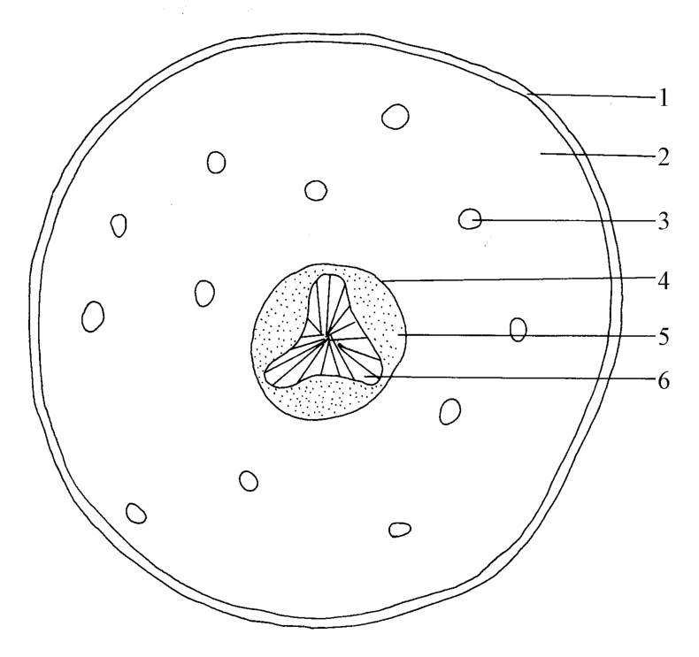
- 成分：挥发油（甲基丁香酚、α-蒎烯、细辛脑等），北细辛含挥发油2.65%
- 检查：含马兜铃酸Ⅰ不得过0.001%（《中国药典》HPLC法）
- 含量测定：含挥发油不得少于2.0%(mL/g)；含细辛脂素不得少于0.050%
- 功效：性温，味辛。解表散寒，祛风止痛，通窍，温肺化饮
- 附注：历代本草药用部位为根，东北地区用带根全草，根叶挥发油含量相差悬殊；同属24种3变种曾混作细辛或土细辛，需以花柱/柱头/叶形等区别

### 大黄 Rhei Radix et Rhizoma
- 来源：蓼科植物掌叶大黄 *Rheum palmatum* L.、唐古特大黄 *R. tanguticum* Maxim.ex Balf. 或药用大黄 *R. officinale* Baill. 的干燥根和根茎
- 产地：掌叶大黄主产甘肃/青海/西藏/四川（多栽培，产量最大）；唐古特大黄主产青海/甘肃/西藏；药用大黄主产四川/贵州/云南/湖北
- 采收加工：秋末茎叶枯萎或次春发芽前采挖，刮去外皮（忌用铁器），切瓣或段干燥
- 性状鉴别：类圆柱形/圆锥形/卵圆形，表面黄棕色至红棕色，可见类白色网状纹理"锦纹"；质坚实，断面淡红棕色，根茎髓部有"星点"（异常维管束）环列或散在，根无星点；气清香，味苦微涩，嚼之黏牙有沙粒感，唾液染黄色
  - 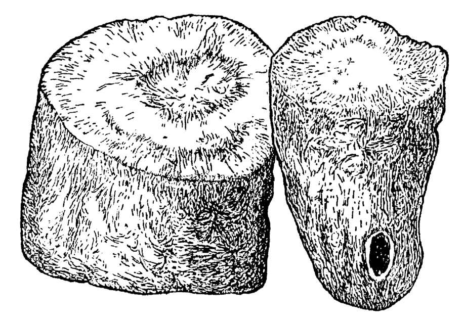
- 显微鉴别：根茎横切面韧皮部薄壁组织发达有黏液腔；形成层成环；髓部有异常维管束排列成环状或散在（星点）；薄壁细胞含草酸钙簇晶及淀粉粒；根横切面无髓
  - 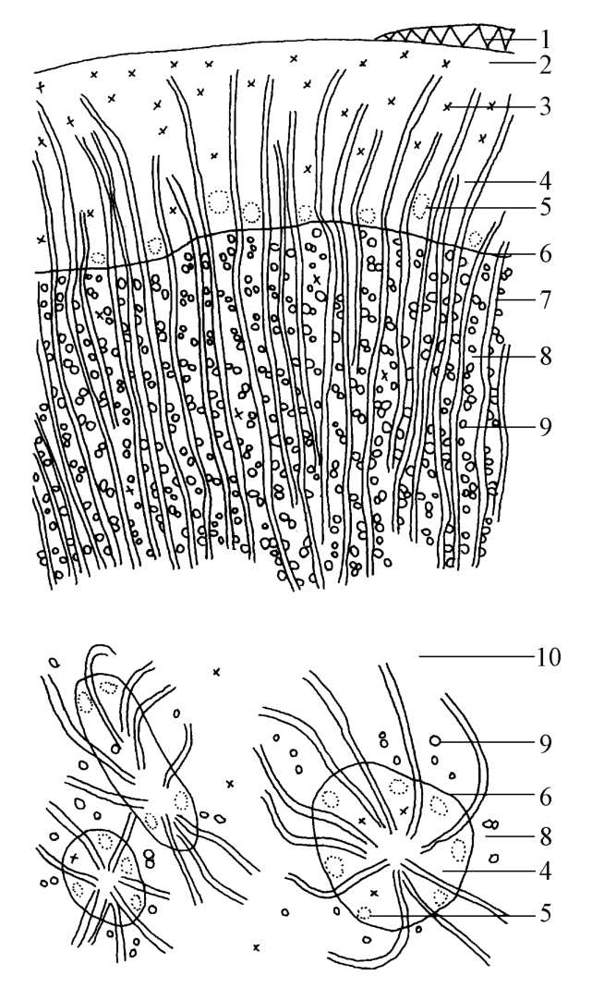
  - 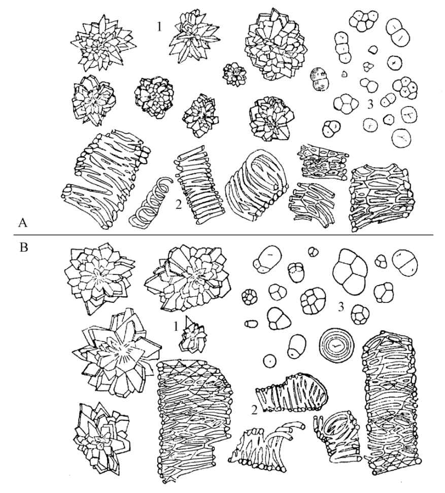
- 成分：游离蒽醌（大黄酸、大黄素、大黄酚、芦荟大黄素、大黄素甲醚，为抗菌成分）；结合性蒽醌双蒽酮苷（番泻苷A/B/C/D/E/F，为主要泻下成分，双蒽酮苷作用最强）；鞣质类（止泻收敛成分）
- 理化鉴别：薄层色谱与对照药材及对照品比对，紫外灯(365nm)显5个橙黄色荧光主斑点，氨蒸气熏后变红色；微量升华见菱状针晶或羽状结晶
  - 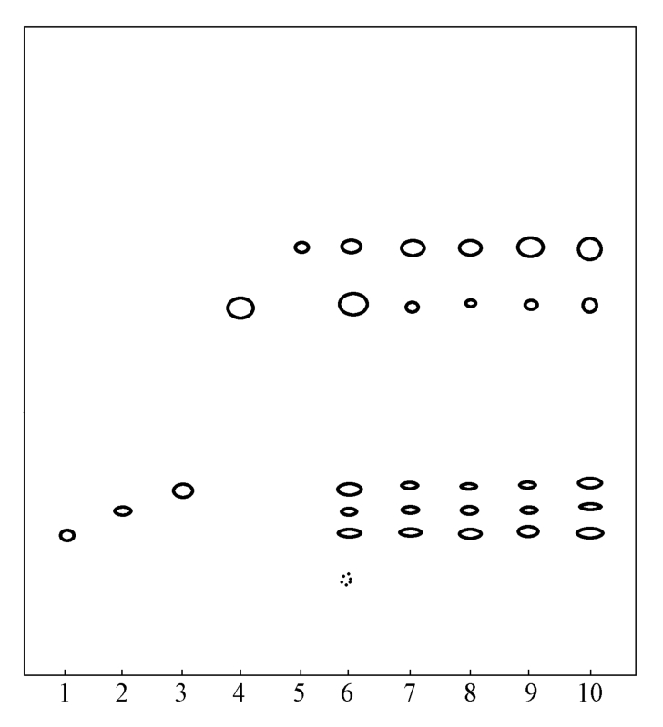
- 检查：土大黄苷检查（聚酰胺薄膜薄层色谱，不得显相同亮蓝色荧光斑点，区别于山大黄/土大黄伪品）
- 含量测定：含总蒽醌（芦荟大黄素+大黄酸+大黄素+大黄酚+大黄素甲醚）不得少于1.50%；含游离蒽醌不得少于0.20%
- 功效：性寒，味苦。泻下攻积，清热泻火，凉血解毒，逐瘀通经，利湿退黄
- 附注：藏边大黄、河套大黄等同属植物在民间称"山大黄"或"土大黄"，含土大黄苷而不含番泻苷类，泻下作用差，均非正品

### 何首乌 Polygoni Multiflori Radix（附：首乌藤）
- 来源：蓼科植物何首乌 *Polygonum multiflorum* Thunb. 的干燥块根
- 产地：主产河南、湖北、广西、广东
- 采收加工：秋冬叶枯萎时采挖，削去两端，洗净，个大者切块干燥
- 性状鉴别：团块状或不规则纺锤形，表面红棕色或红褐色皱缩不平，断面浅黄棕色有粉性，皮部有4～11个"云锦花纹"环列（异型维管束），中央木部发达；味微苦而甘涩
  - 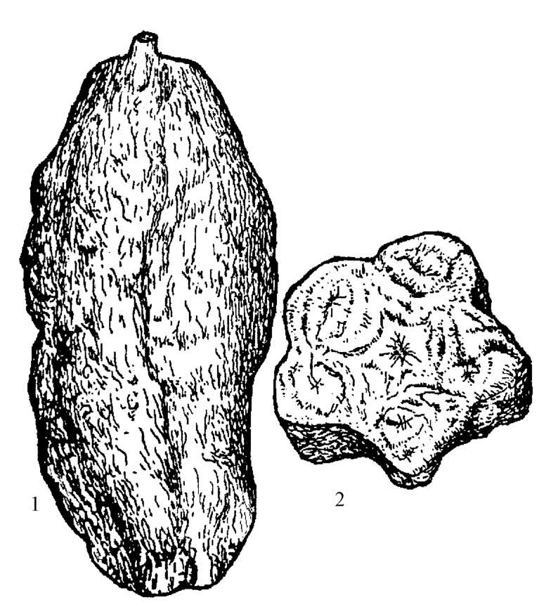
- 显微鉴别：横切面木栓层含棕色物质；韧皮部外侧异型维管束4～11个外韧型；中央形成层呈环状；薄壁细胞含草酸钙簇晶及淀粉粒
  - 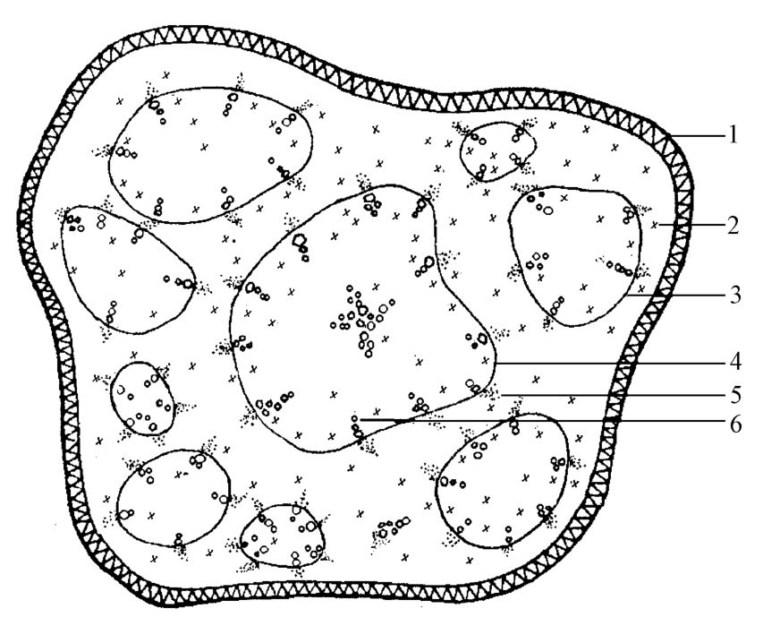
  - 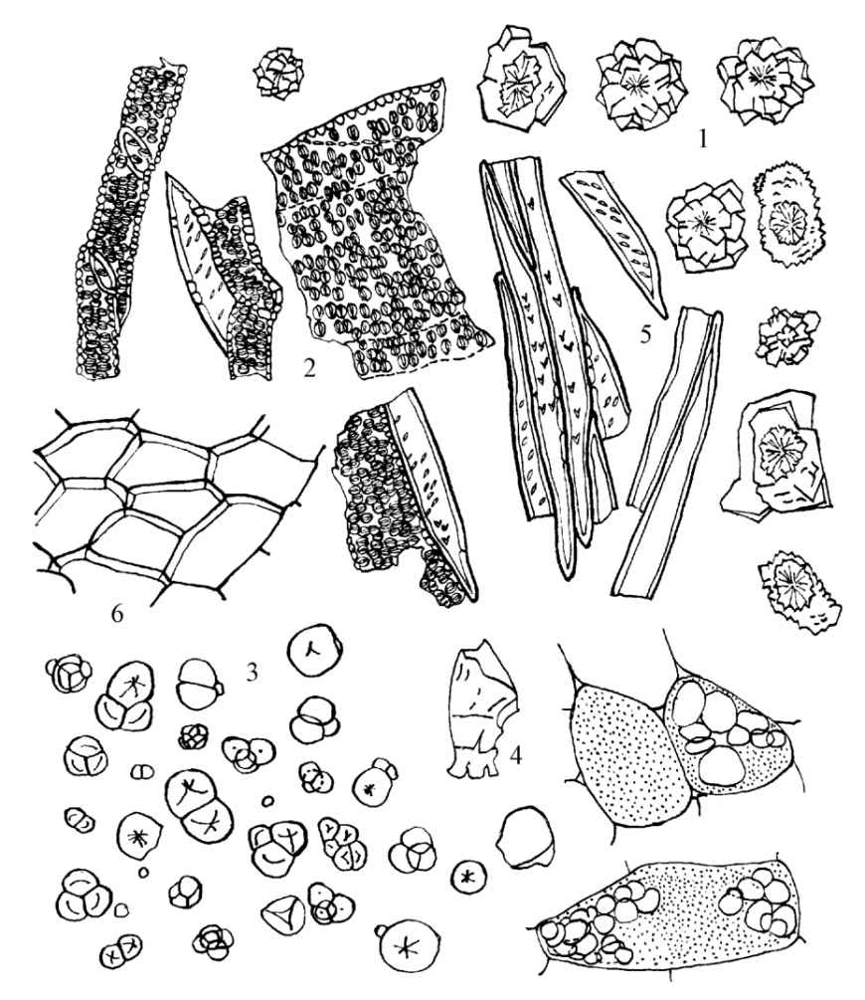
- 成分：卵磷脂(约3.7%)；蒽醌衍生物(约1.1%，大黄酚、大黄素为主)；二苯乙烯苷类（水溶性成分）；含铁量为补血药中最高
- 理化鉴别：薄层色谱与何首乌对照药材比对，紫外灯(365nm)显相同颜色荧光斑点
- 含量测定：含2,3,5,4′-四羟基二苯乙烯-2-O-β-D-葡萄糖苷不得少于1.0%；含结合蒽醌（大黄素+大黄素甲醚）不得少于0.10%
- 功效：性微温，味苦、甘、涩。解毒，消痈，截疟，润肠通便
- 附注：白首乌（萝藦科牛皮消块根，无云锦花纹）、翼蓼"红药子"、毛脉蓼"朱砂七/黄药子"均为混淆品，断面均无云锦花纹，均非正品
- 【附】首乌藤（夜交藤）：何首乌的干燥藤茎，断面皮部紫红色木部黄白色具多数小孔；性平味甘，养血安神，祛风通络

### 牛膝 Achyranthis Bidentatae Radix
- 来源：苋科植物牛膝 *Achyranthes bidentata* Bl. 的干燥根
- 产地：主产河南武陟、沁阳等地（习称"怀牛膝"），栽培品
- 采收加工：冬季茎叶枯萎时采挖，晒至干皱后顶端切齐晒干
- 性状鉴别：细长圆柱形，表面灰黄色或淡棕色，断面淡棕色微呈角质样油润，中心维管束木部较大，外围散有黄白色点状维管束断续排列成2～4轮；味微甜而稍苦涩
  - 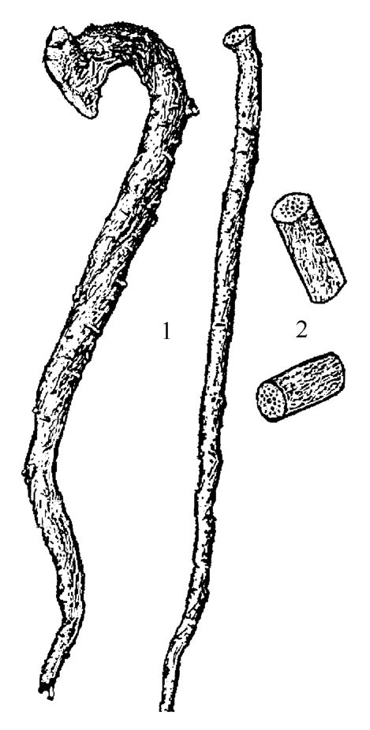
- 显微鉴别：横切面异型维管束断续排列2～4轮外韧型；中央木质部多集成2～3群；薄壁细胞含草酸钙砂晶
  - 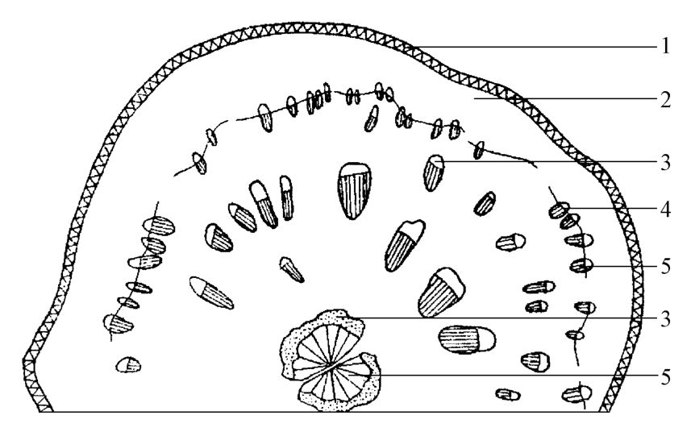
  - 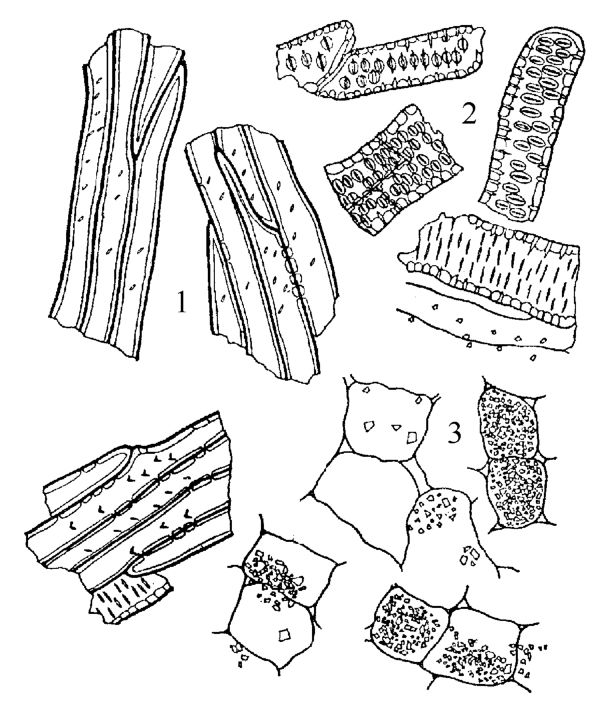
- 成分：皂苷类（人参皂苷Ro、牛膝皂苷Ⅰ～Ⅳ、齐墩果酸）；甾酮类（β-蜕皮甾酮、牛膝甾酮）；钾含量高
- 含量测定：含β-蜕皮甾酮不得少于0.030%（HPLC法）
- 功效：性平，味苦、甘、酸。逐瘀通经，补肝肾，强筋骨，利尿通淋，引血下行
- 附注：柳叶牛膝"红牛膝"、粗毛牛膝（广东作"倒扣草"全草入药）作土牛膝用，均非正品

### 川牛膝 Cyathulae Radix
- 来源：苋科植物川牛膝 *Cyathula officinalis* Kuan 的干燥根
- 产地：主产四川、云南、贵州
- 采收加工：秋冬采挖，烘或晒至半干堆放回润再烘晒干
- 性状鉴别：近圆柱形微扭曲，表面黄棕色或灰褐色，断面浅黄色或棕黄色，维管束点状排列成数轮同心环；味甜
  - 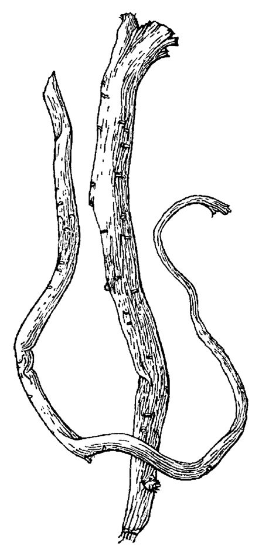
- 显微鉴别：异常维管束外韧型断续排列4～11轮；薄壁细胞含草酸钙砂晶和方晶
- 成分：甾类化合物（杯苋甾酮、异杯苋甾酮、β-蜕皮甾酮等）；甜菜碱
- 含量测定：含杯苋甾酮不得少于0.030%
- 功效：性平，味甘、微苦。逐瘀通经，通利关节，利尿通淋
- 附注：同属麻牛膝的根在部分地区曾混作川牛膝，质粗短纤维性强味麻，非正品

### 商陆 Phytolaccae Radix
- 来源：商陆科植物商陆 *Phytolacca acinosa* Roxb. 或垂序商陆 *P. americana* L. 的干燥根
- 产地：商陆主产河南、湖北、安徽；垂序商陆主产山东、浙江、江西
- 性状鉴别：横切或纵切不规则块片，切面浅黄棕色或黄白色，木部隆起呈数个突起同心性环纹（异常维管束）习称"罗盘纹"；久嚼麻舌
- 显微鉴别：异常维管束断续排列成数环外韧型；薄壁细胞含草酸钙针晶束（垂序商陆针晶束稍长约96μm，无方晶簇晶）
- 成分：三萜皂苷（商陆皂苷元、商陆皂苷甲～辛）；垂序商陆含商陆皂苷B/E/G/F/D₂、商陆碱、商陆毒素（有毒）
- 功效：本品有毒。性寒，味苦。逐水消肿，通利二便；外用解毒散结（鲜根煎煮或蒸制半小时以上毒性显著下降）

### 银柴胡 Stellariae Radix
- 来源：石竹科植物银柴胡 *Stellaria dichotoma* L.var. *lanceolata* Bge. 的干燥根
- 产地：主产宁夏、甘肃、陕西、内蒙古
- 采收加工：野生品春夏萌发或秋后茎叶枯萎时采挖；栽培品种植后第3年9月或第4年4月采挖
- 性状鉴别：类圆柱形，表面浅棕黄色，多具孔穴状凹陷"砂眼"（折断可见细砂散出），根头部"珍珠盘"（疣状芽苞或茎残基）；木质部黄白相间放射状纹理；味甘
  - 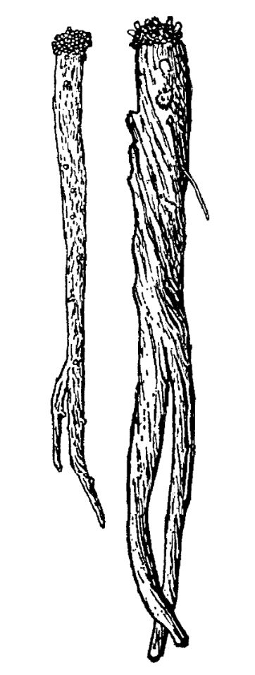
- 显微鉴别：横切面木栓细胞数列至10余列；射线宽至10余列细胞；薄壁细胞含草酸钙砂晶（射线细胞中多见）
  - 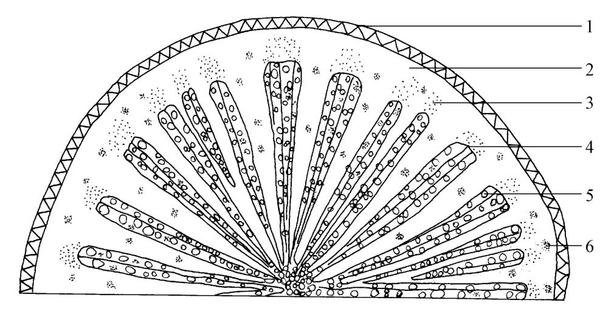
- 成分：6,8-双-C-半乳糖基芹黄素、汉黄芩素、银柴胡环肽、挥发油等
- 理化鉴别：乙醇浸液紫外灯(365nm)显亮蓝微紫色荧光；紫外-可见分光光度法270nm波长处有最大吸收
- 功效：性微寒，味甘。清虚热，除疳热
- 附注：灯心蚤缀、旱麦瓶草、霞草（丝石竹）等同科植物根曾作"山银柴胡"使用，均非正品

### 太子参 Pseudostellariae Radix
- 来源：石竹科植物孩儿参 *Pseudostellaria heterophylla* (Miq.) Pax ex Pax et Hoffm. 的干燥块根
- 产地：主产江苏、山东、安徽
- 性状鉴别：细长纺锤形或细长条形，表面灰黄色至黄棕色，断面角质样或类白色显粉性；味微甘
- 显微鉴别：木栓层2～4列类方形细胞；形成层成环；初生木质部3～4原型；薄壁细胞充满淀粉粒和草酸钙簇晶
- 成分：皂苷、太子参环肽A/B、多种甾醇类、胡萝卜苷
- 功效：性平，味甘、微苦。益气健脾，生津润肺

### 威灵仙 Clematidis Radix et Rhizoma
- 来源：毛茛科植物威灵仙 *Clematis chinensis* Osbeck、棉团铁线莲 *C. hexapetala* Pall. 或东北铁线莲 *C. manshurica* Rupr. 的干燥根和根茎
- 产地：威灵仙主产长江以南；棉团铁线莲主产东北及山东；东北铁线莲主产东北
- 采收加工：秋季采挖，晒干
- 性状鉴别：威灵仙根茎柱状，根细长圆柱形表面黑褐色，断面皮部与木部间常有裂隙，味淡；棉团铁线莲断面木部圆形味咸；东北铁线莲断面木部近圆形味辛辣
  - 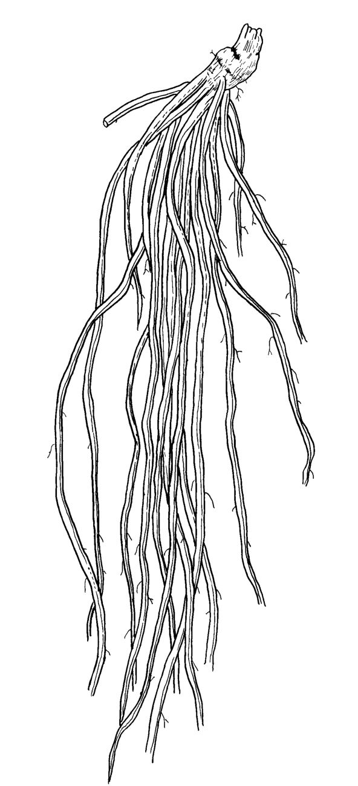
- 显微鉴别：威灵仙根横切面维管束外韧型，老根韧皮部外侧有纤维束及石细胞；三者外皮层细胞形态及韧皮纤维束多少可资鉴别
  - 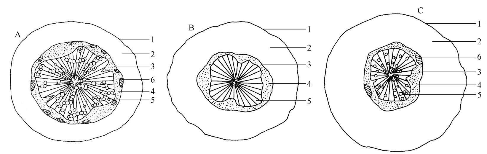
  - 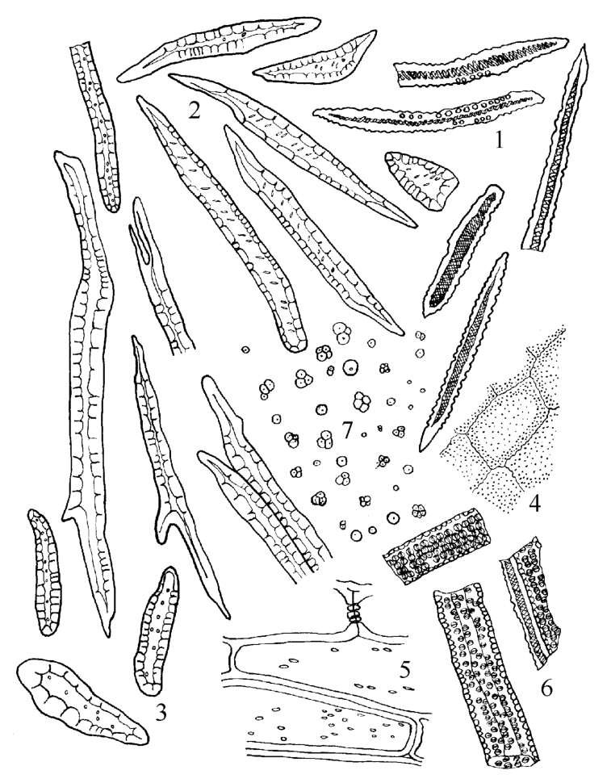
- 成分：三萜类皂苷（威灵仙次皂苷CP系列）；原白头翁素(约0.25%)；东北铁线莲含铁线莲皂苷A/A′/B/C
- 含量测定：含齐墩果酸不得少于0.30%
- 功效：性温，味辛、咸。祛风湿，通经络
- 附注：柱果铁线莲、铁皮威灵仙等同属多种植物根曾混作威灵仙；短梗菝葜/华东菝葜（百合科）"铁丝威铸仙"，均非正品

### 川乌 Aconiti Radix
- 来源：毛茛科植物乌头 *Aconitum carmichaelii* Debx. 的干燥母根
- 产地：四川、陕西为主要栽培产区
- 采收加工：6月下旬至8月上旬采挖，晒干
- 性状鉴别：不规则圆锥形，表面棕褐色或灰棕色皱缩，断面类白色或浅灰黄色粉质，形成层环纹呈多角形；味辛辣而麻舌
  - 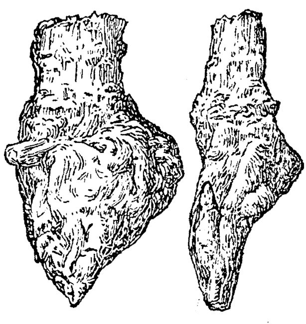
- 显微鉴别：横切面后生皮层棕色木栓化细胞；皮层偶有石细胞；形成层类多角形；木质部导管呈径向或"V"字形排列；髓部明显
  - 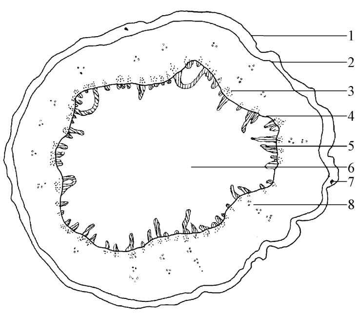
  - 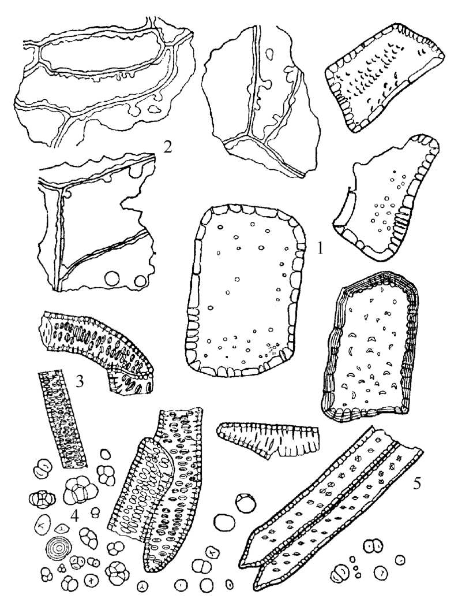
- 成分：总生物碱0.82%～1.56%，主要为剧毒双酯类生物碱（新乌头碱、乌头碱、次乌头碱）
- 理化鉴别：薄层色谱与乌头碱/次乌头碱/新乌头碱对照品比对，喷稀碘化铋钾试液显相同颜色斑点
- 含量测定：含乌头碱+次乌头碱+新乌头碱总量应为0.050%～0.17%
- 功效：性热，味辛、苦；有大毒。祛风除湿，温经止痛
- 附注：部分地区以乌头子根为川乌、母根作草乌，均非正品

### 草乌 Aconiti Kusnezoffii Radix
- 来源：毛茛科植物北乌头 *Aconitum kusnezoffii* Reichb. 的干燥块根
- 产地：主产东北、华北
- 采收加工：秋季茎叶枯萎时采挖，干燥
- 性状鉴别：不规则长圆锥形，表面灰褐色或黑棕褐色极皱缩，断面灰白色或暗灰色有裂隙，髓部较大或中空；味辛辣麻舌
  - 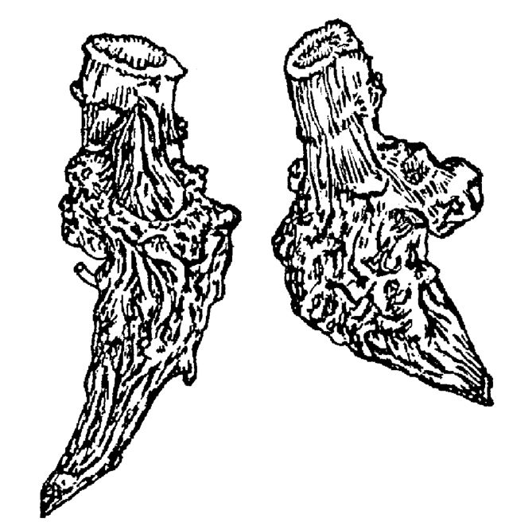
- 显微鉴别：后生皮层7～8列棕黄色栓化细胞；母根形成层外侧有韧皮纤维群；髓部较大
  - 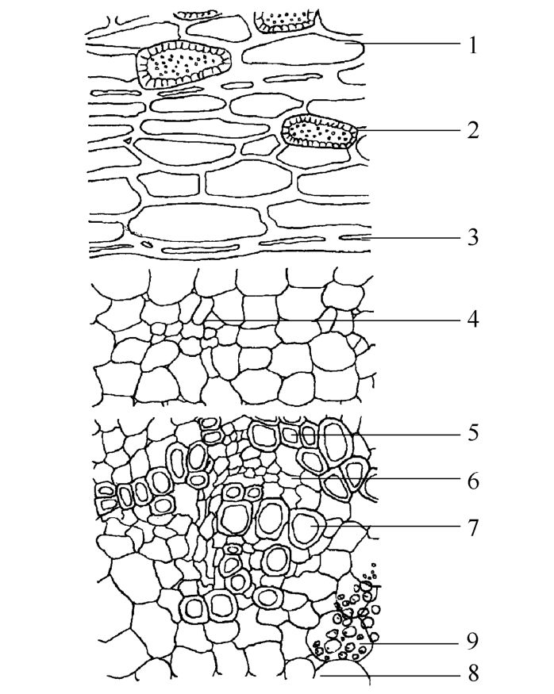
- 成分：总生物碱0.70%～1.3%（新乌头碱、乌头碱、次乌头碱、北草乌碱等）
- 含量测定：含乌头碱+次乌头碱+新乌头碱总量应为0.10%～0.50%
- 功效：性热，味辛、苦；有大毒。祛风除湿，温经止痛
- 附注：同属21种植物块根曾作草乌用（乌头、黄草乌、多根乌头、瓜叶乌头等），均非正品

### 附子 Aconiti Lateralis Radix Praeparata
- 来源：毛茛科植物乌头 *Aconitum carmichaelii* Debx. 子根的加工品
- 产地：四川、陕西为主要栽培产区
- 采收加工：6月下旬至8月上旬采挖子根（"泥附子"），加工成：盐附子（胆巴水溶液+食盐浸泡至盐霜）、黑顺片（胆巴水溶液煮透心切片染色蒸制）、白附片（去皮切片蒸透晒干）
- 性状鉴别：盐附子圆锥形表面灰黑色被盐霜，味咸而麻刺舌；黑顺片纵切片外皮黑褐色切面暗黄色油润半透明；白附片无外皮全体黄白色半透明
  - 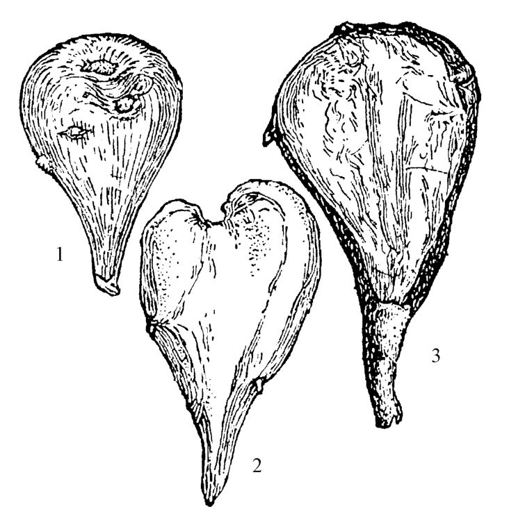
- 显微鉴别：与川乌相似
- 成分：加工炮制使双酯型生物碱水解为毒性较小的单酯型生物碱（苯甲酰乌头原碱等），继续水解生成毒性更小的胺醇类生物碱（乌头原碱等）；盐附子尚含少量双酯型生物碱毒性较黑顺片白附片大；含强心成分氯化棍掌碱、附子苷
- 理化鉴别：薄层色谱区分单酯型（黑顺片/白附片）与双酯型（盐附子）生物碱
- 检查：双酯型生物碱总量不得过0.020%
- 含量测定：含苯甲酰新乌头原碱+苯甲酰乌头原碱+苯甲酰次乌头原碱总量不得少于0.010%
- 功效：有毒；性大热，味辛、甘。回阳救逆，补火助阳，散寒止痛

### 白头翁 Pulsatillae Radix
- 来源：毛茛科植物白头翁 *Pulsatilla chinensis* (Bge.) Regel 的干燥根
- 产地：主产东北、华北、华东
- 性状鉴别：类圆柱形或圆锥形稍扭曲，表面黄棕色或棕褐色具纵皱纹，皮部易脱落露出黄色木部，根头部有白色绒毛；味微苦涩
- 显微鉴别：韧皮纤维梭形壁木化；非腺毛单细胞壁多木化；薄壁细胞含淀粉粒
- 成分：原白头翁素、聚合白头翁素、白头翁内酯；三萜类皂苷（白头翁皂苷A/B/C/B4）
- 功效：性寒，味苦。清热解毒，凉血止痢
- 附注：商品来源复杂多达20余种，兴安白头翁等同属植物及翻白草、委陵菜（蔷薇科）等曾混用，均非正品

### 白芍 Paeoniae Radix Alba
- 来源：毛茛科植物芍药 *Paeonia lactiflora* Pall. 的干燥根
- 产地：主产浙江、安徽、四川、贵州、山东（均系栽培）
- 采收加工：种植3～4年后夏秋采挖，煮至透心后去皮（或去皮后再煮），晒干
- 性状鉴别：圆柱形平直，表面类白色或淡红棕色光洁，断面类白色或微带棕红色形成层环明显，木部放射状纹理；味微苦、酸
  - 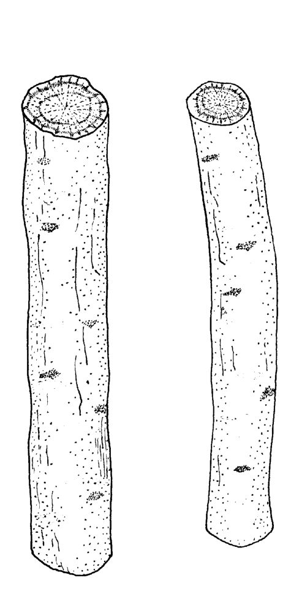
- 显微鉴别：形成层环微波状弯曲；木质部束窄导管群放射状排列；薄壁细胞含草酸钙簇晶及糊化淀粉粒团块
  - 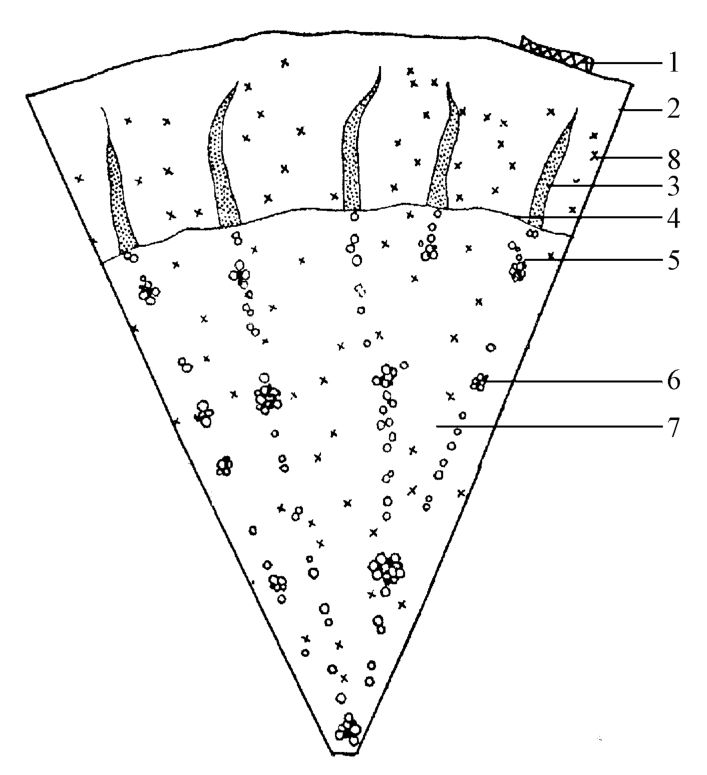
  - 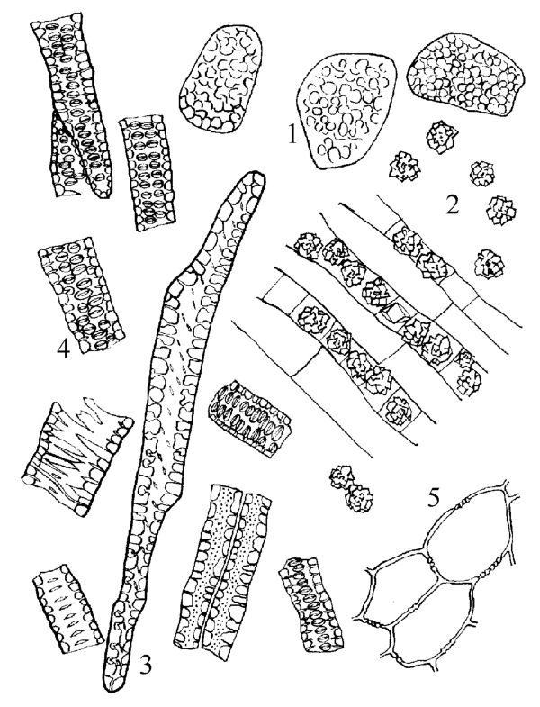
- 成分：芍药苷（加工后含量显著减少，约1%以下，为解痉有效成分）；芍药内酯苷、苯甲酰芍药苷、鞣质等
- 理化鉴别：薄层色谱与芍药苷对照品/白芍对照药材比对，喷5%香草醛硫酸液显相同蓝紫色斑点
- 含量测定：含芍药苷不得少于1.6%；饮片不得少于1.2%
- 功效：性微寒，味苦、酸。养血调经，敛阴止汗，柔肝止痛，平抑肝阳
- 附注：毛叶草芍药曾在陕西作"宝鸡白芍"，非正品

### 赤芍 Paeoniae Radix Rubra
- 来源：毛茛科植物芍药 *Paeonia lactiflora* Pall. 或川赤芍 *P. veitchii* Lynch 的干燥根
- 产地：芍药主产内蒙古、东北；川赤芍主产四川
- 性状鉴别：圆柱形稍弯曲，表面棕褐色粗糙，断面粉白色或粉红色，木部放射状纹理明显；味微苦、酸涩
- 显微鉴别：木栓层数列棕色细胞；木质部射线较宽，导管群放射状排列；薄壁细胞含草酸钙簇晶
- 成分：芍药苷3.5%～8%（含量高于白芍）；赤芍精、赤芍甲素、赤芍乙素；鞣质约12.6%
- 功效：性微寒，味苦。清热凉血，散瘀止痛
- 附注：草芍药及其变种毛叶草芍药根曾混作赤芍，质量较差，非正品

### 黄连 Coptidis Rhizoma
- 来源：毛茛科植物黄连 *Coptis chinensis* Franch.、三角叶黄连 *C. deltoidea* C.Y.Cheng et Hsiao 或云连 *C. teeta* Wall. 的干燥根茎，分别习称"味连""雅连""云连"
- 产地：味连主产四川石柱（商品主要来源）；雅连主产四川洪雅、峨眉；云连主产云南德钦、碧江及西藏
- 采收加工：秋季采挖，干燥，撞去须根
- 性状鉴别：味连多分枝集聚成簇弯曲如"鸡爪"，节间平滑处习称"过桥"，断面皮部橙红色木部鲜黄色放射状排列；雅连单枝圆柱形"过桥"较长；云连弯曲呈钩状较细小"过桥"较短；味均极苦
  - 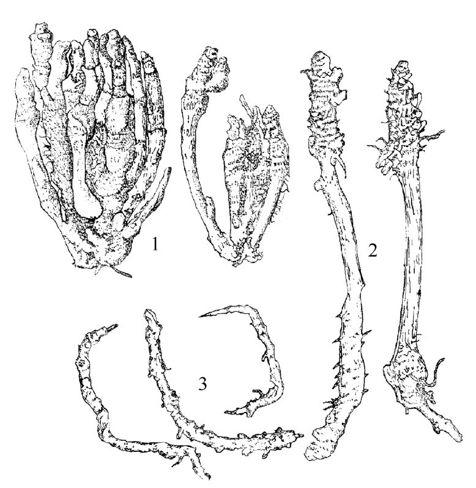
- 显微鉴别：味连横切面皮层石细胞单个或成群散在；中柱鞘纤维成束木化；髓部无石细胞；雅连髓部有石细胞；云连皮层中柱鞘及髓部均无石细胞
  - 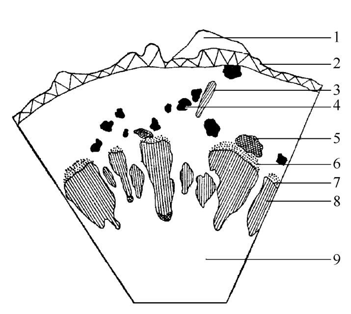
  - 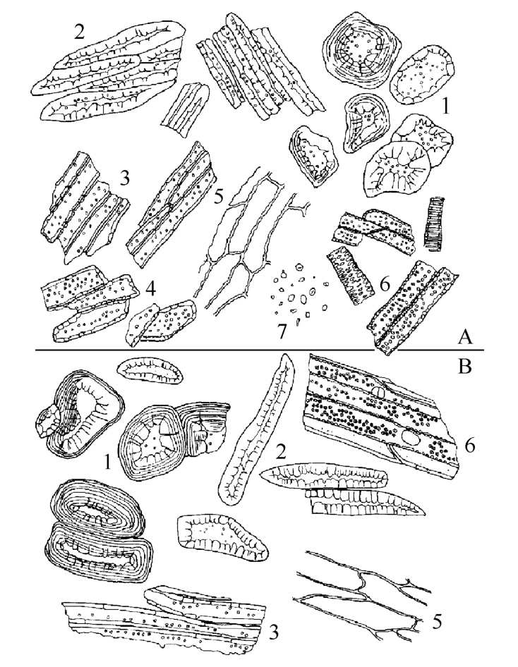
- 成分：多种生物碱，主要为小檗碱（5.2%～7.69%），其次黄连碱（特征性成分）、甲基黄连碱（云连无）、巴马汀、药根碱
- 理化鉴别：薄层色谱与盐酸小檗碱对照品/黄连对照药材比对，紫外灯(365nm)显4个以上相同荧光斑点；粉末加乙醇+硝酸镜检见黄色针状结晶（硝酸小檗碱）
- 含量测定：味连含小檗碱不得少于5.5%；雅连不得少于4.5%；云连不得少于7.0%
- 功效：性寒，味苦。清热燥湿，泻火解毒
- 附注：峨眉野连、短萼黄连"土黄连"等同属植物曾混作黄连，均非正品

### 升麻 Cimicifugae Rhizoma
- 来源：毛茛科植物大三叶升麻 *Cimicifuga heracleifolia* Kom.、兴安升麻 *C. dahurica* (Turcz.) Maxim. 或升麻 *C. foetida* L. 的干燥根茎，依次称关升麻、北升麻、西升麻
- 产地：主产辽宁、吉林、黑龙江
- 采收加工：秋季采挖，晒至须根干时燎去须根
- 性状鉴别：不规则长形块状多分枝呈结节状，表面黑褐色或棕褐色粗糙，上面有数个圆形空洞茎基痕，断面纤维性黄绿色或淡黄白色；味微苦而涩
  - 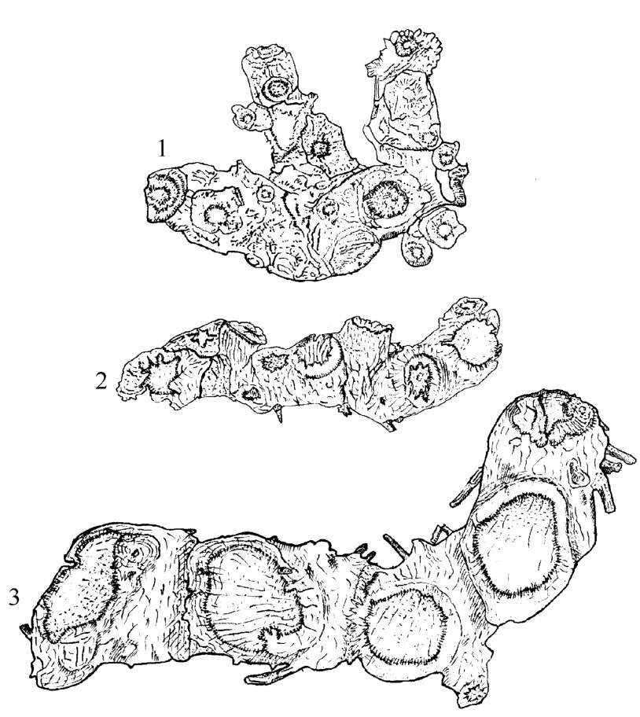
- 显微鉴别：西升麻横切面后生表皮棕色细胞有明显纹理；皮层外侧石细胞壁厚壁孔明显；薄壁组织中有大量树脂块；关升麻、北升麻后生表皮无纹理可资区别
  - 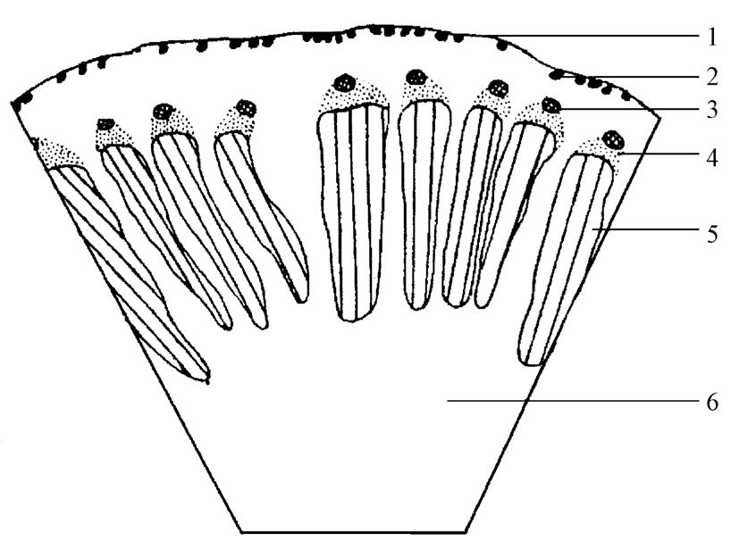
- 成分：甾萜类（升麻醇、北升麻醇等）；异阿魏酸、阿魏酸、咖啡酸
- 理化鉴别：薄层色谱与阿魏酸/异阿魏酸对照品比对
- 含量测定：含异阿魏酸不得少于0.10%
- 功效：性微寒，味辛、微甘。发表透疹，清热解毒，升举阳气
- 附注：单穗升麻、华麻花头"广东升麻"、落新妇"红升麻"等曾混作升麻，均非正品

### 防己 Stephaniae Tetrandrae Radix
- 来源：防己科植物粉防己 *Stephania tetrandra* S.Moore 的干燥根
- 产地：主产浙江、安徽、湖北、湖南、江西
- 采收加工：秋季采挖，除去粗皮，切段干燥
- 性状鉴别：不规则圆柱形多弯曲，弯曲处常有深陷横沟成结节状瘤块样，断面灰白色富粉性，放射状纹理习称"车轮纹"；味苦
  - 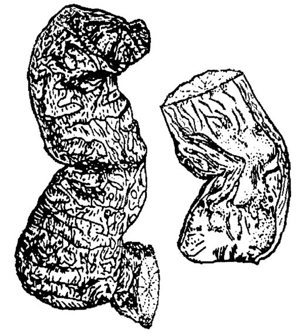
- 显微鉴别：栓内层有石细胞群散在；木质部占大部分导管稀少放射状排列；薄壁细胞含淀粉粒及杆状草酸钙结晶
  - 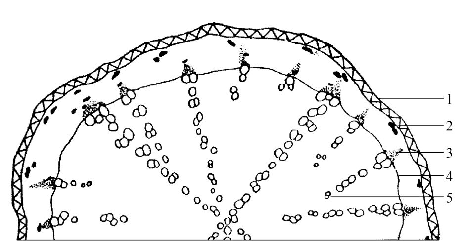
- 成分：异喹啉生物碱总量1.7%～2.5%，主要为粉防己碱（汉防己甲素）、防己诺林碱
- 理化鉴别：薄层色谱与粉防己碱/防己诺林碱混合对照品比对，喷稀碘化铋钾试液
- 含量测定：含粉防己碱+防己诺林碱总量不得少于1.6%
- 功效：性寒，味苦。祛风止痛，利水消肿
- 附注：异叶马兜铃"汉中防己"、称钩风"湘防己"、木防己等多种混淆品，均非正品

### 北豆根 Menispermi Rhizoma
- 来源：防己科植物蝙蝠葛 *Menispermum dauricum* DC. 的干燥根茎
- 产地：主产东北及河北、山东、山西
- 采收加工：春秋采挖，干燥
- 性状鉴别：细长圆柱形弯曲有分枝，表面黄棕色至暗棕色，断面纤维性木部淡黄色放射状排列中心有髓；味苦
  - 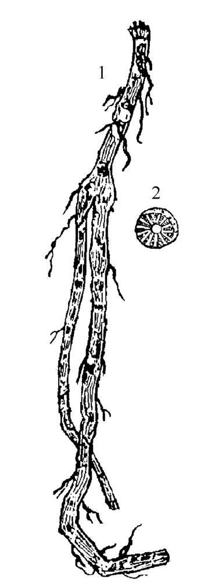
- 显微鉴别：中柱鞘纤维排列成新月形；射线细胞5～13列有石细胞散在；薄壁细胞含淀粉粒及细小草酸钙结晶
  - 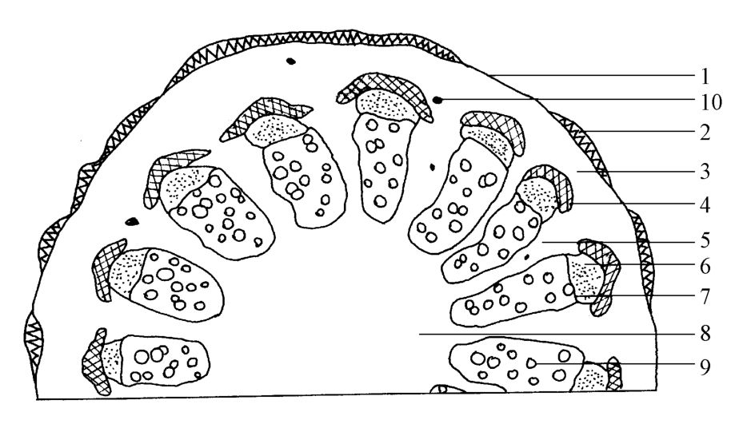
  - 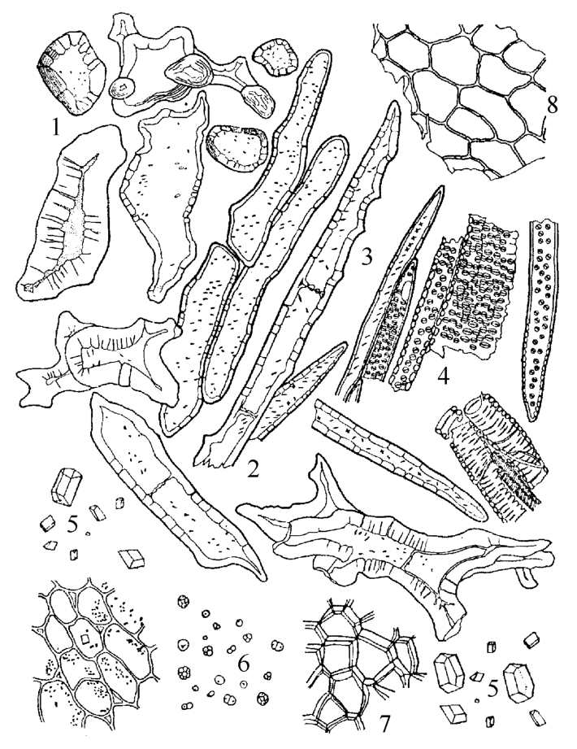
- 成分：多种生物碱总量1.7%～2.5%（春季采收最高），主要为北豆根碱（占总碱之半）
- 含量测定：含蝙蝠葛苏林碱+蝙蝠葛碱总量不得少于0.60%
- 功效：性寒，味苦；有小毒。清热解毒，祛风止痛

### 延胡索 Corydalis Rhizoma
- 来源：罂粟科植物延胡索 *Corydalis yanhusuo* W.T.Wang 的干燥块茎
- 产地：主产浙江东阳、磐安（多栽培）
- 采收加工：夏初(5～7月)茎叶枯萎时采挖，沸水煮至恰无白心，晒干
- 性状鉴别：不规则扁球形，表面黄色或黄褐色具网状皱纹，断面黄色角质样有蜡样光泽；味苦
  - 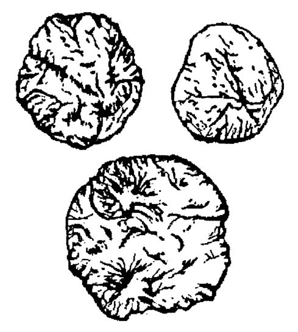
- 显微鉴别：粉末绿黄色，石细胞壁较厚纹孔细密；下皮厚壁细胞木化呈连珠状增厚；薄壁细胞充满糊化淀粉粒团块
  - 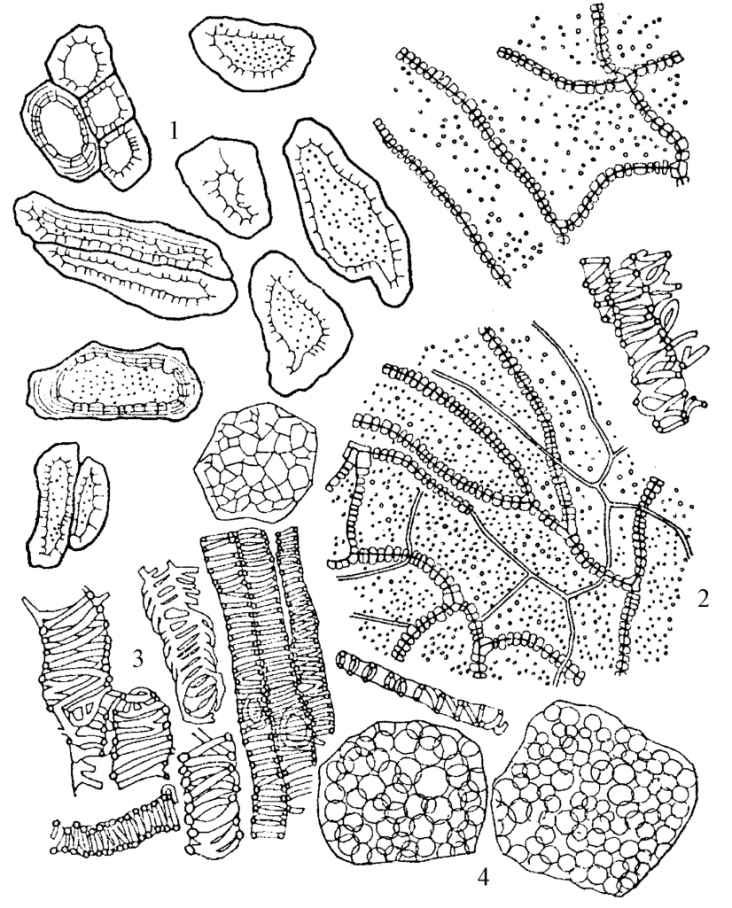
- 成分：多种生物碱（延胡索甲素～壬素），延胡索乙素（dl-四氢巴马亭）为主要镇痛镇静成分
- 理化鉴别：薄层色谱与延胡索对照药材/延胡索乙素对照品比对
- 含量测定：含延胡索乙素不得少于0.050%；饮片不得少于0.040%
- 功效：性温，味苦、辛。活血，行气，止痛
- 附注：齿瓣延胡索、全叶延胡索、东北延胡索等同属植物块茎曾作"土元胡"，不含延胡索乙素，均非正品
- 【附】夏天无：罂粟科植物伏生紫堇的干燥块茎，含原鸦片碱、夏天无碱等；性温味苦微辛，活血止痛，舒筋活络，祛风除湿

### 板蓝根 Isatidis Radix（附：南板蓝根）
- 来源：十字花科植物菘蓝 *Isatis indigotica* Fort. 的干燥根
- 产地：主产河北、江苏
- 采收加工：秋季采挖，晒干
- 性状鉴别：圆柱形稍扭曲，表面淡灰黄色或淡棕黄色，根头部有暗绿色轮状排列叶柄残基，断面皮部黄白色木部黄色呈"菊花心"；味微甜而后苦涩
  - 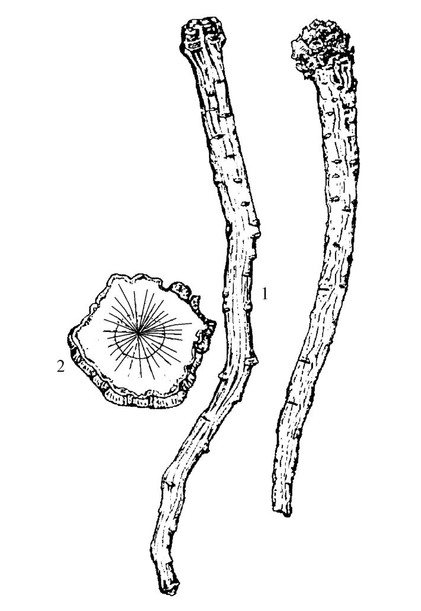
- 显微鉴别：木质部导管黄色类圆形，导管周围有木纤维束
  - 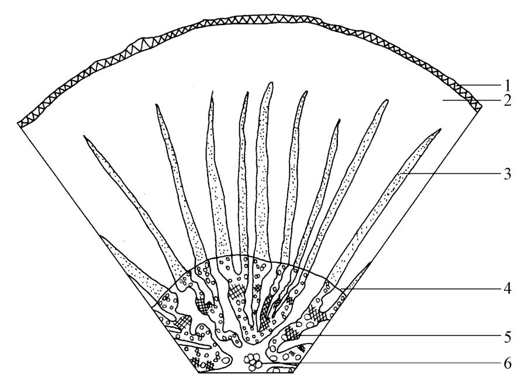
- 成分：芥子苷、靛蓝、靛玉红、(R,S)-告依春等
- 理化鉴别：水煎液紫外灯(365nm)显蓝色荧光；薄层色谱与板蓝根对照药材/(R,S)-告依春对照品比对
- 含量测定：含(R,S)-告依春不得少于0.020%
- 功效：性寒，味苦。清热解毒，凉血利咽
- 【附】南板蓝根：爵床科植物马蓝的根茎及根，薄壁细胞含椭圆形钟乳体；性寒味苦，清热解毒，凉血消斑

### 地榆 Sanguisorbae Radix
- 来源：蔷薇科植物地榆 *Sanguisorba officinalis* L. 或长叶地榆 *S. officinalis* L. var. *longifolia* (Bert.) Yü et Li（习称"绵地榆"）的干燥根
- 产地：地榆主产黑龙江、吉林、辽宁；长叶地榆主产安徽、浙江、江苏
- 性状鉴别：地榆圆柱形或纺锤形表面灰褐色至暗棕色，断面粉红色或淡黄色放射状纹理；长叶地榆表面红棕色，皮部有黄白色绵状纤维
- 显微鉴别：木质部导管径向排列；长叶地榆栓内层内侧与韧皮部有众多非木化纤维可资区别
- 成分：鞣质（地榆素H1～H6）；三萜皂苷（地榆苷Ⅰ、Ⅱ）
- 功效：性微寒，味苦、酸、涩。凉血止血，解毒敛疮

### 苦参 Sophorae Flavescentis Radix
- 来源：豆科植物苦参 *Sophora flavescens* Ait. 的干燥根
- 产地：主产山西、河南、河北
- 采收加工：春秋采挖，洗净干燥，或趁鲜切片
- 性状鉴别：长圆柱形下部常分枝，表面灰棕色或棕黄色外皮薄易剥落，断面纤维性黄白色皮部木部分层明显放射状纹理；味极苦
  - 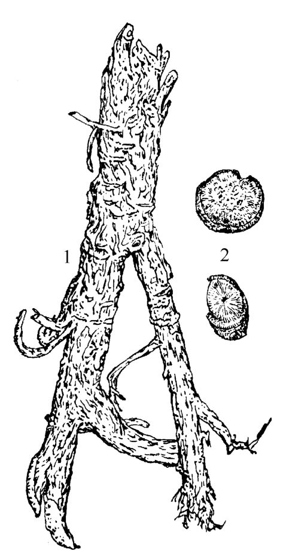
- 显微鉴别：韧皮部多数纤维束；薄壁细胞含众多淀粉粒及草酸钙方晶（晶鞘纤维）
  - 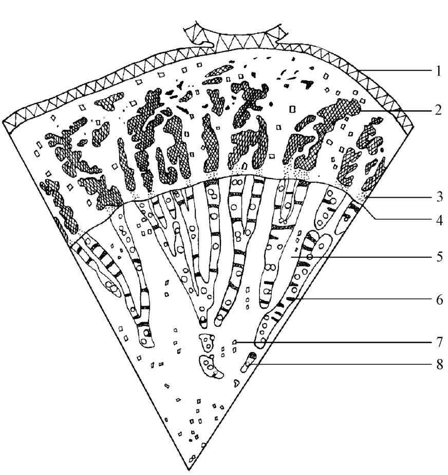
  - 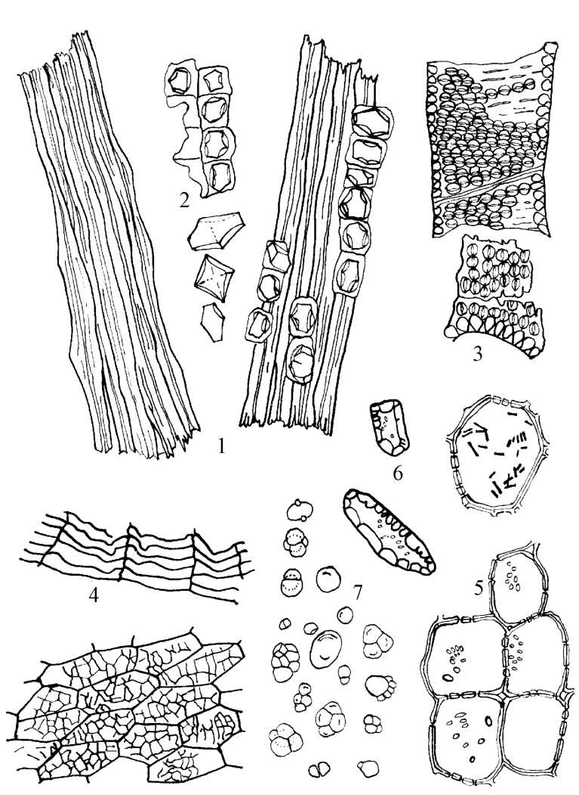
- 成分：多种生物碱，主要为苦参碱及氧化苦参碱；多种黄酮成分（苦参酮等）
- 理化鉴别：根横切片加氢氧化钠液栓皮呈橙红色渐变血红色；薄层色谱与苦参碱/槐定碱对照品比对显两个橙色斑点
- 含量测定：含苦参碱+氧化苦参碱总量不得少于1.20%
- 功效：性寒，味苦。清热燥湿，杀虫，利尿

### 山豆根 Sophorae Tonkinensis Radix et Rhizoma
- 来源：豆科植物越南槐 *Sophora tonkinensis* Gagnep. 的干燥根和根茎
- 产地：主产广西、广东，习称"广豆根"
- 性状鉴别：根茎不规则结节状，根长圆柱形常有分枝，表面棕色至棕褐色，断面皮部浅棕色木部淡黄色，有豆腥气；味极苦
- 显微鉴别：皮层外侧含晶细胞环（草酸钙方晶）；木质部发达；粉末见晶鞘纤维
- 成分：生物碱类（苦参碱、氧化苦参碱、山豆根碱A/B）；黄酮类（广豆根素）；山豆根查尔酮
- 功效：性寒，味苦；有毒。清热解毒，消肿利咽
- 附注：全国"山豆根"原植物分属3科4属9种，木蓝属多种植物及朱砂根曾混用，均非正品

### 葛根 Puerariae Lobatae Radix（附：粉葛）
- 来源：豆科植物野葛 *Pueraria lobata* (Willd.) Ohwi 的干燥根
- 产地：主产湖南、河南、广东、浙江
- 采收加工：秋冬采挖，趁鲜切厚片或小块干燥
- 性状鉴别：纵切长方形厚片或小方块，外皮淡棕色至棕色，切面黄白色至淡黄棕色，质韧纤维性强；味微甜
  - 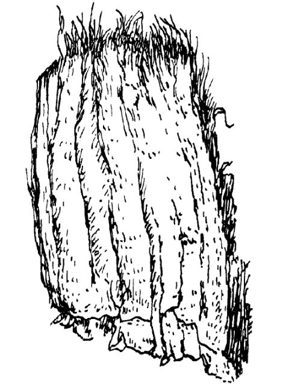
- 显微鉴别：木质部导管群与木纤维束相间排列，纤维束周围薄壁细胞含草酸钙方晶（晶鞘纤维）
  - 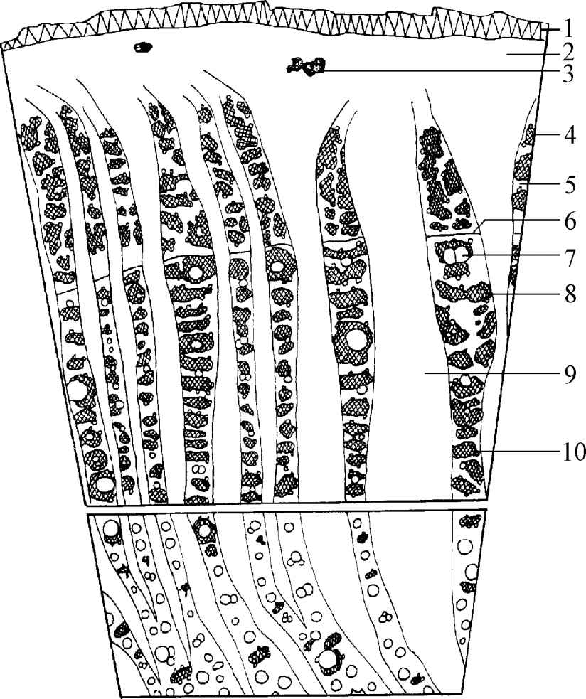
  - 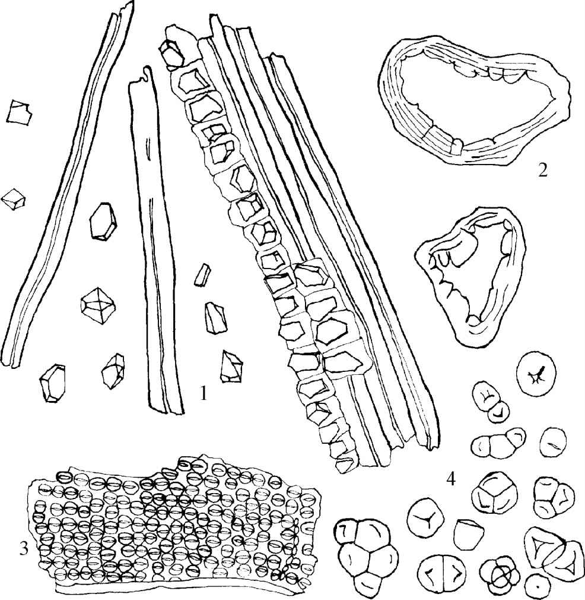
- 成分：黄酮类总量可达12%，主要为黄豆苷、黄豆苷元及葛根素
- 理化鉴别：薄层色谱与葛根对照药材/葛根素对照品比对，紫外灯(365nm)显相同荧光条斑
- 含量测定：含葛根素不得少于2.4%
- 功效：性凉，味甘、辛。解肌退热，生津止渴，透疹，升阳止泻，通经活络，解酒毒
- 附注：峨眉葛藤、三裂叶葛藤等同属植物总黄酮含量低，质量较差，非正品；葛花能解酒毒止渴
- 【附】粉葛：豆科植物甘葛藤的干燥根，富粉性，横切面可见同心性环纹，总黄酮量较野葛低，功效同葛根

### 甘草 Glycyrrhizae Radix et Rhizoma
- 来源：豆科植物甘草 *Glycyrrhiza uralensis* Fisch.、胀果甘草 *G. inflata* Bat. 或光果甘草 *G. glabra* L. 的干燥根和根茎
- 产地：主产内蒙古、宁夏、甘肃、新疆（内蒙古伊盟杭锦旗一带品质最佳）
- 采收加工：春秋采挖，晒干
- 性状鉴别：圆柱形，外皮红棕色或灰棕色有纵皱纹，断面黄白色有粉性，形成层环纹及放射状纹理明显；味甜而特殊
  - 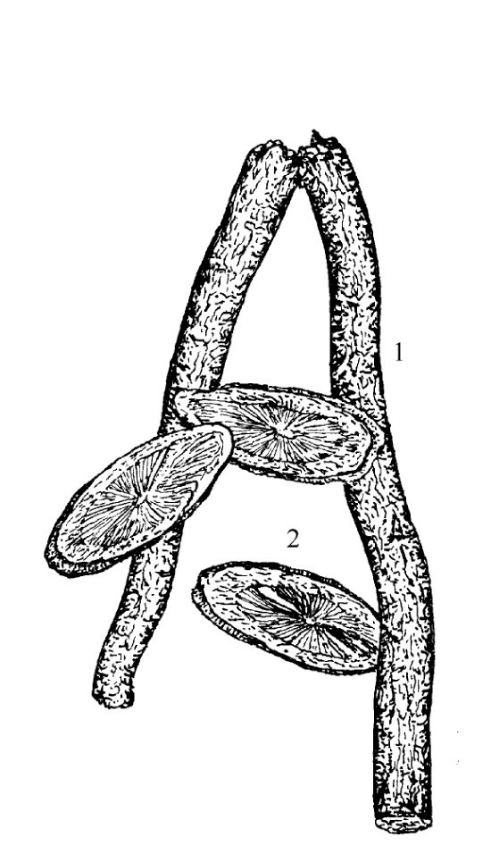
- 显微鉴别：韧皮部及木质部均有纤维束，周围薄壁细胞含草酸钙方晶（晶鞘纤维）；束内形成层明显
  - 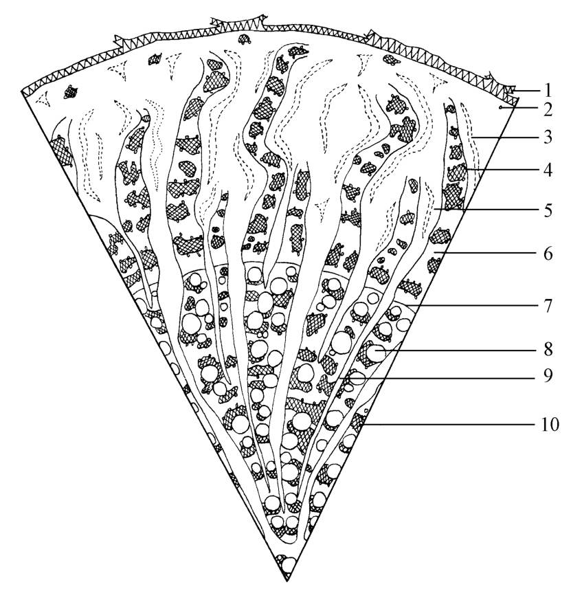
  - 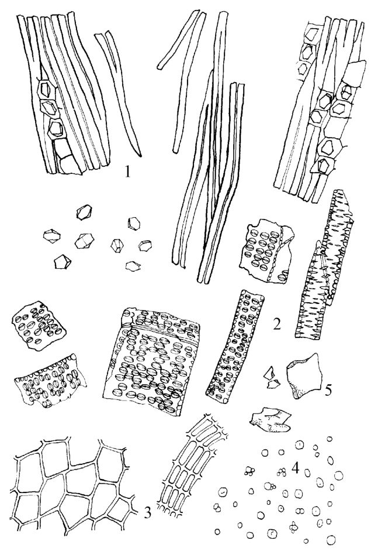
- 成分：三萜类甘草甜素（甘草酸钾钙盐，甜味成分，水解生成18β-甘草次酸）；黄酮类30余个（甘草苷、异甘草苷）
- 理化鉴别：薄层色谱与甘草对照药材/甘草酸铵盐对照品比对，紫外灯(365nm)显相同荧光斑点
- 含量测定：含甘草酸不得少于2.0%，含甘草苷不得少于0.50%
- 功效：性平，味甘。补脾益气，清热解毒，祛痰止咳，缓急止痛，调和诸药

### 黄芪 Astragali Radix（附：红芪）
- 来源：豆科植物蒙古黄芪 *Astragalus membranaceus* (Fisch.) Bge.var. *mongholicus* (Bge.) Hsiao 或膜荚黄芪 *A. membranaceus* (Fisch.) Bge. 的干燥根
- 产地：主产山西、黑龙江、内蒙古（栽培蒙古黄芪质量为佳）
- 采收加工：春秋采挖，晒至六七成干捆把晒干
- 性状鉴别：圆柱形上粗下细，表面淡棕黄色有纵皱纹，断面纤维性强显粉性，皮部黄白色木部淡黄色放射状纹理呈"菊花心"；味微甜，嚼之有豆腥味
  - 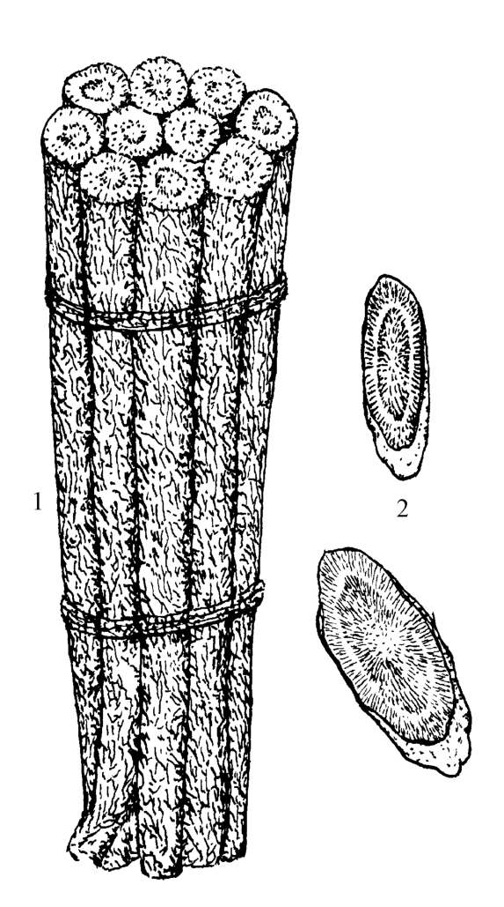
- 显微鉴别：韧皮部纤维束与筛管群交替排列；形成层成环；木质部导管单个或2～3成群；膜荚黄芪导管直径更大内含橙红色色素块可资区别
  - 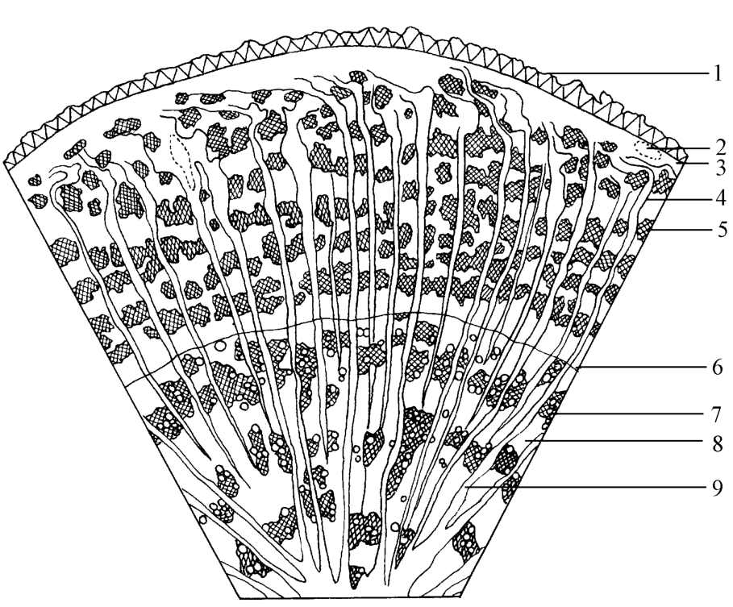
  - 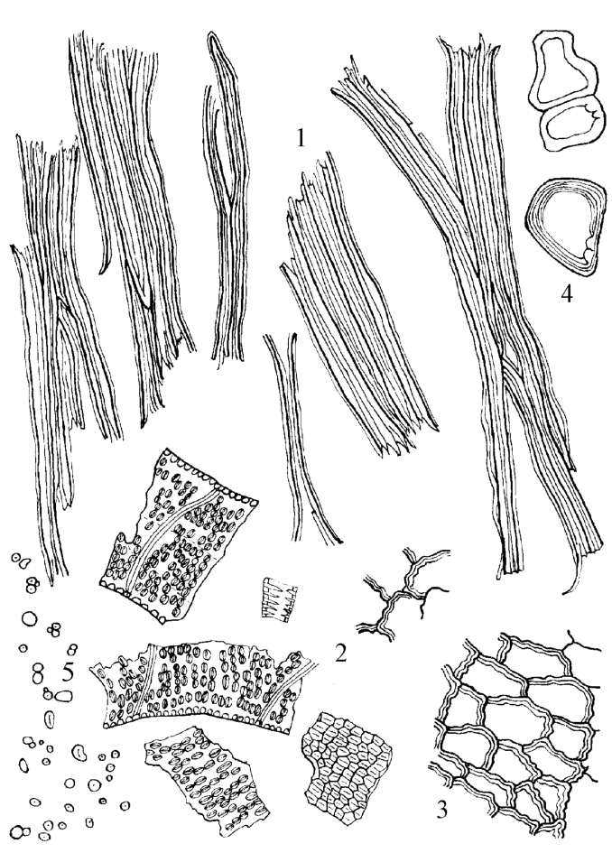
- 成分：三萜皂苷（黄芪皂苷Ⅰ～Ⅷ，黄芪甲苷为质量控制主要指标）；黄酮类（山柰酚、毛蕊异黄酮）；黄芪多糖（具免疫促进作用）
- 理化鉴别：薄层色谱与黄芪甲苷对照品比对，日光下显棕褐色斑点，紫外灯(365nm)显橙黄色荧光斑点
- 含量测定：含黄芪甲苷不得少于0.040%，含毛蕊异黄酮葡萄糖苷不得少于0.020%
- 功效：性微温，味甘。补气升阳，固表止汗，利水消肿，生津养血，行滞通痹，托毒排脓，敛疮生肌
- 附注：金翼黄芪"小黄芪"、多花黄芪、梭果黄芪、塘谷耳黄芪"土黄芪"等同属植物及锦鸡儿、圆叶锦葵等伪品，均非正品
- 【附】红芪：豆科植物多序岩黄芪的干燥根，主产甘肃南部，横切面形成层呈浅棕色环，功效同黄芪

### 远志 Polygalae Radix
- 来源：远志科植物远志 *Polygala tenuifolia* Willd. 或卵叶远志 *P. sibirica* L. 的干燥根
- 产地：主产山西、陕西、吉林、河南
- 性状鉴别：圆柱形具支根略弯曲，表面灰黄色至灰棕色有深陷横皱纹，断面皮部棕黄色木部黄白色易剥离呈双卷状；味苦微辛，嚼之有刺喉感
- 显微鉴别：根皮横切面木栓层数列至10余列细胞；韧皮部有纵向裂隙；薄壁细胞含脂肪油滴及草酸钙簇晶
- 成分：三萜类皂苷（远志皂苷A～G，皮部含量最多）
- 功效：性温，味苦、辛。安神益智，交通心肾，祛痰，消肿

### 人参 Ginseng Radix et Rhizoma（附：红参、人参叶）
- 来源：五加科植物人参 *Panax ginseng* C.A.Mey. 的干燥根和根茎。栽培者为"园参"；林下野生者称"林下山参"（习称"籽海"）
- 产地：主产吉林、辽宁、黑龙江
- 采收加工：园参多于秋季采挖，洗净晒干或烘干
- 性状鉴别：主根纺锤形或圆柱形，表面灰黄色具粗横纹及纵皱纹，根茎(芦头)具茎痕(芦碗)，断面淡黄白色显粉性，皮部有点状树脂道，形成层环纹棕黄色；香气特异，味微苦、甘
  - 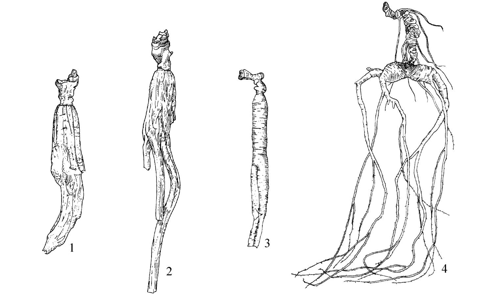
- 显微鉴别：韧皮部有树脂道散在含黄色分泌物；木质部射线宽广导管放射状排列；薄壁细胞含草酸钙簇晶
  - 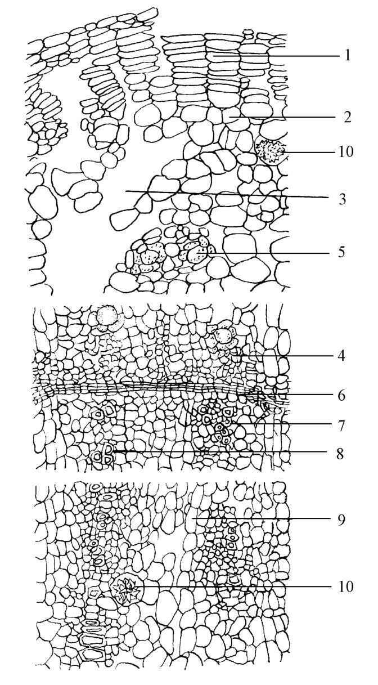
  - 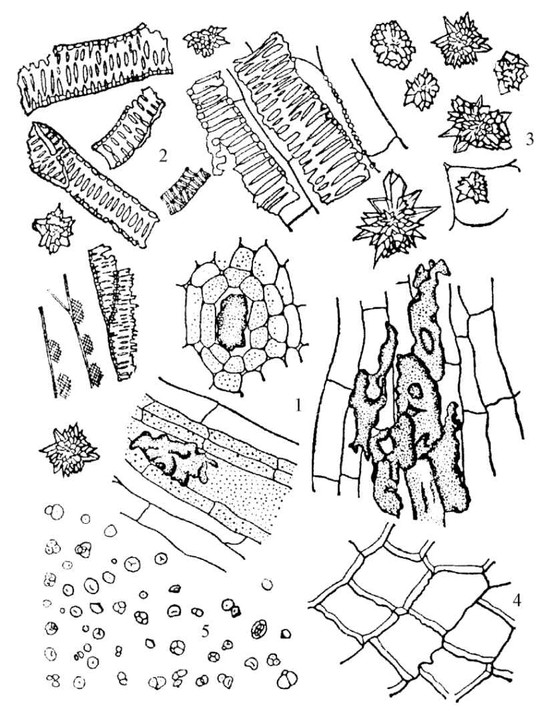
- 成分：三萜皂苷30余种（人参皂苷Ro/Ra/Rb1/Rb2/Rc/Rd/Re/Rf/Rg1/Rg2/Rg3等），达玛脂烷系为主要活性成分；挥发油；人参多糖
- 理化鉴别：薄层色谱与人参对照药材/人参皂苷Rb1·Re·Rf·Rg1对照品比对
  - 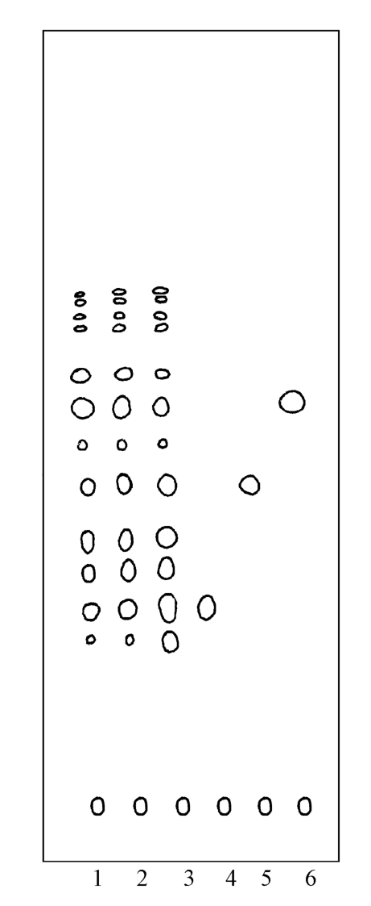
- 含量测定：含人参皂苷Rg1+Re总量不得少于0.30%，含人参皂苷Rb1不得少于0.20%
- 功效：性微温，味甘、微苦。大补元气，复脉固脱，补脾益肺，生津养血，安神益智
- 附注：参须/参皮/参叶/花蕾总皂苷含量较主根高；红参为蒸制加工品；朝鲜人参（高丽参）原植物相同；华山参曾伪充人参；刺五加为同科植物，含刺五加苷有类似生理活性，非人参正品
- 【附】红参：人参栽培品（园参）经蒸制后的干燥根及根茎，淀粉粒已糊化轮廓模糊，性温味甘微苦，大补元气，复脉固脱，益气摄血
- 【附】人参叶：人参的干燥叶，含与根相同的多种皂苷类成分，性寒味苦甘，补气，益肺，祛暑，生津

### 西洋参 Panacis Quinquefolii Radix
- 来源：五加科植物西洋参 *Panax quinquefolium* L. 的干燥根（均系栽培品）
- 产地：原产加拿大和美国，我国东北、华北、西北引种栽培成功
- 采收加工：秋季采挖，晒干或低温干燥
- 性状鉴别：纺锤形、圆柱形或圆锥形，表面浅黄褐色或黄白色具横向环纹，断面浅黄白色略显粉性，皮部见黄棕色点状树脂道；气微而特异，味微苦、甘
  - 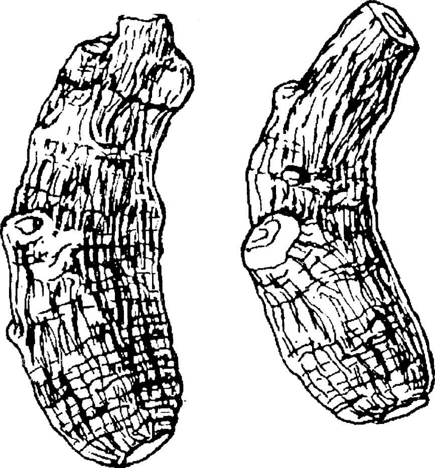
- 显微鉴别：皮层外部树脂道6～14个呈环状排列；韧皮部树脂道呈数层环状排列；初生木质部五原型
  - 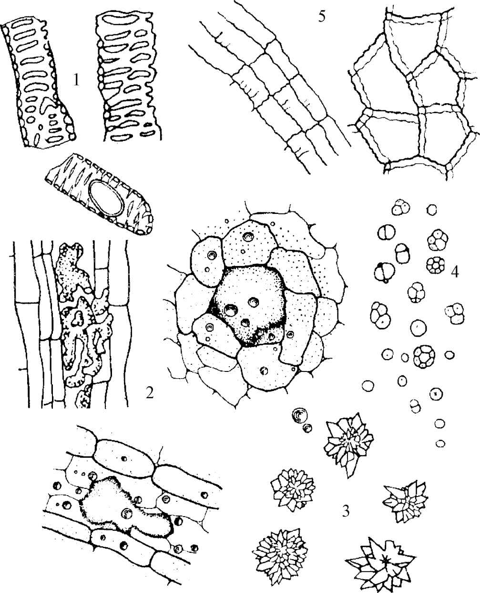
- 成分：人参皂苷类（Ro/Rb1/Rb2/Rc/Rd/Re/Rf/Rg1/Rg2/Rg3等）及西洋参特有的拟人参皂苷F11；挥发油含反式β-金合欢烯较高
- 理化鉴别：薄层色谱与西洋参对照药材及拟人参皂苷F11等对照品比对；另需检查不得检出人参（薄层色谱不得显与人参对照药材完全一致的斑点，以区分人参冒充）
- 含量测定：含人参皂苷Rg1+Re+Rb1总量不得少于2.0%
- 功效：性凉，味甘、微苦。补气养阴，清热生津

### 三七 Notoginseng Radix et Rhizoma
- 来源：五加科植物三七 *Panax notoginseng* (Burk.) F.H.Chen 的干燥根和根茎
- 产地：主产广西田阳、靖西、百色及云南文山（多系栽培）
- 采收加工：秋季开花前采挖，分开主根、支根（"筋条"）及根茎（"剪口"），干燥
- 性状鉴别：主根类圆锥形或圆柱形，表面灰褐色或灰黄色，顶端有茎痕周围有瘤状突起，断面灰绿黄绿或灰白色皮部有细小棕色树脂道斑点；味苦回甜
  - 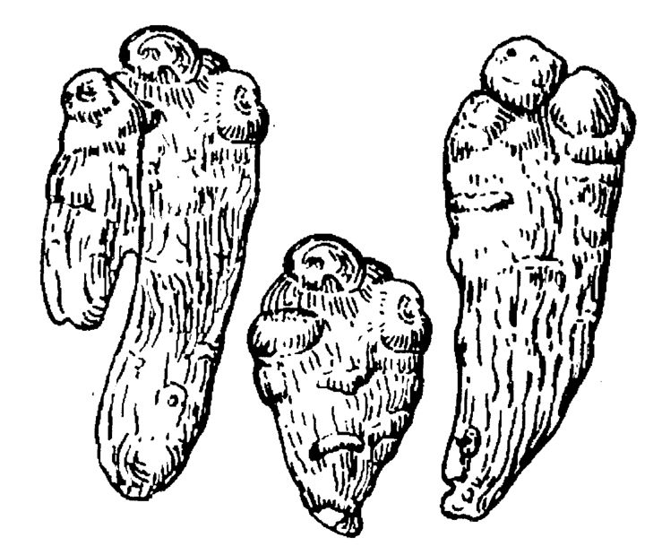
- 显微鉴别：韧皮部有树脂道散在；木质部导管1～2列径向排列；草酸钙簇晶稀少棱角较钝
  - 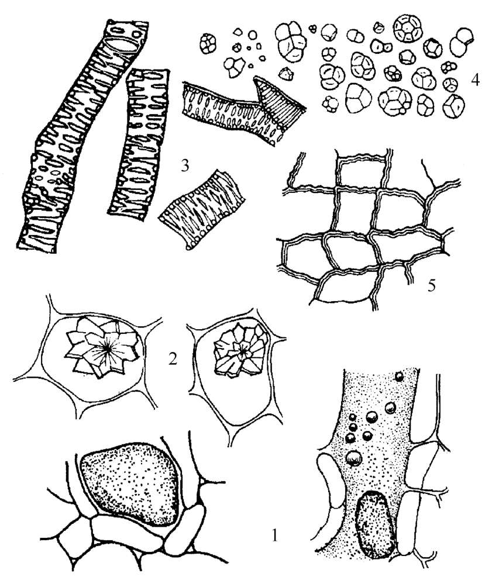
- 成分：皂苷总量9.75%～14.90%，主要为达玛脂烷系（人参皂苷Rb1/Rb2/Rc/Rd/Re/Rg1/Rg2/Rh1及三七皂苷R1～R6）；止血成分田七氨酸、三七素
- 理化鉴别：薄层色谱与人参皂苷Rb1·Re·Rg1及三七皂苷R1对照品比对
- 含量测定：含人参皂苷Rb1+Rg1+三七皂苷R1总量不得少于5.0%
- 功效：性温，味甘、微苦。散瘀止血，消肿定痛
- 附注：菊三七"土三七"（含菊糖）、落葵薯"藤三七"、加工莪术等混淆品/伪品，均非正品

### 白芷 Angelicae Dahuricae Radix
- 来源：伞形科植物白芷 *Angelica dahurica* (Fisch.ex Hoffm.) Benth.et Hook.f. 或杭白芷 *A. dahurica* var. *formosana* (Boiss.) Shan et Yuan 的干燥根
- 产地：白芷产河南"禹白芷"、河北安国"祁白芷"；杭白芷产浙江/福建/四川"杭白芷""川白芷"
- 采收加工：夏秋叶黄时采挖，洗净晒干或烘干（杭州地区加石灰拌匀后晒干）
- 性状鉴别：根长圆锥形头粗尾细，表面灰棕色或黄棕色具"疙瘩丁"（皮孔样横向突起），断面灰白色显粉性皮部有棕色油点，形成层环近方形或圆形；气芳香，味辛、微苦
  - 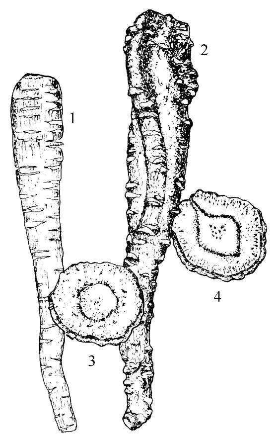
- 显微鉴别：皮层和韧皮部散有油管；木质部导管放射状排列；杭白芷木质部略呈方形射线较多可资区别
  - 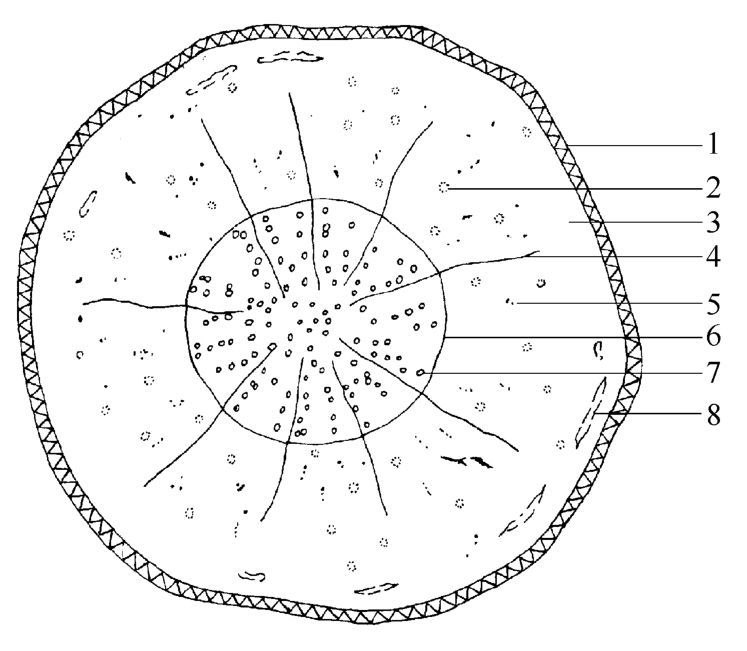
  - 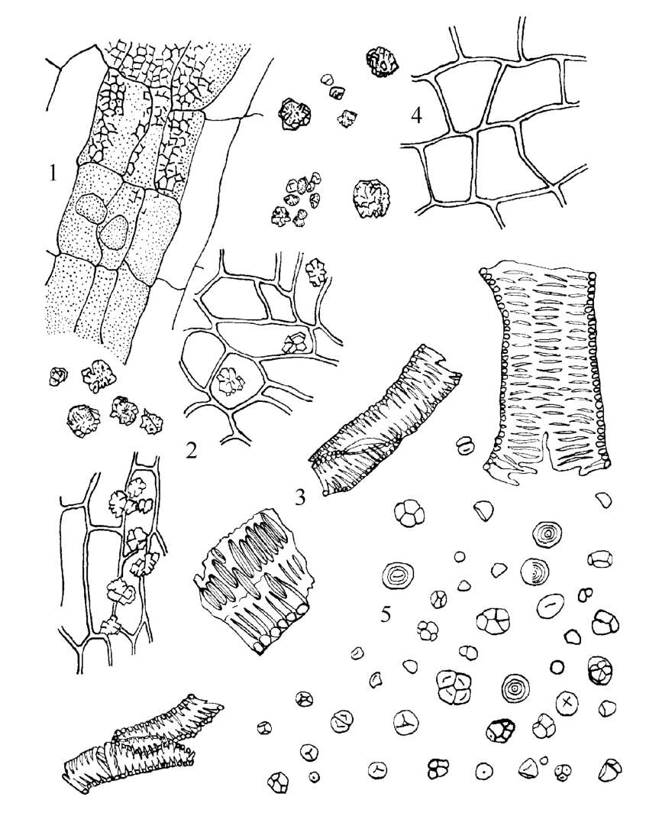
- 成分：香豆精衍生物（欧前胡素、异欧前胡素、花椒毒素、氧化前胡素等）；挥发油59种成分
- 理化鉴别：薄层色谱与白芷对照药材/欧前胡素·异欧前胡素对照品比对，紫外灯(365nm)显相同荧光斑点
- 含量测定：含欧前胡素不得少于0.080%
- 功效：性温，味辛。解表散寒，祛风止痛，宣通鼻窍，燥湿止带，消肿排脓

### 当归 Angelicae Sinensis Radix
- 来源：伞形科植物当归 *Angelica sinensis* (Oliv.) Diels 的干燥根
- 产地：主产甘肃岷县、武都、漳县（主为栽培）
- 采收加工：栽培至第二年秋后采挖，捆把上棚烟火慢慢熏干
- 性状鉴别：根上端"归头"、主根"归身"、支根"归尾"，全体"全归"；外皮黄棕色至棕褐色，断面黄白色或淡黄棕色皮部有棕色油点，形成层黄棕色环状，木质部放射状纹理似"菊花心"；香气浓郁，味甘、辛、微苦
  - 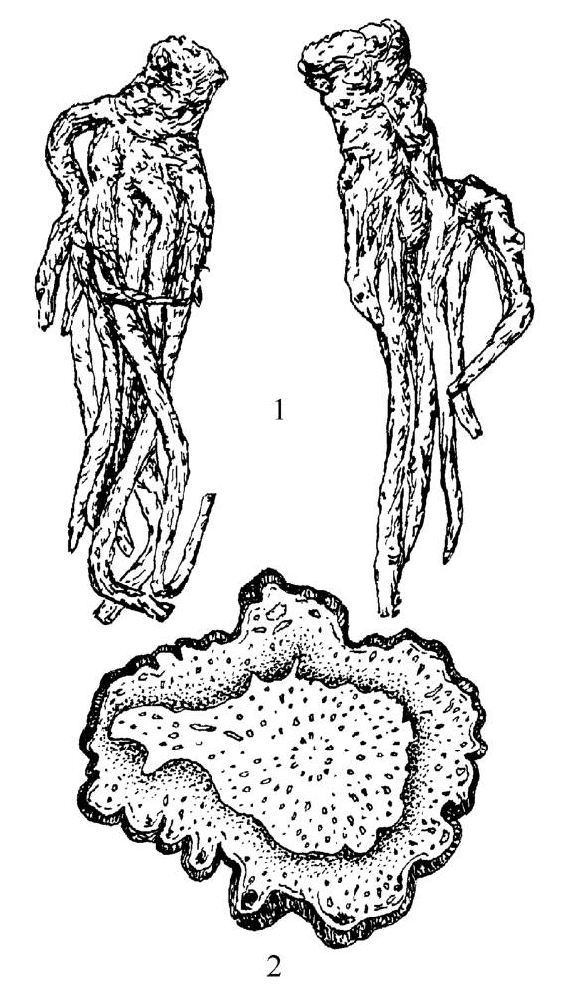
- 显微鉴别：韧皮部多裂隙散在多数类圆形油室；形成层环状；木质部射线宽3～5列细胞
  - 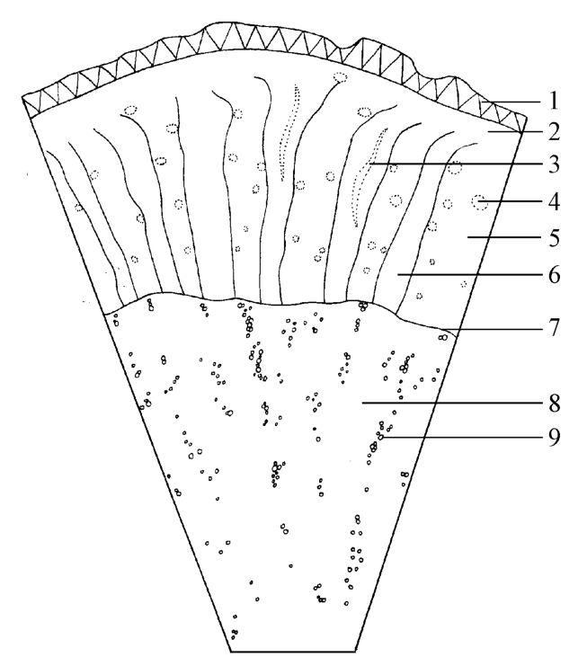
  - 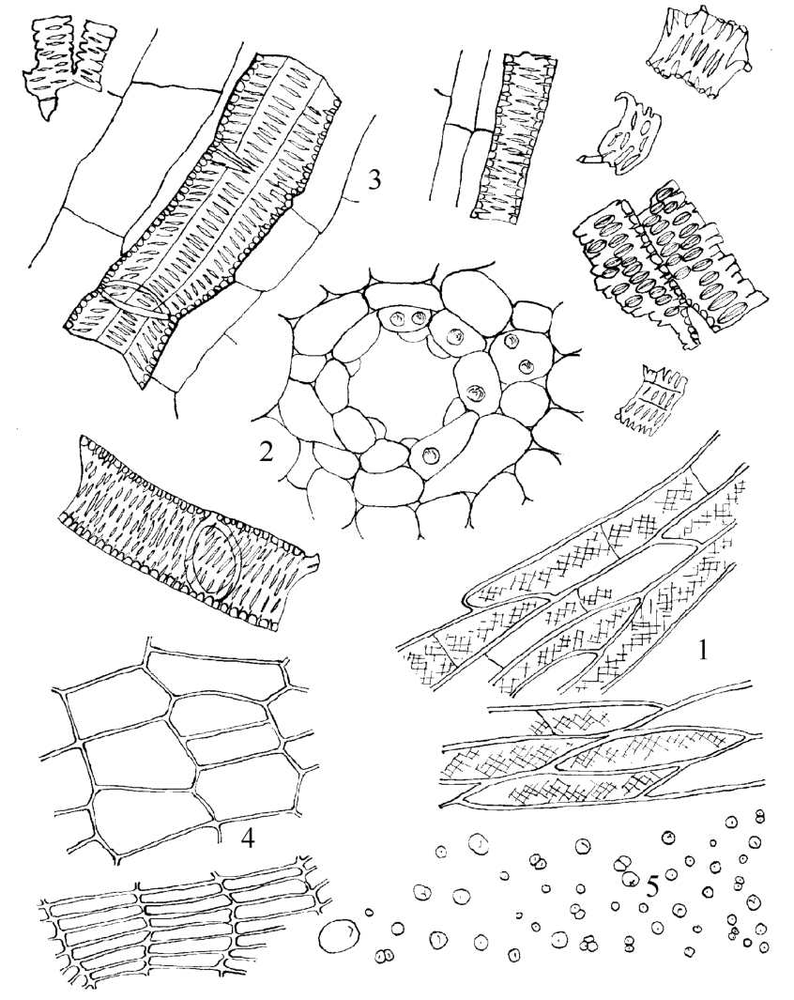
- 成分：挥发油0.42%，主要为藁本内酯(约47%)及正丁烯基苯酞，为解痉主要活性成分；水溶性成分阿魏酸等；17种氨基酸
- 理化鉴别：薄层色谱与阿魏酸/藁本内酯对照品比对，紫外灯(365nm)显相同荧光斑点
- 含量测定：含挥发油不得少于0.4%(mL/g)；含阿魏酸不得少于0.050%
- 功效：性温，味甘、辛。补血活血，调经止痛，润肠通便
- 附注：东当归、欧当归曾作当归使用，含相似挥发油成分但非正品

### 独活 Angelicae Pubescentis Radix
- 来源：伞形科植物重齿毛当归 *Angelica pubescens* Maxim.f. *biserrata* Shan et Yuan 的干燥根，习称"川独活"
- 产地：主产湖北、四川
- 采收加工：春初苗发芽或秋末茎叶枯萎时采挖，炕至半干堆放发软后烘全干
- 性状鉴别：主根粗短略呈圆柱形下部分枝，根头膨大有横皱纹，断面皮部灰白色见棕色油点，形成层环棕色；香气特异，味苦辛微麻舌
  - 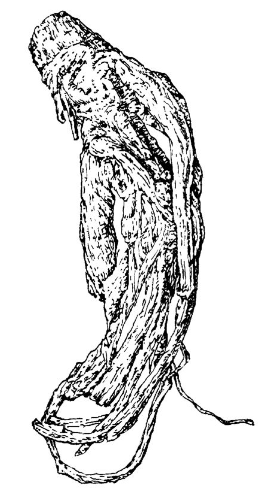
- 显微鉴别：韧皮部宽广占根半径1/2，油室排成数轮；木质部射线宽1～2列细胞
- 成分：甲基欧芹酚、佛手酚、二氢山芹醇当归酸酯（蛇床子素相关）等香豆素类
- 理化鉴别：薄层色谱与独活对照药材/二氢欧山芹醇当归酸酯·蛇床子素对照品比对
- 含量测定：含蛇床子素不得少于0.50%，含二氢欧山芹醇当归酸酯不得少于0.080%
- 功效：性微温，味苦、辛。祛风除湿，通痹止痛
- 附注：山独活、牛尾独活（伞形科）、九眼独活（五加科）等习用品，均非正品

### 前胡 Peucedani Radix（附：紫花前胡）
- 来源：伞形科植物白花前胡 *Peucedanum praeruptorum* Dunn. 的干燥根
- 产地：主产浙江、江西、四川
- 采收加工：冬季枯萎后或早春未抽茎时采挖，晒干或低温干燥
- 性状鉴别：不规则圆锥形圆柱形或纺锤形，表面黑褐色或灰黄色根头部有茎痕及叶鞘残基，断面淡黄白色见棕色形成层环及放射状纹理皮部多油点；气芳香，味微苦、辛
  - 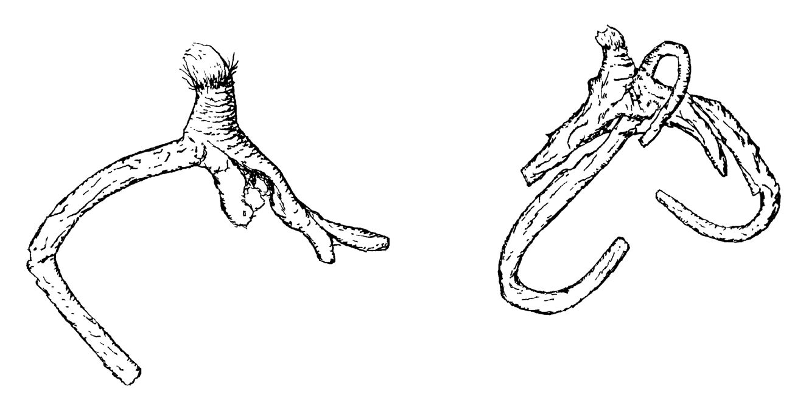
- 显微鉴别：韧皮部占根半径3/5散生多数油管；木质部大小导管相间排列
  - 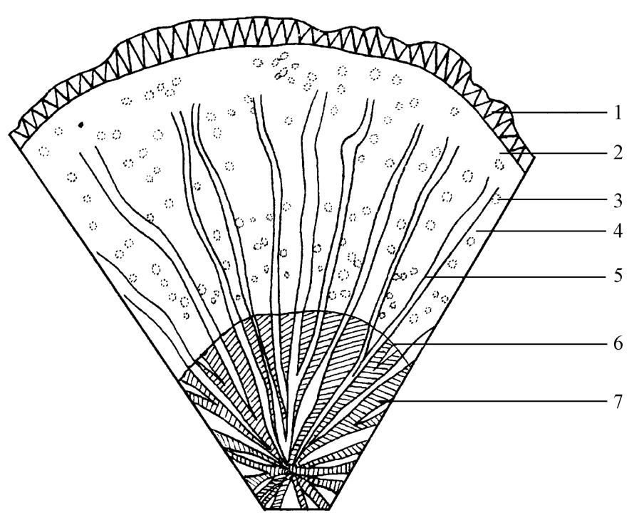
- 成分：挥发油；香豆素类42种（白花前胡甲乙丙丁素等）
- 理化鉴别：薄层色谱与白花前胡甲素/乙素对照品比对
- 含量测定：含白花前胡甲素不得少于0.90%，含白花前胡乙素不得少于0.24%
- 功效：性微寒，味苦、辛。降气化痰，散风清热
- 【附】紫花前胡：伞形科植物紫花前胡的干燥根，木质部占根半径1/2导管排列不规则近中心有纤维束散在无油室；含紫花前胡苷等，含量不得少于0.90%；性微寒味苦辛，降气化痰散风清热

### 川芎 Chuanxiong Rhizoma
- 来源：伞形科植物川芎 *Ligusticum chuanxiong* Hort. 的干燥根茎
- 产地：主产四川、江西、湖北、陕西（多栽培）
- 采收加工：夏季茎节盘突出略带紫色时采挖，晒后烘干撞去须根
- 性状鉴别：不规则结节状拳形团块，表面灰褐色或褐色有多数平行隆起轮节，断面黄白色或灰黄色见波状环纹及油点；香气特异浓郁，味苦辛稍麻舌微回甜
  - 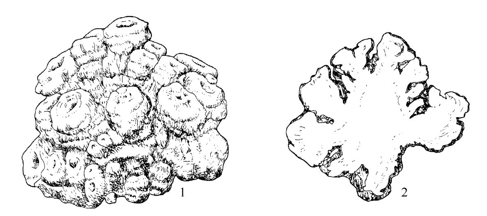
- 显微鉴别：形成层环呈波状或不规则多角形；薄壁组织散有多数油室；髓部较大
  - 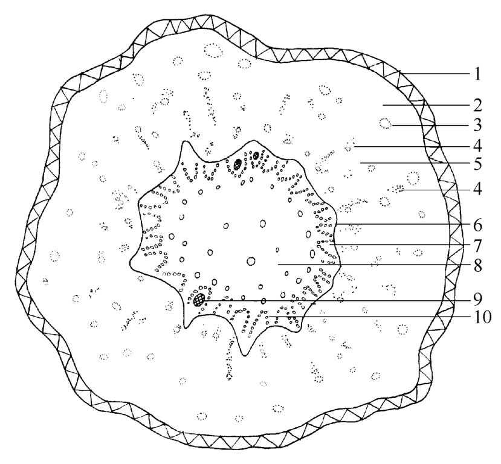
  - 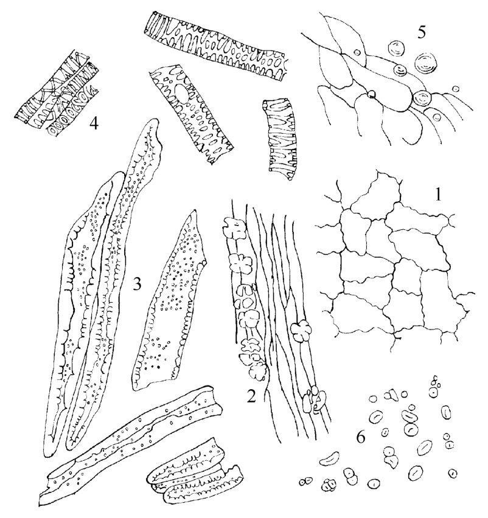
- 成分：挥发油1%；生物碱（川芎嗪）；内酯类（藁本内酯等）；阿魏酸
- 理化鉴别：粉末经石油醚提取液加二硝基苯甲酸甲醇液及氢氧化钾显紫红色（检查不饱和内酯）；薄层色谱与川芎对照药材/欧当归内酯A对照品比对
- 含量测定：含阿魏酸不得少于0.10%
- 功效：性温，味辛。活血行气，祛风止痛
- 附注：茶芎(抚芎)、东川芎曾作川芎使用，非正品

### 防风 Saposhnikoviae Radix
- 来源：伞形科植物防风 *Saposhnikovia divaricata* (Turcz.) Schischk. 的干燥根，习称"关防风"
- 产地：主产东北及内蒙古东部（现有栽培）
- 采收加工：春秋挖根，晒至八九成干捆把再晒干
- 性状鉴别：长圆柱形或长圆锥形，根头部密集环纹习称"蚯蚓头"，表面灰棕色或棕褐色，断面皮部棕黄色至棕色有裂隙木部黄色；气特异，味微甘
  - 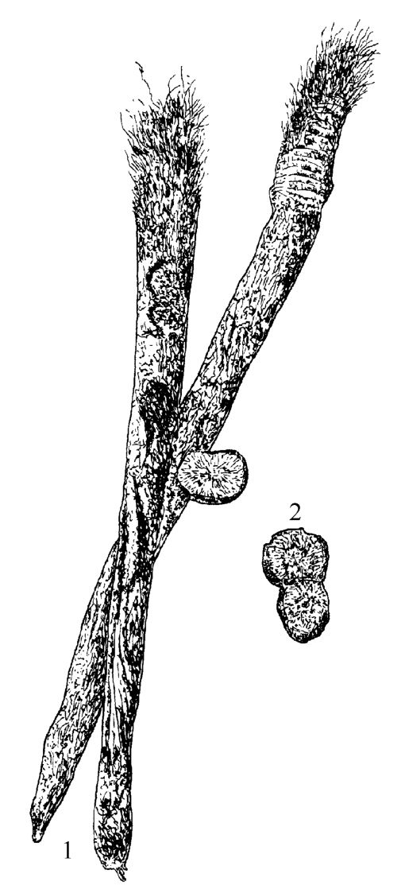
- 显微鉴别：韧皮部有多数类圆形油管含金黄色分泌物；木质部导管放射状排列；薄壁组织散有少数石细胞
  - 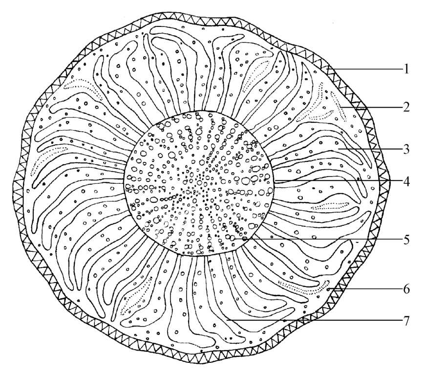
  - 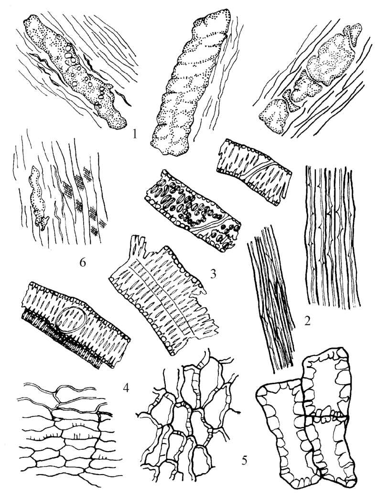
- 成分：挥发油；呋喃香豆精（升麻素苷、5-O-甲基维斯阿米醇苷，有镇痛作用）；色原酮（有降压作用）
- 理化鉴别：薄层色谱与防风对照药材/升麻素苷·5-O-甲基维斯阿米醇苷对照品比对
- 含量测定：含升麻素苷+5-O-甲基维斯阿米醇苷总量不得少于0.24%
- 功效：性微温，味辛、甘。祛风解表，胜湿止痛，止痉
- 附注：全国23省调查品种混乱，水防风类/云防风类/川防风类/西北防风类等多种混淆品，均非正品

### 柴胡 Bupleuri Radix
- 来源：伞形科植物柴胡 *Bupleurum chinense* DC. 或狭叶柴胡 *B. scorzonerifolium* Willd. 的干燥根，按性状分别习称"北柴胡"和"南柴胡"
- 产地：北柴胡主产河北、河南、辽宁、湖北；南柴胡主产湖北、四川、安徽、黑龙江
- 采收加工：春秋采挖，晒干
- 性状鉴别：北柴胡圆柱形或长圆锥形，根头膨大顶端有茎基或叶基残留，断面片状纤维性，气微香味微苦；南柴胡根头多细毛状枯叶纤维，断面不显纤维性，具败油气
  - 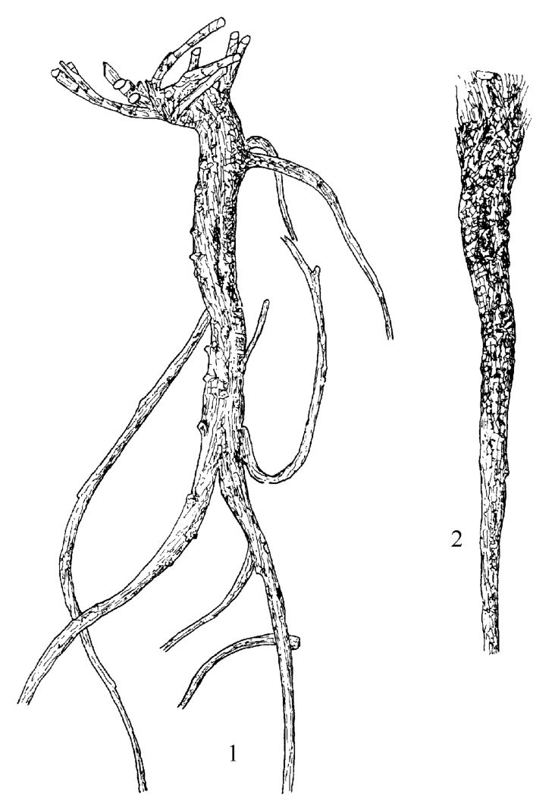
- 显微鉴别：北柴胡皮层散有油管及裂隙，木质部导管稀疏分散木纤维束断续环状；南柴胡木栓层整齐帽顶状，油管较多而大
  - 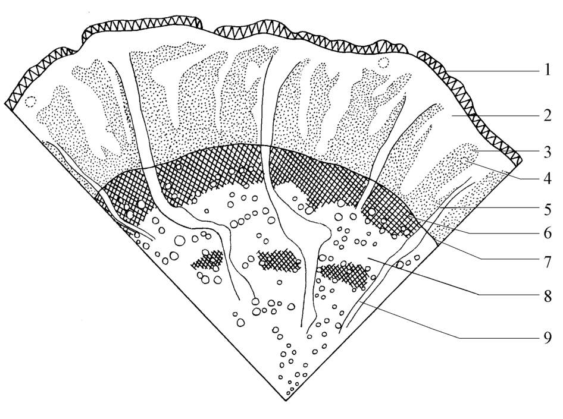
  - 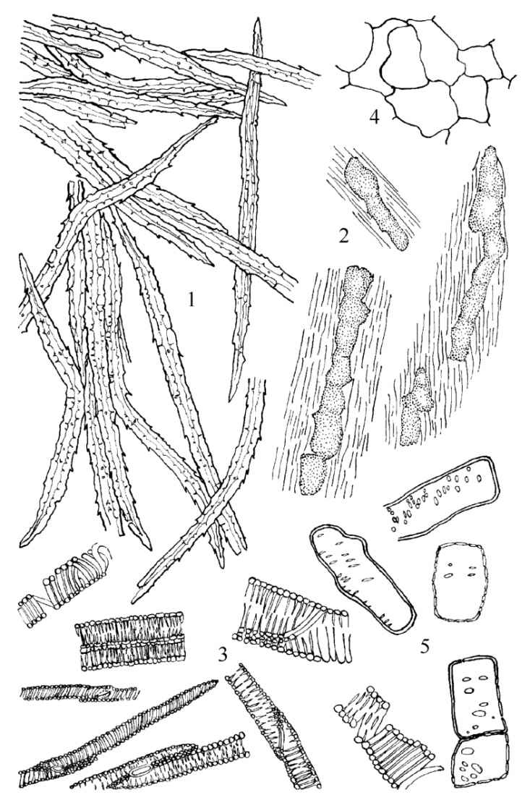
- 成分：挥发油、皂苷（柴胡皂苷a/c/d/S1等）、多元醇、植物甾醇、香豆素
- 理化鉴别：粉末加水振摇产生持久性泡沫（检查皂苷）；薄层色谱与北柴胡对照药材/柴胡皂苷a·d对照品比对
- 含量测定：含柴胡皂苷a+d总量不得少于0.30%
- 功效：性微寒，味辛、苦。疏散退热，疏肝解郁，升举阳气
- 附注：兴安柴胡、竹叶柴胡（膜缘柴胡）、银州柴胡等约30余种同属植物；大叶柴胡根茎有毒不可作柴胡用

### 北沙参 Glehniae Radix
- 来源：伞形科植物珊瑚菜 *Glehnia littoralis* Fr.Schmidt ex Miq. 的干燥根
- 产地：主产江苏、山东
- 采收加工：夏秋挖根，沸水烫后去外皮晒干或烘干，或洗净直接干燥
- 性状鉴别：细长圆柱形，表面淡黄白色略粗糙具细纵皱纹，断面皮部浅黄白色木部黄色；气特异，味微甜
- 显微鉴别：韧皮部外侧筛管群颓废成条状，分泌道散列含黄色分泌物；木质部束多呈"V"字形
  - 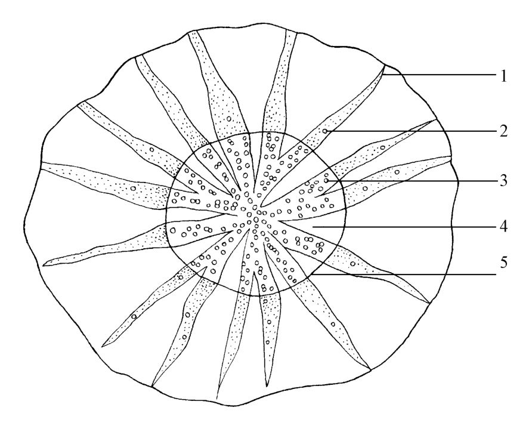
- 成分：欧前胡素、佛手柑内酯、补骨脂内酯等香豆精类；亚油酸等有机酸；多糖
- 功效：性微寒，味甘、微苦。养阴清肺，益胃生津
- 附注：田葛蒿及硬阿魏（伞形科）、麦瓶草（石竹科）、石沙参（桔梗科）的根曾混充北沙参，均非正品

### 龙胆 Gentianae Radix et Rhizoma（附：红花龙胆）
- 来源：龙胆科植物条叶龙胆 *Gentiana manshurica* Kitag.、龙胆 *G. scabra* Bge.、三花龙胆 *G. triflora* Pall. 或坚龙胆 *G. rigescens* Franch. 的干燥根和根茎，前三种习称"龙胆"，后一种习称"坚龙胆"
- 产地：龙胆主产东北；三花龙胆主产东北及内蒙古；条叶龙胆主产东北；坚龙胆主产云南
- 采收加工：春秋采挖（秋季质量较好），洗净晒干
- 性状鉴别：根茎不规则块状，根细长圆柱形表面淡黄色或黄棕色具横皱纹，断面皮部黄白色木质部束点状环列习称"筋脉点"；坚龙胆无横皱纹有脱落的灰白色膜质套筒状物；味甚苦
  - 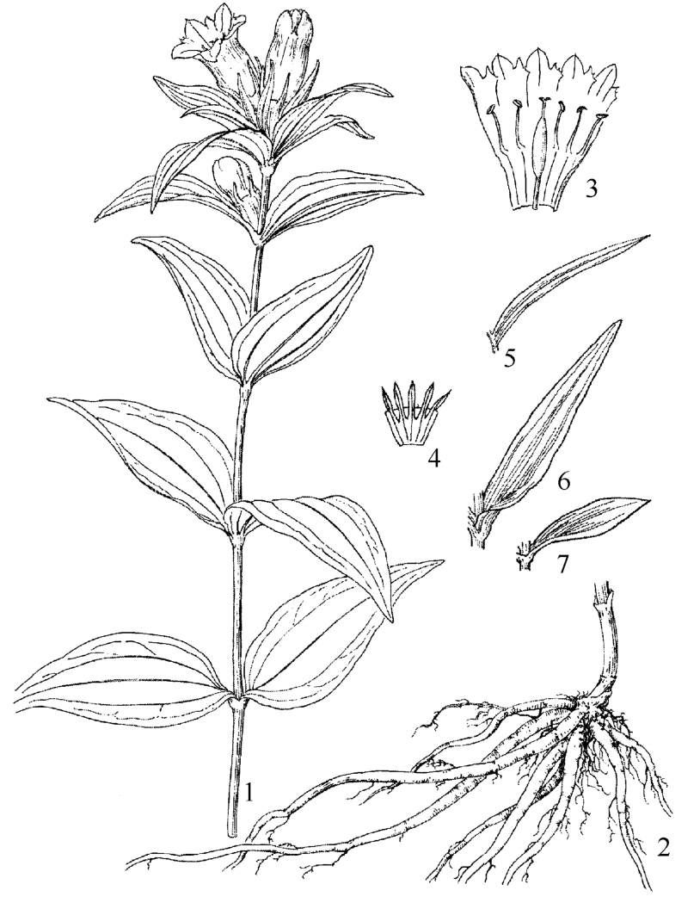
- 显微鉴别：内皮层明显每个细胞分隔成2～18个子细胞；木质部束3～10个楔形排列；髓部明显；坚龙胆无髓部
  - 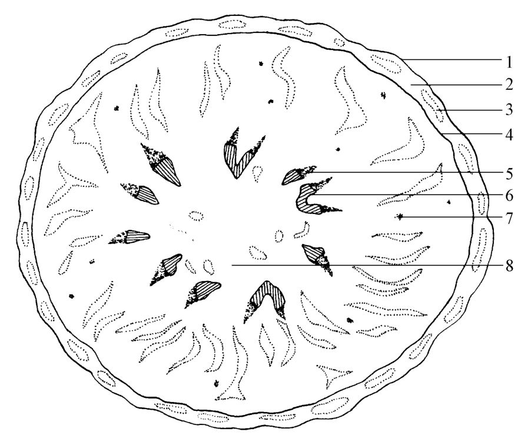
  - 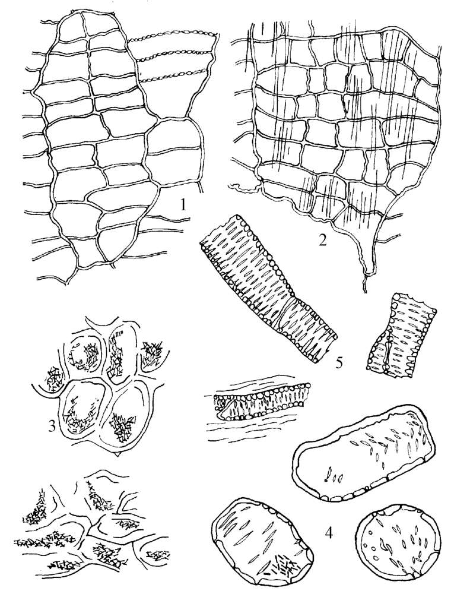
- 成分：环烯醚萜及裂环烯醚萜苷（龙胆苦苷、当药苦苷、当药苷），龙胆中含量最高(4.02%～6.34%)
- 理化鉴别：薄层色谱与龙胆苦苷对照品比对
- 含量测定：龙胆含龙胆苦苷不得少于3.0%，坚龙胆不得少于1.5%
- 功效：性寒，味苦。清热燥湿，泻肝胆火
- 附注：传统商品按产地分关龙胆/坚龙胆/川龙胆/严龙胆/苏龙胆五类
- 【附】红花龙胆：龙胆科植物红花龙胆的干燥全草，含芒果苷不得少于2.0%

### 秦艽 Gentianae Macrophyllae Radix
- 来源：龙胆科植物秦艽 *Gentiana macrophylla* Pall.、麻花秦艽 *G. straminea* Maxim.、粗茎秦艽 *G. crassicaulis* Duthie ex Burk. 或小秦艽 *G. dahurica* Fisch. 的干燥根，前三种分别习称"秦艽"和"麻花艽"，后一种习称"小秦艽"
- 产地：秦艽主产甘肃（质量最好）、山西、陕西；麻花秦艽主产四川、甘肃、青海、西藏；小秦艽主产河北、内蒙古、陕西
- 采收加工：春秋采挖，晒软堆放"发汗"至表面红黄色后晒干，或直接晒干；小秦艽趁鲜搓去黑皮
- 性状鉴别：秦艽类圆柱形扭曲不直，根头部数个根茎合着，断面皮部黄色木部黄色根茎中央有髓；麻花艽下部多根交错纠聚呈麻花状断面多枯朽状；味苦微涩
  - 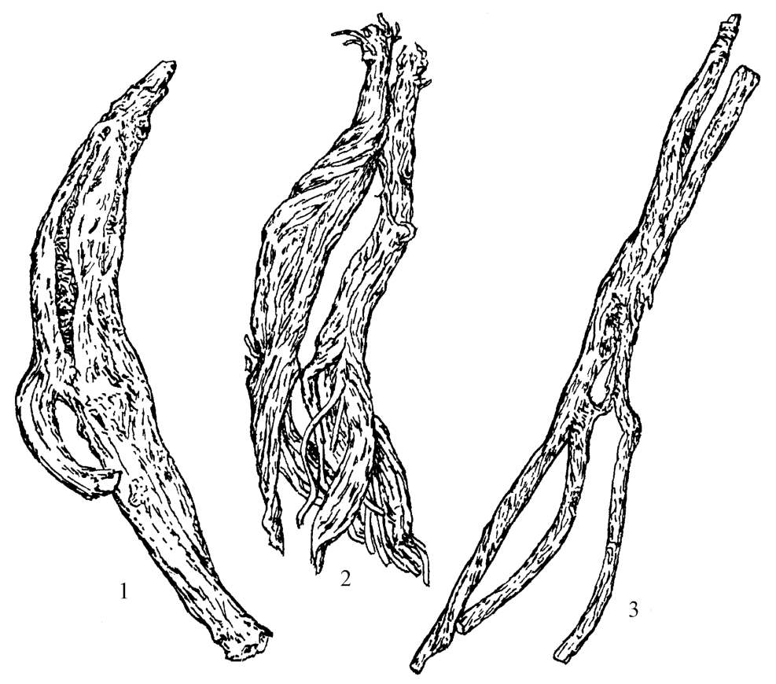
- 显微鉴别：栓化细胞每个分隔成3～12个子细胞；草酸钙针晶较多；小秦艽与麻花艽粉末中有厚壁网纹细胞
  - 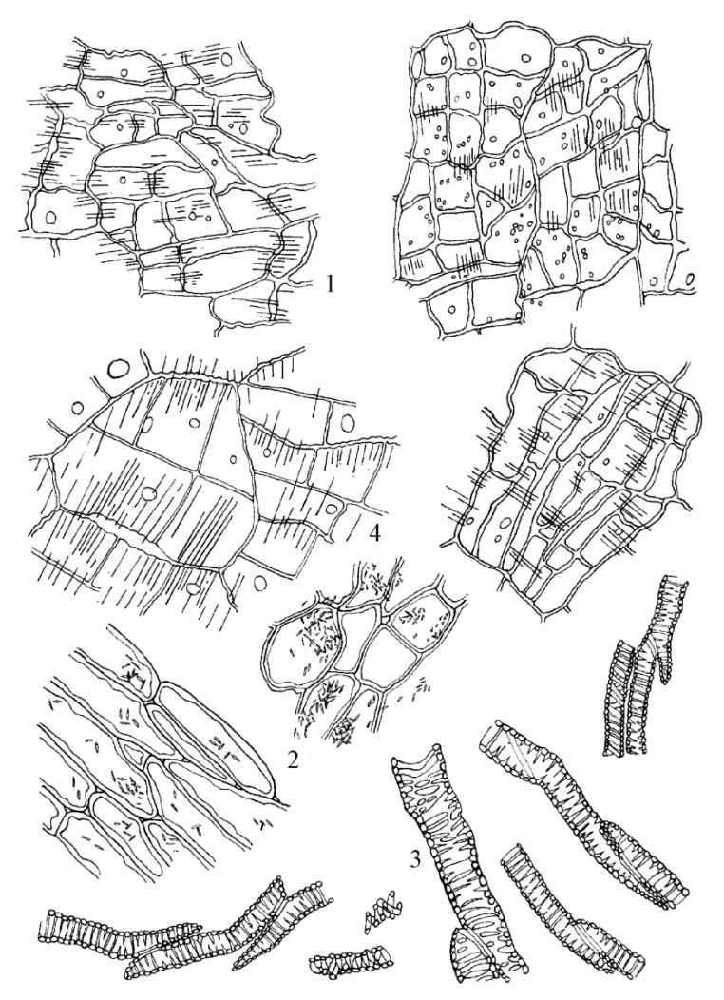
- 成分：生物碱（秦艽甲素即龙胆碱含量最高、秦艽乙素、秦艽丙素）；龙胆苦苷（苦味成分）
- 理化鉴别：横切面紫外灯(365nm)显黄白色或金黄色荧光；薄层色谱与龙胆苦苷/栎瘿酸对照品比对
- 含量测定：含龙胆苦苷+马钱苷酸总量不得少于2.5%
- 功效：性平，味辛、苦。祛风湿，清湿热，止痹痛，退虚热
- 附注：藏秦艽（西藏秦艽）及多种乌头属植物根曾伪充秦艽（黑秦艽/黑大艽/辫子艽），均非正品

### 紫草 Arnebiae Radix
- 来源：紫草科植物新疆紫草 *Arnebia euchroma* (Royle) Johnst. 或内蒙紫草 *A. guttata* Bunge 的干燥根，依次称"软紫草""内蒙紫草"
- 产地：新疆紫草主产新疆、西藏；内蒙紫草主产内蒙古、甘肃
- 采收加工：春秋采挖，晒干
- 性状鉴别：软紫草不规则长圆柱形多扭曲，表面紫红色或紫褐色皮部疏松呈条形片状多层重叠易剥落；内蒙紫草皮部略薄数层相叠；味微苦涩或涩
  - 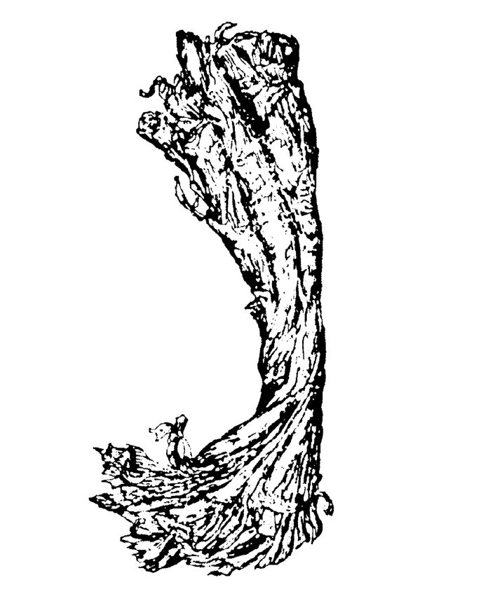
- 显微鉴别：木栓层将韧皮部木质部层层分隔；木栓细胞及薄壁细胞含紫色素
  - 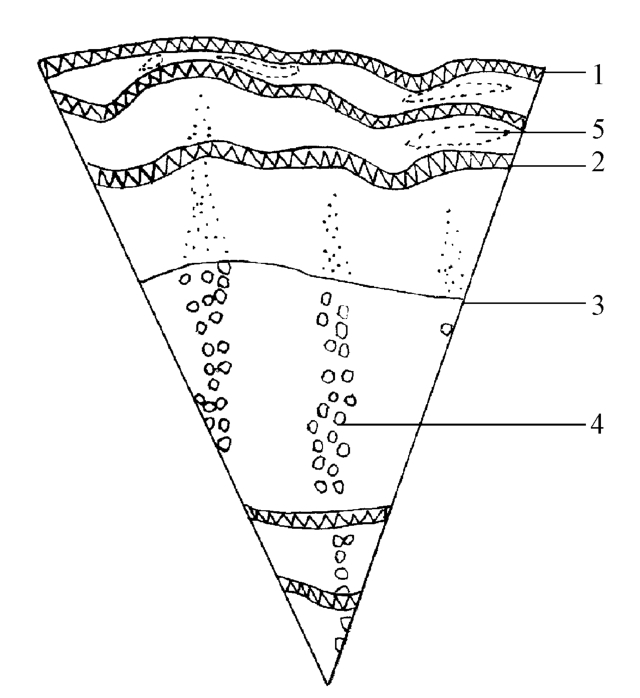
- 成分：萘醌类色素（紫草素、乙酰紫草素等）、多糖、脂肪酸
- 理化鉴别：粉末加热生成红色气体凝结红褐色油滴；薄层色谱与紫草对照药材比对，喷氢氧化钾甲醇液斑点变蓝色
- 含量测定：含羟基萘醌总色素（以左旋紫草素计）不得少于0.80%
- 功效：性寒，味甘、咸。清热凉血，活血解毒，透疹消斑
- 附注：硬紫草（紫草科紫草）、滇紫草、西藏紫草等同科植物根曾混用，均非正品

### 丹参 Salviae Miltiorrhizae Radix et Rhizoma
- 来源：唇形科植物丹参 *Salvia miltiorrhiza* Bge. 的干燥根和根茎
- 产地：主产安徽、江苏、山东、四川（栽培或野生）
- 采收加工：秋季采挖，晒干
- 性状鉴别：根茎粗短，根长圆柱形略弯曲，表面棕红色或暗棕红色具纵皱纹老根呈鳞片状剥落，断面皮部棕红色木部灰黄色或紫褐色见黄白色导管束放射状排列；味微苦涩
  - 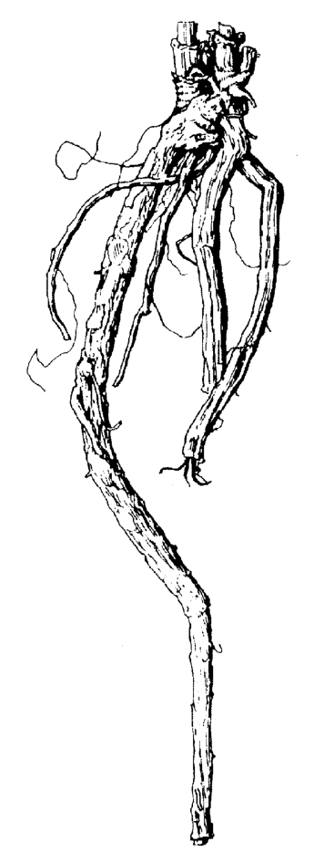
- 显微鉴别：韧皮部狭窄呈半月形；木质部8～10多束呈放射状；纤维常成束存在于中央初生木质部
  - 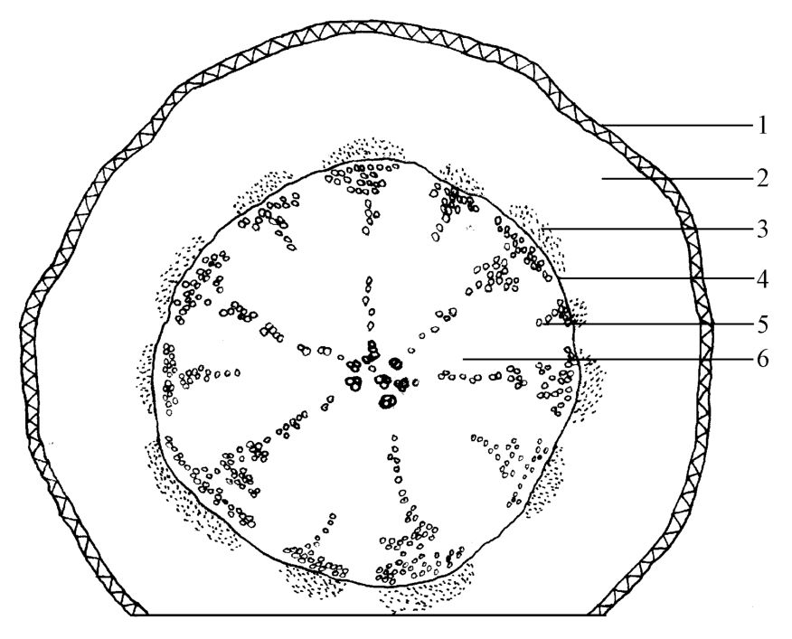
  - 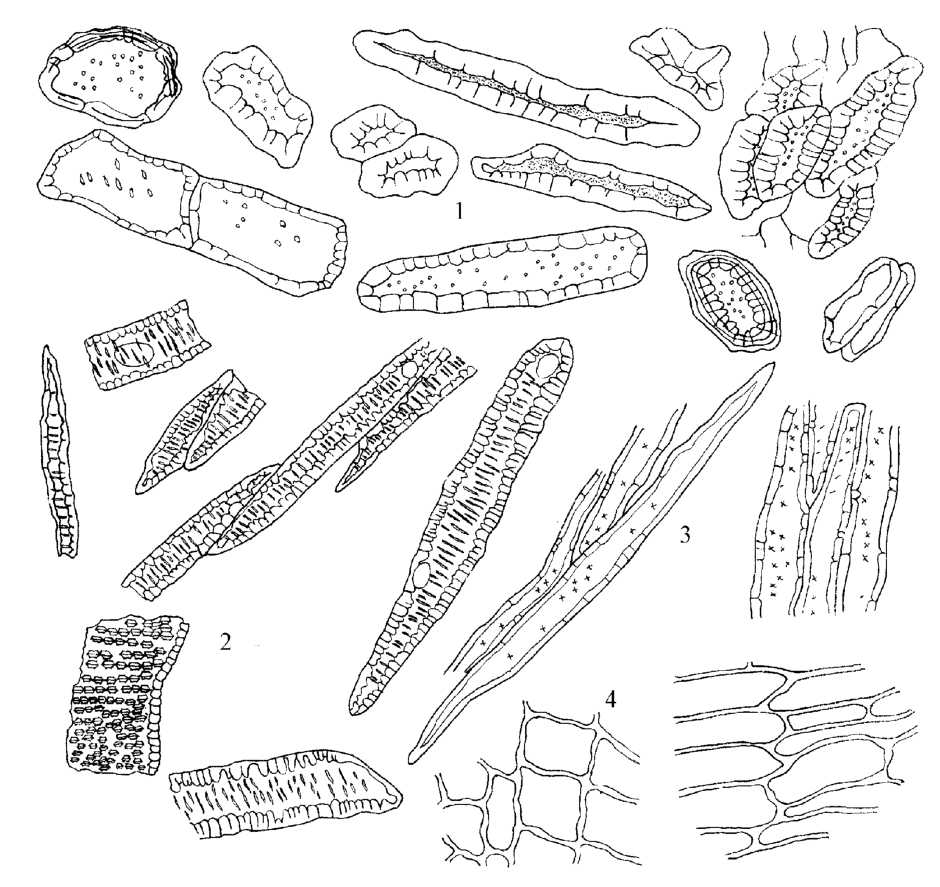
- 成分：菲醌类（丹参酮Ⅰ/ⅡA/ⅡB、隐丹参酮——抗菌主要有效成分）；水溶性酚酸类（丹参素、丹酚酸A/B）
- 理化鉴别：薄层色谱与丹参对照药材/丹参酮ⅡA·丹酚酸B对照品比对
- 含量测定：含丹参酮ⅡA+隐丹参酮+丹参酮Ⅰ总量不得少于0.25%；含丹酚酸B不得少于3.0%
- 功效：性微寒，味苦。活血祛瘀，通经止痛，清心除烦，凉血消痈
- 附注：南丹参、甘西鼠尾"甘肃丹参"、褐毛甘西鼠尾、三叶鼠尾、白花丹参等同属植物在部分地区混用，均非正品

### 黄芩 Scutellariae Radix
- 来源：唇形科植物黄芩 *Scutellaria baicalensis* Georgi 的干燥根
- 产地：主产河北、山西、内蒙古、辽宁（野生为主，已开始栽培）
- 采收加工：春秋采挖，晒至半干撞去外皮晒干
- 性状鉴别：圆锥形扭曲，表面棕黄色或深黄色，断面黄色中间红棕色；老根中心枯朽空洞者称"枯芩"，新根称"子芩/条芩"；味苦
  - 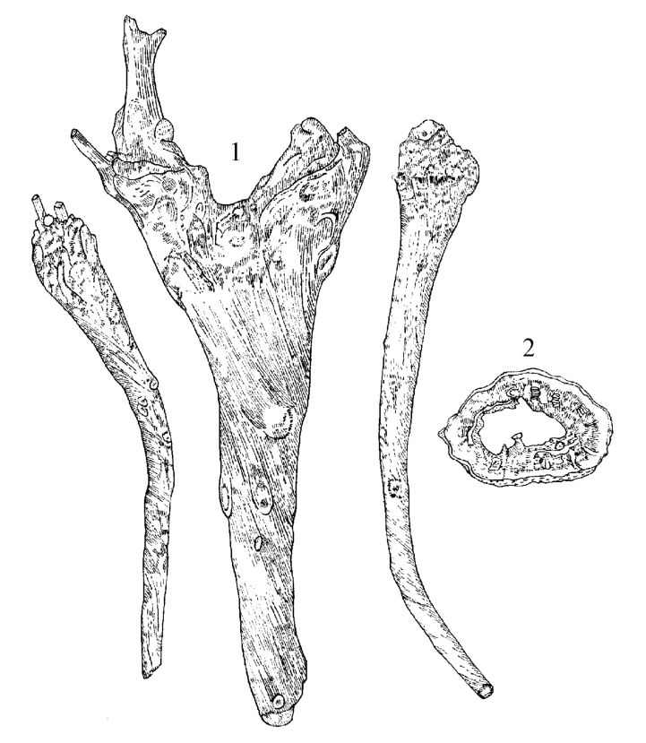
- 显微鉴别：石细胞与韧皮纤维散在；木质部在老根中央有栓化细胞环（单环或数个同心环）
  - 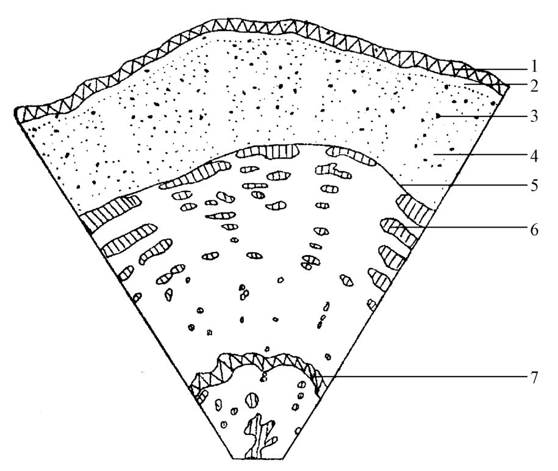
  - 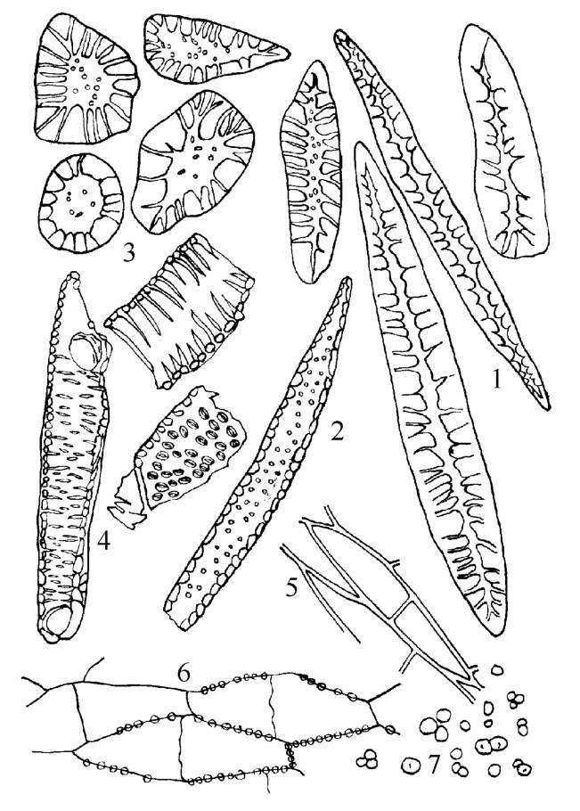
- 成分：黄酮类约30种（黄芩苷4.0%～5.2%、汉黄芩苷、黄芩素、汉黄芩素），子芩含量比枯芩高
- 理化鉴别：薄层色谱与黄芩对照药材/黄芩苷·黄芩素·汉黄芩素对照品比对
- 含量测定：含黄芩苷不得少于9.0%
- 功效：性寒，味苦。清热燥湿，泻火解毒，止血，安胎
- 附注：西南黄芩"滇黄芩"、粘毛黄芩、甘肃黄芩等同属植物曾混用，均非正品

### 玄参 Scrophulariae Radix
- 来源：玄参科植物玄参 *Scrophularia ningpoensis* Hemsl. 的干燥根
- 产地：主产浙江、湖北、江苏、江西（主为栽培品）
- 性状鉴别：类圆柱形中部略粗或上粗下细，微弯似羊角状，表面灰黄色或灰褐色，断面乌黑色微有光泽；水浸泡水呈墨黑色；气特异似焦糖，味甘、微苦
- 显微鉴别：石细胞单个散在或2～5成群；木质部射线宽广导管断续放射状排列
- 成分：环烯醚萜苷类（哈巴苷、哈巴俄苷，为变黑成分）
- 功效：性微寒，味甘、苦、咸。清热凉血，滋阴降火，解毒散结
- 附注：北玄参曾在华北东北作玄参用，皮层无石细胞，非正品

### 地黄 Rehmanniae Radix（附：熟地黄）
- 来源：玄参科植物地黄 *Rehmannia glutinosa* Libosch. 的新鲜或干燥块根
- 产地：主产河南温县、博爱、武陟、孟县（产量大质量佳）
- 采收加工：秋季采挖；鲜用者"鲜地黄"；徐徐烘焙至内部变黑约八成干捏团块为"生地黄"
- 性状鉴别：鲜地黄纺锤形或条状表面浅红黄色断面淡黄白色见橘红色油点；生地黄不规则团块表面灰黑色或灰棕色断面棕黑色或乌黑色有光泽具黏性；味微甜
  - 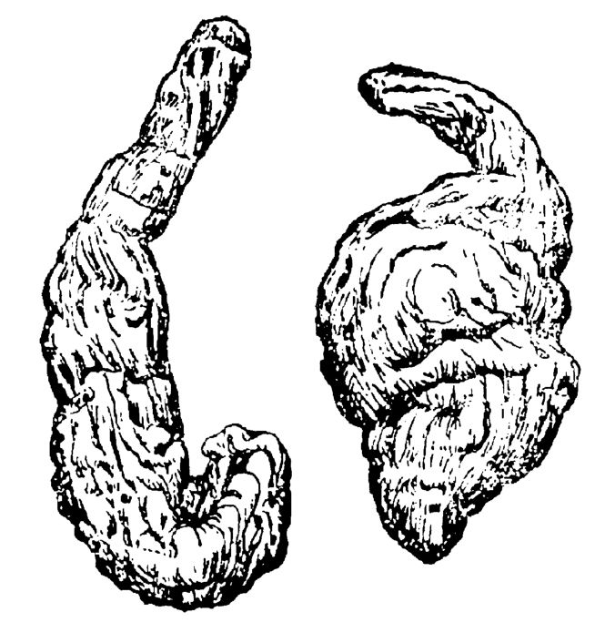
- 显微鉴别：皮层散有多数分泌细胞含橘黄色油滴；木质部射线较宽导管稀疏放射状排列
  - 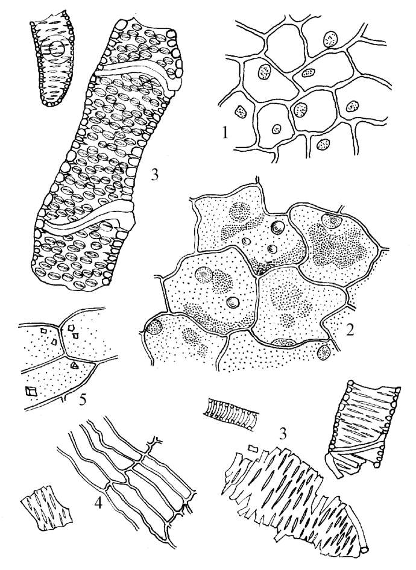
- 成分：环烯醚萜苷类（梓醇、桃叶珊瑚苷、地黄苷A～D，主要活性成分也是变黑成分）；苯乙醇苷类（毛蕊花糖苷）；水苏糖（含量高达32.1%～48.3%）
- 理化鉴别：薄层色谱与毛蕊花糖苷对照品比对
- 含量测定：生地黄含梓醇不得少于0.20%，含毛蕊花糖苷不得少于0.020%
- 功效：鲜地黄性寒味甘苦，清热生津凉血止血；生地黄性寒味甘，清热凉血养阴生津
- 【附】熟地黄：生地黄的炮制加工品，表面乌黑色有光泽黏性大；含毛蕊花糖苷不得少于0.020%；性微温味甘，补血滋阴，益精填髓

### 巴戟天 Morindae Officinalis Radix
- 来源：茜草科植物巴戟天 *Morinda officinalis* How 的干燥根
- 产地：主产广东、广西、福建
- 采收加工：全年可采，晒至六七成干捶扁切段晒干
- 性状鉴别：扁圆柱形略弯曲，表面灰黄色或暗灰色具纵纹和横裂纹，皮部横向断裂露出木部形似连珠，断面皮部紫色易与木部剥离；味甘、微涩
  - 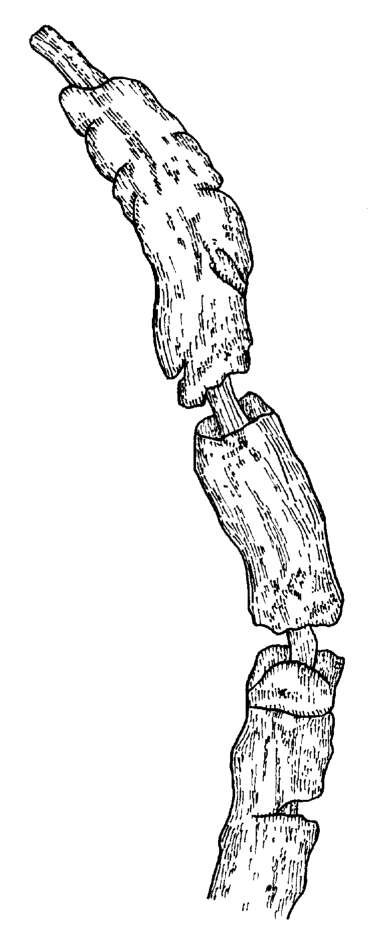
- 显微鉴别：皮层外侧石细胞断续排列成环；薄壁细胞及韧皮部含草酸钙针晶束；木纤维（纤维管胞）发达
  - 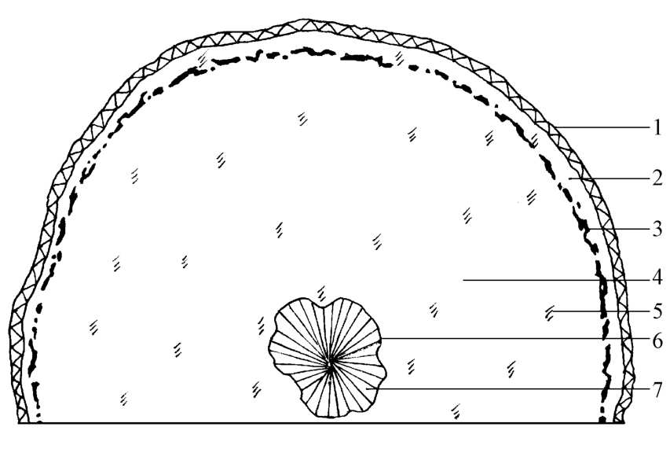
  - 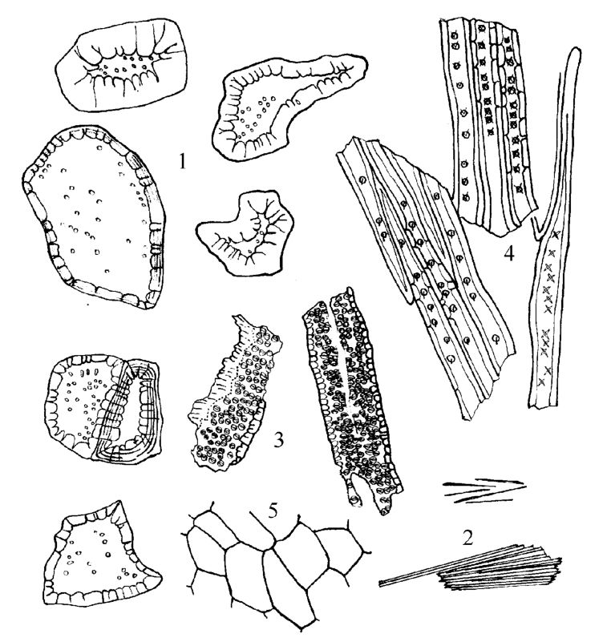
- 成分：蒽醌类（甲基异茜草素等）；耐斯糖；环烯醚萜苷（水晶蓝苷等）
- 含量测定：含耐斯糖不得少于2.0%
- 功效：性微温，味甘、辛。补肾阳，强筋骨，祛风湿
- 附注：羊角藤"建巴戟"、假巴戟、铁箍散"香巴戟"、四川虎刺"恩施巴戟"等混淆品，均非正品

### 茜草 Rubiae Radix et Rhizoma
- 来源：茜草科植物茜草 *Rubia cordifolia* L. 的干燥根和根茎
- 产地：主产陕西、山西、河南
- 性状鉴别：根茎结节状，根常弯曲扭曲，表面红棕色或暗棕色皮部易剥落露出黄红色木部，断面皮部狭紫红色木部宽广浅黄红色；味微苦，久嚼刺舌
- 显微鉴别：木质部占根主要部分全部木化射线不明显；薄壁细胞含草酸钙针晶束
- 成分：蒽醌类（羟基茜草素、茜草素、茜草酸）；升白活性成分茜草萘酸苷
- 功效：性寒，味苦。凉血，祛瘀，止血，通经
- 附注：同属多种植物在不同地区作茜草用，均非正品茜草

### 天花粉 Trichosanthis Radix
- 来源：葫芦科植物栝楼 *Trichosanthes kirilowii* Maxim. 或双边栝楼 *T. rosthornii* Harms 的干燥根
- 产地：栝楼主产河南、山东、江苏、安徽；双边栝楼主产四川
- 采收加工：秋冬采挖，刮去粗皮切段块或纵剖成瓣，晒干或烘干
- 性状鉴别：不规则圆柱形纺锤形或瓣块状，表面黄白色或淡棕黄色，断面白色或黄白色富粉性见黄色小孔放射状排列；味微苦
  - 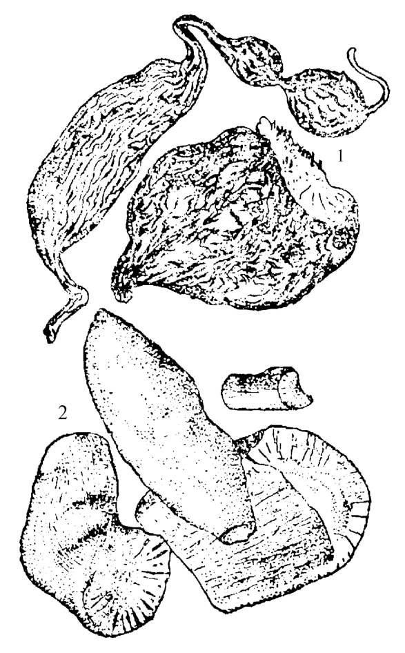
- 显微鉴别：木栓层内侧有断续排列石细胞环；木质部宽广导管3～5成群；初生木质部导管附近常有小片内涵韧皮部
  - 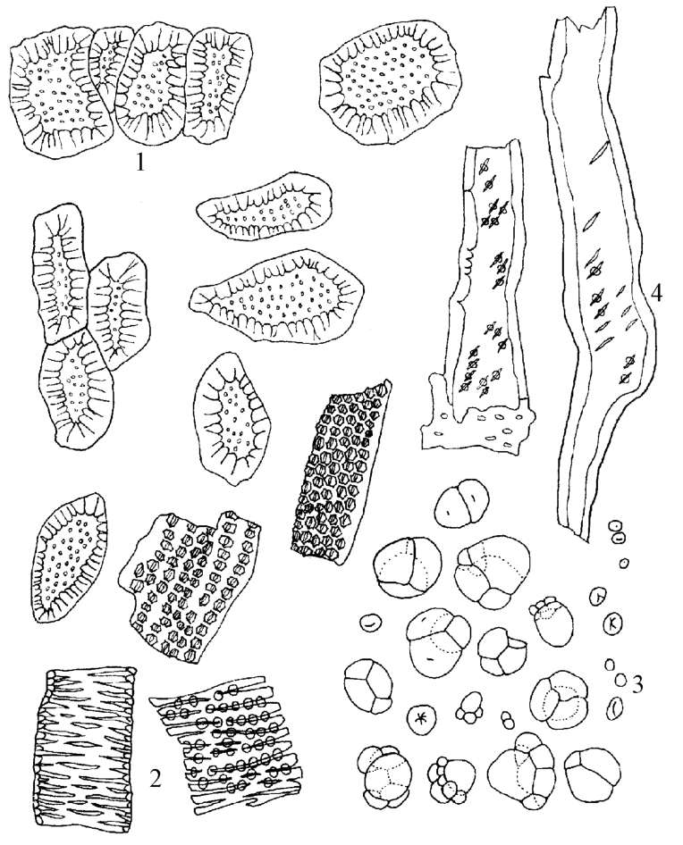
- 成分：皂苷（约1%）；天花粉蛋白（用于中期妊娠引产）；瓜氨酸等氨基酸
- 理化鉴别：薄层色谱与天花粉对照药材/瓜氨酸对照品比对，喷茚三酮试液显色
- 功效：性微寒，味甘、微苦。清热泻火，生津止渴，消肿排脓
- 附注：日本栝楼、长萼栝楼"广花粉"、湖北栝楼"苦花粉"（含有毒葫芦素B）等混淆品，均非正品

### 桔梗 Platycodonis Radix
- 来源：桔梗科植物桔梗 *Platycodon grandiflorum* (Jacq.) A.DC. 的干燥根
- 产地：全国大部分地区均产，东北华北产量大，华东质量较好
- 采收加工：春秋采挖，趁鲜刮去外皮或不去皮，干燥
- 性状鉴别：圆柱形或长纺锤形，表面白色或淡黄白色（不去皮者黄棕色至灰棕色），断面见放射状裂隙皮部类白色形成层环棕色；味微甜后苦
  - 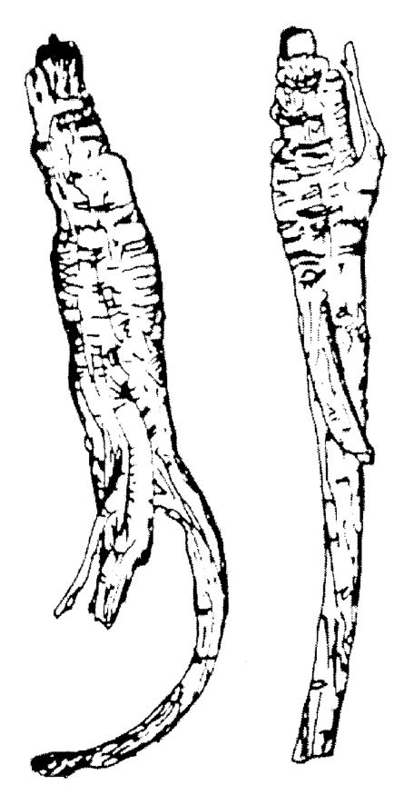
- 显微鉴别：韧皮部乳管群散在；木质部导管放射状排列；薄壁细胞含菊糖呈扇形结晶
  - 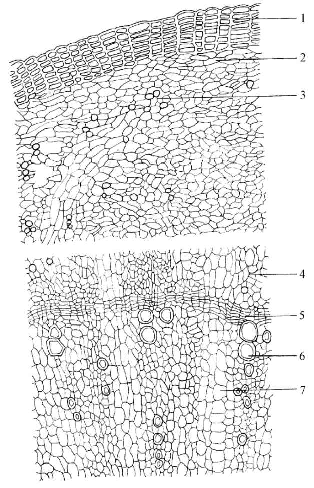
  - 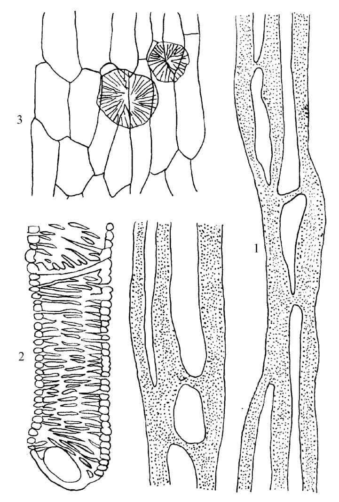
- 成分：皂苷（完全水解产生桔梗皂苷元、远志酸）；桔梗皂苷A/C/D；菊糖
- 理化鉴别：薄层色谱与桔梗对照药材比对
- 含量测定：含桔梗皂苷D不得少于0.10%
- 功效：性平，味苦、辛。宣肺，利咽，祛痰，排脓
- 附注：白花桔梗（变种，皂苷含量较低）、霞草（石竹科，伪充）曾混用，非正品

### 党参 Codonopsis Radix
- 来源：桔梗科植物党参 *Codonopsis pilosula* (Franch.) Nannf.、素花党参 *C. pilosula* var. *modesta* (Nannf.) L.T.Shen 或川党参 *C. tangshen* Oliv. 的干燥根
- 产地：党参主产山西、陕西、甘肃、四川及东北；素花党参"西党参"主产甘肃文县、四川南坪松潘；川党参主产四川、湖北
- 采收加工：秋季采挖，反复搓揉晒至七八成干捆把晒干
- 性状鉴别：长圆柱形，根头部疣状突起茎痕呈凹点状习称"狮子盘头"，根头下致密环状横纹，断面皮部淡棕黄色木质部淡黄色呈"菊花心"；有特殊香气，味微甜
  - 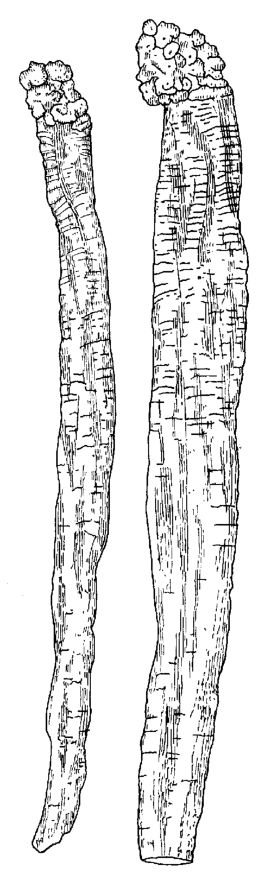
- 显微鉴别：韧皮部散有乳管群与筛管交互排列；薄壁细胞含菊糖及淀粉粒
  - 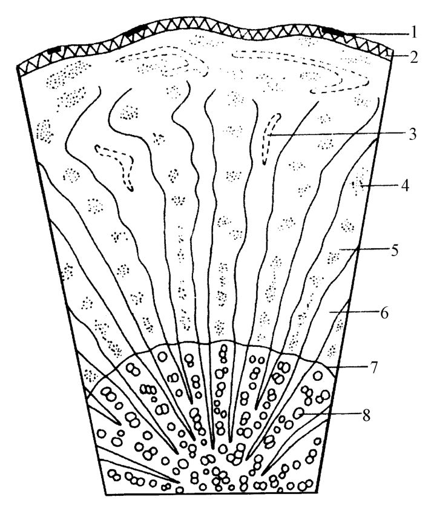
  - 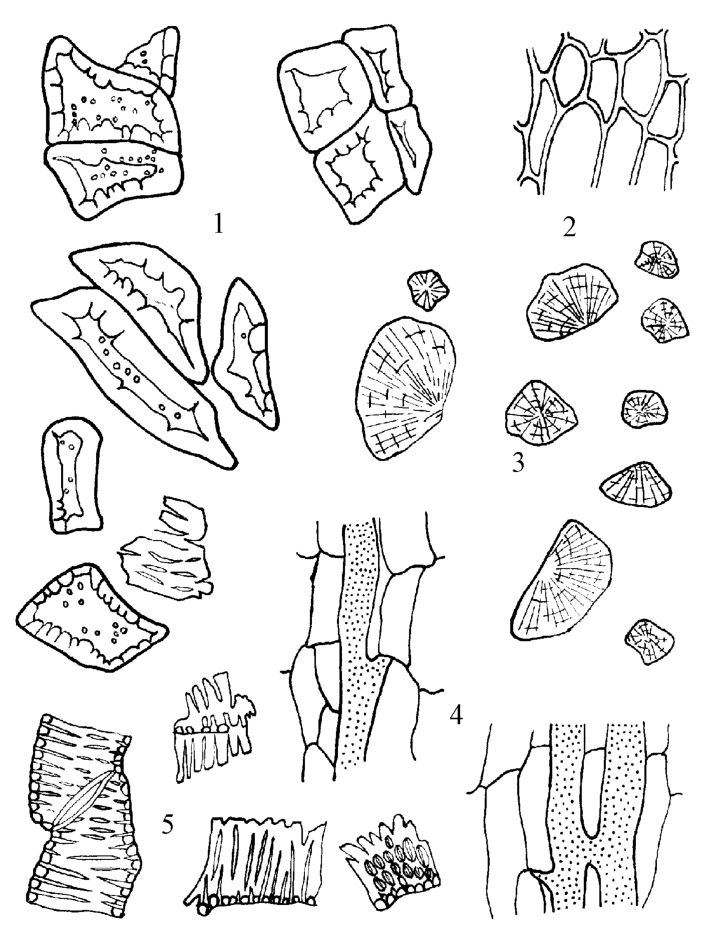
- 成分：三萜类（蒲公英萜醇等）；植物甾醇类；党参炔苷、党参苷Ⅰ～Ⅳ
- 理化鉴别：薄层色谱与党参炔苷对照品比对
- 功效：性平，味甘。健脾益肺，养血生津
- 附注：管花党参"白党/叙党"曾混用，质较次，非正品

### 南沙参 Adenophorae Radix
- 来源：桔梗科植物轮叶沙参 *Adenophora tetraphylla* (Thunb.) Fisch. 或沙参 *A. stricta* Miq. 的干燥根
- 产地：主产安徽、江苏、浙江、贵州
- 性状鉴别：圆锥形或圆柱形，顶端具根茎(芦头)，去栓皮后表面黄白色或淡棕黄色，断面不平坦黄白色交错纹理多裂隙；体轻质松泡；味微甘
- 显微鉴别：维管组织异常构造维管束交错排列；乳汁管多分布于筛管群上方；薄壁细胞含菊糖
- 成分：南沙参皂苷等三萜皂苷类；蒲公英萜酮；呋喃香豆精类（花椒毒素）
- 功效：性微寒，味甘。养阴清肺，益胃生津，化痰，益气
- 附注：无柄沙参、泡沙参等沙参属7种曾使用，但非正品南沙参

### 木香 Aucklandiae Radix（附：土木香）
- 来源：菊科植物木香 *Aucklandia lappa* Decne. 的干燥根
- 产地：主产云南（云木香），四川、西藏亦产（为栽培品）
- 采收加工：秋冬采挖2～3年生根，切段或纵剖晒干或风干撞去粗皮
- 性状鉴别：圆柱形或半圆柱形形如枯骨，表面黄棕色至灰褐色具显著皱纹，断面灰褐色至暗褐色形成层环棕色见散在褐色油室；气香特异，味微苦
  - 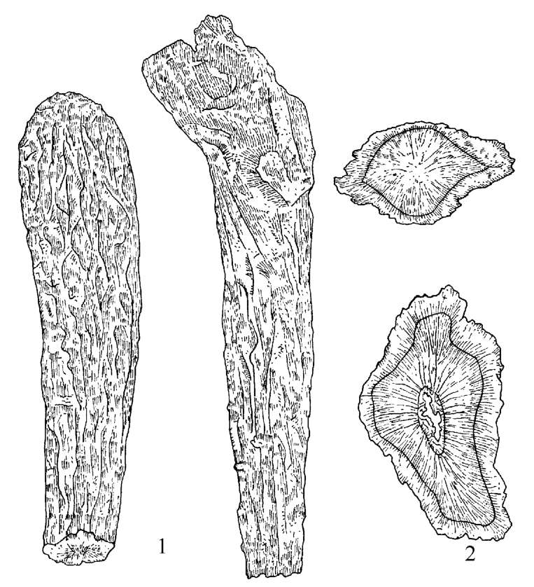
- 显微鉴别：韧皮部宽广纤维束散在；根中心为四原型初生木质部；薄壁组织有大型油室散在；薄壁细胞含菊糖
  - 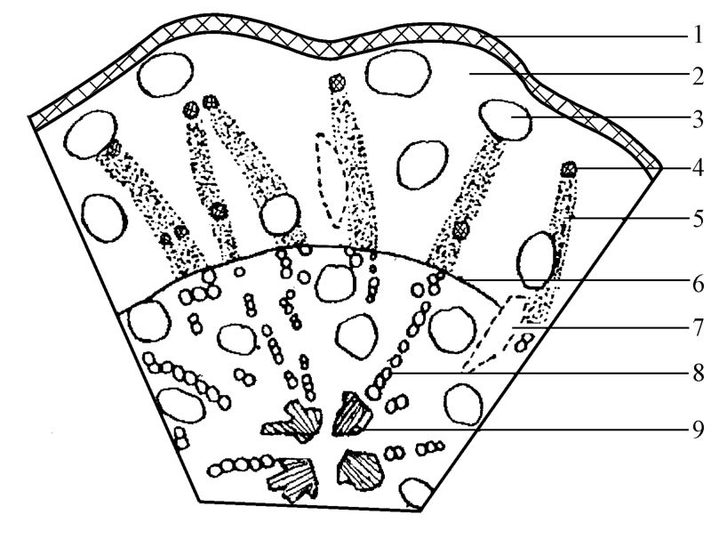
  - 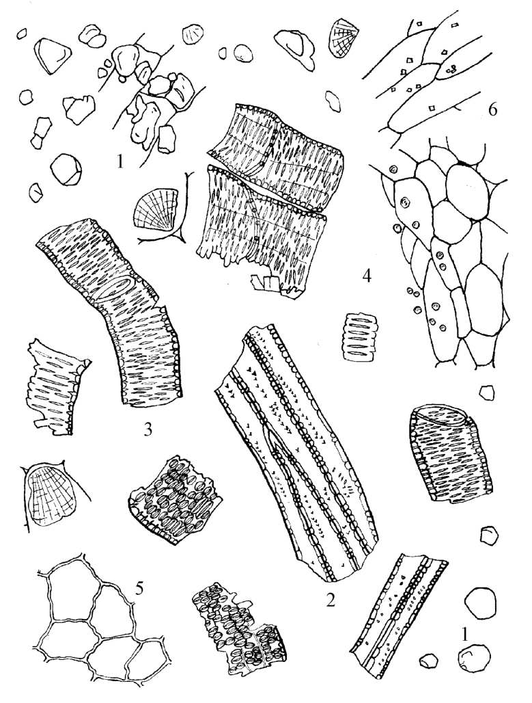
- 成分：挥发油（木香内酯、去氢木香内酯、木香烃内酯）；木香碱；菊糖
- 理化鉴别：薄层色谱与去氢木香内酯/木香烃内酯对照品比对
- 含量测定：含木香烃内酯+去氢木香内酯总量不得少于1.8%
- 功效：性温，味辛、苦。行气止痛，健脾消食
- 【附】土木香："祁木香"，菊科植物土木香的干燥根，含土木香内酯等，性温味辛苦，健脾和胃，行气止痛，安胎

### 川木香 Vladimiriae Radix
- 来源：菊科植物川木香 *Vladimiria souliei* (Franch.) Ling 或灰毛川木香 *V. souliei* var. *cinerea* Ling 的干燥根
- 产地：川木香主产四川、西藏；灰毛川木香产四川
- 性状鉴别：圆柱形"铁杆木香"或半圆柱形"槽子木香"，表面黄褐色或棕褐色外皮脱落处见丝瓜络状细筋脉，根头偶有"油头"（黑色发黏胶状物），断面黄白色或黄色木质部宽广放射状纹理；味苦，嚼之黏牙
- 显微鉴别：纤维束与筛管或导管相间排列呈放射状，伴有石细胞；油室散于射线及髓部；薄壁细胞含菊糖
- 成分：挥发油（川木香内酯、土木香内酯）
- 功效：性温，味苦、辛。行气止痛

### 白术 Atractylodis Macrocephalae Rhizoma
- 来源：菊科植物白术 *Atractylodes macrocephala* Koidz. 的干燥根茎
- 产地：主产浙江、安徽、湖北、湖南（多栽培）
- 采收加工：霜降前后挖取2～3年生根茎，烘干称"烘术"，晒干称"生晒术"
- 性状鉴别：不规则肥厚团块或拳状团块，表面灰黄色或灰棕色有瘤状突起，断面生晒术淡黄白色至淡棕色见菊花纹及油点，烘术角质样色较深有裂隙；气清香，味甘微辛，嚼之略带黏性
  - 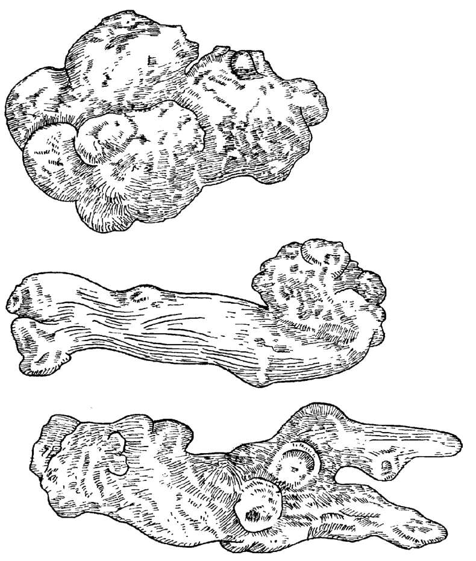
- 显微鉴别：皮层韧皮部及木射线有大型油室散在；木质部放射状排列，初生木质部附近纤维束最发达；中央有髓部；薄壁细胞含菊糖及草酸钙针晶
  - 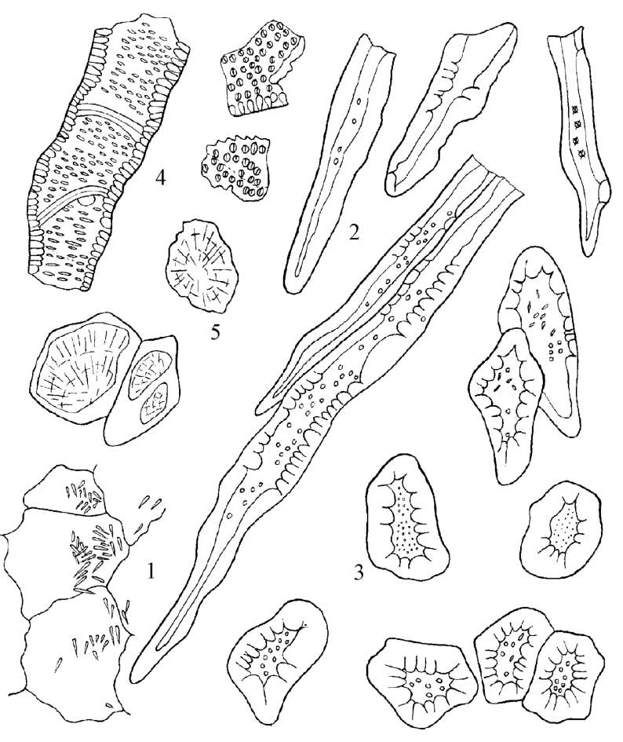
- 成分：挥发油1.4%（苍术酮、苍术醇、白术内酯A/B）；倍半萜糖苷及黄酮苷
- 理化鉴别：薄层色谱与白术对照药材比对，应显一桃红色主斑点（苍术酮）
- 检查：色度检查（控制走油变质程度）
- 功效：性温，味苦、甘。健脾益气，燥湿利水，止汗，安胎
