---
markmap:
  colorFreezeLevel: 2
  initialExpandLevel: 2
---

# 第六章 茎木类中药

## 第一节 概述
- 茎(caulis)类中药：主要指木本植物的茎及少数草本植物的茎，包括茎藤（海风藤、大血藤、鸡血藤）、茎枝(ramulus，桂枝、桑枝)、茎刺(spina，皂角刺)、茎髓(medulla，通草、灯心草)、茎翅状附属物（鬼箭羽）、草质茎（苏梗）
- 木(lignum)类中药：指木本植物茎形成层以内部分，通称木材。心材形成较早，蓄积树脂、树胶、丹宁、油类等，颜色较深质地致密，木类中药多采用心材（降香、苏木），少数用木材（沉香）

### 一、性状鉴别
- 木质藤茎和茎枝：多呈圆柱形或扁圆柱形，表面棕黄色，外表粗糙，节膨大具叶痕枝痕；断面纤维性或裂片状，木部呈放射状排列；气味可助鉴别（海风藤味苦有辛辣感，青风藤味苦无辛辣感）
- 草质藤茎：较细长，多呈圆柱形，质脆易折断，断面可见明显髓部
- 木类中药：多呈不规则块状、厚片状或长条状，质地和气味常助鉴别（沉香质重具香气，白木香质轻香气较淡）

### 二、显微鉴别
#### （一）茎类中药的组织构造
- 1.周皮或表皮：注意木栓细胞形状、层数、增厚情况，落皮层有无
- 2.皮层：注意存在与否及横切面所占比例
- 3.韧皮部：韧皮薄壁组织和射线细胞形态排列，有无厚壁组织
- 4.形成层：是否明显，一般呈环状
- 5.木质部：导管、管胞、木纤维、木薄壁细胞、木射线细胞形态和排列
- 6.髓部：大多由薄壁细胞构成，有的具厚壁细胞形成环髓纤维或环髓石细胞
- 双子叶植物木质茎藤异常构造：韧皮部和木质部层状排列成数轮（鸡血藤）；髓部具数个维管束（海风藤）；具内生韧皮部（络石藤）

#### （二）木类中药的组织构造
- 1.导管：注意导管分子形状宽度长度、纹孔类型；松柏科木材无导管而为管胞
- 2.木纤维：占木材大部分，纵切面狭长厚壁细胞，有斜裂隙状单纹孔，有分隔纤维
- 3.木薄壁细胞：贮藏养料的生活细胞，有时含淀粉粒或草酸钙结晶
- 4.木射线：细胞壁木化，胞腔内常见淀粉粒或草酸钙结晶（图6-1降香三切面）
- 木类中药有时可见内涵韧皮部，如沉香

## 第二节 药材（饮片）鉴定

### 海风藤 Piperis Kadsurae Caulis
- 来源：胡椒科植物风藤 *Piper kadsura* (Choisy) Ohwi 的干燥藤茎
- 产地：主产福建、浙江、广东、台湾
- 性状鉴别：扁圆柱形略弯曲，表面灰褐色粗糙有纵棱及节，节部膨大其上生不定根；断面皮部窄木部宽广呈相间放射状排列，中央髓部灰褐色；气香，味微苦、辛
- 显微鉴别：外韧型维管束18～33个排列成环，髓外方有5～8层环髓纤维，中央有一黏液道
- 成分：细叶青蒌藤素（含量最高，具抑制肿瘤作用）、细叶青蒌藤烯酮、细叶青蒌藤醌醇
- 功效：性微温，味辛、苦。祛风湿，通经络，止痹痛

### 川木通 Clematidis Armandii Caulis
- 来源：毛茛科植物小木通 *Clematis armandii* Franch. 或绣球藤 *C. montana* Buch.-Ham. 的干燥藤茎
- 产地：主产四川，湖南、陕西、贵州亦产
- 性状鉴别：长圆柱形略扭曲，表面黄棕色或黄褐色有纵向凹沟及棱线，节处膨大；切面木部有黄白色放射状纹理及裂隙布满导管孔；味淡
- 显微鉴别：绣球藤韧皮纤维束与射线厚壁细胞构成厚壁组织环带通常两层；小木通厚壁组织环带呈波浪状弯曲
- 成分：绣球藤含常春藤皂苷元六糖皂苷及三糖皂苷；小木通含双氢黄酮苷等木脂素成分
- 功效：性寒，味苦。利尿通淋，清心除烦，通经下乳

### 木通 Akebiae Caulis
- 来源：木通科植物木通 *Akebia quinata* (Thunb.) Decne.、三叶木通 *A. trifoliata* (Thunb.) Koidz. 或白木通 *A. trifoliata* var. *australis* (Diels) Rehd. 的干燥藤茎
- 产地：木通主产江苏、浙江、安徽、江西；三叶木通主产浙江；白木通主产四川
- 采收加工：秋季采收，截取茎部，除去细枝，阴干
- 性状鉴别：圆柱形稍扭曲，表面灰棕色或灰褐色，外皮粗糙有不规则裂纹及纵沟纹，具突起皮孔；断面皮部黄棕色有淡黄色颗粒小点，木部黄白色射线呈放射状排列；味微苦而涩
  - 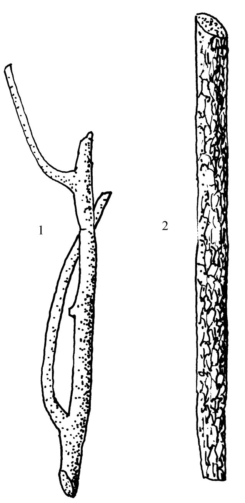
- 显微鉴别：木通中柱鞘有含晶纤维束与含晶石细胞群交替排列成连续浅波浪形环带，维管束16～26个；三叶木通木栓细胞无褐色内含物；白木通含晶石细胞群仅存在于射线外侧，维管束13个
  - 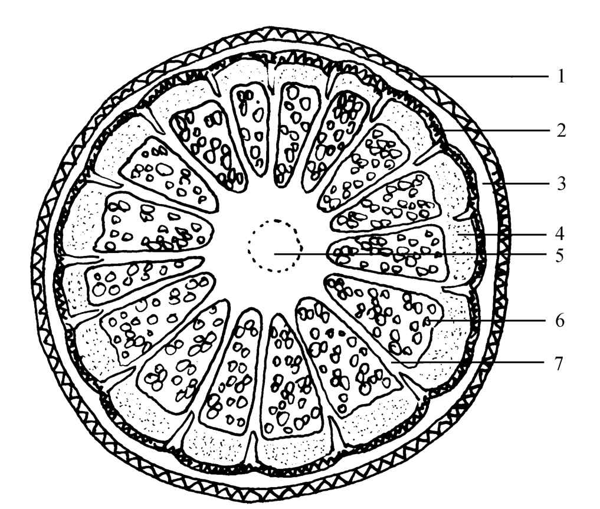
- 成分：齐墩果酸、常春藤皂苷元、木通苯乙醇苷B、木通皂苷St系列
- 理化鉴别：薄层色谱与木通苯乙醇苷B对照品比对
- 含量测定：含木通苯乙醇苷B不得少于0.15%
- 功效：性寒，味苦。利尿通淋，清心除烦，通经下乳

### 大血藤 Sargentodoxae Caulis
- 来源：木通科植物大血藤 *Sargentodoxa cuneata* (Oliv.) Rehd. et Wils. 的干燥藤茎
- 产地：主产湖北、四川、江西、河南，江苏、安徽、浙江、贵州亦产
- 采收加工：秋冬二季采藤茎，去细枝及叶，切段或厚片晒干
- 性状鉴别：圆柱形略弯曲，表面灰棕色粗糙，栓皮有时片状剥落露出暗红棕色内皮；断面皮部红棕色环状嵌入木部，木部黄白色有红棕色放射状纹理；味微涩
  - 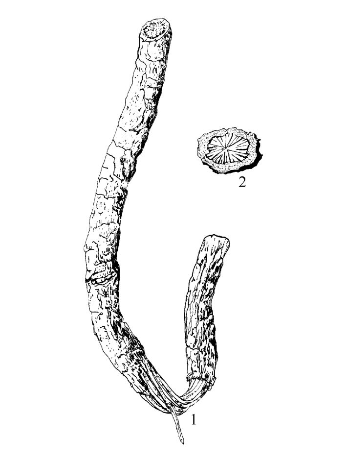
- 显微鉴别：皮层散有石细胞群；韧皮部含黄棕色物质分泌细胞较多切向排列；木质部导管多单个散在，周围有木纤维
  - 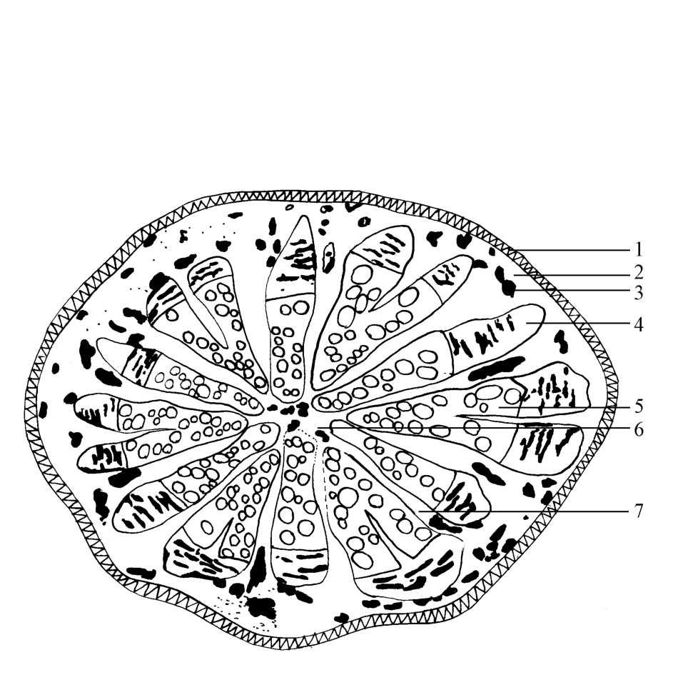
- 成分：鞣质约7.7%；大黄素、大黄素甲醚、大血藤醇
- 功效：性平，味苦。清热解毒，活血，祛风止痛
- 附注：全国不少地区误作"鸡血藤"入药，应注意鉴别；市场有用木材染色伪制苏木的情况（置热水中显浅黄色、黄色、橙黄色）

### 苏木 Sappan Lignum
- 来源：豆科植物苏木 *Caesalpinia sappan* L. 的干燥心材
- 产地：主产台湾、广东、广西、贵州
- 采收加工：秋季采伐，除去粗皮及边材，取黄红色或红棕色心材晒干
- 性状鉴别：圆柱形或半圆柱形，表面黄红色至棕红色可见红黄相间纵向条纹；断面强纤维性，横断面有显著类圆形同心环纹（年轮）；味微涩
  - 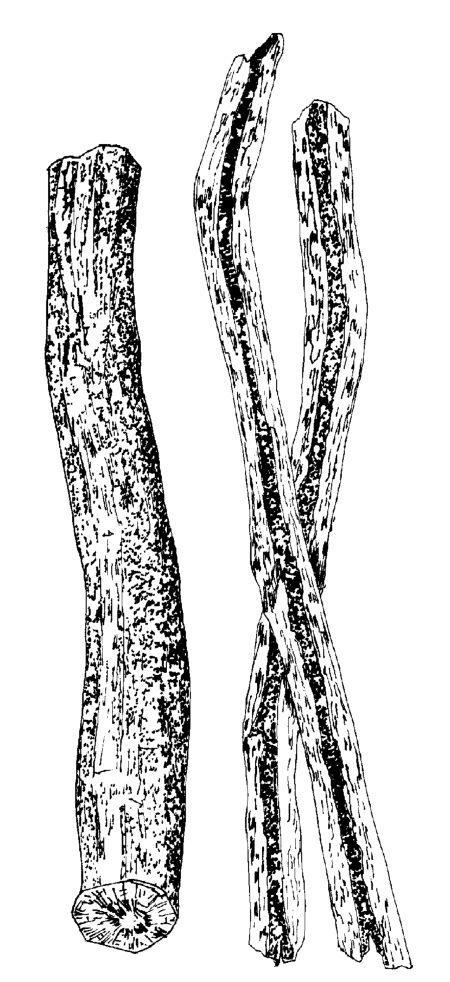
- 显微鉴别：导管常含黄棕色或红棕色物质；木纤维多角形壁极厚；粉末纤维及晶纤维极多成束橙黄色
- 成分：巴西苏木素（约2%，氧化成巴西苏木色素即红色色素）；苏木酚（检查铅离子）；挥发油（d-α-菲兰烃、罗勒烯）
- 功效：性平，味甘、咸。活血祛瘀，消肿止痛

### 鸡血藤 Spatholobi Caulis（附：滇鸡血藤）
- 来源：豆科植物密花豆 *Spatholobus suberectus* Dunn 的干燥藤茎
- 产地：主产广东、广西、云南
- 采收加工：秋冬两季采收，除去枝叶，切片或切段晒干
- 性状鉴别：椭圆形、长矩圆形或不规则斜切片，栓皮灰棕色脱落处呈红褐色；横切面木部红棕色，韧皮部树脂状分泌物红棕色至黑棕色与木部相间排列成数个同心性椭圆形环或偏心性半圆形环；味涩
  - 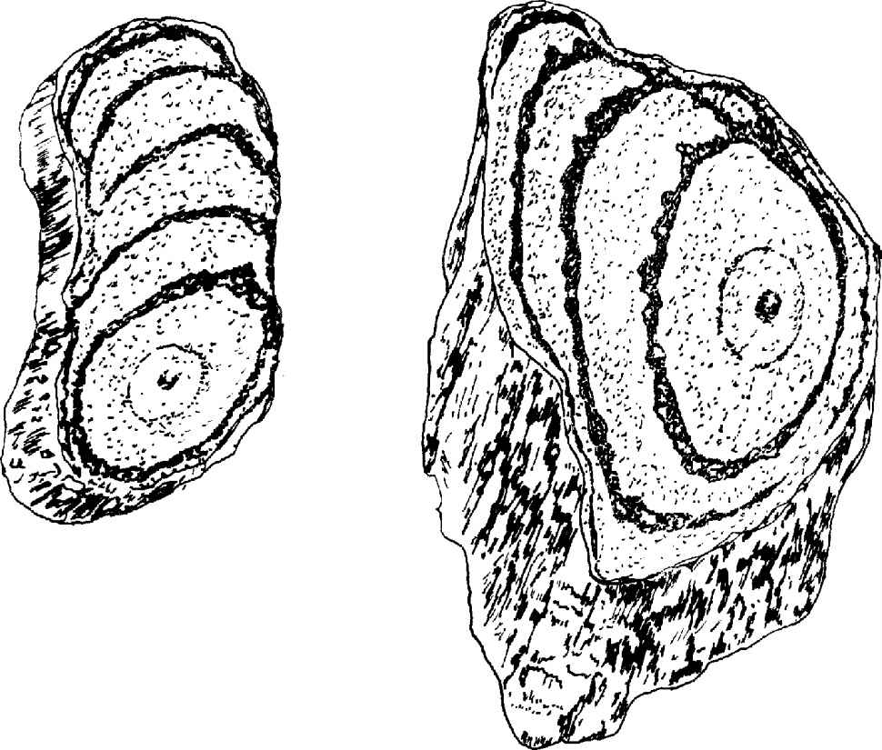
- 显微鉴别：维管束异型，韧皮部与木质部相间排列成数轮；分泌细胞充满棕红色物常数个至十多个切向排列成带状；纤维束形成晶鞘纤维
- 成分：鞣质；多种异黄酮、二氢黄酮、查耳酮（芒柄花素、密花豆素、染料木苷）
- 理化鉴别：薄层色谱与鸡血藤对照药材比对
- 功效：性温，味苦、甘。活血补血，调经止痛，舒筋活络
- 附注：商品来源复杂，包括山鸡血藤（香花崖豆藤）、常绿油麻藤（牛马藤）、大血藤、南五味子等，均非正品
- 【附】滇鸡血藤：木兰科植物内南五味子的干燥藤茎，含异型南五味子丁素不得少于0.05%，性温味苦甘，活血补血调经止痛舒筋通络

### 降香 Dalbergiae Odoriferae Lignum
- 来源：豆科植物降香檀 *Dalbergia odorifera* T.Chen 树干和根的干燥心材
- 产地：主产广东、海南，福建、广西、云南亦产
- 性状鉴别：类圆柱形或不规则块状，表面紫红色至红褐色，切面有致密纹理；质硬富油性，入水下沉；火烧有黑烟及油冒出，残留白色灰烬；气微香，味微苦
- 显微鉴别：纤维成束周围薄壁细胞含草酸钙方晶形成晶纤维；射线宽1～2列细胞
- 成分：挥发油(1.76%～9.70%)；黄酮类
- 功效：性温，味辛。化瘀止血，理气止痛

### 沉香 Aquilariae Lignum Resinatum
- 来源：瑞香科植物白木香 *Aquilaria sinensis* (Lour.) Gilg 含有树脂的木材
- 产地：主产广东、海南、广西、福建
- 采收加工：树干"开香门"砍刀促使结香，真菌侵入腐烂后露出聚积香脂的木材，即可采割
- 性状鉴别：不规则块片、片状或盔帽状，表面凹凸不平有刀痕，黑褐色微显光泽树脂与黄白色不含树脂木部交互形成斑纹；质坚实，断面刺状；气芳香，味苦；燃烧浓烟强烈香气有黑色油状物渗出；以色黑质坚硬油性足能沉水者为佳
  - 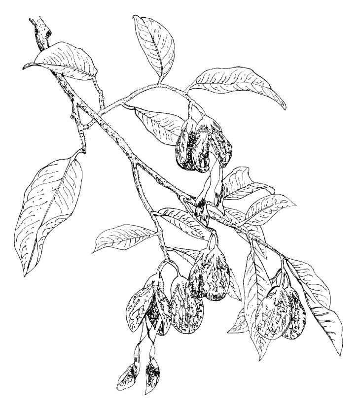
  - 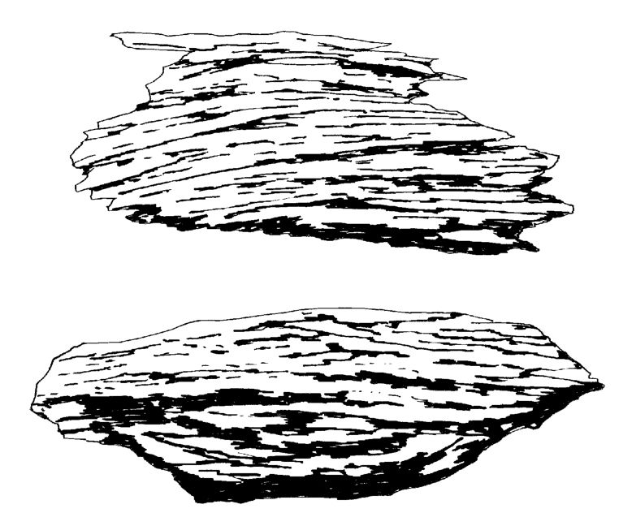
- 显微鉴别：木射线宽1～2列细胞含棕色树脂状物质；导管2～10个成群存在；内涵韧皮部薄壁组织常呈长椭圆状或条带状内含树脂状物及丝状物(菌丝)
  - 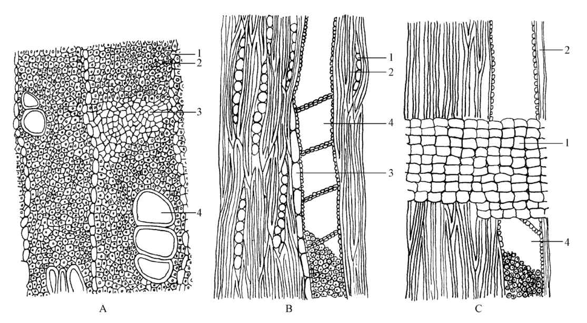
  - 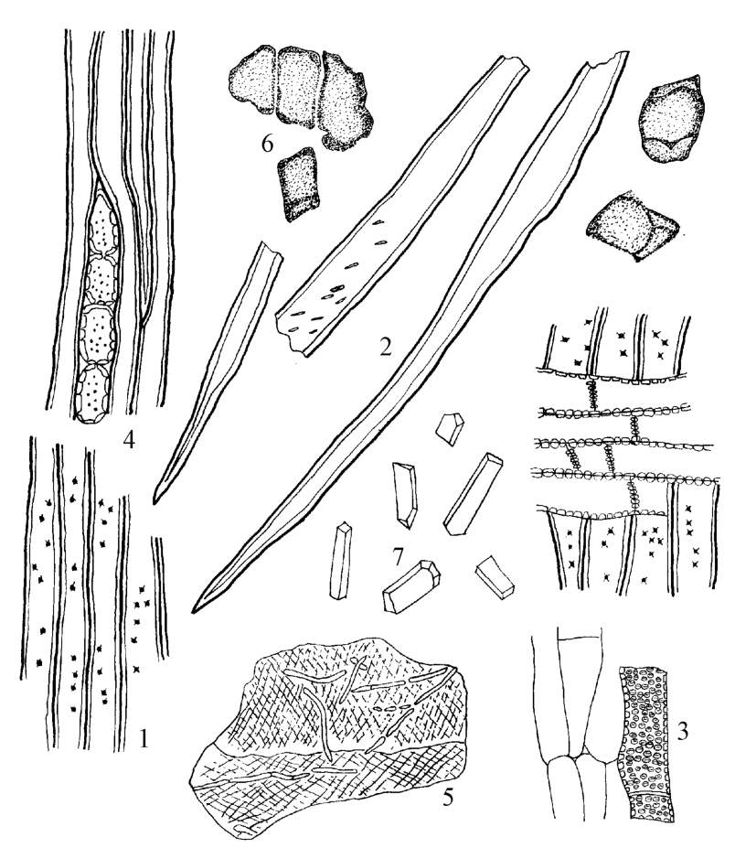
- 成分：挥发油及树脂（沉香螺萜醇、白木香酸、白木香醛，具镇静作用）；沉香四醇
- 理化鉴别：乙醇浸出物微量升华加盐酸及香草醛显樱红色；薄层色谱及高效液相色谱法鉴别
- 含量测定：含沉香四醇不得少于0.10%
- 功效：性微温，味辛、苦。行气止痛，温中止呕，纳气平喘
- 附注：进口沉香为同属植物沉香 *Aquilaria agallocha* Roxb. 含树脂木材，醇浸出物35%～50%

### 通草 Tetrapanacis Medulla（附：小通草）
- 来源：五加科植物通脱木 *Tetrapanax papyrifer* (Hook.) K.Koch 的干燥茎髓
- 产地：产于贵州、云南、四川、湖北
- 采收加工：秋季割取2～3年生茎干，趁鲜用细木棍顶出茎髓，理直晒干
- 性状鉴别：圆柱形，表面白色或淡黄色有浅纵沟纹；体轻质松软稍有弹性；断面有银白色光泽，中央有空心或半透明圆形薄膜；商品有"方通""通丝"；味淡
  - 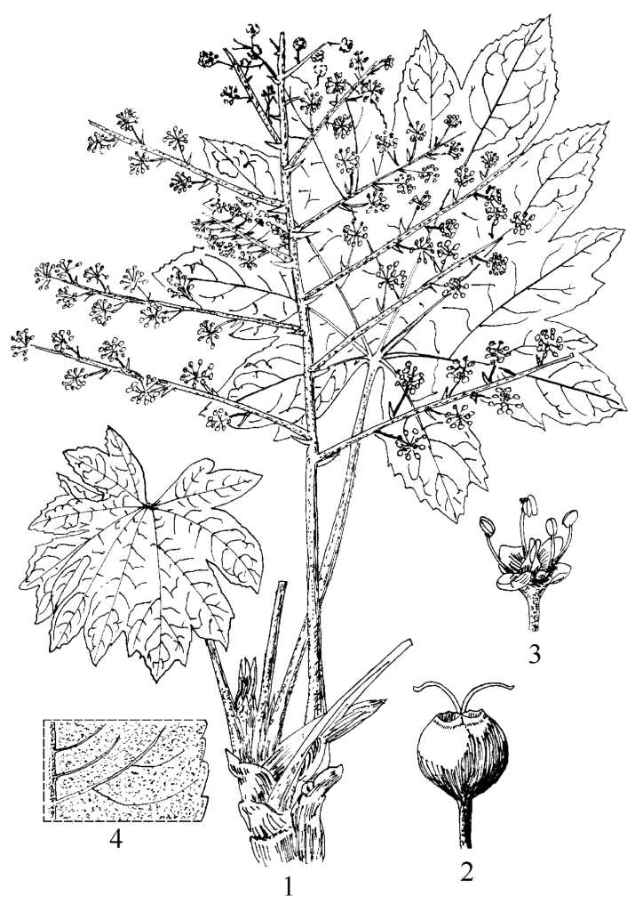
  - 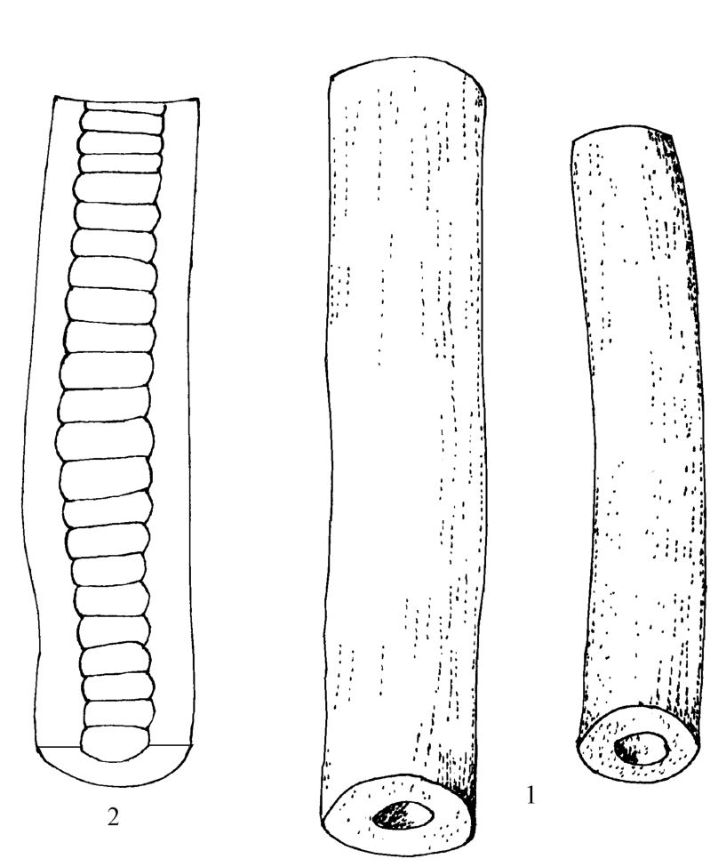
- 显微鉴别：全部为薄壁细胞，有的含草酸钙簇晶
- 成分：肌醇；多聚戊糖(约14.3%)、多聚甲基戊糖
- 功效：性微寒，味甘、淡。清热利尿，通气下乳
- 附注："实心大通草"为盘叶掌叶树茎髓，表面黄白色粗糙质地坚硬断面实心，与通草不同
- 【附】小通草：旌节花科喜马山旌节花或中国旌节花，或山茱萸科青荚叶的干燥茎髓，性寒味甘淡，清热利尿下乳

### 钩藤 Uncariae Ramulus cum Uncis
- 来源：茜草科植物钩藤 *Uncaria rhynchophylla* (Miq.) Miq. ex Havil.、大叶钩藤、毛钩藤、华钩藤或无柄果钩藤的干燥带钩茎枝
- 产地：钩藤主产广西、广东、湖北、湖南；其余各有分布
- 采收加工：秋冬两季采收有钩的嫩枝，剪成短段晒干
- 性状鉴别：带单钩、双钩的茎枝小段，表面红棕色至紫红色具细纵纹；钩略扁或稍圆先端细尖；质坚韧，断面皮部纤维性髓部黄白色疏松似海绵；味淡；以双钩、茎细、钩结实、光滑、色紫红、无枯枝钩者为佳
  - 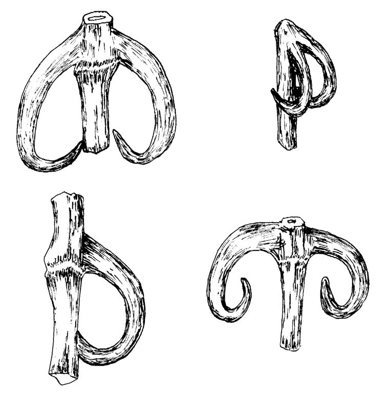
- 显微鉴别：皮层内方纤维连成间断环层；韧皮部薄壁细胞含草酸钙砂晶；髓宽阔约占切面直径一半，四周有1～2列环髓厚壁细胞
- 成分：钩藤碱、异钩藤碱（降血压有效成分）、去氢钩藤碱
- 理化鉴别：薄层色谱与异钩藤碱对照品比对；横切片紫外光灯下外皮呈浓紫褐色切面呈蓝色
- 功效：性凉，味甘。息风定惊，清热平肝
