---
markmap:
  colorFreezeLevel: 2
  initialExpandLevel: 2
---

# 第七章 皮类中药

## 第一节 概述
- 皮(cortex)类中药：指来源于被子植物（主要双子叶植物）和裸子植物的茎干、枝和根的形成层以外部分，由外向内依次为周皮、皮层、初生和次生韧皮部；大多为木本植物茎干的皮，少数为根皮或枝皮

### 一、性状鉴别
- 1.形状：平坦状（杜仲、黄柏）；弯曲状又分反曲状（石榴树皮）、槽状/半管状（合欢皮）、管状/筒状（牡丹皮）、单卷状（肉桂）、双卷筒状（厚朴）、复卷筒状（锡兰桂皮）
  - 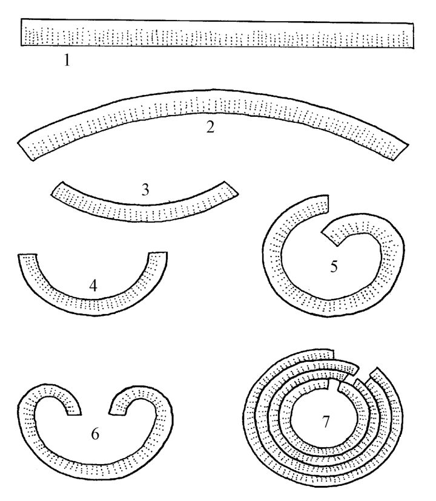
- 2.外表面：多灰黑色、灰褐色、棕褐色或棕黄色；皮孔形状颜色分布密度常是鉴别特征（合欢皮皮孔红棕色椭圆形，牡丹皮皮孔灰褐色横长略凹陷，杜仲皮孔斜方形）
- 3.内表面：颜色各不相同（肉桂红棕色，杜仲紫褐色，黄柏黄色，苦楝皮黄白色）；含油皮类刻划出现油痕（肉桂、厚朴）
- 4.折断面：平坦状（牡丹皮）、颗粒状（肉桂）、纤维状（桑白皮、合欢皮）、层状（苦楝皮、黄柏）；杜仲折断有胶质丝状物相连；白鲜皮折断有粉尘飞扬
- 5.气味：外形相似而气味不同可资鉴别（香加皮气香味苦刺激，地骨皮气味微弱；肉桂味甜微辛，桂皮味辛辣而凉）

### 二、显微鉴别
- 1.周皮：包括木栓层、木栓形成层、栓内层；木栓细胞排列整齐扁平栓化或木化（杜仲木栓细胞内壁特厚，肉桂最内一列木栓细胞外壁特厚）；栓内层又称绿皮层
- 2.皮层：薄壁性略切向延长，常见纤维、石细胞和分泌组织（油细胞、乳管、黏液细胞），内含物有淀粉粒和草酸钙结晶
- 3.韧皮部：包括韧皮部束和射线；初生韧皮部筛管群常颓废皱缩，外方常有厚壁组织环带（中柱鞘纤维）；次生韧皮部占大部分
- 射线：髓射线较长常弯曲呈喇叭口状；韧皮射线较短；均由薄壁细胞构成不木化，常含淀粉粒和草酸钙结晶
- 粉末显微观察：细胞形状、长宽、壁厚度、壁孔壁沟及层纹是重要鉴定依据

## 第二节 药材（饮片）鉴定

### 桑白皮 Mori Cortex（附：桑枝、桑叶、桑椹）
- 来源：桑科植物桑 *Morus alba* L. 的干燥根皮
- 产地：主产河南、安徽、浙江、江苏、湖南、四川
- 采收加工：秋末至次春发芽前采挖根部，刮去粗皮，纵剖剥取根皮晒干
- 性状鉴别：扭曲的卷筒状、槽状或板片状，外表面白色或淡黄白色平坦，内表面黄白色或灰黄色有细纵纹；体轻质韧纤维性强，撕裂时有白色粉尘飞扬；味微甘
  - 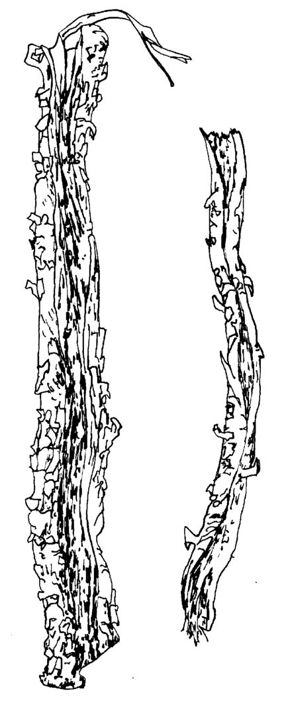
- 显微鉴别：射线宽2～6列细胞；薄壁细胞含淀粉粒及草酸钙方晶；老根皮韧皮部内侧石细胞群断续排列成环带状
  - 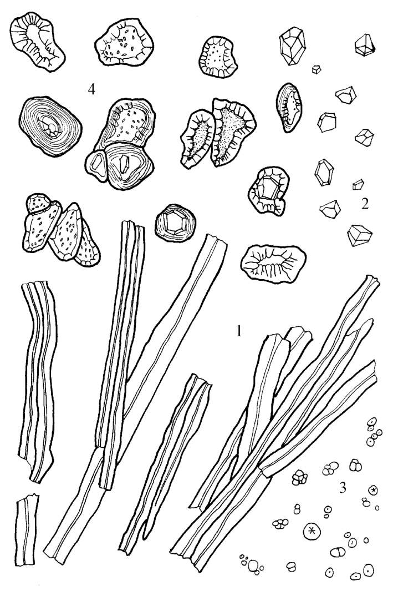
- 成分：四种黄酮类衍生物（桑皮素、桑皮色烯素）及桦皮酸；香豆精类（东莨菪素、伞形花内酯）
- 功效：性寒，味甘。泻肺平喘，利水消肿
- 附注：华桑、鸡桑根皮曾混作桑白皮，均非正品
- 【附】桑枝：桑的干燥嫩枝，含桑木素等，性平味微苦，祛风湿利关节
- 【附】桑叶：桑的干燥叶，含芦丁、桑苷等黄酮类，性寒味甘苦，疏散风热清热润燥清肝明目
- 【附】桑椹：桑的干燥果穗，含芸香苷、花青素苷等，性寒味甘酸，滋阴补血生津润燥

### 牡丹皮 Moutan Cortex
- 来源：毛茛科植物牡丹 *Paeonia suffruticosa* Andr. 的干燥根皮
- 产地：主产安徽、四川、河南、山东
- 采收加工：栽培3～5年后10～11月挖根，剥皮晒干习称"连丹皮"；趁鲜刮去外皮抽取木心习称"刮丹皮"或"粉丹皮"
- 性状鉴别：连丹皮呈筒状或半筒状，外表面灰褐色有横长皮孔样突起，内表面淡灰黄色或浅棕色有发亮结晶（丹皮酚）；质硬脆断面平坦粉性淡粉红色；气芳香味微苦而涩
  - 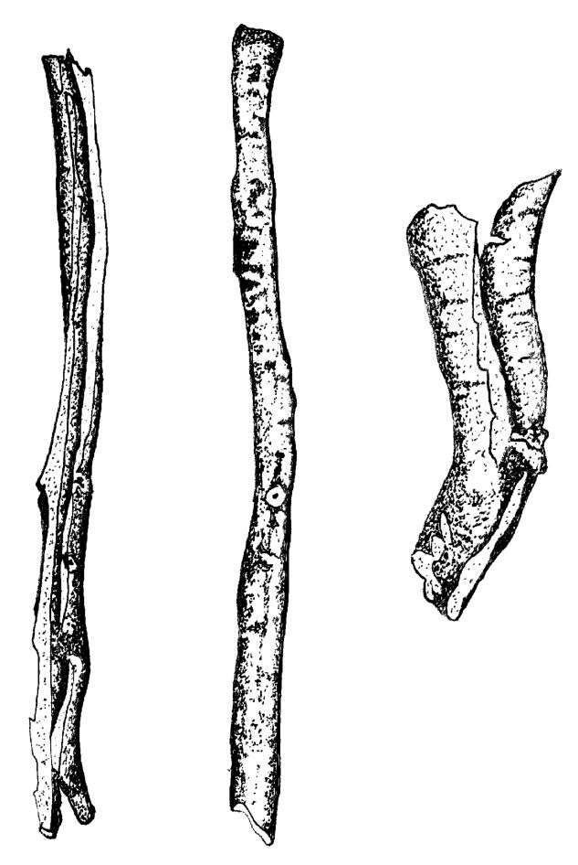
- 显微鉴别：韧皮部占大部分，射线宽1～3列细胞；韧皮部、皮层薄壁细胞及细胞间隙含草酸钙簇晶
  - 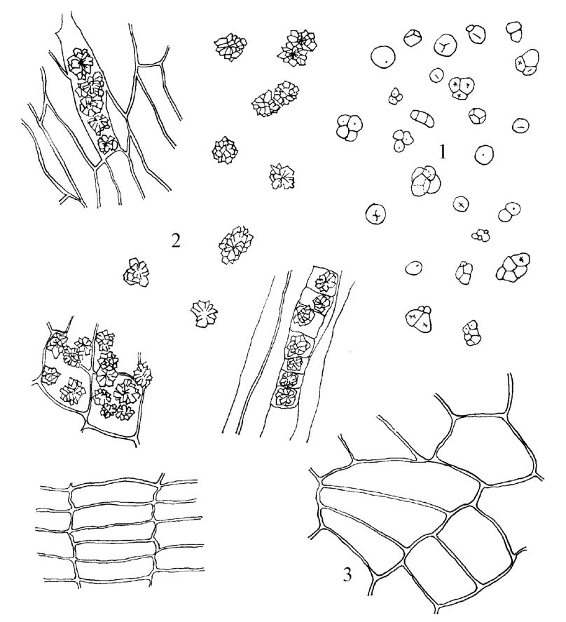
- 成分：丹皮酚原苷(5%～6%)；丹皮酚（镇痛解痉抑菌）、芍药苷
- 理化鉴别：粉末微量升华结晶滴加三氯化铁醇溶液显暗紫色；薄层色谱与丹皮酚对照品比对
- 含量测定：含丹皮酚不得少于1.2%
- 功效：性微寒，味苦、辛。清热凉血，活血化瘀
- 附注：四川牡丹根皮称"川丹皮"，野牡丹根皮称"西昌丹皮"，应注意鉴别

### 厚朴 Magnoliae Officinalis Cortex（附：厚朴花）
- 来源：木兰科植物厚朴 *Magnolia officinalis* Rehd. et Wils. 或凹叶厚朴 *M. officinalis* var. *biloba* Rehd. et Wils. 的干燥干皮、根皮和枝皮
- 产地：主产四川、湖北、浙江、江西，多为栽培
- 采收加工：4～6月剥取15～20年树干皮，沸水微煮"发汗"至内表面变紫褐色，蒸软卷成筒状晒干
- 性状鉴别：干皮呈卷筒状或双卷筒状习称"筒朴"，近根部展开如喇叭口习称"靴筒朴"；内表面紫棕色或深紫褐色具细密纵纹划之显油痕；断面颗粒性可见发亮细小结晶（厚朴酚、和厚朴酚）；气香味辛辣微苦
  - 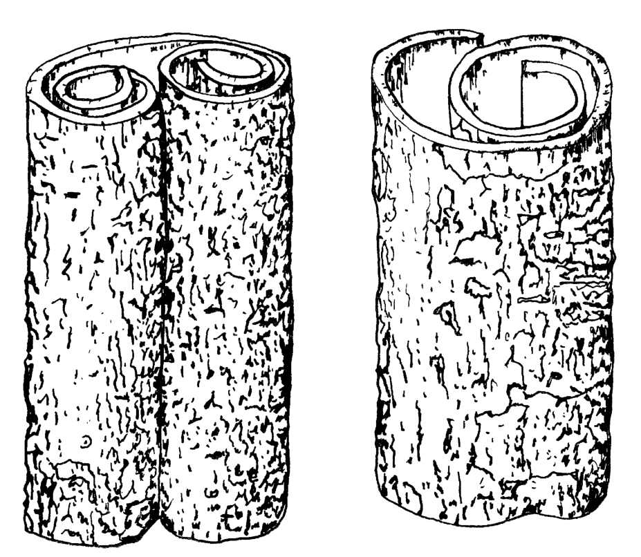
- 显微鉴别：栓内层为石细胞环层；皮层散有多数油细胞及石细胞群；韧皮纤维束众多壁极厚，油细胞颇多
  - 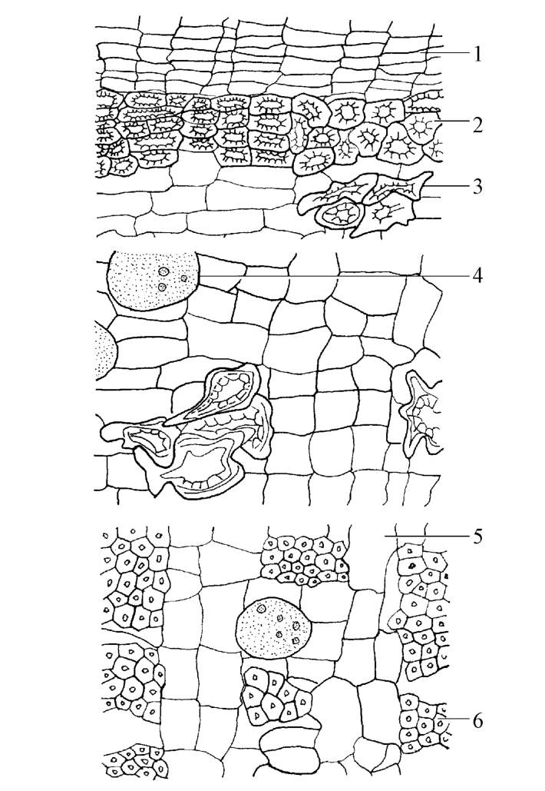
  - 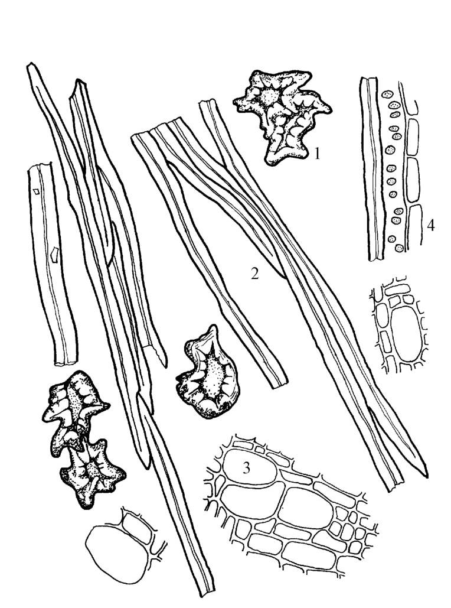
- 成分：挥发油约0.3%（α、β-桉油醇占94%～98%）；厚朴酚约5%（抗菌）及和厚朴酚
- 理化鉴别：薄层色谱与厚朴酚、和厚朴酚对照品比对
- 含量测定：含厚朴酚与和厚朴酚总量不得少于2.0%
- 功效：性温，味苦、辛。燥湿消痰，下气除满
- 附注：滇缅厚朴树皮已收入部颁标准，非厚朴正品
- 【附】厚朴花：厚朴或凹叶厚朴的干燥花蕾，性微温味苦，芳香化湿理气宽中

### 肉桂 Cinnamomi Cortex（附：桂枝）
- 来源：樟科植物肉桂 *Cinnamomum cassia* Presl 的干燥树皮
- 产地：主产广东、广西，云南、福建亦产，多为栽培
- 采收加工：分两期采收（第二期9～10月产量大香气浓质量佳），加工品有桂通(官桂)、企边桂、板桂、桂碎
- 性状鉴别：呈槽状或卷筒状，外表面灰棕色有细皱纹及横向皮孔，内表面红棕色有细纵纹刻之有油痕；断面外层棕色粗糙内层红棕色油润，两层间有黄棕色线纹；气香浓烈，味甜、辣
  - 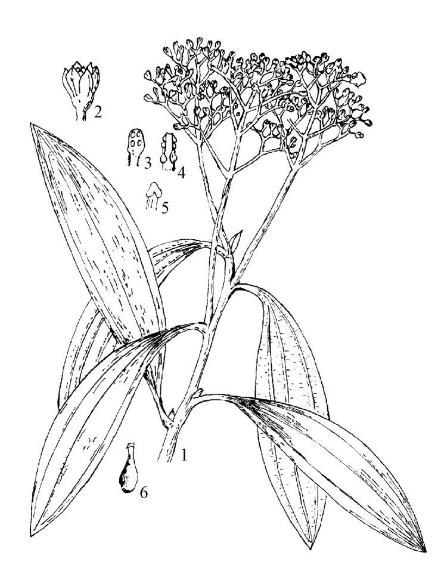
  - 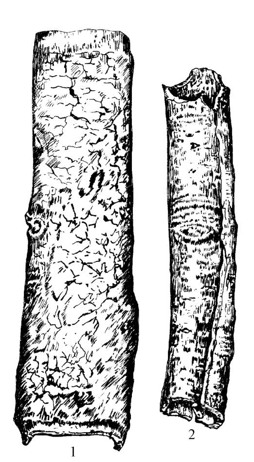
- 显微鉴别：木栓最内层细胞外壁特厚木化；中柱鞘部位石细胞群断续排列成环；韧皮部射线含草酸钙针晶，油细胞、黏液细胞较多
  - 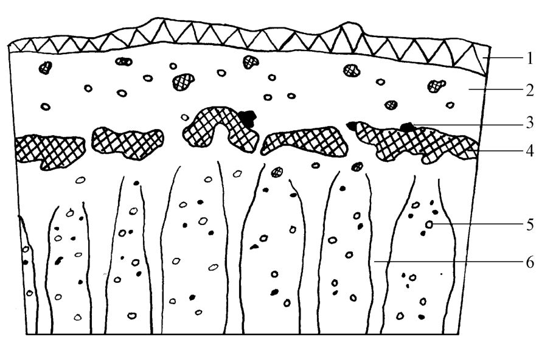
  - 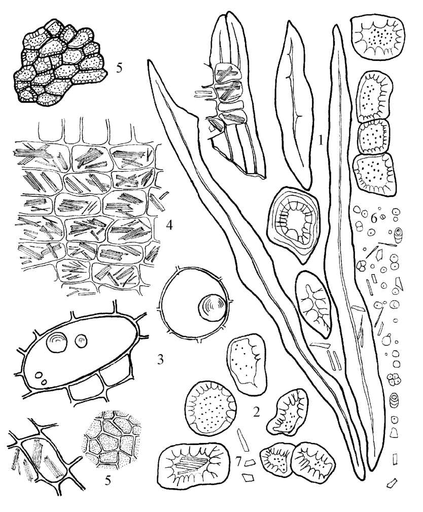
- 成分：挥发油1%～2%，主成分桂皮醛（约85%，镇静镇痛解热有效成分）及醋酸桂皮酯
- 理化鉴别：粉末加三氯甲烷及盐酸苯肼液镜检见桂皮醛苯腙杆状结晶；薄层色谱与桂皮醛对照品比对
- 含量测定：含挥发油不得少于1.2%(mL/g)；含桂皮醛不得低于1.5%
- 功效：性大热，味辛、甘。补火助阳，引火归元，散寒止痛，温通经脉
- 附注：南玉桂（大叶清化桂）与正种相似；市场有以天竺桂、阴香、细叶香桂等桂皮充肉桂，或误用大叶钩樟、三钻风树皮，均非药用正品
- 【附】桂枝：肉桂的干燥嫩枝，含挥发油0.2%～0.9%（桂皮醛70%～80%），性温味辛甘，发汗解肌温经通脉助阳化气平冲降气

### 杜仲 Eucommiae Cortex（附：杜仲叶）
- 来源：杜仲科植物杜仲 *Eucommia ulmoides* Oliv. 的干燥树皮
- 产地：主产湖北、四川、贵州、云南，多为栽培
- 采收加工：4～6月剥取近十年树皮，趁鲜刮去粗皮，"发汗"至内皮呈紫褐色，取出晒干
- 性状鉴别：扁平板片状或两边稍内卷块片，外表面淡棕色或灰褐色，内表面暗紫色光滑；断面有细密银白色富弹性胶丝相连可拉至1cm以上；味稍苦，嚼之有胶状感
  - 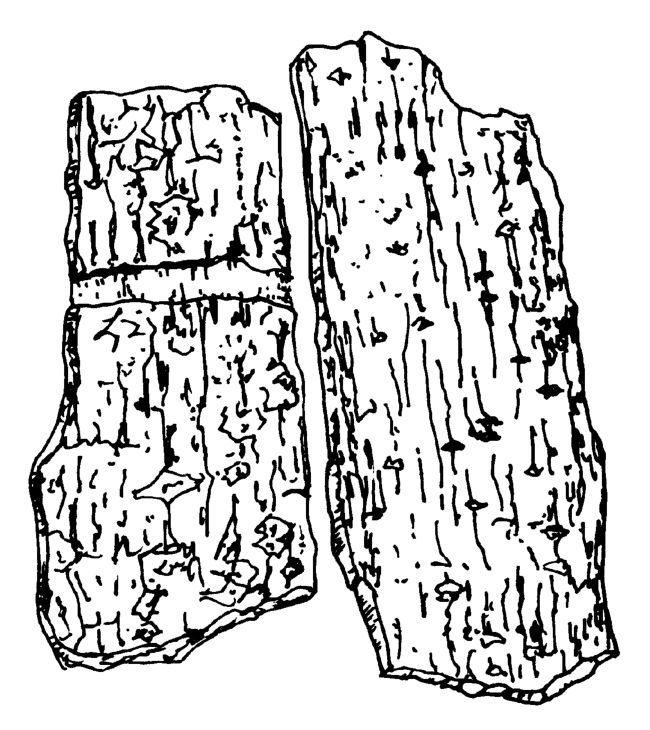
- 显微鉴别：韧皮部有5～7条石细胞环带；白色橡胶质（丝状或团块状）随处可见，存在于乳汁细胞内
  - 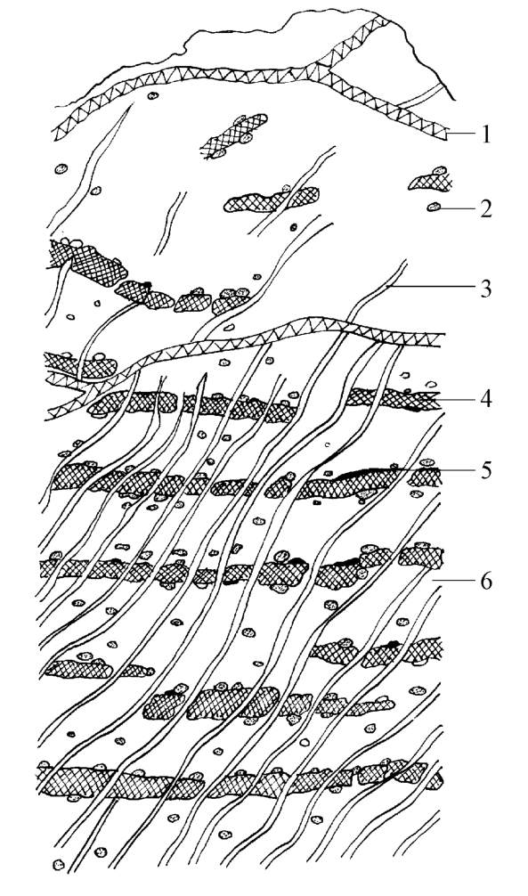
  - 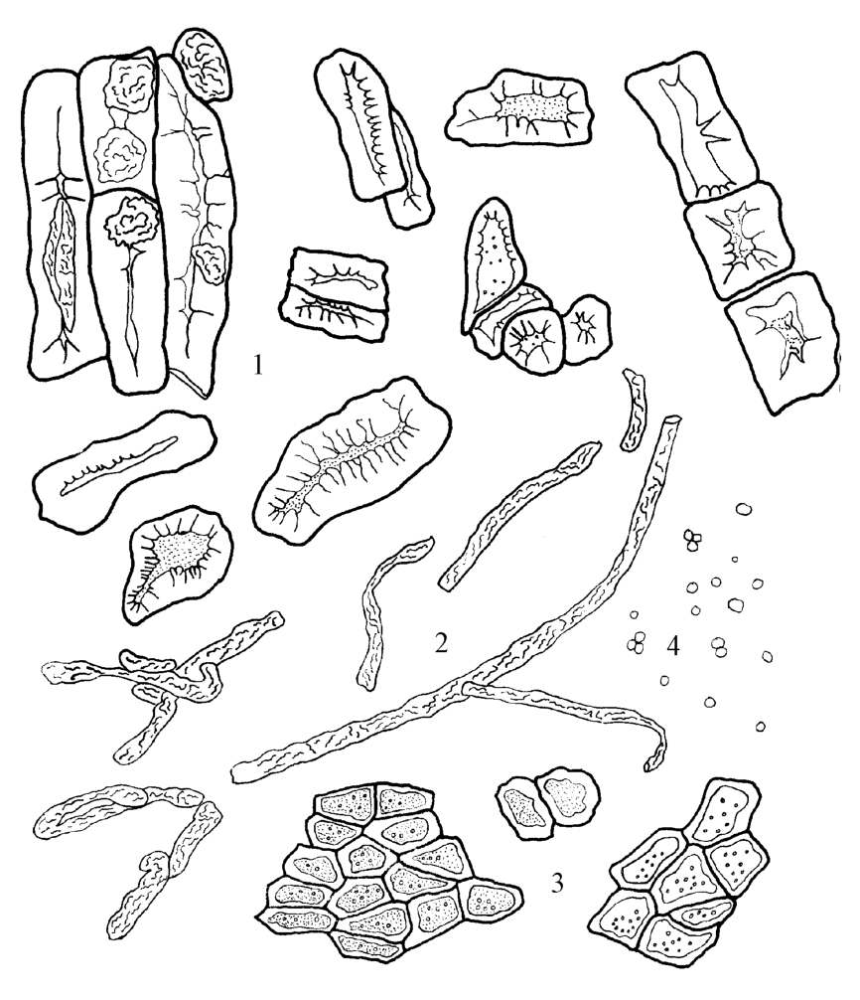
- 成分：杜仲胶（硬质橡胶，含量因树龄不同而异）；桃叶珊瑚苷；松脂醇二葡萄糖苷（降压成分）
- 理化鉴别：三氯甲烷浸渍液加乙醇产生具弹性胶膜；乙醇提取液喷氢氧化钠显浅黄色斑点（红杜仲显紫色，丝棉木不显色）
- 含量测定：含松脂醇二葡萄糖苷不得低于0.10%
- 功效：性温，味甘。补肝肾，强筋骨，安胎
- 附注：藤杜仲、毛杜仲、红杜仲（夹竹桃科）及丝棉木、云南卫矛"土杜仲"均不能代替杜仲药用
- 【附】杜仲叶：杜仲科植物杜仲的干燥叶，性温味微辛，补肝肾强筋骨

### 关黄柏 Phellodendri Amurensis Cortex（附：黄柏）
- 来源：芸香科植物黄檗 *Phellodendron amurense* Rupr. 的干燥树皮
- 产地：主产吉林、辽宁，内蒙古、河北、黑龙江亦产，辽宁产量最大
- 采收加工：3～6月采收10年左右树皮，晒至半干压平刮净粗皮显黄色
- 性状鉴别：板片状或浅槽状，外表面黄绿色或淡棕黄色较平坦，内表面黄色或黄棕色；断面鲜黄色或黄绿色纤维性；味极苦嚼之有黏性可将唾液染黄色
  - 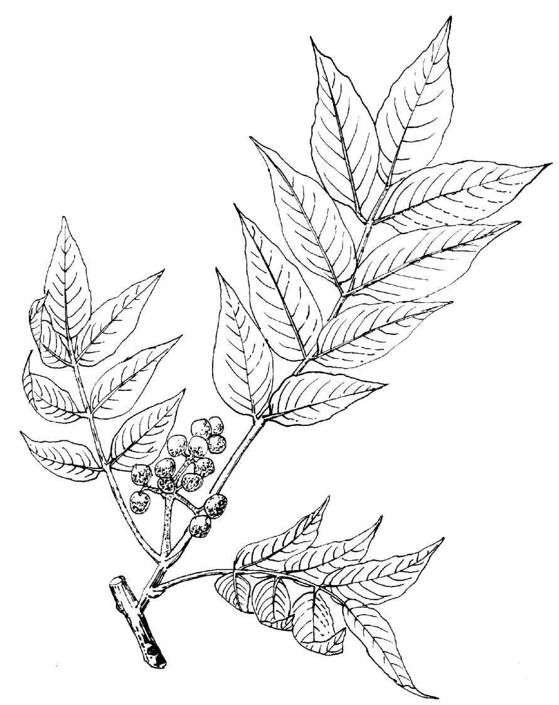
  - 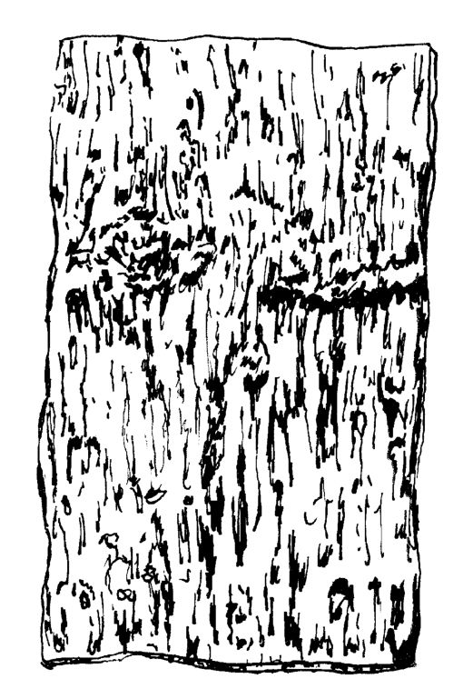
- 显微鉴别：皮层石细胞鲜黄色成群或单个散在；韧皮纤维束众多与韧皮薄壁细胞和筛管群交互排列成层带；黏液细胞众多
  - 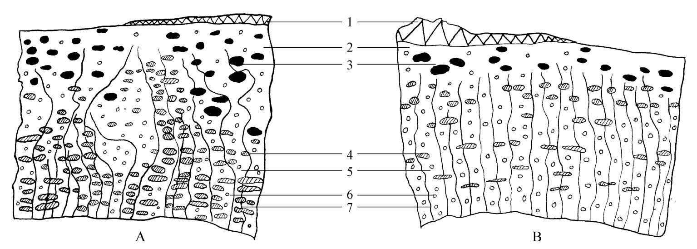
  - 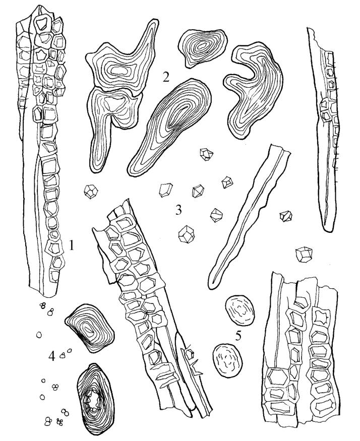
- 成分：小檗碱(0.6%～2.5%)、黄柏碱、木兰碱、掌叶防己碱；黄柏酮、黄柏内酯（柠檬苦素）
- 理化鉴别：断面紫外光灯下显亮黄色荧光；薄层色谱与黄柏酮对照品比对
- 含量测定：含盐酸小檗碱不得少于0.60%，含盐酸巴马汀不得少于0.30%
- 功效：性寒，味苦。清热燥湿，泻火除蒸，解毒疗疮
- 【附】黄柏（川黄柏）：芸香科植物黄皮树的干燥树皮，射线较弯曲韧皮部发达，性寒味苦，清热燥湿泻火除蒸解毒疗疮

### 白鲜皮 Dictamni Cortex
- 来源：芸香科植物白鲜 *Dictamnus dasycarpus* Turcz. 的干燥根皮
- 产地：主产辽宁、河北、山东
- 性状鉴别：卷筒状，外表面灰白色或淡灰黄色具细皱纹及突起颗粒状小点，内表面类白色有细纵纹；折断时有白粉飞扬，迎光可见闪烁小亮点；有羊膻气，味微苦
- 显微鉴别：皮层和韧皮部均有单个散在纤维，薄壁细胞含多数草酸钙簇晶
- 成分：白鲜碱、茵芋碱、崖椒碱、柠檬苦素、梣酮
- 功效：性寒，味苦。清热燥湿，祛风解毒

### 苦楝皮 Meliae Cortex
- 来源：楝科植物川楝 *Melia toosendan* Sieb. et Zucc. 和楝 *M. azedarach* L. 的干燥树皮和根皮
- 产地：川楝主产四川、云南、贵州、甘肃；楝主产山西、甘肃、山东、江苏
- 性状鉴别：干皮呈不规则块片或槽状卷片，外表面粗糙灰棕色至棕褐色有宽纵裂纹及皮孔；内表面黄白色；质韧难折断，手折叠揉搓可分多层薄片层层黄白相间；气微，味苦
- 显微鉴别：韧皮纤维束与韧皮薄壁细胞及筛管群相间排列成10～20层断续环层；射线喇叭形开口处薄壁组织有草酸钙簇晶分布
- 成分：川楝素（驱虫有效成分，根皮含量最高）；苦楝萜酮内酯
- 功效：性寒，味苦；有毒。杀虫，疗癣

### 五加皮 Acanthopanacis Cortex
- 来源：五加科植物细柱五加 *Acanthopanax gracilistylus* W.W.Smith 的干燥根皮
- 产地：主产湖北、河南、四川、湖南
- 性状鉴别：不规则卷筒状，外表面灰褐色有扭曲纵皱纹及横长皮孔，内表面淡黄色或灰黄色；体轻质脆易折断，断面灰白色；气微香，味微辣而苦
- 显微鉴别：皮层、韧皮部均散有树脂道，薄壁细胞含草酸钙簇晶及淀粉粒
- 成分：挥发油、树脂及紫丁香苷
- 功效：性温，味辛、苦。祛风除湿，补益肝肾，强筋壮骨，利水消肿

### 秦皮 Fraxini Cortex
- 来源：木犀科植物苦枥白蜡树 *Fraxinus rhynchophylla* Hance、白蜡树、尖叶白蜡树或宿柱白蜡树的干燥枝皮或干皮
- 产地：苦枥白蜡树主产东北三省；白蜡树主产四川；尖叶、宿柱白蜡树主产陕西
- 性状鉴别：枝皮卷筒状或槽状，外表面灰白色、灰棕色至黑棕色密布圆点状皮孔；本品热水浸出液呈黄绿色，日光下显碧蓝色荧光（历史上最早荧光鉴别记载）；味苦
  - 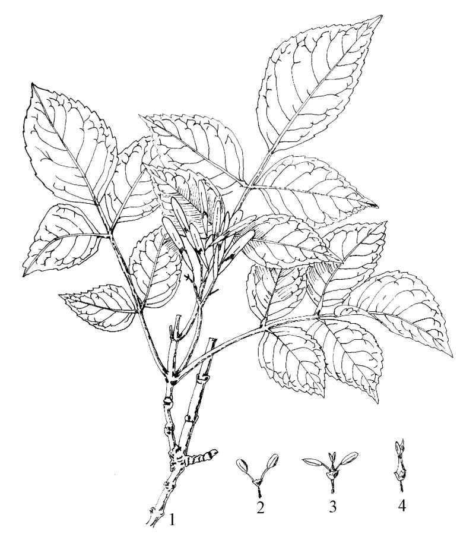
  - 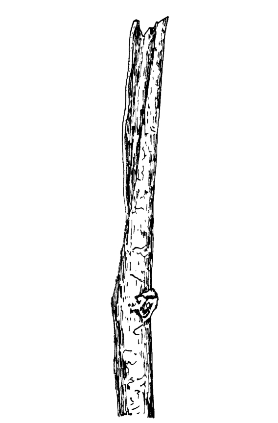
- 显微鉴别：中柱鞘部位石细胞及纤维束组成断续环带，内方纤维束被射线分隔形成井字形
  - 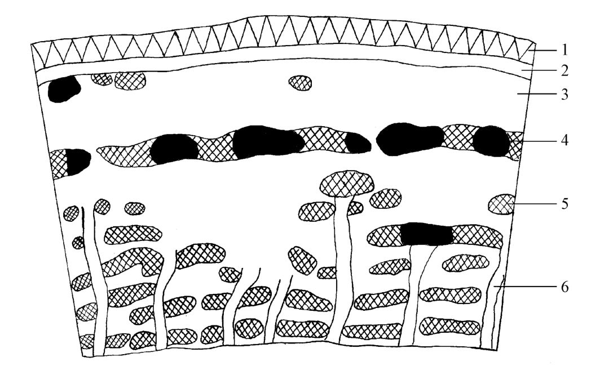
- 成分：秦皮乙素（七叶树素，碱液中显蓝色荧光）及秦皮甲素（七叶树苷，pH>5.8水液中呈蓝色荧光）等香豆精类
- 理化鉴别：薄层色谱与秦皮甲素、秦皮乙素、秦皮素对照品比对
- 含量测定：含秦皮甲素和秦皮乙素总量不得少于1.0%
- 功效：性寒，味苦、涩。清热燥湿，收敛止痢，止带，明目
- 附注：核桃楸树皮曾混作秦皮用，水浸液无荧光，不应作秦皮用

### 香加皮 Periplocae Cortex
- 来源：萝藦科植物杠柳 *Periploca sepium* Bge. 的干燥根皮
- 产地：主产山西、河南、河北、山东，辽宁、吉林、内蒙古亦产
- 性状鉴别：卷筒状或槽状，外表面灰棕色或黄棕色栓皮松软常呈鳞片状易剥落，内表面淡黄色或淡黄棕色；体轻质脆易折断；有特异香气，味苦
- 显微鉴别：栓内层薄壁细胞含少量草酸钙方晶；韧皮部乳汁管较多
- 成分：北五加苷A～K（苷G即杠柳毒苷为强心苷类）；香气成分4-甲氧基水杨醛
- 功效：性温，味辛、苦；有毒。利水消肿，祛风湿，强筋骨

### 地骨皮 Lycii Cortex
- 来源：茄科植物枸杞 *Lycium chinense* Mill. 或宁夏枸杞 *L. barbarum* L. 的干燥根皮
- 产地：枸杞主产河北、河南、山西、陕西（江苏、浙江品质较好）；宁夏枸杞主产宁夏、甘肃
- 采收加工：春初或秋后挖根剥皮晒干，清明节前采者质量较好
- 性状鉴别：筒状、槽状或不规则卷片，外表面灰黄色至棕黄色粗糙易成鳞片状剥落，内表面黄白色至灰黄色；断面外层黄棕色内层灰白色；气微，味微甘而后苦
  - 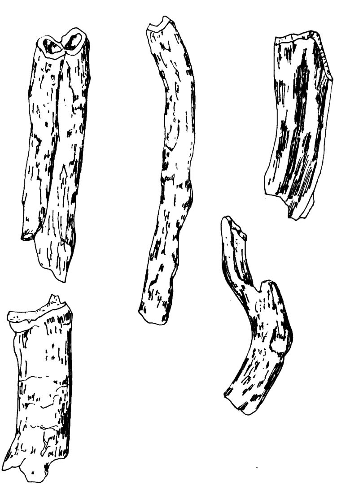
- 显微鉴别：枸杞根皮外层有2～3条木栓组织层带；薄壁细胞含草酸钙砂晶与淀粉粒；宁夏枸杞根皮无石细胞和纤维
  - 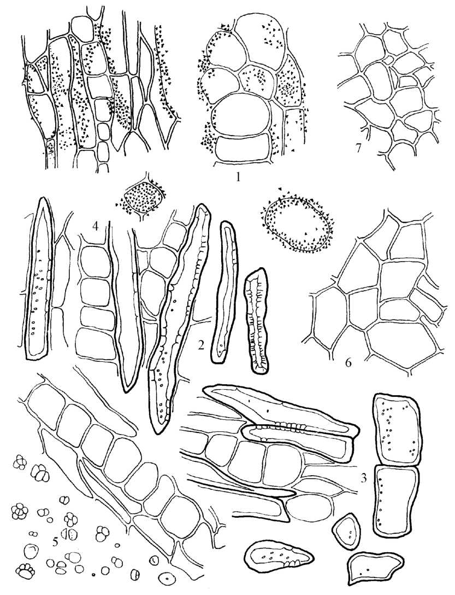
- 成分：桂皮酸和多量酚性物质；β-谷甾醇、甜菜碱
- 理化鉴别：断面紫外光灯下韧皮部呈淡蓝色荧光（陈旧药材呈淡黄色）
- 功效：性寒，味甘。凉血除蒸，清肺降火
