---
markmap:
  colorFreezeLevel: 2
  initialExpandLevel: 2
---

# 第八章 叶类中药

## 第一节 概述
- 叶(folium)类中药：一般用完整已长成的干燥叶，也有用嫩叶（苦竹叶）；大多单叶，少数为复叶小叶（番泻叶）；有的带部分嫩枝(cacumen，侧柏叶)

### 一、性状鉴别
- 多皱缩或破碎，观察时常需浸泡水中展开后识别
- 注意：叶的形状大小长宽；叶端叶缘叶基；上下表面色泽及毛茸腺点；叶脉类型凹凸分布；质地；叶柄；叶翼叶轴叶鞘托叶茎枝有无；气味
- 可借助解剖镜或放大镜观察，或对光透视

### 二、显微鉴别
- 主要观察表皮、叶肉、中脉三部分特征，需作中脉横切片及上下表面制片或粉末制片
- 1.表皮：1层排列整齐细胞，上表皮外平周壁常具角质层；复表皮（夹竹桃叶）；桑叶表皮含葡萄状钟乳体，穿心莲叶含螺旋状钟乳体，薄荷叶含簇状橙皮苷结晶，番泻叶表皮含黏液质
  - 腺毛非腺毛气孔形态分布是重要鉴定特征；气孔指数(stomatal index)可区别不同种植物
- 2.叶肉：分栅栏组织和海绵组织
  - 栅栏组织：异面叶（薄荷叶）上表皮下方；等面叶（番泻叶）上下表皮内方均有；"栅表比"(palisade ratio)有鉴定意义
  - 海绵组织：占叶肉大部分，注意结晶体、分泌组织（油细胞、黏液细胞、间隙腺毛-广藿香）
- 3.中脉：维管束通常外韧型，木质部上方呈槛状或新月形；有的分裂成2～3个（蓼大青叶、臭梧桐叶）；有的为双韧维管束（罗布麻叶）
  - "脉岛数"(vein-islet number)：每平方毫米叶肉脉岛数目，同种植物固定不变，可作鉴别特征

## 第二节 药材（饮片）鉴定

### 石韦 Pyrrosiae Folium
- 来源：水龙骨科植物庐山石韦 *Pyrrosia sheareri* (Bak.) Ching、石韦 *P. lingua* (Thunb.) Farwell 或有柄石韦 *P. petiolosa* (Christ) Ching 的干燥叶，前两者习称"大叶石韦"，后者习称"小叶石韦"
- 产地：庐山石韦主产江西、湖南、贵州、四川；石韦主产长江以南各省；有柄石韦主产东北、华东、华中
- 性状鉴别：庐山石韦叶片披针形，上表面黄绿色或灰绿色散布黑色圆形小凹点，下表面密生红棕色星状毛；叶柄具四棱略扭曲；叶片革质；味微涩苦
- 显微鉴别：叶柄维管束7～12个周韧型环状散在；叶横切面栅栏组织3～4列长形细胞，主脉中央分体中柱周韧型木质部呈三叉状
  - 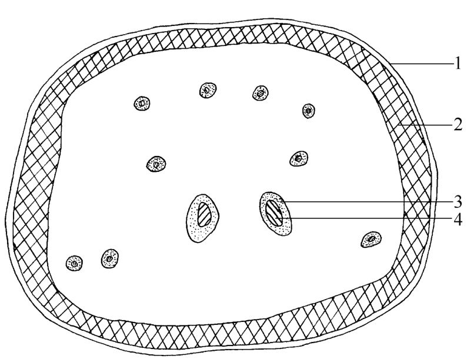
  - 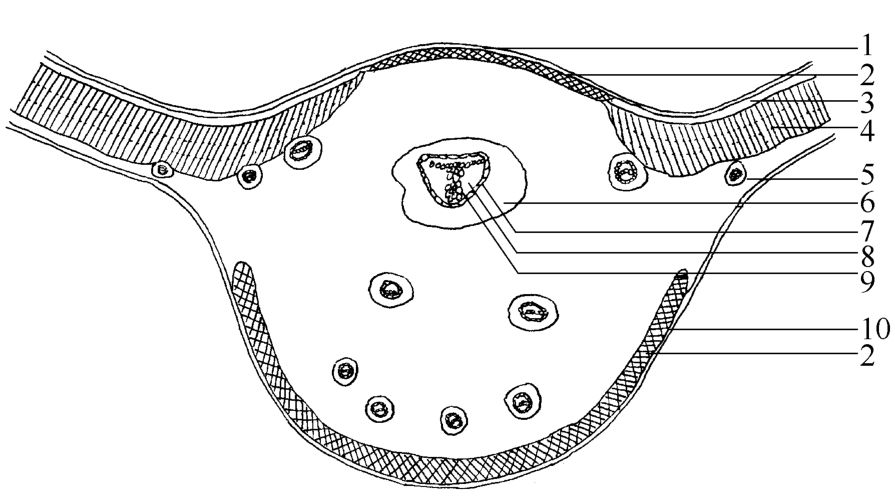
  - 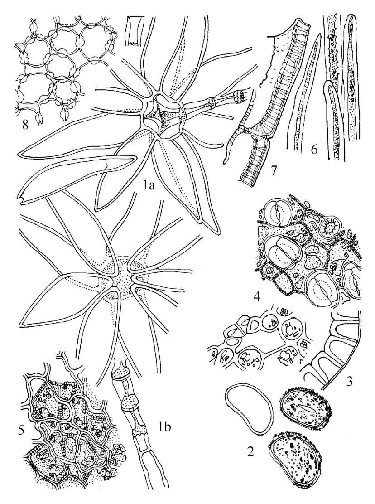
- 成分：里白烯、芒果苷、异芒果苷、绿原酸、β-谷甾醇
- 含量测定：含绿原酸不得少于0.20%
- 功效：性微寒，味甘、苦。利尿通淋，清肺止咳，凉血止血
- 附注：毡毛石韦、北京石韦、光叶石韦在部分地区亦作石韦用

### 蓼大青叶 Polygoni Tinctorii Folium
- 来源：蓼科植物蓼蓝 *Polygonum tinctorium* Ait. 的干燥叶
- 产地：主产河北、山东、辽宁、陕西
- 性状鉴别：叶多皱缩破碎，完整叶椭圆形，蓝绿色或黑蓝色；叶柄扁平偶带膜质托叶鞘；味微涩而稍苦
- 显微鉴别：栅栏细胞2～3列不通过主脉；薄壁细胞含大量蓝色物质及大型草酸钙簇晶；主脉维管束外韧型6～8个排列成环
  - 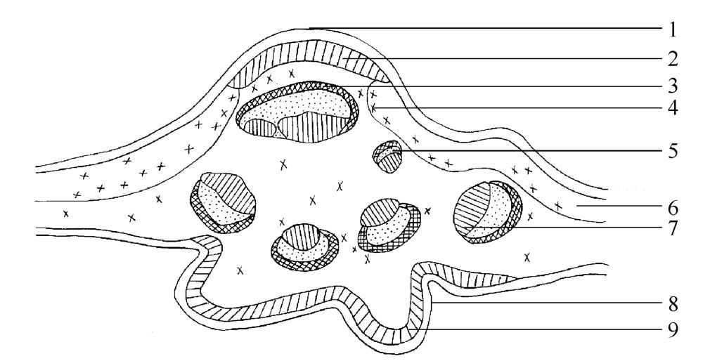
- 成分：靛青苷（水解生成吲哚酚氧化成靛蓝）；靛玉红
- 理化鉴别：薄层色谱与靛蓝对照品比对
- 含量测定：含靛蓝不得少于0.55%
- 功效：性寒，味苦。清热解毒，凉血消斑

### 淫羊藿 Epimedii Folium（附：巫山淫羊藿）
- 来源：小檗科植物淫羊藿 *Epimedium brevicornu* Maxim.、箭叶淫羊藿、柔毛淫羊藿或朝鲜淫羊藿的干燥叶
- 产地：淫羊藿主产陕西、山西、河南、广西；箭叶淫羊藿主产湖北、四川、浙江；柔毛淫羊藿主产四川；朝鲜淫羊藿主产东北
- 性状鉴别：三出复叶，小叶片卵圆形，顶生小叶基部心形两侧小叶偏心形，边缘具黄色刺毛状细锯齿，上表面黄绿色下表面灰绿色网脉明显；味微苦
  - 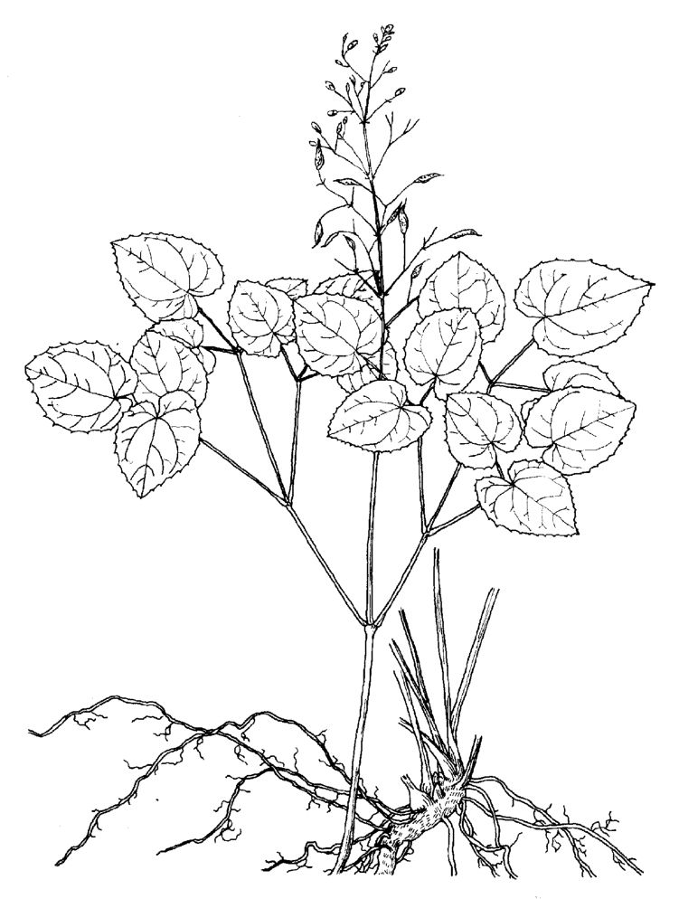
- 成分：淫羊藿苷、淫羊藿次苷Ⅰ/Ⅱ、淫羊藿新苷A（增加冠脉流量、耐缺氧、保护心肌缺血等作用）
- 理化鉴别：薄层色谱与淫羊藿苷对照品比对，紫外灯下显暗红色斑点，喷三氯化铝后显橙红色荧光
- 含量测定：含总黄酮（以淫羊藿苷计）不得少于5.0%；含淫羊藿苷不得少于0.50%
- 功效：性温，味辛、甘。补肾阳，强筋骨，祛风湿
- 【附】巫山淫羊藿：小檗科植物巫山淫羊藿的干燥叶，含朝藿定C不得少于1.0%，性温味辛甘，补肾阳强筋骨祛风湿

### 大青叶 Isatidis Folium
- 来源：十字花科植物菘蓝 *Isatis indigotica* Fort. 的干燥叶
- 产地：主产河北、陕西、江苏、安徽，大多栽培品
- 性状鉴别：叶片极皱缩卷曲，完整叶展平呈长椭圆形至长圆状倒披针形，上表面暗灰绿色有色较深稍突起小点，基部渐狭下延至叶柄成翼状；味微酸、苦、涩
  - 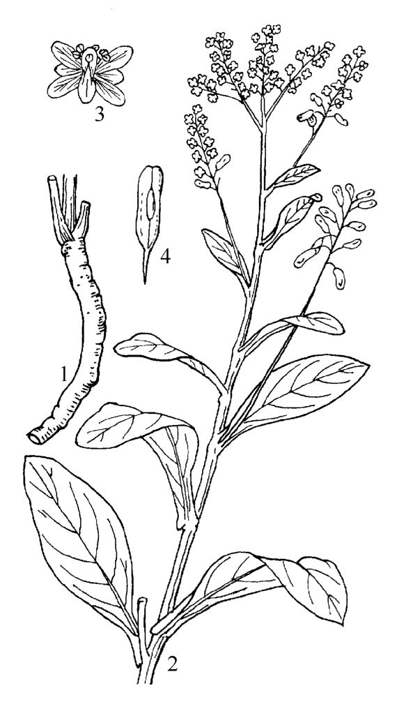
- 显微鉴别：栅栏细胞3～4列与海绵细胞分化不明显；薄壁组织有含芥子酶分泌细胞内含棕黑色颗粒；粉末可见靛蓝结晶蓝色细小颗粒状
  - 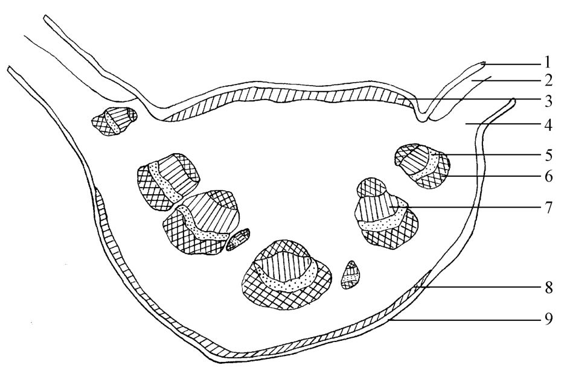
  - 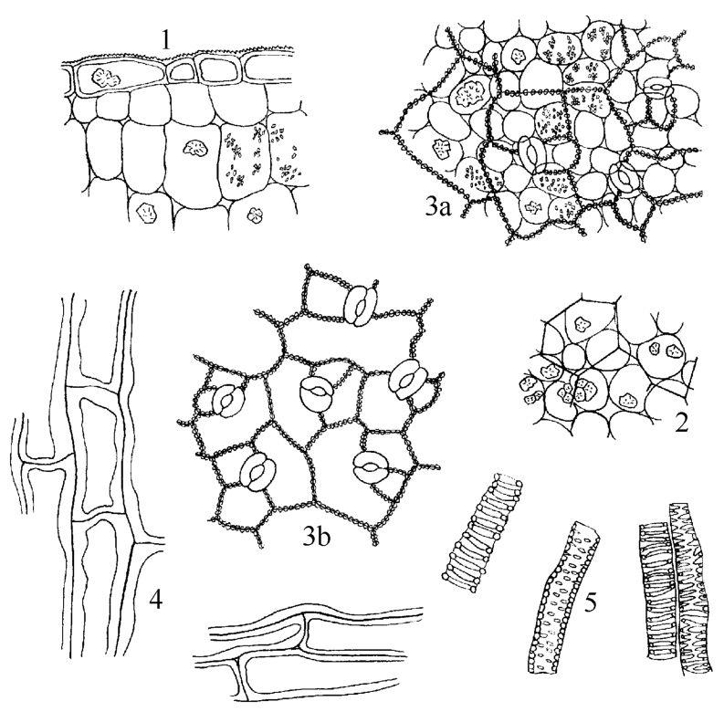
- 成分：菘蓝苷约1%（水解形成靛蓝、靛玉红）；芥苷、新芥苷
- 理化鉴别：粉末微量升华得蓝色或紫红色细小结晶；水浸液紫外灯下有蓝色荧光；薄层色谱与靛蓝、靛玉红对照品比对
- 含量测定：含靛玉红不得少于0.020%
- 功效：性寒，味苦。清热解毒，凉血消斑
- 附注：马蓝、路边青的叶在部分省区亦作大青叶用，但药典未收载

### 枇杷叶 Eriobotryae Folium
- 来源：蔷薇科植物枇杷 *Eriobotrya japonica* (Thunb.) Lindl. 的干燥叶
- 产地：主产广东、广西、江苏，江苏产量大，广东质量佳
- 性状鉴别：长椭圆形或倒卵形，边缘上部有疏锯齿基部全缘，上表面灰绿色、黄棕色或红棕色，下表面密被黄色绒毛，主脉显著突起；革质而脆；味微苦
- 显微鉴别：下表皮多数单细胞非腺毛近主脉处弯成人字形；栅栏组织3～4列细胞延伸至主脉上方但不连接；主脉韧皮部外方纤维束和厚壁细胞相间排列成环
- 成分：皂苷、熊果酸、齐墩果酸、缩合鞣质
- 功效：性微寒，味苦。清肺止咳，降逆止呕

### 番泻叶 Sennae Folium
- 来源：豆科植物狭叶番泻 *Cassia angustifolia* Vahl 或尖叶番泻 *C. acutifolia* Delile 的干燥小叶
- 产地：狭叶番泻主产红海以东至印度（印度番泻叶/丁内未利番泻叶）；尖叶番泻主产埃及尼罗河中上游（埃及番泻叶/亚历山大番泻叶）；我国广东、海南、云南西双版纳有栽培
- 采收加工：狭叶番泻开花前摘叶阴干；尖叶番泻9月果实将熟时剪枝摘叶晒干
- 性状鉴别：狭叶番泻叶长卵形或卵状披针形，全缘叶基稍不对称，有叶脉及压叠线纹；尖叶番泻叶披针形略卷曲两面有细短毛茸无压叠线纹；开水浸泡为茶色；味微苦稍有黏性
  - 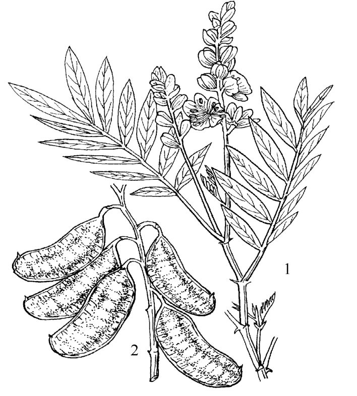
  - 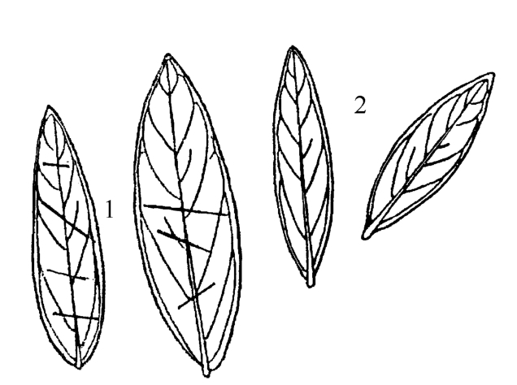
- 显微鉴别：叶肉等面型，上面栅栏组织通过主脉细胞较长，下面不通过主脉细胞较短；主脉维管束外韧型上下两侧均有纤维束形成晶纤维
  - 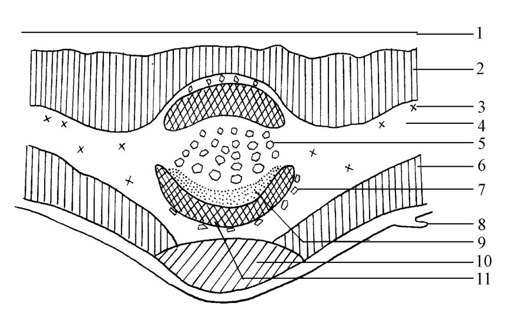
  - 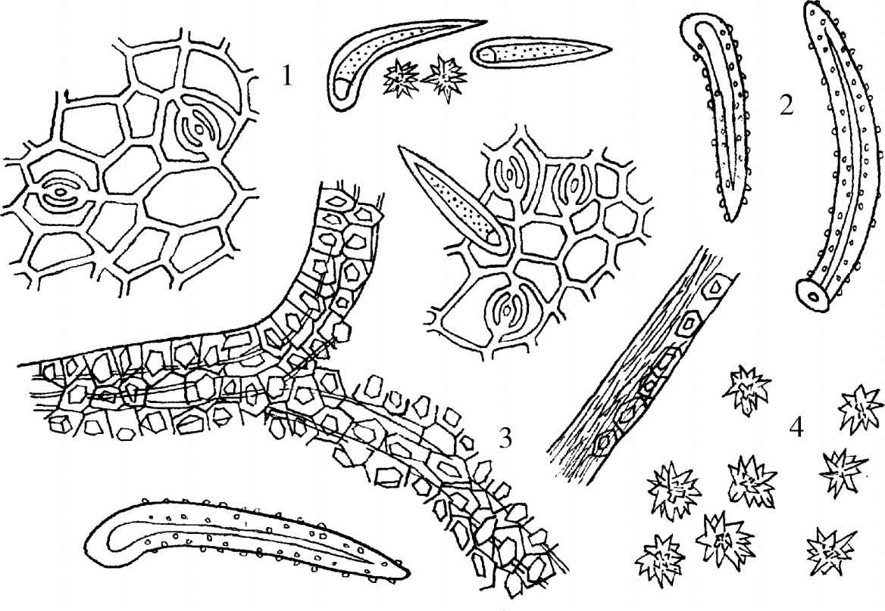
- 成分：番泻苷A、B、C、D；芦荟大黄素双蒽酮苷；尖叶番泻叶蒽醌衍生物0.85%～2.86%
- 理化鉴别：粉末加氢氧化钠显红色（检查蒽醌衍生物）；水解后加氨试液水浴加热变紫红色（检查蒽苷类）；薄层色谱与对照药材比对
- 含量测定：含番泻苷A和B总量不得少于1.1%
- 功效：性寒，味甘、苦。泻热行滞，通便，利水
- 附注：耳叶番泻叶常混入狭叶番泻叶中（含蒽醌苷量极微）；卵叶番泻叶（意大利番泻叶），均药典未收载

### 枸骨叶 Ilicis Cornutae Folium
- 来源：冬青科植物枸骨 *Ilex cornuta* Lindl. ex Paxt. 的干燥叶
- 产地：主产长江中、下游各省
- 性状鉴别：类长方形或矩圆状长方形，边缘卷曲先端有3个较大硬刺齿顶端1个常向下反曲，上表面黄绿色或绿褐色有光泽，硬革质；味微苦
- 显微鉴别：栅栏细胞2～4列，上表皮下方栅栏细胞通过主脉；主脉维管束木质部呈新月形；叶缘表皮内依次为厚角细胞、石细胞半环带及木化纤维群
- 成分：冬青苷甲、乙（苷元为坡模酸及熊果酸）
- 功效：性凉，味苦。清热养阴，益肾，平肝
- 附注：苦丁茶为本种嫩叶；功劳子为枸骨的果实；阔叶十大功劳、细叶十大功劳的叶亦作"功劳叶"使用

### 紫苏叶 Perillae Folium（附：紫苏梗、紫苏子）
- 来源：唇形科植物紫苏 *Perilla frutescens* (L.) Britt. 的干燥叶（或带嫩枝）
- 产地：主产江苏、浙江、河北，多为栽培
- 性状鉴别：叶片多皱缩卷曲破碎，完整者卵圆形，两面紫色或上表面绿色下表面紫色，下表面有多数凹点状腺鳞；气清香，味微辛
  - 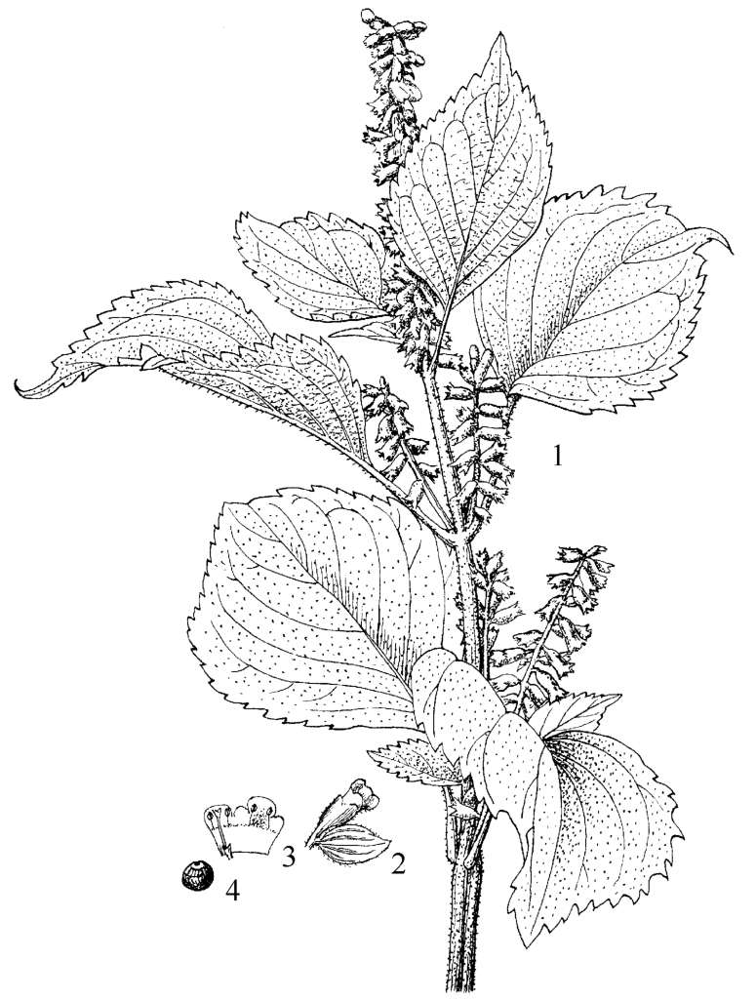
- 显微鉴别：非腺毛常呈镰刀状弯曲；腺鳞头部多为8个细胞含黄色分泌物；草酸钙簇晶分布于叶肉组织中
  - 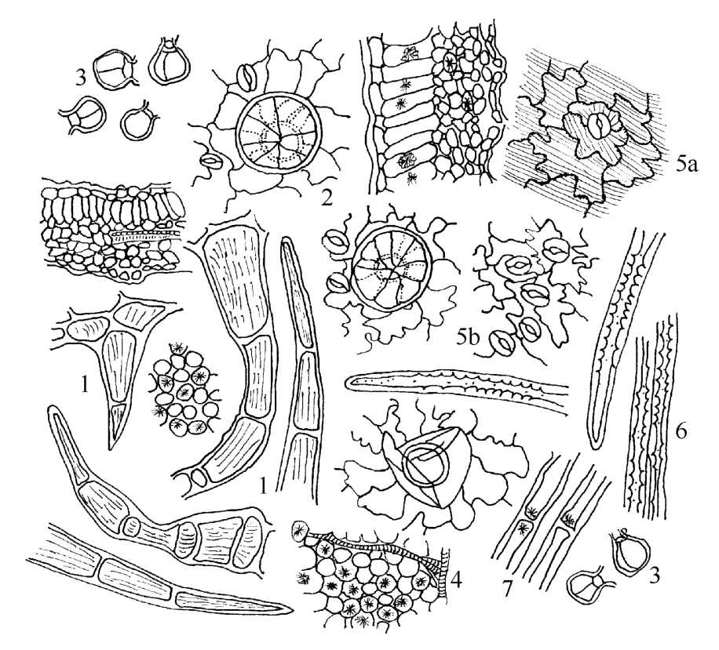
- 成分：挥发油0.1%～0.2%，主含紫苏醛（占40%～55%）；叶含红色色素perillanin
- 理化鉴别：表皮细胞滴加盐酸显红色，滴加氢氧化钾显鲜绿色后变黄绿色；薄层色谱与紫苏醛对照品比对
- 含量测定：含挥发油不得少于0.40%(mL/g)
- 功效：性温，味辛。解表散寒，行气和胃
- 【附】紫苏梗：紫苏的干燥茎，含迷迭香酸不得少于0.10%，性温味辛，理气宽中止痛安胎
- 【附】紫苏子：紫苏的干燥成熟果实，含脂肪油45.35%，含迷迭香酸不得少于0.25%，性温味辛，降气化痰止咳平喘润肠通便

### 艾叶 Artemisiae Argyi Folium
- 来源：菊科植物艾 *Artemisia argyi* Lévl. et Vant. 的干燥叶
- 产地：全国大部分地区均有分布，主产山东、安徽、湖北、河北
- 性状鉴别：多皱缩破碎，完整叶展平呈卵状椭圆形羽状深裂，上表面灰绿色或深黄绿色有蛛丝状短绵毛及腺点，下表面密生灰白色绒毛；质柔软；气清香，味苦
- 显微鉴别：非腺毛有两种（T形毛与单列性非腺毛）；腺毛表面观呈鞋底形由4或6个细胞叠合而成；草酸钙簇晶存在于叶肉细胞中
- 成分：挥发油（水芹烯、杜松烯、樟脑、龙脑）；黄酮类物质
- 功效：性温，味辛、苦；有小毒。温经止血，散寒止痛；外用祛湿止痒
