---
markmap:
  colorFreezeLevel: 2
  initialExpandLevel: 2
---

# 第九章 花类中药

## 第一节 概述
- 花(flos)类中药：包括完整花（已开放：洋金花、红花；未开放花蕾：辛夷、丁香、金银花、槐米）、花序（未开放头状花序：款冬花；已开放：菊花、旋覆花）、花的某一部分（雄蕊：莲须；花柱：玉米须；柱头：番红花；花粉粒：松花粉、蒲黄）

### 一、性状鉴别
- 常见形状：圆锥状、棒状、团簇状、丝状、粉末状等
- 花朵入药：注意花托、萼片、花瓣、雄蕊雌蕊数目着生位置形状颜色被毛与否气味
- 花序入药：注意花序类别、总苞片或苞片；菊科还需观察花序托形状及被毛
- 花很小时需先放入水中浸泡展开，借助放大镜、解剖镜观察

### 二、显微鉴别
- 除花梗和膨大花托制横切片外，一般只作表面制片和粉末观察
- 1.苞片和萼片：与叶片构造相类似，以观察表面观为主；注意分泌组织、草酸钙结晶（锦葵花花萼有黏液腔，洋金花有草酸钙砂晶）
- 2.花瓣：上表皮细胞常呈乳头状或毛茸状突起无气孔；下表皮垂周壁波状弯曲；有的有分泌组织（丁香有油室，红花有管状分泌组织）
- 3.雄蕊：花丝构造简单（闹羊花花丝被毛）；花药内壁细胞壁不均匀增厚多木化；花粉粒外壁形态多样（光滑：番红花、槐米；刺状突起：红花、金银花；放射状雕纹：洋金花；网状纹理：蒲黄）；双子叶植物萌发孔3个以上，单子叶和裸子植物1个
- 4.雌蕊：由子房、花柱、柱头组成；柱头表皮细胞常呈乳头状突起（金银花）或分化成毛茸（西红花）
- 5.花梗和花托：横切面构造与茎相似，注意有无厚壁组织、分泌组织、草酸钙结晶、淀粉粒

## 第二节 药材（饮片）鉴定

### 松花粉 Pini Pollen
- 来源：松科植物马尾松 *Pinus massoniana* Lamb.、油松 *P. tabuliformis* Carr. 或同属数种植物的干燥花粉
- 产地：马尾松主产长江流域各省区；油松主产东北、华北、西北，山东亦有栽培
- 性状鉴别：淡黄色细粉，质轻易流动飞扬，手捻有滑润感，入水不沉；气微，味淡
- 显微鉴别：花粉粒椭圆形一侧稍压扁，两侧各有一膨大气囊，气囊壁具明显网状纹理网眼多角形
- 成分：脂肪油和色素；甾醇及黄酮类
- 功效：性温，味甘。收敛止血，燥湿敛疮

### 辛夷 Magnoliae Flos
- 来源：木兰科植物望春花 *Magnolia biondii* Pamp.、玉兰 *M. denudata* Desr. 或武当玉兰 *M. sprengeri* Pamp. 的干燥花蕾
- 产地：望春花主产河南及湖北质量最佳；武当玉兰主产四川北川、湖北、陕西；玉兰多庭园栽培主产安徽安庆称"安春花"质较次
- 采收加工：冬末春初花未开放时采收，阴干
- 性状鉴别：望春花呈长卵形似毛笔头，苞片2～3层外表面密被灰白色或灰绿色长茸毛，花被片9外轮3片呈萼片状内两轮6片；武当玉兰花被片10～12；玉兰花被片9内外轮同型；气芳香，味辛、凉而稍苦
  - 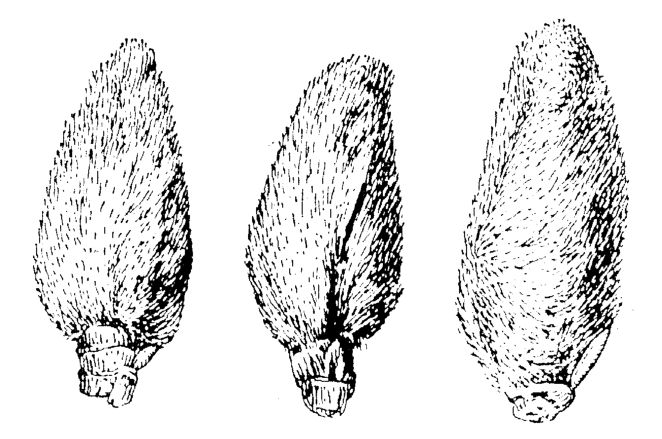
- 显微鉴别：油细胞较多；非腺毛2～4细胞基部短粗膨大；石细胞多成群呈分枝状
  - 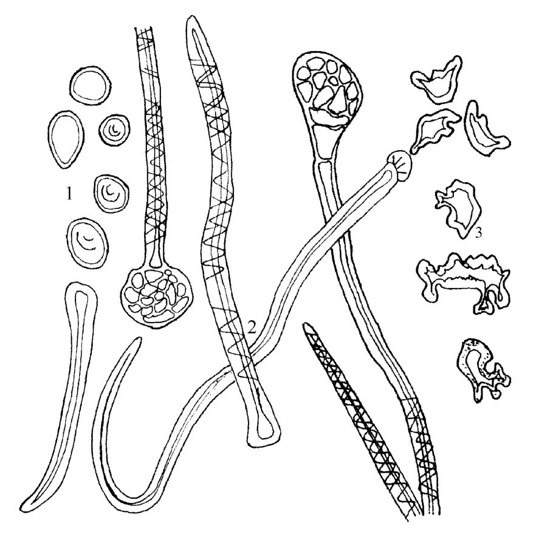
- 成分：望春花含木兰脂素，挥发油3%～5%（β-蒎烯、桉油精、樟脑）
- 理化鉴别：薄层色谱与木兰脂素对照品比对
- 含量测定：含挥发油不得少于1.0%(mL/g)；含木兰脂素不得少于0.40%
- 功效：性温，味辛。散风寒，通鼻窍
- 附注：凹叶木兰花蕾已收入四川地方药品标准

### 槐花 Sophorae Flos（附：槐角）
- 来源：豆科植物槐 *Sophora japonica* L. 的干燥花及花蕾，花称"槐花"，花蕾称"槐米"
- 产地：主产辽宁、河北、河南、山东
- 性状鉴别：槐花皱缩卷曲花瓣多散落，完整花萼钟状黄绿色花瓣5黄色；槐米呈卵形或椭圆形似米粒，体轻手捻即碎；味微苦（涩）
- 显微鉴别：花粉粒类球形或钝三角形具3个萌发孔；非腺毛1～3细胞；可见草酸钙方晶
  - 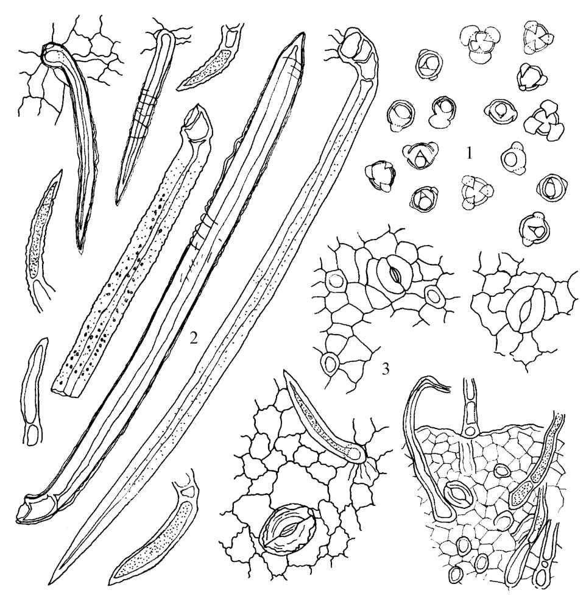
- 成分：芦丁8%～28%；槐花米甲素（黄酮类）、乙素丙素（甾体类）
- 理化鉴别：薄层色谱与芦丁对照品比对
- 含量测定：含总黄酮（以芦丁计）槐花不得少于8.0%，槐米不得少于20.0%
- 功效：性微寒，味苦。凉血止血，清肝泻火
- 【附】槐角：槐的干燥成熟果实，串珠状肉质荚果不开裂，含槐角苷不少于4.0%，性寒味苦，清热泻火凉血止血

### 丁香 Caryophylli Flos（附：母丁香）
- 来源：桃金娘科植物丁香 *Eugenia caryophyllata* Thunb. 的干燥花蕾
- 产地：主产坦桑尼亚桑给巴尔岛、马来西亚、印度尼西亚，我国海南、广西、云南南部有引种
- 采收加工：花蕾由绿转红时采摘晒干
- 性状鉴别：略呈研棒状，花冠圆球形花瓣4覆瓦状抱合，萼筒圆柱状红棕色或棕褐色上部4枚三角状萼片十字状分开；质坚实富油性；气芳香浓烈味辛辣有麻舌感；入水萼管下沉（与去油丁香区别）
  - 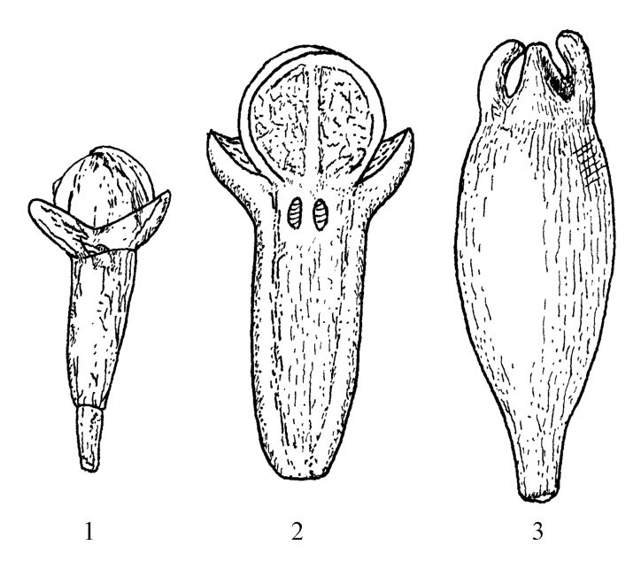
- 显微鉴别：皮层外侧散有2～3列径向延长椭圆形油室；20～50个小型双韧维管束断续排列成环；薄壁细胞含众多细小草酸钙簇晶
  - 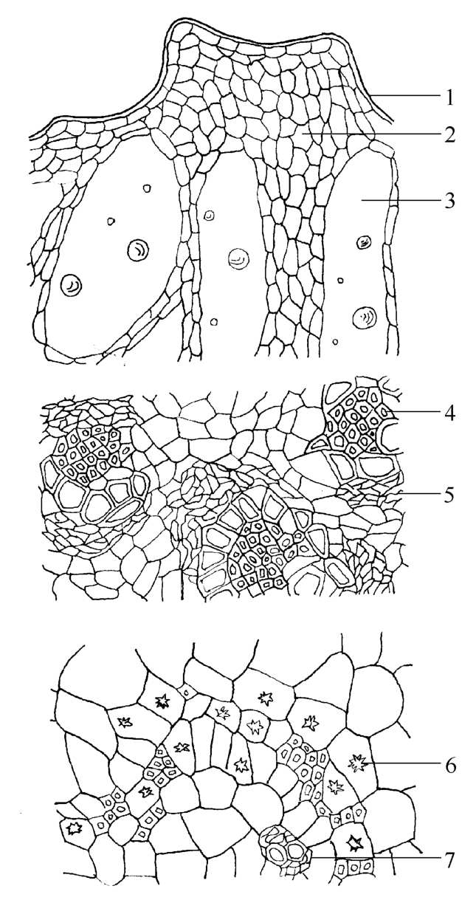
  - 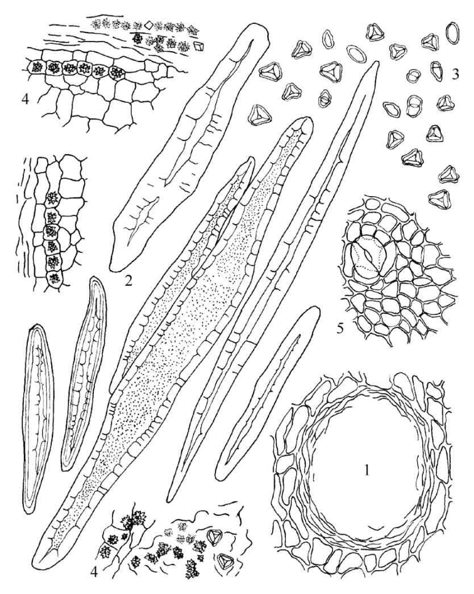
- 成分：挥发油，主含丁香酚（80%～95%）、β-丁香烯、乙酰基丁香酚
- 理化鉴别：薄层色谱与丁香酚对照品比对
- 含量测定：含丁香酚不得少于11.0%
- 功效：性温，味辛。温中降逆，补肾助阳
- 【附】母丁香：丁香的成熟干燥果实（鸡舌香），含淀粉及少量挥发油，性温味辛，温中降逆补肾助阳

### 洋金花 Daturae Flos
- 来源：茄科植物白花曼陀罗 *Datura metel* L. 的干燥花，习称南洋金花
- 产地：主产江苏、浙江、福建、广东，多为栽培
- 性状鉴别：多皱缩成条状，花萼筒状灰绿色或灰黄色先端5裂，花冠喇叭状淡黄色或黄棕色先端5浅裂裂片有短尖；烘干品质柔韧气特异，晒干品质脆气微味微苦
  - 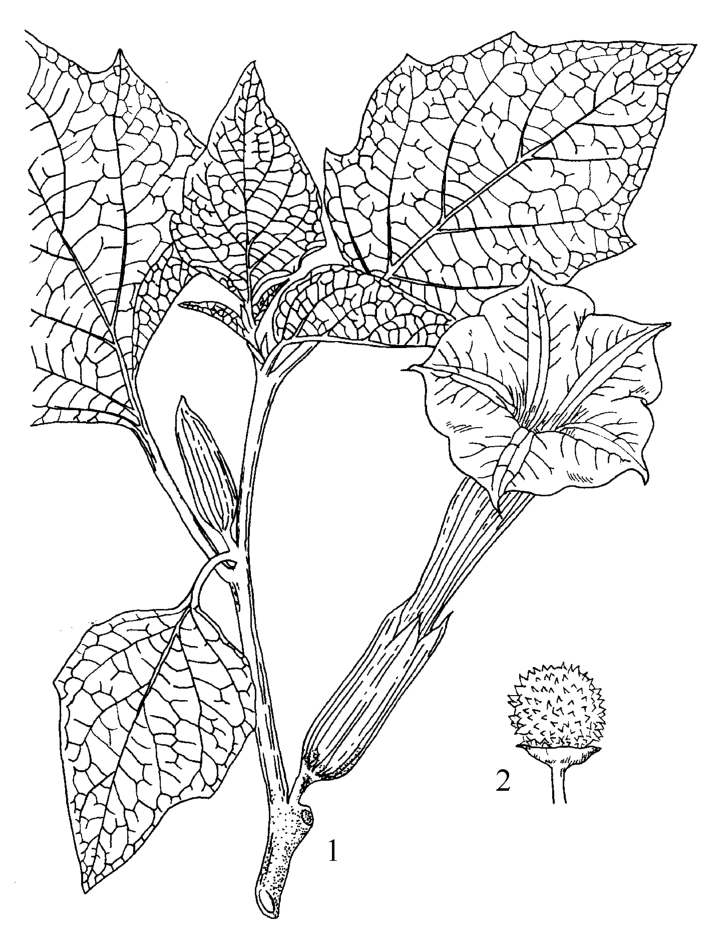
- 显微鉴别：花粉粒类球形或长圆形外壁有细点状条形雕纹；腺毛有两种；花萼花冠薄壁组织有草酸钙簇晶、砂晶及方晶
  - 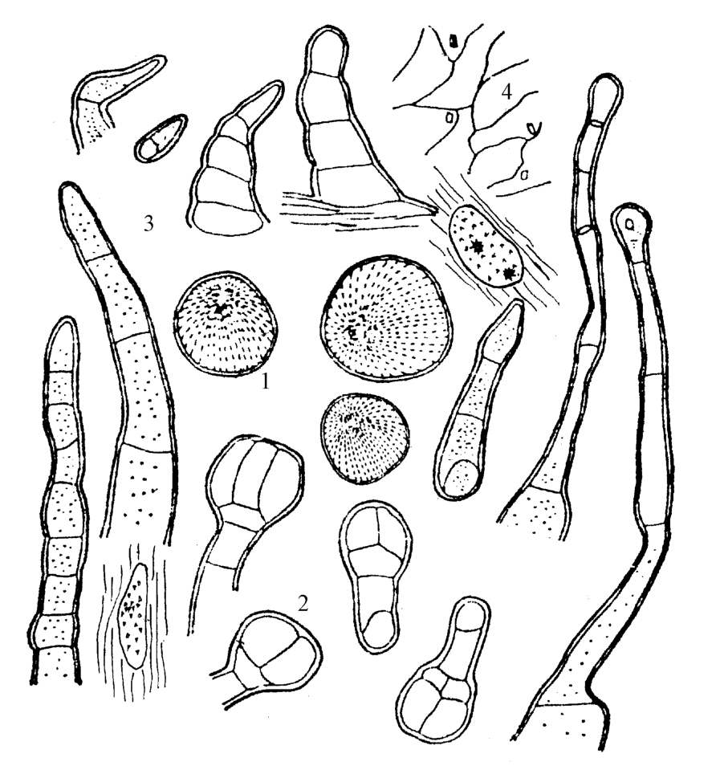
- 成分：总生物碱0.12%～0.82%（东莨菪碱0.11%～0.47%，莨菪碱0.01%～0.37%）；阿托品
- 理化鉴别：薄层色谱与硫酸阿托品、氢溴酸东莨菪碱对照品比对
- 含量测定：含东莨菪碱不得少于0.15%
- 功效：性温，味辛；有毒。平喘止咳，解痉定痛
- 附注：毛曼陀罗"北洋金花"、无刺曼陀罗"野洋金花"均非正品

### 金银花 Lonicerae Japonicae Flos（附：山银花、忍冬藤）
- 来源：忍冬科植物忍冬 *Lonicera japonica* Thunb. 的干燥花蕾或带初开的花
- 产地：主产山东、河南，全国大部地区均产
- 采收加工：5～6月采未开放花蕾，阴干或晒干
- 性状鉴别：呈小棒状上粗下细略弯曲，表面黄白色或绿白色密被短柔毛；花萼绿色先端5裂；气清香，味淡、微苦
  - 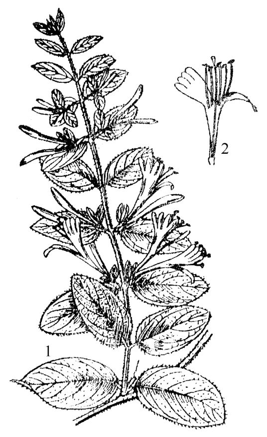
  - 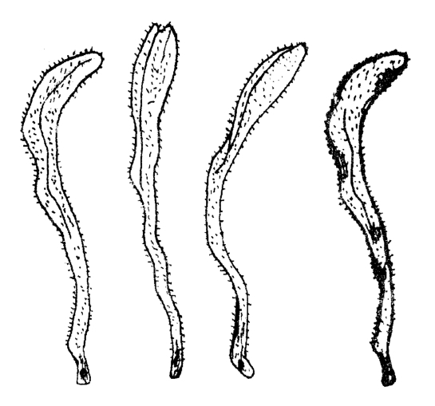
- 显微鉴别：腺毛有两种（倒圆锥形和类圆形头部）；花粉粒球形外壁具细刺状突起萌发孔3个；柱头顶端表皮细胞呈绒毛状
  - 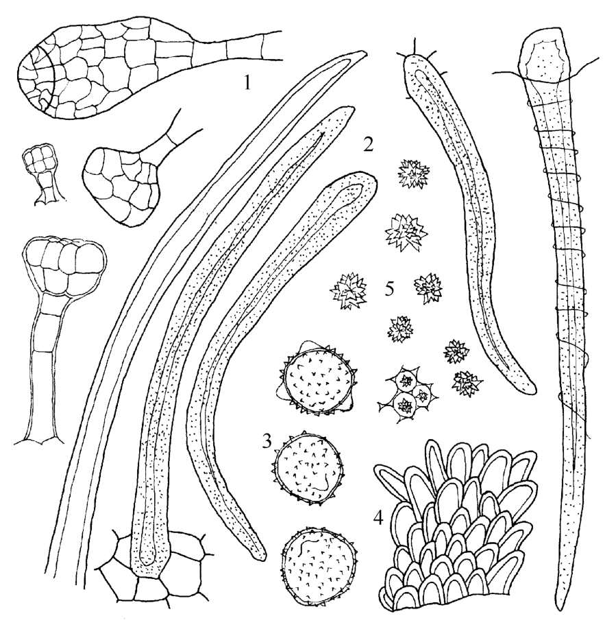
- 成分：黄酮类（木犀草素、木犀草苷、忍冬苷）；绿原酸、异绿原酸（抗菌有效成分）
- 理化鉴别：薄层色谱与绿原酸对照品比对
- 含量测定：含绿原酸不得少于1.5%；含木犀草苷不得少于0.050%
- 功效：性寒，味甘。清热解毒，疏散风热
- 【附】山银花：灰毡毛忍冬、华南忍冬、红腺忍冬或黄褐毛忍冬的干燥花蕾或带初开的花，化学成分与金银花相似，含绿原酸不得少于2.0%
- 【附】忍冬藤：忍冬的干燥茎枝，含绿原酸、马钱苷、忍冬苷，性寒味甘，清热解毒疏风通络

### 旋覆花 Inulae Flos
- 来源：菊科植物旋覆花 *Inula japonica* Thunb. 或欧亚旋覆花 *I. britannica* L. 的干燥头状花序
- 产地：主产河南、河北、江苏、浙江，多自产自销
- 性状鉴别：扁球形或类球形，多松散，总苞覆瓦状排列；舌状花1列黄色花瓣多卷曲，管状花多数棕黄色；子房顶端有多数白色冠毛；体轻易散碎；味苦
- 显微鉴别：苞片非腺毛由1～8个细胞组成；腺毛棒槌状头部多细胞排成2列；花粉粒外壁有刺具3萌发孔
- 成分：旋覆花次内酯、旋覆花内酯；欧亚旋覆花含天人菊内酯
- 功效：性微温，味苦、辛、咸。降气，消痰，行水，止呕
- 附注：金沸草为旋覆花全草，功用相同

### 款冬花 Farfarae Flos
- 来源：菊科植物款冬 *Tussilago farfara* L. 的干燥花蕾
- 产地：主产河南、甘肃、山西、陕西
- 性状鉴别：长圆棒状，单生或2～3个基部连在一起习称"连三朵"，外面被多数鱼鳞状苞片外表面紫红色或淡红色内表面密被白色絮状茸毛；体轻撕开可见白色茸毛；气香，味微苦而辛
- 显微鉴别：非腺毛极长顶端细胞特长扭曲盘绕成团；花粉粒表面有尖刺每裂片5刺；冷水合氯醛装片可见菊糖团块呈无色扇形
- 成分：款冬二醇、山金车二醇、降香醇；三萜皂苷、挥发油
- 功效：性温，味辛、微苦。润肺下气，止咳化痰
- 附注：蜂斗菜花蕾曾在部分地区充作款冬花入药

### 菊花 Chrysanthemi Flos（附：野菊花）
- 来源：菊科植物菊 *Chrysanthemum morifolium* Ramat. 的干燥头状花序，按产地加工不同分"亳菊""滁菊""贡菊""杭菊""怀菊"
- 产地：主产安徽、浙江、江苏、河南，多栽培
- 性状鉴别：亳菊呈倒圆锥形或圆筒形，总苞碟状3～4层，舌状花类白色管状花黄色；滁菊球形舌状花不规则扭曲；贡菊扁球形舌状花白色无腺点；杭菊碟形或扁球形常数个相连；怀菊不规则球形；气清香，味甘、微苦
- 显微鉴别：花粉粒外壁较厚具粗齿具3萌发孔；T形毛顶端细胞长大；无柄腺毛鞋底形4～6个细胞两两相对排列
  - 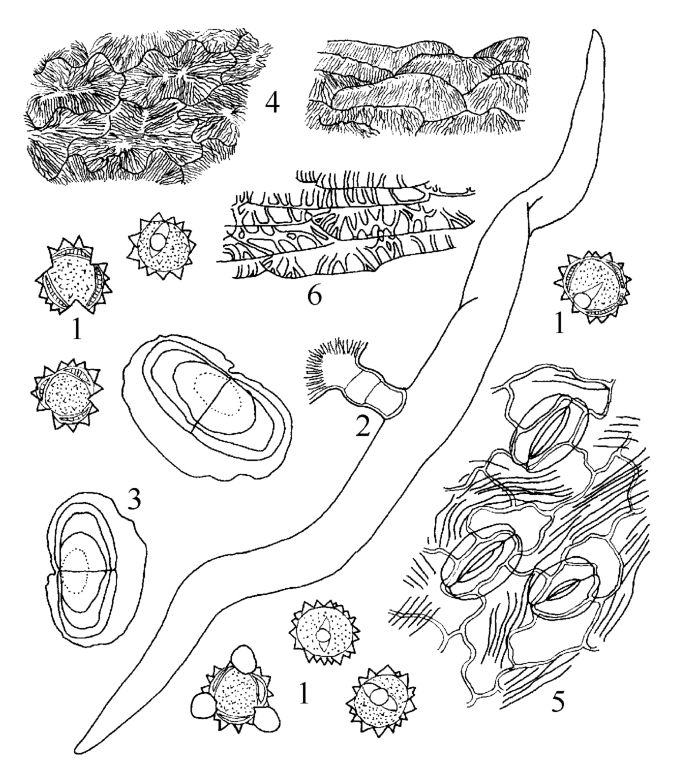
- 成分：绿原酸、3,5-O-二咖啡酰基奎宁酸；挥发油（菊花酮、龙脑）；黄酮类（木犀草苷、大波斯菊苷）
- 理化鉴别：聚酰胺薄膜薄层色谱与菊花对照药材和绿原酸对照品比对
- 含量测定：含绿原酸不得少于0.20%，含木犀草苷不得少于0.080%，含3,5-O-二咖啡酰基奎宁酸不得少于0.70%
- 功效：性微寒，味甘、苦。散风清热，平肝明目，清热解毒
- 【附】野菊花：菊科植物野菊的干燥头状花序，含蒙花苷不得少于0.80%，性微寒味苦辛，清热解毒泻火平肝

### 红花 Carthami Flos
- 来源：菊科植物红花 *Carthamus tinctorius* L. 的干燥花
- 产地：主产河南、河北、浙江、四川、新疆，均为栽培
- 采收加工：5～7月花冠由黄变红时晴天早晨露水未干时采摘
- 性状鉴别：为不带子房的管状花，表面红黄色或红色，花冠筒部细长先端5裂；雄蕊5花药黄白色聚合成筒状；质柔软；气微香，味微苦；花浸水中水染成金黄色
  - 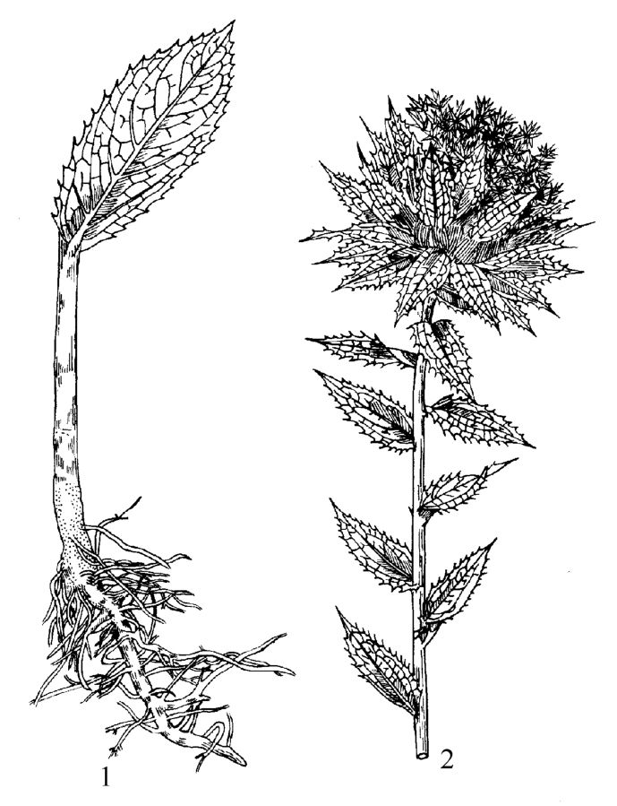
  - 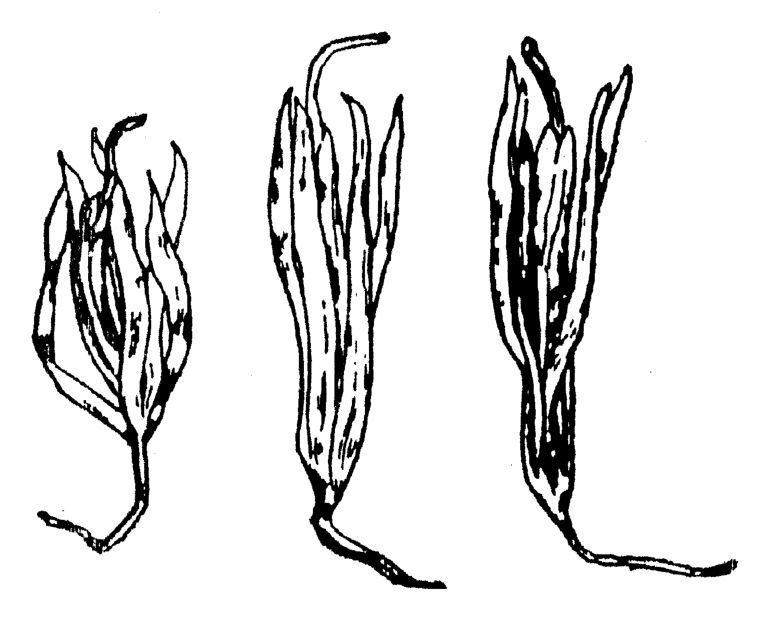
- 显微鉴别：柱头表皮细胞分化成圆锥形单细胞毛；分泌细胞单列纵向连接内充满淡黄色至红棕色物；花粉粒外壁有短刺及疣状雕纹具3萌发孔
  - 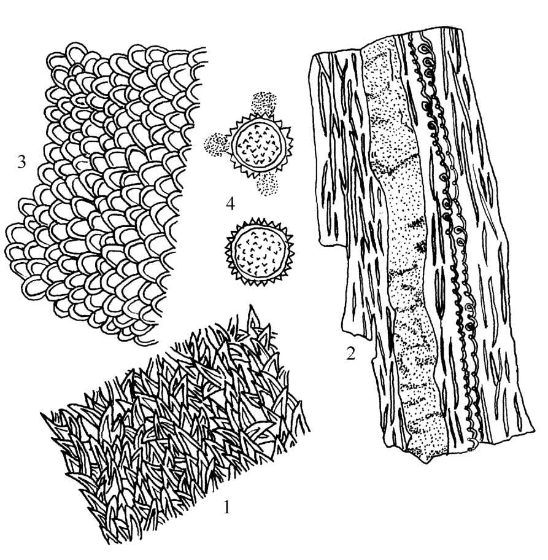
- 成分：红花苷、红花醌苷、新红花苷（不同成熟期花含量不同）；羟基红花黄色素A
- 理化鉴别：薄层色谱与红花对照药材比对
- 含量测定：含羟基红花黄色素A不得少于1.0%，含山柰素不得少于0.050%
- 功效：性温，味辛。活血通经，散瘀止痛
- 附注：无刺红花花含红花苷0.48%～0.83%高于红花（0.3%～0.6%），但茎秆较软抗病力弱

### 蒲黄 Typhae Pollen
- 来源：香蒲科植物水烛香蒲 *Typha angustifolia* L.、东方香蒲 *T. orientalis* Presl 或同属植物的干燥花粉
- 产地：水烛香蒲主产江苏、浙江、山东、安徽；东方香蒲主产贵州、山东、山西及东北
- 性状鉴别：鲜黄色粉末，体轻手捻有滑腻感易附手指，放水中飘浮水面；气微，味淡
- 显微鉴别：花粉粒类圆形或椭圆形表面有似网状雕纹周边轮廓呈凸波状或齿轮状，单萌发孔不甚明显
- 成分：脂肪油；黄酮类（异鼠李素-3-O-新橙皮苷、香蒲新苷）
- 含量测定：含异鼠李素-3-O-新橙皮苷和香蒲新苷总量不得少于0.5%
- 功效：性平，味甘。止血，化瘀，通淋

### 西红花 Croci Stigma
- 来源：鸢尾科植物番红花 *Crocus sativus* L. 的干燥柱头
- 产地：主产西班牙、希腊、法国、伊朗及中亚一带，我国浙江、江苏、上海、北京等地有少量栽培
- 采收加工：开花期晴天早晨采花摘取柱头，晒干或低温烘干
- 性状鉴别：弯曲细丝状或线形三分枝，暗红色上部较宽略扁平顶端边缘不整齐齿状内侧有短裂隙；体轻质松软无油润光泽干燥后质脆易断；气特异微有刺激性，味微苦
  - 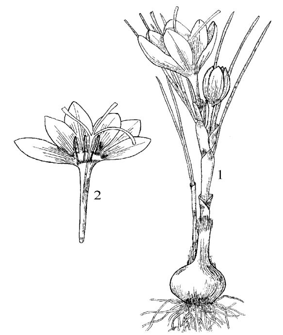
  - 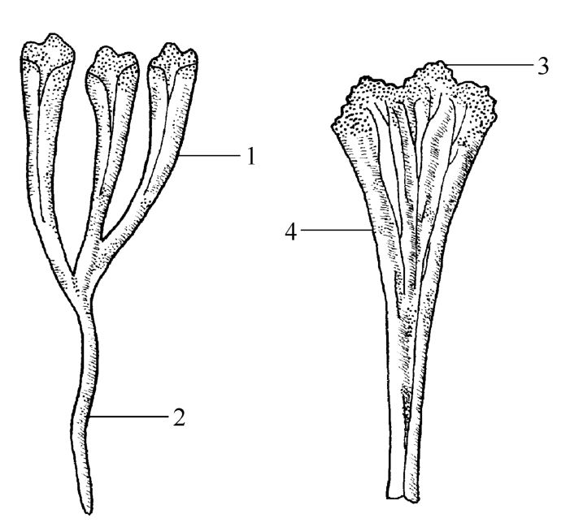
- 显微鉴别：表皮细胞表面观长条形外壁凸出呈乳头状或绒毛状；柱头顶端表皮细胞绒毛状；草酸钙结晶聚集于薄壁细胞中
  - 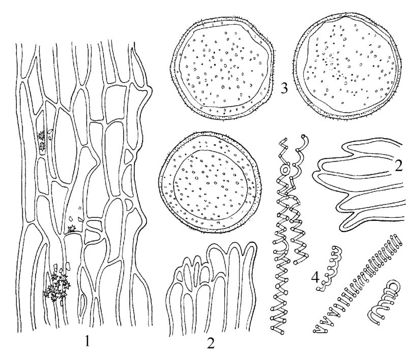
- 成分：胡萝卜素类约2%（西红花苷Ⅰ～Ⅳ、α-西红花酸）；挥发油（西红花醛为西红花苦苷分解产物）
- 理化鉴别：浸水可见橙黄色物质直线下降逐渐扩散水染成黄色无沉淀；加硫酸显蓝色经紫色变红褐色或棕色；458nm与432nm波长吸光度比值应为0.85～0.90
- 含量测定：含西红花苷-Ⅰ和西红花苷-Ⅱ总量不得少于10.0%
- 功效：性平，味甘。活血化瘀，凉血解毒，解郁安神
- 附注：进口药材价格昂贵，曾发现以其他植物花丝染色、合成染料、淀粉糊精、矿物油或植物油、甘油硝酸铵等多种方式掺伪，需分别用显微镜检识、水溶液颜色、碘试液、纸上油渍、水溶性浸出物及灰分含量等方法鉴别
