---
markmap:
  colorFreezeLevel: 2
  initialExpandLevel: 1
---

# 第十章 果实及种子类中药
- 果实(fructus)及种子(semen)类中药商品中二者并未严格区分，大多果实与种子一起入药（乌梅、枸杞），少数仅用种子但以果实形式贮存销售（巴豆、砂仁），少数用果实一部分（山茱萸为果肉、大腹皮为果皮、陈皮为部分果皮、甜瓜蒂为带部分果皮的果柄、柿蒂为宿萼、橘络/丝瓜络为中果皮维管束组织）

## 第一节 概述

### 一、果实类中药
#### (一) 性状鉴别
- 观察形状大小颜色顶端基部表面质地破断面气味；常呈类球形长椭圆形（五味子、山楂）、半球形或半椭圆形（枳壳、木瓜）、不规则多角形（八角茴香、化橘红）
- 表面常具凹下油点（芸香科）、隆起肋线（伞形科双悬果）、纵直棱角（使君子）；顶端常有花柱基，基部残留果梗或果梗痕，有的具宿萼（蔓荆子、地肤子）
- 特殊气味助鉴别：枳壳吴茱萸具香气，枸杞子味甜，鸦胆子味极苦，乌梅极酸，五味子五味俱全；剧毒药材（巴豆、马钱子）口尝需特别注意

#### (二) 显微鉴别
- 果皮包括外果皮、中果皮、内果皮三部分
- 1.外果皮：与叶下表皮相当，1列表皮细胞外被角质层；有的被毛茸（吴茱萸）、腺鳞（蔓荆子）、含色素物质（川花椒）、嵌有油细胞（五味子）
- 2.中果皮：与叶肉组织相当，大多薄壁细胞组成，中部有细小维管束；有时含淀粉粒（五味子）；有石细胞油细胞油室油管（荜澄茄、小茴香）
- 3.内果皮：与叶上表皮相当，多1列薄壁细胞；全为石细胞（胡椒）；伞形科果实常见"镶嵌细胞"特征

### 二、种子类中药
- 多用成熟种子，少数未成熟（枣儿槟）；少数用部分（肉豆蔻衣/龙眼肉为假种皮，绿豆衣为种皮，肉豆蔻为去种皮种仁，莲子心为去子叶的胚）；加工品（大豆黄卷为发芽种子，淡豆豉为发酵品）

#### (一) 性状鉴别
- 注意形状大小颜色表面纹理种脐合点种脊位置形态、质地纵横剖面气味
- 形状多不规则圆球形类圆球形或扁圆球形；种皮表面纹理各异（王不留行颗粒状突起，蓖麻子花纹，马钱子被毛茸）；少数有种阜（蓖麻子、巴豆、千金子）
- 有发达胚乳（马钱子）或无胚乳子叶肥厚（杏仁）；浸水显黏性（车前子、葶苈子）

#### (二) 显微鉴别
- 种子构造包括种皮、胚乳、胚，主要鉴别特征为种皮
- 1.种皮：①表皮层：含黏液质（白芥子）；部分/全部分化非腺毛（牵牛子/马钱子）；含石细胞（杏仁、桃仁/天仙子）；栅状细胞壁木化（青葙子）；含色素（青葙子、牵牛子）
  - ②栅状细胞层：1～3列狭长细胞壁多木化（决明子）；光辉带（牵牛子、菟丝子）
  - ③油细胞层：内贮挥发油（白豆蔻、砂仁）
  - ④色素层：内层或内种皮含色素（白豆蔻）
  - ⑤石细胞：表皮层以内几乎全为石细胞（瓜蒌仁）或内种皮为石细胞层（白豆蔻）
  - ⑥营养层：贮淀粉粒薄壁细胞，成熟种子常颓废扁缩
- 2.胚乳：贮藏脂肪油和糊粉粒，大多具内胚乳；错入组织（槟榔种皮内层与外胚乳折合层，肉豆蔻外胚乳伸入内胚乳）
- 3.胚：包括胚根胚茎胚芽子叶；糊粉粒是确定种子类粉末中药的主要标志
- 扫描电镜及电泳技术已用于种子类中药鉴别研究

## 第二节 药材（饮片）鉴定

### 地肤子 Kochiae Fructus
- 来源：藜科植物地肤 *Kochia scoparia* (L.) Schrad. 的干燥成熟果实
- 产地：主产山东、江苏、河南、河北
- 性状鉴别：扁球状五角星形，外被宿存花被，表面灰绿色或浅棕色，周围具膜质小翅5枚，放射状脉纹5～10条；种子扁卵形黑色，胚弯曲如马蹄状；味微苦
- 成分：三萜类及其苷（地肤子皂苷Ic为主要有效成分）；挥发油
- 含量测定：含地肤子皂苷Ic不得少于1.8%
- 功效：性寒，味辛、苦。清热利湿，祛风止痒
- 附注：碱地肤、藜、草木犀的果实曾误作地肤子用

### 五味子 Schisandrae Chinensis Fructus（附：南五味子）
- 来源：木兰科植物五味子 *Schisandra chinensis* (Turcz.) Baill. 的干燥成熟果实，习称"北五味子"
- 产地：主产辽宁、吉林、黑龙江，河北亦产
- 采收加工：秋季果实完全成熟时采收晒干
- 性状鉴别：不规则圆球形或扁球形，外皮紫红色或暗红色皱缩显油性，久贮呈黑红色或出现"白霜"；种子1～2粒肾形种仁钩状半透明富油性；果肉气微味酸，种子破碎后有香气味辛微苦
  - 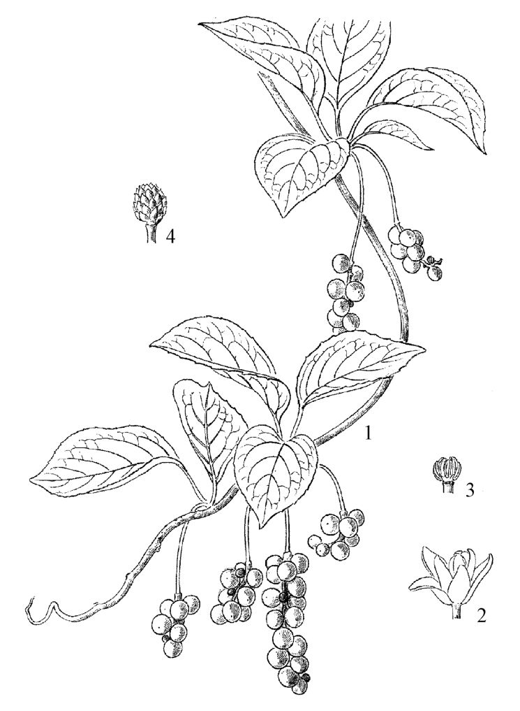
  - 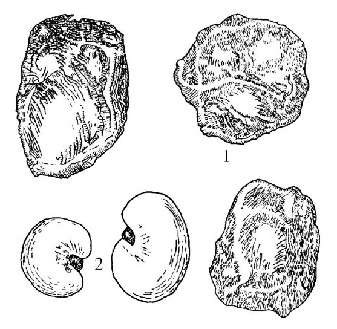
- 显微鉴别：外果皮1列表皮细胞散有油细胞；种皮最外层1列径向延长石细胞呈栅栏状；油细胞1列径向延长含棕黄色挥发油
  - 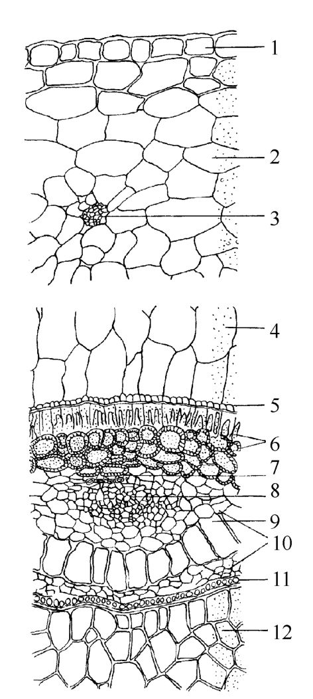
  - 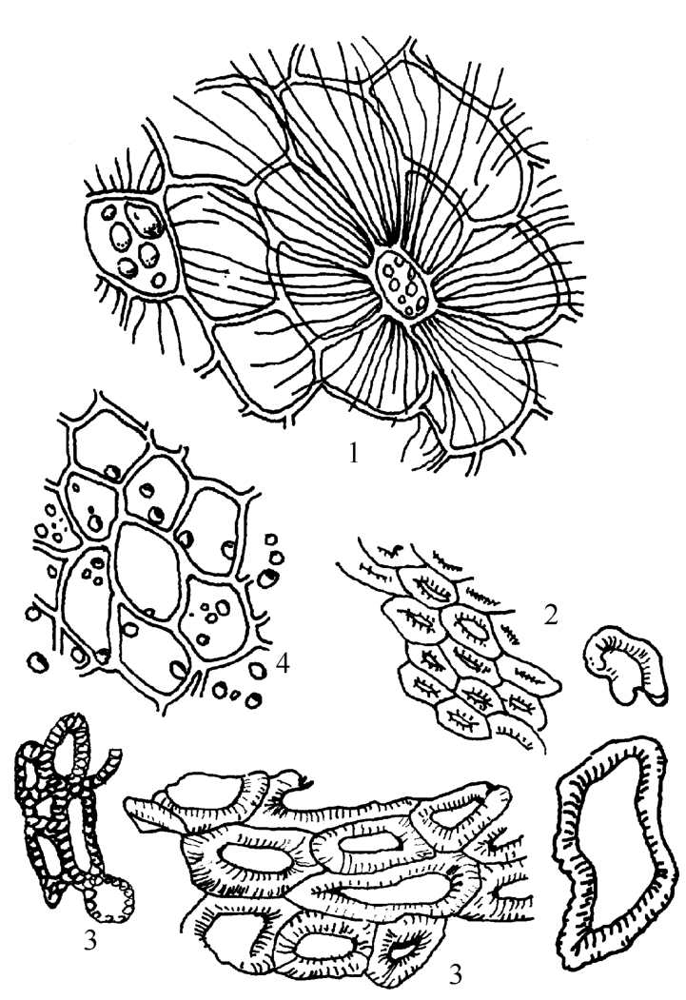
- 成分：挥发油0.89%；木脂素约5%（有效成分，五味子甲素及α/β/γ/δ/ε-五味子素、五味子醇甲/乙、戈米辛系列）；有机酸9.11%
- 理化鉴别：薄层色谱与五味子对照药材及五味子甲素对照品比对
- 含量测定：含五味子醇甲不得少于0.40%
- 功效：性温，味酸、甘。收敛固涩，益气生津，补肾宁心
- 【附】南五味子：木兰科植物华中五味子的干燥成熟果实，表面棕红色至暗棕色干瘪皱缩，含五味子甲素、五味子酯甲～戊

### 肉豆蔻 Myristicae Semen
- 来源：肉豆蔻科植物肉豆蔻 *Myristica fragrans* Houtt. 的干燥种仁
- 产地：主产马来西亚、印度尼西亚、斯里兰卡，西印度群岛亦产
- 性状鉴别：卵形或椭圆形，表面灰色或灰黄色或被白色石灰粉，有网状沟纹，一侧有明显纵沟（种脊），较宽端有圆形隆起（种脐），狭端有暗色凹陷（合点）；纵剖面外胚乳与内胚乳交错形成类似槟榔样纹理；气芳香而强烈，味辛
- 成分：挥发油5%～15%（α-蒎烯、β-莰烯）；肉豆蔻醚约4%（特有香气，量大有毒）；脂肪油25%～35%
- 功效：性温，味辛。温中行气，涩肠止泻
- 附注：肉豆蔻衣（肉豆蔻花/玉果花）为假种皮干燥品，含挥发油4%～15%

### 葶苈子 Descurainiae Semen / Lepidii Semen
- 来源：十字花科植物播娘蒿 *Descurainia sophia* (L.) Webb. ex Prantl. 或独行菜 *Lepidium apetalum* Willd. 的干燥成熟种子，前者习称"南葶苈子"，后者习称"北葶苈子"
- 产地：独行菜以华北、东北为主；播娘蒿主产华东、中南
- 性状鉴别：北葶苈子扁卵形一端钝圆另端渐尖微凹现白色点，表面棕色或红棕色具细微颗粒状突起及2条纵列浅槽，遇水黏滑性强；南葶苈子长圆形而略扁，具纵沟2条及细密网纹，略带黏性；味微辛（苦）
  - 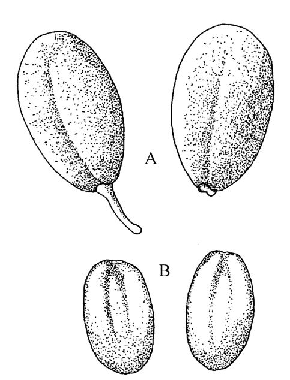
- 显微鉴别：北葶苈子表皮1列黏液细胞外壁特化成黏液层厚达216μm；栅状细胞层侧壁及内壁增厚木化
  - 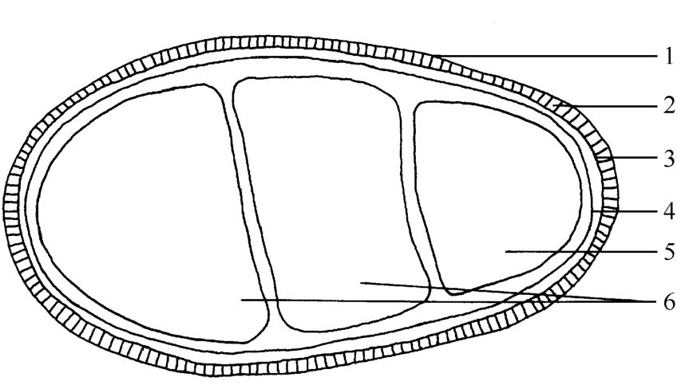
  - 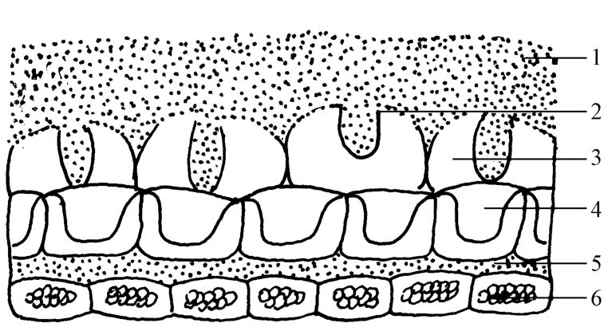
- 成分：北葶苈子含芥子苷、强心成分；南葶苈子含挥发油（异硫氰酸苄酯60%）、五种强心成分（毒毛旋花子苷元、葶苈苷等）
- 理化鉴别：加水浸泡放大镜下比较黏液层厚度（北＞种子厚度1/2，南＜1/5）；薄层色谱比对
- 含量测定：含槲皮素-3-O-β-D-葡萄糖-7-O-β-D-龙胆双糖苷不得少于0.075%；膨胀度北葶苈子不得低于12，南葶苈子不得低于3
- 功效：性大寒，味辛、苦。泻肺平喘，行水消肿

### 覆盆子 Rubi Fructus
- 来源：蔷薇科植物华东覆盆子 *Rubus chingii* Hu 的干燥果实
- 产地：产于浙江、湖北、江西、福建
- 性状鉴别：聚合果由多数小核果聚成呈圆锥形或扁圆锥形，表面黄绿色或淡棕色，小核果半月形背面密被灰白色茸毛两侧网状腹部有突起棱线；味微酸涩
- 成分：枸橼酸、苹果酸等有机酸；鞣花酸、β-谷甾醇
- 功效：性温，味甘、酸。益肾固精缩尿，养肝明目
- 附注：山莓未成熟果实曾误作覆盆子入药，非正品

### 木瓜 Chaenomelis Fructus
- 来源：蔷薇科植物贴梗海棠 *Chaenomeles speciosa* (Sweet) Nakai 的干燥近成熟果实
- 产地：主产安徽、湖北、四川、浙江，安徽宣城木瓜为上品，现多栽培
- 采收加工：夏秋果实绿黄时采收，沸水烫至外表灰白色，对半纵剖晒干
- 性状鉴别：长圆形多纵剖两半，外表紫红色或棕红色有不规则深皱纹，剖面边缘内卷，果肉红棕色中心可见凹陷棕黄色子房室；质坚实；气清香，味酸
  - 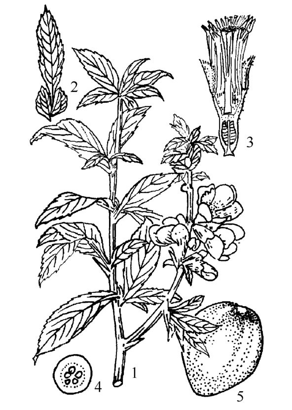
  - 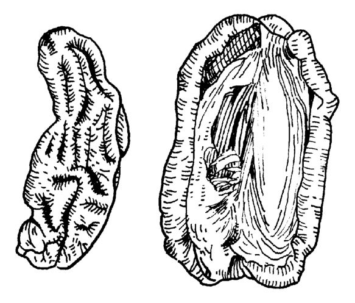
- 显微鉴别：石细胞成群或散在纹孔明显；草酸钙方晶；外果皮表皮细胞胞腔内含棕色物质
  - 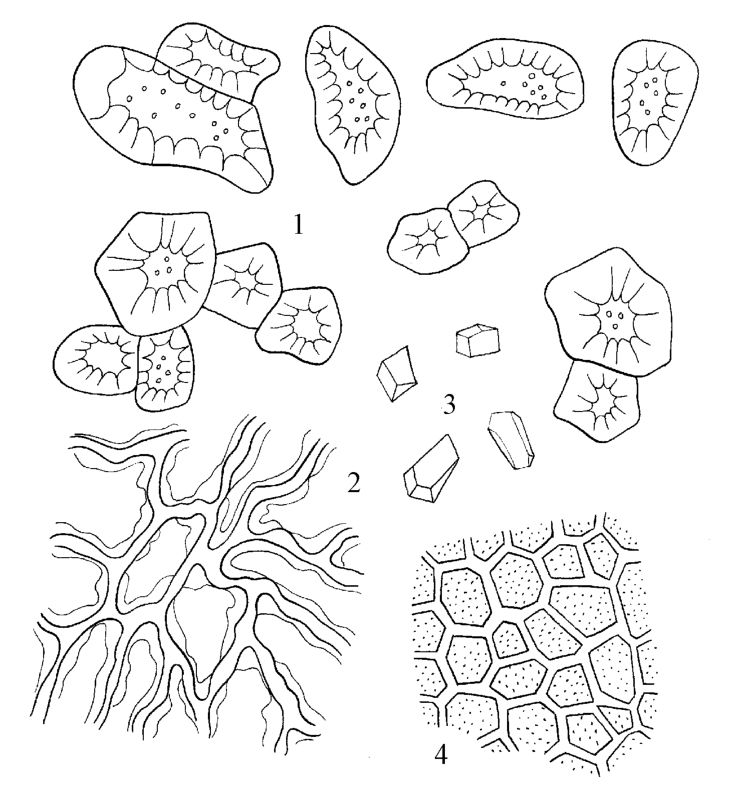
- 成分：齐墩果酸和熊果酸；皂苷、黄酮类、维生素C；过氧化氢酶
- 理化鉴别：薄层色谱与木瓜对照药材及熊果酸对照品比对
- 含量测定：含齐墩果酸和熊果酸总量不得少于0.50%
- 功效：性温，味酸。舒筋活络，和胃化湿
- 附注：同属植物木瓜（榠楂）习称"光皮木瓜"，植物枝无刺，与木瓜不同

### 山楂 Crataegi Fructus（附：山楂叶）
- 来源：蔷薇科植物山里红 *Crataegus pinnatifida* var. *major* N.E.Br. 或山楂 *C. pinnatifida* Bge. 的干燥成熟果实
- 产地：主产山东、河北、河南、辽宁
- 性状鉴别：圆形片皱缩不平，外皮红色有细皱纹和灰白色小点，果肉深黄色至浅棕色，横切面具5粒浅黄色果核；气微清香，味酸、微甜
- 成分：山楂酸、酒石酸、枸橼酸、熊果酸；黄酮类（槲皮素、金丝桃苷）；山楂酸有强心降压作用
- 功效：性微温，味酸、甘。消食健胃，行气散瘀，化浊降脂
- 附注：野山楂（南山楂）果实较小类球形，质坚硬核大果肉薄
- 【附】山楂叶：蔷薇科植物山里红或山楂的干燥叶，含金丝桃苷、牡荆素等黄酮类，性平味酸，活血化瘀理气通脉化浊降脂

### 苦杏仁 Armeniacae Semen Amarum
- 来源：蔷薇科植物山杏 *Prunus armeniaca* var. *ansu* Maxim.、西伯利亚杏、东北杏或杏 *P. armeniaca* L. 的干燥成熟种子
- 产地：山杏主产辽宁、河北、内蒙古、山东（多野生）；西伯利亚杏、东北杏主产东北（野生）；杏主产东北、华北、西北（栽培）
- 性状鉴别：扁心形，顶端略尖基部钝圆左右不对称，表面棕色至暗棕色有不规则皱纹，种脐种脊合点可辨；种皮薄子叶2乳白色富油性；气微，味苦
  - 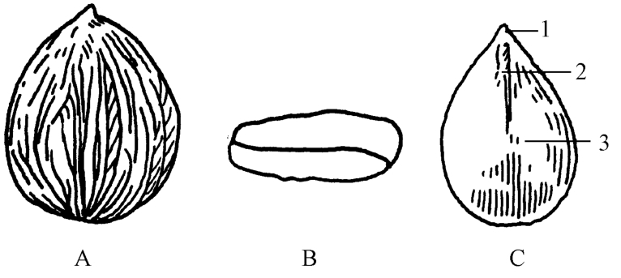
- 显微鉴别：种皮散有近圆形橙黄色石细胞；内胚乳1至数层方形细胞含糊粉粒及脂肪油
  - 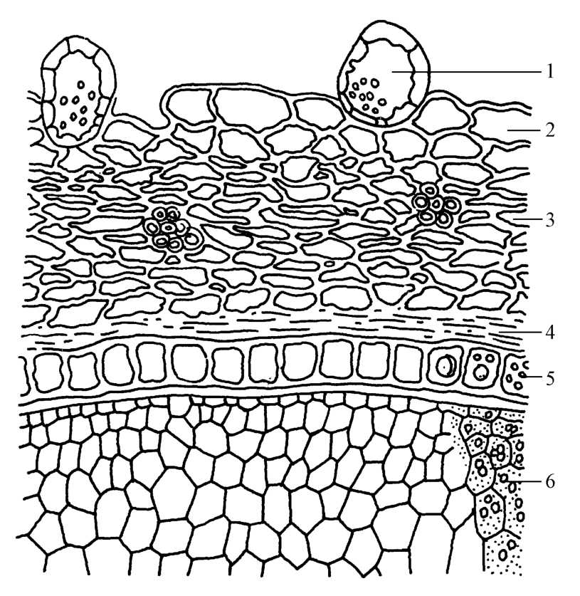
- 成分：苦杏仁苷约3%（水解产生氢氰酸约0.2%、苯甲醛、葡萄糖）；苦杏仁酶；脂肪油约50%
- 理化鉴别：加水共研产生苯甲醛特殊香气；薄层色谱与苦杏仁苷对照品比对
- 含量测定：含苦杏仁苷不得少于3.0%
- 功效：性微温，味苦；有小毒。降气止咳平喘，润肠通便
- 附注：甜杏仁含苦杏仁苷约0.11%味不苦，作副食品；苦杏仁与桃仁蛋白电泳谱有明显区别（B区苦杏仁3条带，桃仁4～5条带）

### 桃仁 Persicae Semen
- 来源：蔷薇科植物桃 *Prunus persica* (L.) Batsch 或山桃 *P. davidiana* (Carr.) Franch. 的干燥成熟种子
- 产地：全国大部分地区，主产四川、陕西、河北、山东
- 性状鉴别：扁长卵形，表面黄棕色或红棕色密布颗粒状突起，一端尖中部膨大另端钝圆稍偏斜；种脐种脊合点可辨；种皮薄子叶2类白色富油性；山桃仁较小而肥厚；味微苦
  - 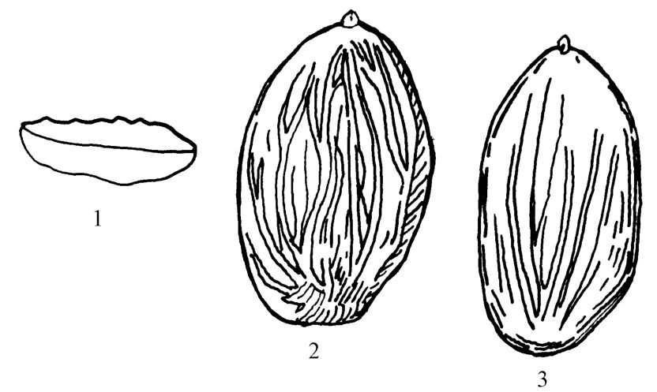
- 成分：苦杏仁苷（含量约为苦杏仁1/2）；苦杏仁酶；多量脂肪油；醇提取物有显著抑制血凝作用
- 含量测定：含苦杏仁苷不得少于2.0%
- 功效：性平，味苦、甘。活血祛瘀，润肠通便，止咳平喘
- 附注：瘪桃干为桃未成熟干燥果实，止汗止血，可治幼儿缺铁性贫血

### 乌梅 Mume Fructus
- 来源：蔷薇科植物梅 *Prunus mume* (Sieb.) Sieb. et Zucc. 的干燥近成熟果实
- 产地：主产四川、浙江、福建、广东
- 采收加工：夏季果实近成熟时采收，低温烘干后闷至色变黑
- 性状鉴别：类球形或扁球形，表面乌黑色至棕黑色皱缩不平，果肉略柔软果核坚硬椭圆形棕黄色，种子1扁卵形淡黄色；气微，味极酸
- 显微鉴别：非腺毛多单细胞；内果皮石细胞单个散在或成群常含红棕色物；中果皮细胞皱缩有时含草酸钙簇晶
  - 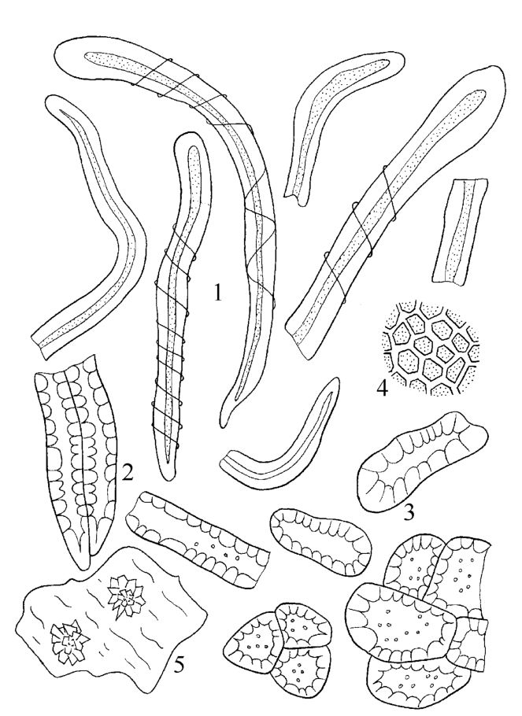
- 成分：熊果酸、枸橼酸、苹果酸、齐墩果酸；种子含苦杏仁苷
- 理化鉴别：薄层色谱与乌梅对照药材及熊果酸对照品比对
- 含量测定：含枸橼酸不得少于12.0%
- 功效：性平，味酸、涩。敛肺，涩肠，生津，安蛔
- 附注：山杏、杏、苦李子、桃肉等果实曾误加工充乌梅，可通过性状（果核形态网纹）及显微特征（非腺毛形态）区别

### 沙苑子 Astragali Complanati Semen
- 来源：豆科植物扁茎黄芪 *Astragalus complanatus* R.Br. 的干燥成熟种子
- 产地：主产陕西潼关（"潼蒺藜"），河北、辽宁、山西、内蒙古亦产
- 性状鉴别：略呈肾形而稍扁，表面光滑褐绿色或灰褐色，边缘一侧凹入处具明显种脐；质坚硬，子叶2淡黄色；气微，味淡，嚼之有豆腥味
  - 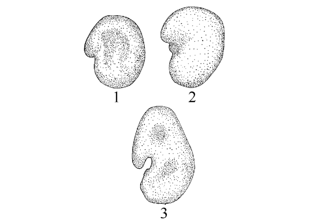
  - 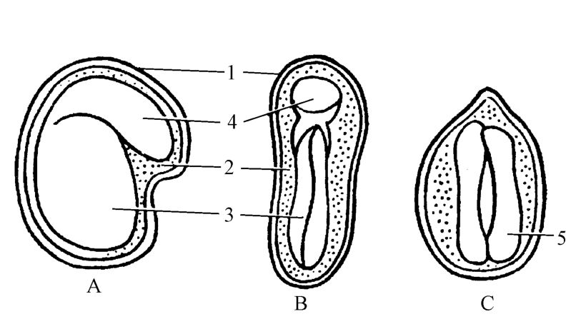
- 显微鉴别：种皮表皮层1列径向延长栅状细胞，靠外1/6处有1光辉带；支持细胞1列含棕色物质
- 成分：黄酮类化合物（沙苑子苷、大麻苷、紫云英苷）；脂肪油约3%；17种以上氨基酸（谷氨酸含量最高）
- 理化鉴别：聚酰胺薄膜薄层色谱与沙苑子对照药材和沙苑子苷比对
- 含量测定：含沙苑子苷不得少于0.060%
- 功效：性温，味甘。补肾助阳，固精缩尿，养肝明目
- 附注：华黄芪、紫云英的种子与沙苑子相似，应注意鉴别

### 决明子 Cassiae Semen
- 来源：豆科植物决明 *Cassia obtusifolia* L. 或小决明 *C. tora* L. 的干燥成熟种子
- 产地：主产安徽、江苏、浙江、广东，全国大部分地区有栽培
- 性状鉴别：决明略呈菱状方形或短圆柱形两端平行倾斜形似马蹄，表面绿棕色或暗棕色平滑有光泽，背腹面各有突起棱线，横切面种皮薄中间有S形折曲黄色子叶2片重叠；小决明较小棱线两侧各有1条浅黄棕色带；味微苦
- 成分：游离羟基蒽醌衍生物（大黄酚、大黄素、决明素、橙黄决明素）
- 理化鉴别：薄层色谱与橙黄决明素、大黄酚对照品比对，氨蒸气熏后变色
- 含量测定：含大黄酚不得少于0.2%，含橙黄决明素不得少于0.080%
- 功效：性微寒，味甘、苦、咸。清热明目，润肠通便

### 补骨脂 Psoraleae Fructus
- 来源：豆科植物补骨脂 *Psoralea corylifolia* L. 的干燥成熟果实
- 产地：除东北、西北外全国各地均产
- 性状鉴别：肾形略扁，果皮黑色、黑褐色或灰褐色具细微网状皱纹，有时外附绿色膜质宿萼；种子1枚黄棕色光滑；质坚硬子叶2黄白色有油性；气香，味辛、微苦
  - 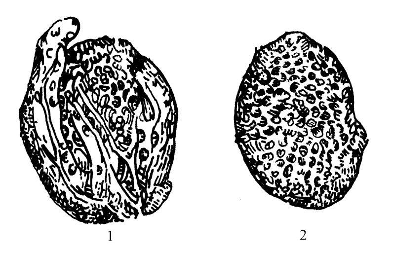
- 显微鉴别：果皮凹陷处表皮下有众多扁圆形壁内腺；种皮外表皮1列栅状细胞内为1列哑铃状支持细胞
  - 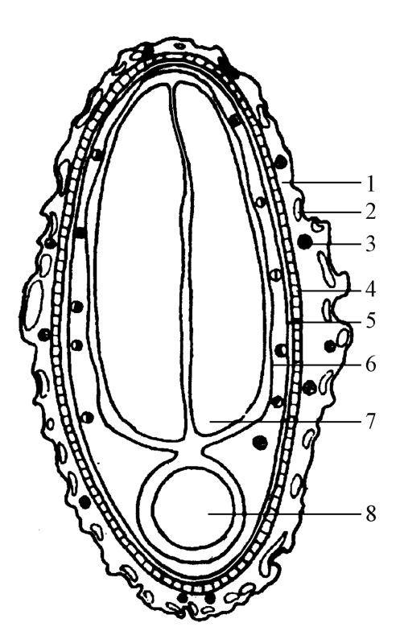
  - 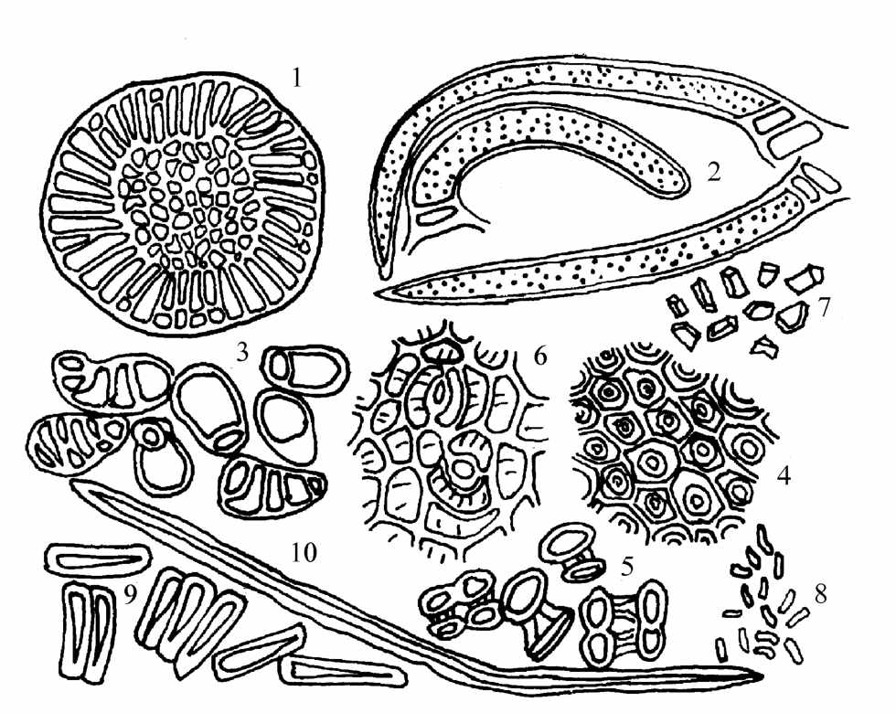
- 成分：香豆素衍生物（补骨脂素、异补骨脂素，能促进皮肤色素新生治白癜风）；黄酮类（补骨脂甲素/乙素）；单萜酚（补骨脂酚）
- 理化鉴别：薄层色谱与补骨脂素、异补骨脂素对照品比对
- 含量测定：含补骨脂素和异补骨脂素总量不得少于0.70%
- 功效：性温，味辛、苦。温肾助阳，纳气平喘，温脾止泻；外用消风祛斑

### 枳壳 Aurantii Fructus（附：枳实）
- 来源：芸香科植物酸橙 *Citrus aurantium* L. 及其栽培变种的干燥未成熟果实
- 产地：产于江西、四川、湖北、贵州，多系栽培，以江西清江、新干所产最闻名，商品习称"江枳壳"
- 采收加工：7～8月果皮尚绿未成熟时采收，横切两瓣晒干
- 性状鉴别：半圆球形翻口似盆状，外表棕褐色至褐色有颗粒状突起，横切面果皮黄白色边缘散有1～2列点状油点，瓤囊7～12瓣；气清香，味苦、微酸
  - 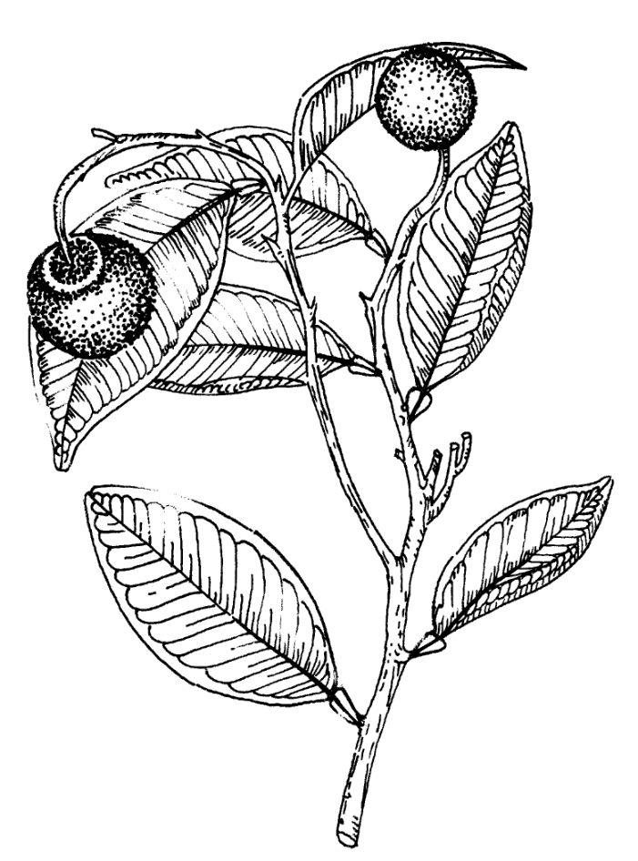
  - 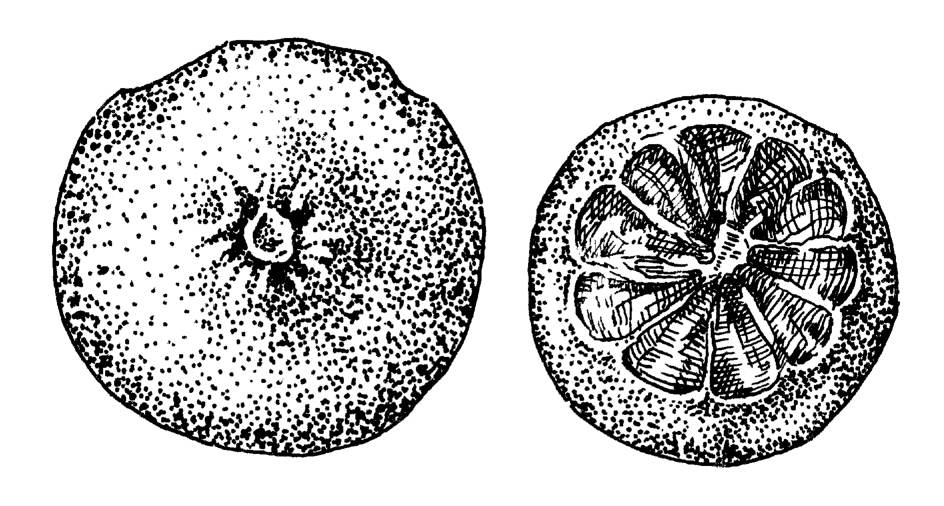
- 显微鉴别：中果皮发达有大型油室1～2列；中果皮外侧细胞散有较多草酸钙斜方晶或棱晶
  - 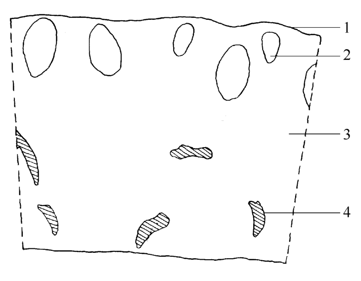
  - 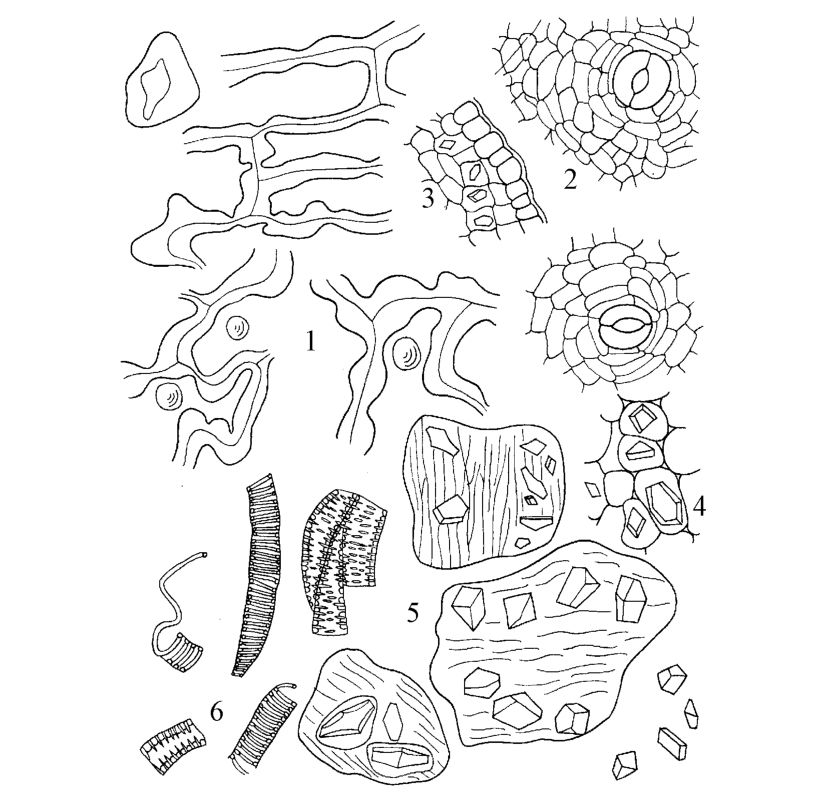
- 成分：挥发油（右旋柠檬烯约90%）；辛弗林、N-甲基酪胺（升压作用）；橙皮苷、柚皮苷
- 理化鉴别：薄层色谱与柚皮苷、新橙皮苷对照品比对
- 含量测定：含柚皮苷不得少于4.0%，含新橙皮苷不得少于3.0%
- 功效：性微寒，味苦、辛、酸。理气宽中，行滞消胀
- 附注：酸橙栽培变种有黄皮酸橙、代代花（苏枳壳）等；混淆品有枸橘、香圆的果实
- 【附】枳实：酸橙及其栽培变种或甜橙的干燥幼果，含辛弗林和N-甲基酪胺均较枳壳高，性微寒味苦辛酸，破气消积化痰散结；香圆幼果及枸橘幼果（"绿衣枳实"）亦作枳实用但非正品

### 香橼 Citri Fructus
- 来源：芸香科植物枸橼 *Citrus medica* L. 或香圆 *C. wilsonii* Tanaka 的干燥成熟果实
- 产地：枸橼产于云南、四川、福建；香圆产于江苏、浙江、安徽、江西
- 性状鉴别：枸橼为圆形或长圆形片，外果皮黄色或黄绿色边缘波状散有凹入油点，中果皮黄白色，瓤囊10～17室；香圆为类球形半球形或圆片表面黑绿色或黄绿色密被凹陷小油点，瓤囊9～11室；气清香，味微甜而苦辛（枸橼）或酸而苦（香圆）
- 成分：挥发油（右旋柠檬烯90%、枸橼醛）；枸橼苷、橙皮苷、柚皮苷；种子含柠檬苦素
- 功效：性温，味苦、辛、酸。疏肝理气，宽中，化痰
- 附注：柚、甜橙、枸橘的果实曾混充香圆药用，应注意鉴别

### 陈皮 Citri Reticulatae Pericarpium（附：青皮、橘核）
- 来源：芸香科植物橘 *Citrus reticulata* Blanco 及其栽培变种的干燥成熟果皮，分"陈皮"和"广陈皮"
- 产地：广东、福建、四川、江苏，均为栽培品
- 采收加工：霜降后至翌年春季采摘成熟果实，剥取外层果皮晒干
- 性状鉴别：陈皮剥成数瓣基部相连，外表面橙红色或红棕色有细皱纹及凹下点状油室，内表面浅黄白色附筋络状维管束；广陈皮常3瓣相连形状整齐质较柔软气香浓郁；味辛而苦
  - 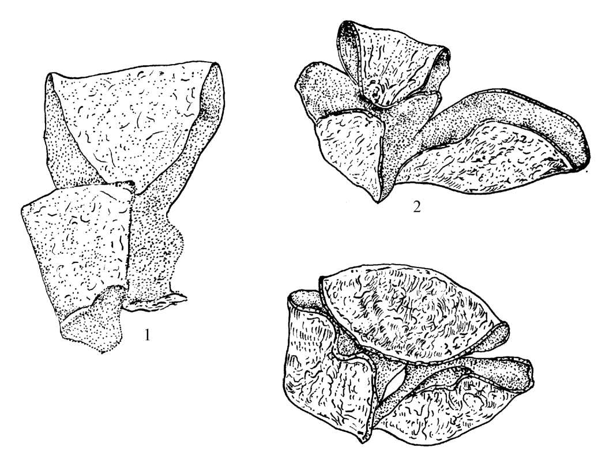
- 显微鉴别：中果皮散生大型卵圆形油室；薄壁细胞中散在草酸钙方晶或棱晶；乙醇处理可见橙皮苷针簇状结晶
  - 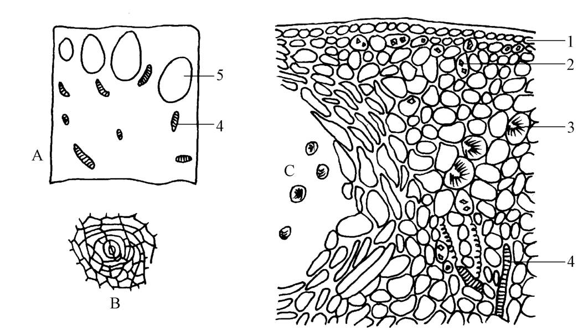
  - 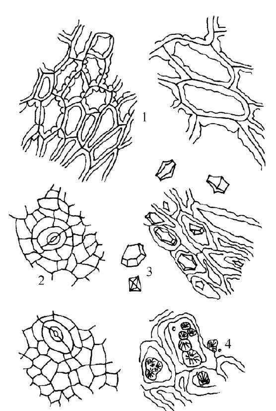
- 成分：挥发油2%～4%（右旋柠檬烯占80%以上）；黄酮类（橙皮苷、橘皮素、新橙皮苷、川陈皮素）
- 理化鉴别：薄层色谱与橙皮苷对照品比对
- 含量测定：含橙皮苷不得少于3.5%；饮片不得少于2.5%
- 功效：性温，味苦、辛。理气健脾，燥湿化痰
- 附注：栽培变种有茶枝柑（广陈皮）、大红袍、温州蜜柑、福橘；甜橙（广柑）外层果皮不宜作陈皮代用
- 【附】青皮：橘及其栽培变种的干燥幼果或未成熟果实果皮，分"个青皮"和"四花青皮"，性温味苦辛，疏肝破气消积化滞
- 【附】橘核：橘及其栽培变种的干燥成熟种子，性平味苦，理气散结止痛

### 化橘红 Citri Grandis Exocarpium
- 来源：芸香科植物化州柚 *Citrus grandis* 'Tomentosa' 或柚 *C. grandis* (L.) Osbeck 的未成熟或近成熟干燥外层果皮，前者习称"毛橘红"，后者习称"光七爪""光五爪"
- 产地：主产广东化县、广西玉林，多为栽培
- 性状鉴别：化州柚呈对折七角或展平五角星状，外表面黄绿色密布茸毛有皱纹及小油室；柚外表面黄绿色至黄棕色无毛；质脆易折断；气芳香，味苦、微辛
- 成分：挥发油、黄酮苷类
- 功效：性温，味辛、苦。理气宽中，燥湿化痰
- 附注：福橘、朱橘等橙红色外层果皮入药亦称"橘红"（芸皮），功效稍逊；化州柚小幼果称"橘红胎"或"橘红珠"，功效与化橘红相似

### 佛手 Citri Sarcodactylis Fructus
- 来源：芸香科植物佛手 *Citrus medica* var. *sarcodactylis* Swingle 的干燥果实
- 产地：主产广东高要，集散于肇庆；次产广西凌乐、灌阳
- 采收加工：秋季果实尚未变黄或变黄时采收，纵切薄片晒干
- 性状鉴别：类椭圆形或卵圆形薄片，常皱缩或卷曲，顶端常有3～5个手指状裂瓣，外皮黄绿色或橙黄色有皱纹及油点；质硬而脆受潮后柔韧；气香，味微甜后苦
- 成分：柠檬油、柠檬苦素、佛手内酯、香叶木苷、橙皮苷
- 理化鉴别：粉末微量升华得黄色针状或羽毛状结晶，紫外灯下有紫色荧光
- 功效：性温，味辛、苦、酸。疏肝理气，和胃止痛，燥湿化痰

### 吴茱萸 Euodiae Fructus
- 来源：芸香科植物吴茱萸 *Euodia rutaecarpa* (Juss.) Benth.、石虎 *E. rutaecarpa* var. *officinalis* (Dode) Huang 或疏毛吴茱萸 *E. rutaecarpa* var. *bodinieri* (Dode) Huang 的干燥近成熟果实
- 产地：主产贵州、广西、湖南、云南，多系栽培，湖南常德产者质量最好
- 采收加工：8～9月果实呈茶绿色尚未开裂时剪下果枝晒干
- 性状鉴别：球形或略呈五角状扁球形，表面暗黄绿色至褐色粗糙有点状突起或凹下油点，顶端五角星状裂隙；破开后内部黑色边缘显黑色油质麻点，横切面子房5室每室种子1粒；气芳香浓郁，味辛辣而苦；水浸泡有黏液渗出
  - 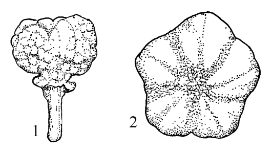
- 显微鉴别：外果皮表皮细胞大多含橙皮苷结晶；中果皮散有大型油室，薄壁细胞含草酸钙簇晶；种皮石细胞呈梭形栅状排列
  - 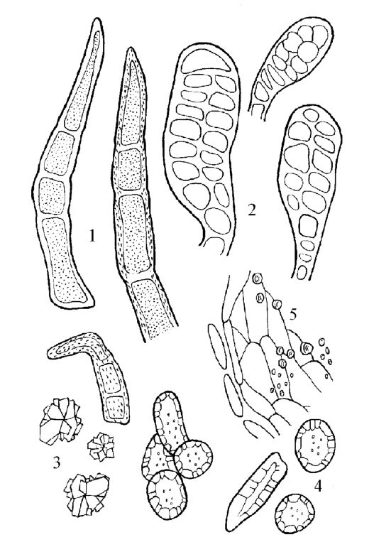
- 成分：挥发油0.4%以上（吴萸烯为香气成分）；生物碱（吴茱萸碱、吴茱萸次碱、羟基吴茱萸碱）；苦味质吴茱萸醇
- 理化鉴别：薄层色谱与吴茱萸次碱、吴茱萸碱对照品比对
- 含量测定：含吴茱萸碱和吴茱萸次碱总量不得少于0.15%，含柠檬苦素不得少于0.20%
- 功效：性热，味辛、苦；有小毒。散寒止痛，降逆止呕，助阳止泻

### 鸦胆子 Bruceae Fructus
- 来源：苦木科植物鸦胆子 *Brucea javanica* (L.) Merr. 的干燥成熟果实
- 产地：主产广西及广东，云南、贵州亦产
- 性状鉴别：卵形，表面黑色或棕色有隆起网状皱纹网眼呈不规则多角形，顶端渐尖两侧有明显棱线；种子卵形类白色或黄白色具网纹较尖端呈鸟嘴状；子叶乳白色富油性；无臭，味极苦而持久
- 显微鉴别：中果皮薄壁细胞含草酸钙簇晶；内果皮由2条石细胞环带及1条厚壁细胞环带组成向外形成多个角状突起
- 成分：鸦胆子苦素A～I、鸦胆子苦醇、鸦胆子苷；种子含脂肪油（鸦胆子酸）
- 功效：性寒，味苦；有小毒。清热解毒，截疟，止痢；外用腐蚀赘疣
- 附注：交让木科牛耳枫的果实曾误作鸦胆子用，表面被浅蓝色粉霜无明显网眼无棱线可资区别

### 巴豆 Crotonis Fructus
- 来源：大戟科植物巴豆 *Croton tiglium* L. 的干燥成熟果实
- 产地：主产四川、贵州、云南、广西，多系栽培
- 性状鉴别：卵圆形一般具三棱，表面灰黄色或稍深粗糙有纵线6条，破开果壳可见3室每室种子1粒；种子略扁椭圆形表面棕色或灰棕色，外种皮薄而脆内种皮白色薄膜，内胚乳肥厚淡黄色油质；气微，味辛辣；有毒不宜口尝
  - 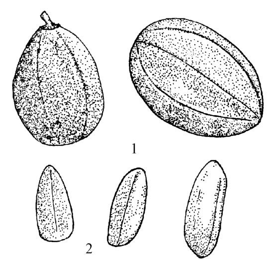
- 显微鉴别：中果皮中部4～7列纤维状石细胞呈带状环列；种皮表皮细胞径向壁锯齿状弯曲，其下1列壁厚性栅状细胞
  - 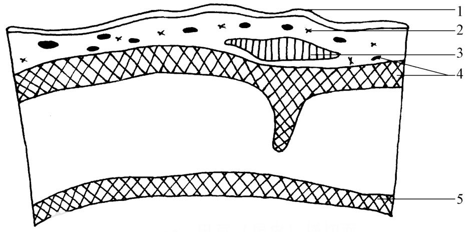
  - 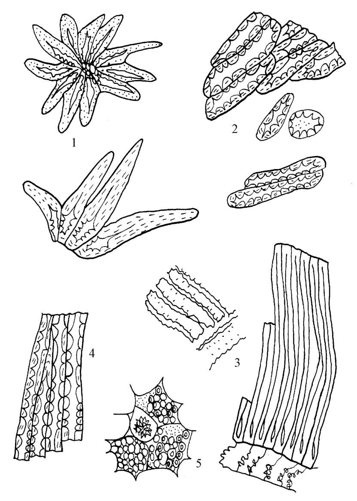
- 成分：脂肪油（巴豆油）34%～57%（巴豆树脂有强烈致泻作用）；巴豆毒素（毒性球蛋白）；巴豆苷
- 理化鉴别：薄层色谱与巴豆对照药材比对
- 含量测定：含脂肪油不得少于22.0%；含巴豆苷不得少于0.80%
- 功效：性热，味辛；有大毒。外用蚀疮
- 附注：巴豆霜为巴豆仁制霜加淀粉调节脂肪油含量至18.0%～20.0%，性热味辛有大毒，峻下冷积逐水消肿豁痰利咽外用蚀疮

### 酸枣仁 Ziziphi Spinosae Semen
- 来源：鼠李科植物酸枣 *Ziziphus jujuba* var. *spinosa* (Bunge) Hu ex H.F.Chou 的干燥成熟种子
- 产地：主产河北、陕西、辽宁、河南
- 性状鉴别：扁圆形或扁椭圆形，表面紫红色或紫褐色平滑有光泽，一面较平坦中间有1条隆起纵皱纹，另一面稍凸起；种皮较脆子叶2浅黄色富油性；气微，味淡
  - 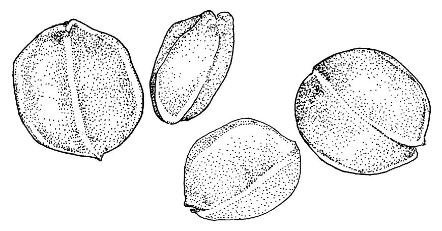
- 显微鉴别：种皮最外1列黄色或棕黄色栅状细胞外侧有明显光辉带；胚乳细胞含较多糊粉粒及脂肪油
  - 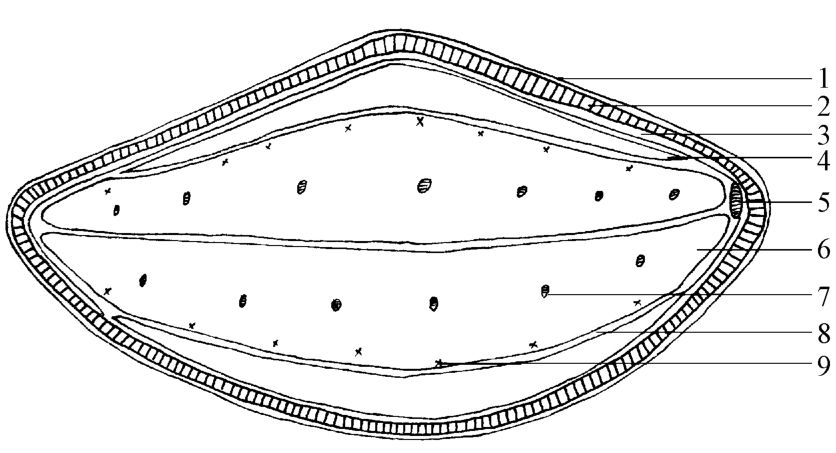
  - 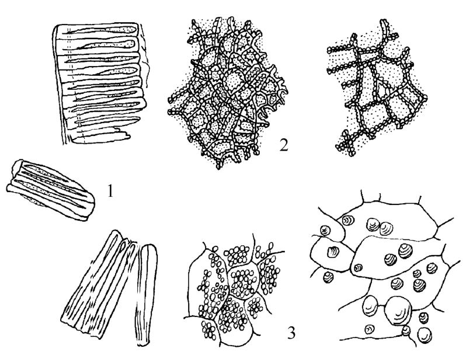
- 成分：酸枣仁皂苷A、B（水解得酸枣仁皂苷元）；黄酮类（斯皮诺素）；白桦脂酸、齐墩果酸
- 理化鉴别：薄层色谱与酸枣仁皂苷A、B对照品比对
- 含量测定：含酸枣仁皂苷A不得少于0.030%，含斯皮诺素不得少于0.080%
- 功效：性平，味甘、酸。养心补肝，宁心安神，敛汗，生津
- 附注：理枣仁（滇刺枣种子）应与酸枣仁区别（内种皮细胞壁不规则增厚胞腔呈哑铃形）

### 胖大海 Sterculiae Lychnophorae Semen
- 来源：梧桐科植物胖大海 *Sterculia lychnophora* Hance 的干燥成熟种子
- 产地：主产越南、泰国、印度尼西亚、马来西亚，越南产品质最佳
- 性状鉴别：纺锤形或椭圆形，表面棕色或暗棕色微有光泽具不规则干缩皱纹；中层种皮遇水膨胀成海绵状；内有2片肥厚胚乳；气微，味淡，嚼之有黏性
- 成分：聚戊糖及黏液质（果胶酸类）；胖大海素；西黄芪胶粘素约59%；脂肪油9.1%
- 理化鉴别：加沸水放置数分钟即吸水膨胀成棕色半透明海绵状物
- 功效：性寒，味甘。清热润肺，利咽开音，润肠通便
- 附注：圆粒苹婆种子及橄榄果实为伪品，应注意鉴别

### 小茴香 Foeniculi Fructus
- 来源：伞形科植物茴香 *Foeniculum vulgare* Mill. 的干燥成熟果实
- 产地：我国各地均有栽培，原产欧洲
- 性状鉴别：双悬果呈圆柱形，表面黄绿色或淡黄色两端略尖，顶端残留黄棕色突起柱基；分果背面纵棱5条；有特异香气，味微甜、辛
  - 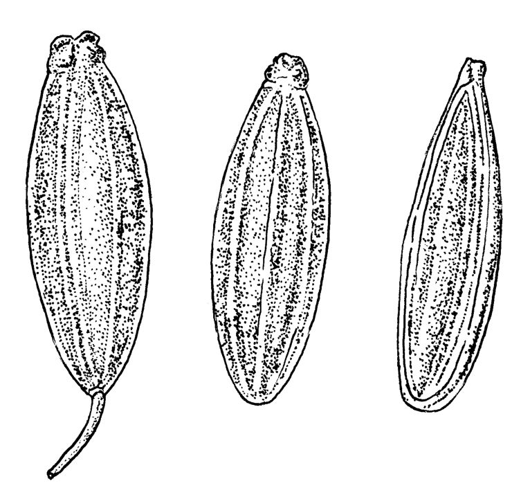
- 显微鉴别：背面纵棱间各有维管束周围有大椭圆形棕色油管1个接合面2个共6个油管；内胚乳细胞每个糊粉粒中含细小草酸钙簇晶1个
  - 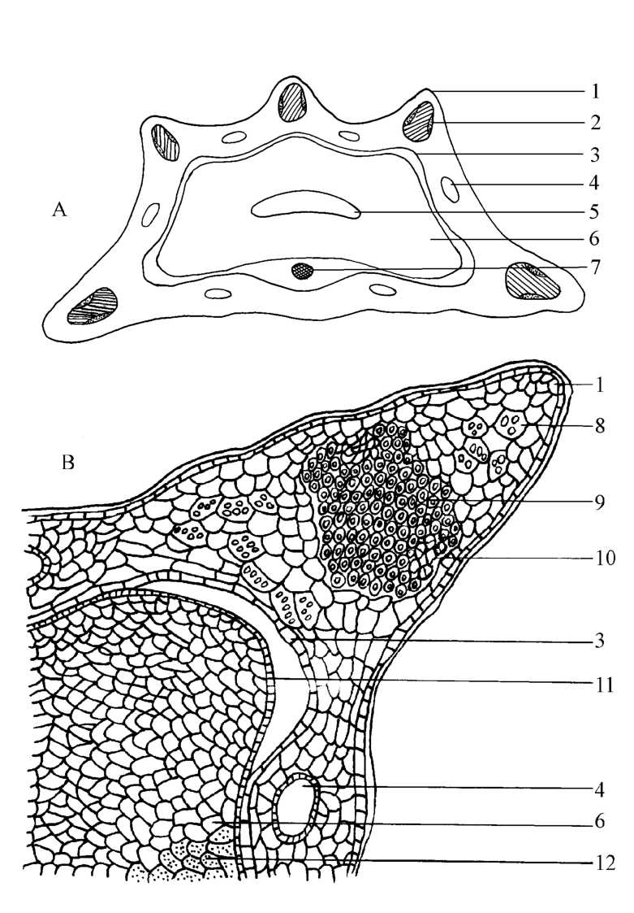
  - 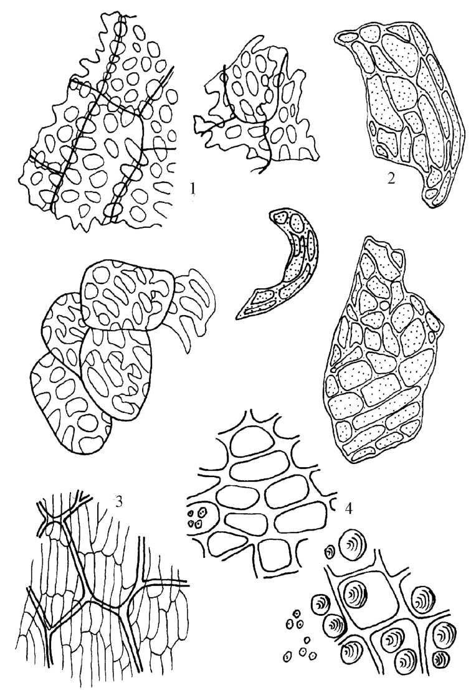
- 成分：挥发油3%～8%（反式茴香脑50%～60%、α-茴香酮18%～20%）
- 理化鉴别：薄层色谱与茴香醛对照品比对
- 含量测定：含挥发油不得少于1.5%(mL/g)；含反式茴香脑不得少于1.4%
- 功效：性温，味辛。散寒止痛，理气和胃
- 附注：莳萝、葛缕子（野茴香）、孜然芹、防风、毒芹子的果实曾误作小茴香药用，应注意鉴别

### 蛇床子 Cnidii Fructus
- 来源：伞形科植物蛇床 *Cnidium monnieri* (L.) Cuss. 的干燥成熟果实
- 产地：主产河北、山东、广西、浙江
- 性状鉴别：双悬果椭圆形，表面灰黄色或灰褐色，顶端有2枚向外弯曲柱基；背面纵棱5条，果皮松脆揉搓易脱落；气香，味辛凉有麻舌感
- 显微鉴别：背面纵棱间各有椭圆形油管1个接合面2个共6个油管；胚乳细胞每个糊粉粒含细小草酸钙簇晶
- 成分：挥发油约1.3%（左旋蒎烯、左旋莰烯）；蛇床子素（治阴道滴虫病有效成分）
- 功效：性温，味辛、苦；有小毒。燥湿祛风，杀虫止痒，温肾壮阳

### 山茱萸 Corni Fructus
- 来源：山茱萸科植物山茱萸 *Cornus officinalis* Sieb. et Zucc. 的干燥成熟果肉
- 产地：主产浙江临安、淳安及河南、陕西、安徽，浙江产者称"杭萸肉""淳萸肉"，河南产量最大
- 采收加工：秋末冬初果皮变红时采收，文火烘或沸水略烫后及时除去果核干燥
- 性状鉴别：不规则片状或囊状，新鲜时紫红色贮久渐变紫黑色，表面皱缩有光泽；质柔软；气微，味酸、涩、微苦
  - 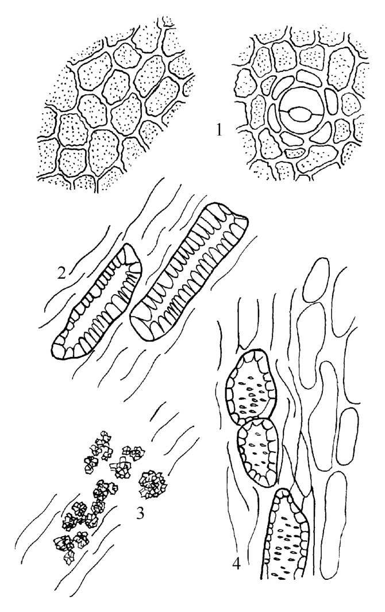
- 显微鉴别：中果皮宽广薄壁细胞含深褐色色素块，近果柄处常见石细胞和纤维束
- 成分：山茱萸苷（马鞭草苷）、番木鳖苷、莫诺苷、马钱苷；熊果酸
- 理化鉴别：薄层色谱与莫诺苷和马钱苷对照品比对
- 含量测定：含马钱苷和莫诺苷总量不得少于1.2%
- 功效：性微温，味酸、涩。补益肝肾，收涩固脱

### 连翘 Forsythiae Fructus
- 来源：木犀科植物连翘 *Forsythia suspensa* (Thunb.) Vahl 的干燥果实
- 产地：主产山西、陕西、河南，多为野生
- 采收加工：果实初熟尚带绿色时摘下蒸熟晒干习称"青翘"；果实熟透时色黄采收晒干习称"黄翘"或"老翘"
- 性状鉴别：长卵形至卵形稍扁，表面有不规则纵皱纹及多数凸起小斑点，两面各有1条明显纵沟；青翘多不开裂绿褐色；老翘自顶端开裂黄棕色或红棕色；气微香，味苦
  - 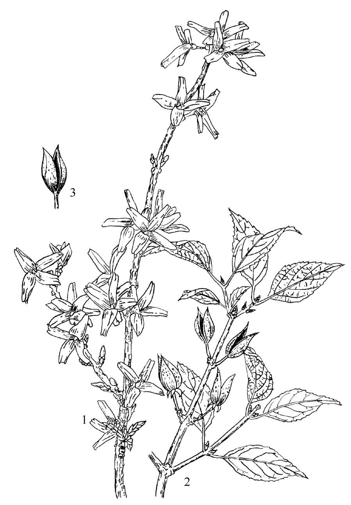
  - 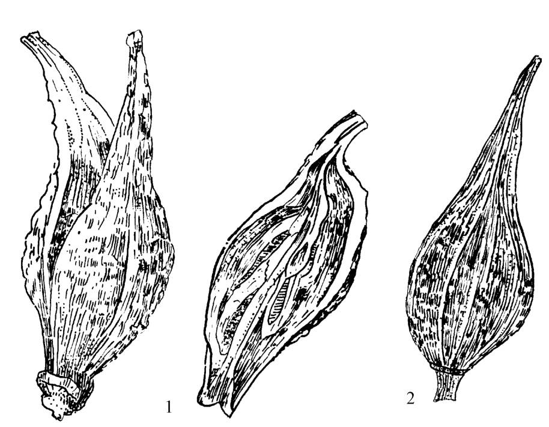
- 显微鉴别：中果皮内侧多列石细胞多切向排列成镶嵌状并延伸至纵隔壁
  - 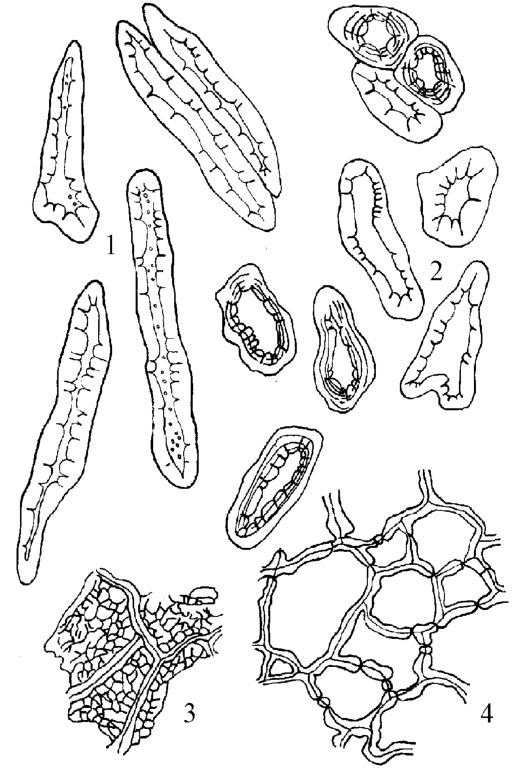
- 成分：连翘酚（抗菌成分）、连翘苷、连翘苷元；连翘酯苷A～E
- 理化鉴别：薄层色谱与连翘对照药材及连翘苷对照品比对
- 含量测定：含连翘苷不得少于0.15%，含连翘酯苷A不得少于0.25%
- 功效：性微寒，味苦。清热解毒，消肿散结，疏散风热
- 附注：连翘心（种子）能清心热；新鲜枝叶含连翘苷

### 女贞子 Ligustri Lucidi Fructus
- 来源：木犀科植物女贞 *Ligustrum lucidum* Ait. 的干燥成熟果实
- 产地：主产浙江、江苏、福建、湖南
- 性状鉴别：卵形、椭圆形或肾形，表面黑紫色或灰黑色皱缩不平；外果皮薄中果皮较松软易剥离内果皮木质具纵棱；种子通常1粒肾形紫黑色油性；气微，味甘、微苦涩
- 成分：齐墩果酸14%；女贞子苷、特女贞苷、齐墩果苷；种子含脂肪油16.9%
- 功效：性凉，味甘、苦。滋补肝肾，明目乌发

### 马钱子 Strychni Semen
- 来源：马钱科植物马钱 *Strychnos nux-vomica* L. 的干燥成熟种子
- 产地：主产印度、越南、泰国
- 采收加工：冬季采收成熟果实，取出种子洗净果肉晒干
- 性状鉴别：纽扣状扁圆形一面隆起另面微凹，表面密被灰棕色或灰绿色绢状茸毛自中央向四周辐射状排列有丝样光泽；边缘有突起珠孔，底面中心有圆点状种脐；剖面可见淡黄白色角质状胚乳，子叶心形有叶脉5～7条；气微，味极苦
  - 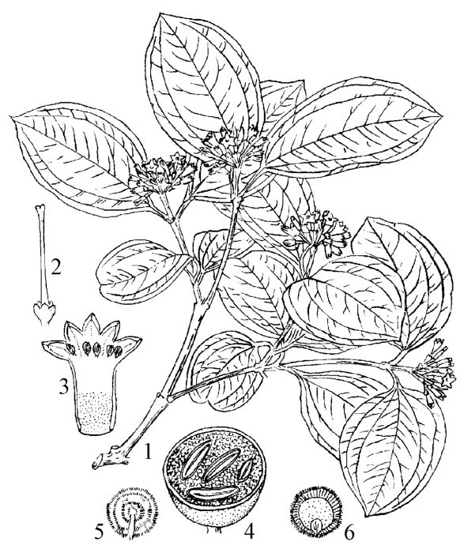
  - 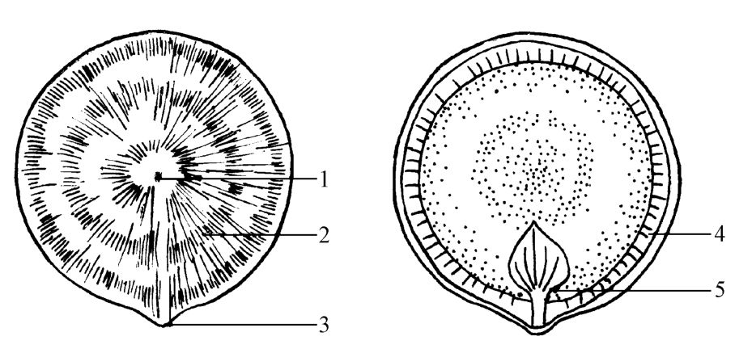
- 显微鉴别：表皮毛茸单细胞强烈木化具纵条纹平直不扭曲毛肋不分散（与云南马钱区别）
  - 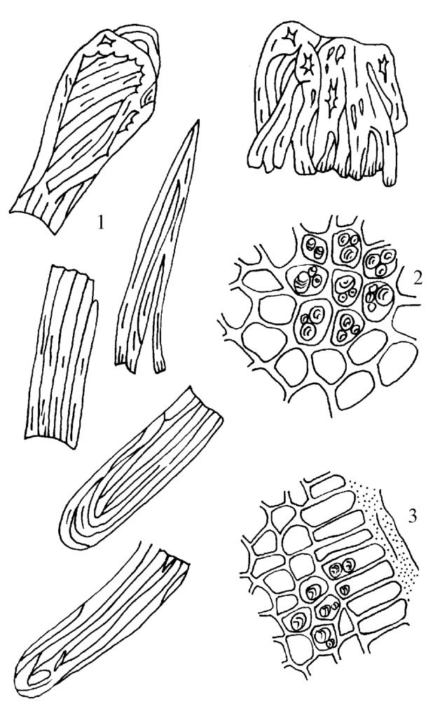
- 成分：总生物碱2%～5%（番木鳖碱/士的宁约占45%、马钱子碱-药效仅为番木鳖碱1/40）
- 理化鉴别：胚乳切片加钒酸铵硫酸溶液显紫色，加发烟硝酸显橙红色；薄层色谱与士的宁和马钱子碱对照品比对
- 含量测定：含士的宁应为1.20%～2.20%，含马钱子碱不得少于0.80%
- 功效：性温，味苦；有大毒。通络止痛，散结消肿
- 附注：云南马钱（曾为1995版药典收载，现非正品，毛茸毛肋常分散）；海南马钱、密花马钱生物碱组成不同；混淆品有山马钱、木鳖种子

### 菟丝子 Cuscutae Semen
- 来源：旋花科植物南方菟丝子 *Cuscuta australis* R.Br. 或菟丝子 *C. chinensis* Lam. 的干燥成熟种子
- 产地：主产江苏、辽宁、吉林、河北
- 性状鉴别：类球形，表面灰棕色或黄棕色具细密突起小点，一端有微凹线形种脐；沸水浸泡表面有黏性，加热煮至种皮破裂露出白色卷旋状胚形如吐丝；气微，味淡
  - 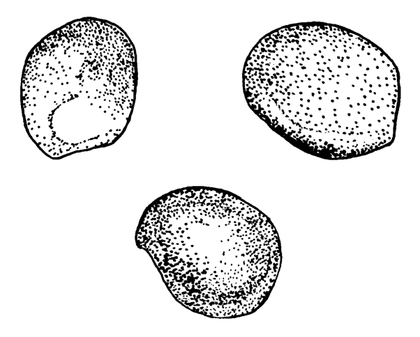
- 显微鉴别：栅状细胞2列外列略短壁木化内列较长壁非木化，外侧近交界处有光辉带
  - 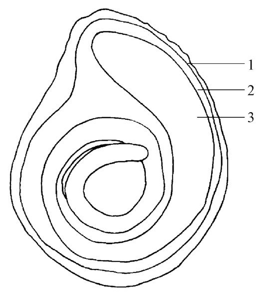
  - 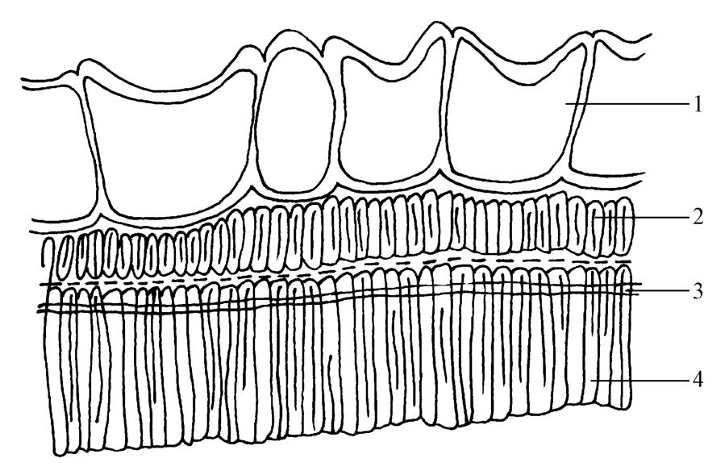
- 成分：胆甾醇、菜油甾醇、β-谷甾醇；黄酮类（槲皮素、紫云英苷、金丝桃苷、菟丝子苷）
- 理化鉴别：聚酰胺薄膜薄层色谱与菟丝子对照药材和金丝桃苷比对
- 含量测定：含金丝桃苷不得少于0.10%
- 功效：性平，味辛、甘。补益肝肾，固精缩尿，安胎，明目，止泻；外用消风祛斑
- 附注：大菟丝子（日本菟丝子）煮之不易破裂味淡；欧洲菟丝子不宜药用；伪品有棉果芝麻菜种子、莨菪子，以及细砂土粉泛制的假货（煮沸不吐丝水混浊）

### 牵牛子 Pharbitidis Semen
- 来源：旋花科植物裂叶牵牛 *Pharbitis nil* (L.) Choisy 或圆叶牵牛 *P. purpurea* (L.) Voigt 的干燥成熟种子
- 产地：主产辽宁，全国各省均有野生或栽培
- 性状鉴别：橘瓣状，表面灰黑色(黑丑)或淡黄白色(白丑)，背面有1条浅纵沟，腹面棱线下端有点状种脐；横切面淡黄色或黄绿色皱缩折叠子叶；水浸后种皮龟裂状黏滑感；味辛、苦，有麻舌感
  - 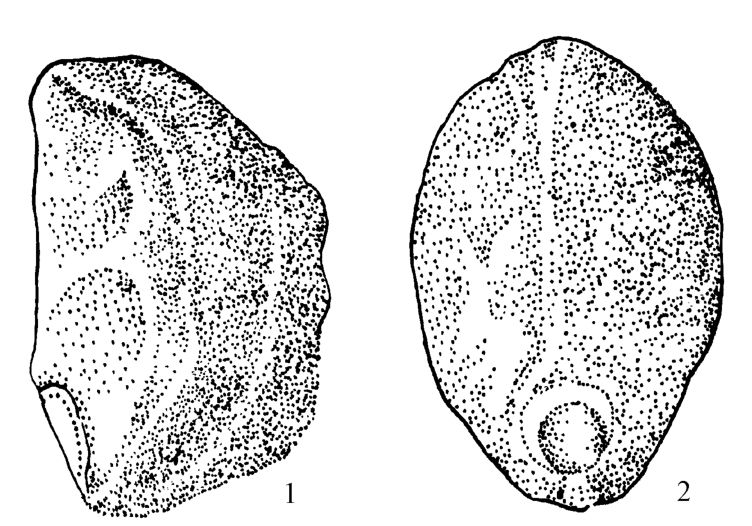
- 显微鉴别：栅状细胞层2～3列外缘有"光辉带"；子叶组织中有多数圆形分泌腔含草酸钙簇晶
  - 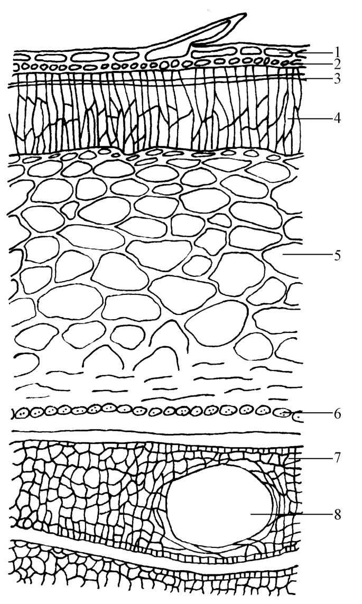
  - 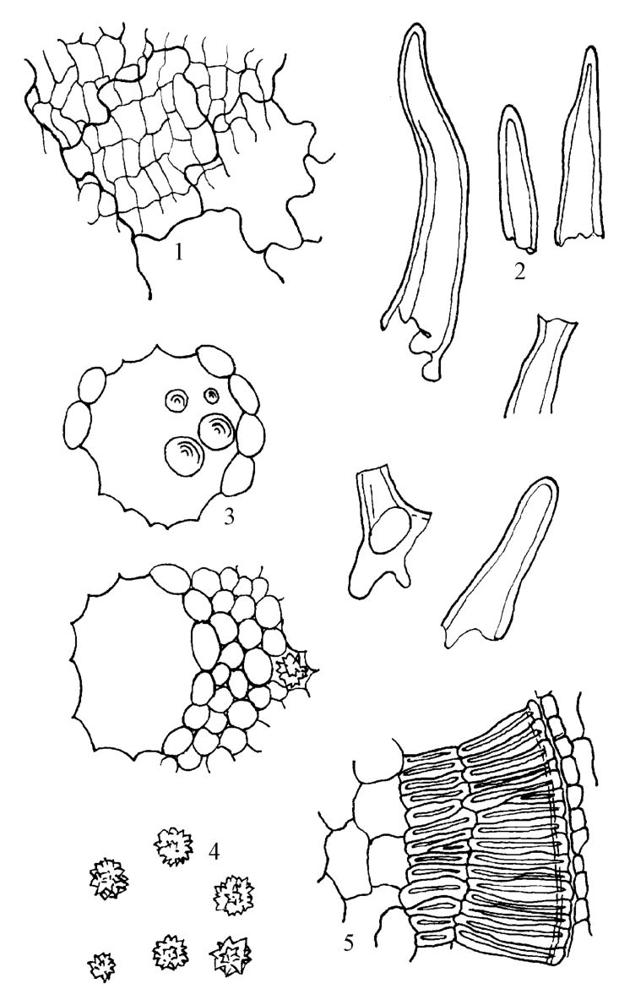
- 成分：牵牛子苷约2%（泻下成分，树脂苷水解生成牵牛子酸）；脂肪油约11%；生物碱（麦角醇等）
- 理化鉴别：薄层色谱与牵牛子对照药材和咖啡酸对照品比对
- 功效：性寒，味苦；有毒。泻水通便，消痰涤饮，杀虫攻积
- 附注：西伯利亚鱼黄草、丁香茄、打碗花、蕹菜的干燥种子曾误作牵牛子，应注意鉴别

### 夏枯草 Prunellae Spica
- 来源：唇形科植物夏枯草 *Prunella vulgaris* L. 的干燥果穗
- 产地：主产江苏、安徽、河南，全国各地均产
- 性状鉴别：圆柱形略扁，淡棕色至棕红色，全穗由数轮至10数轮宿萼与苞片组成，每轮对生苞片2片呈扇形外表面有白毛；每苞片内小坚果4枚卵圆形棕色；体轻，气微，味淡；以摇之作响者为佳
- 显微鉴别：外果皮细胞含棕色物遇水可见膨胀黏液层；内果皮石细胞分枝状相互嵌合
- 成分：夏枯草苷；乌苏酸和齐墩果酸；挥发油（右旋樟脑）；迷迭香酸
- 含量测定：含迷迭香酸不得少于0.20%
- 功效：性寒，味辛、苦。清肝泻火，明目，散结消肿

### 枸杞子 Lycii Fructus
- 来源：茄科植物宁夏枸杞 *Lycium barbarum* L. 的干燥成熟果实
- 产地：主产宁夏、新疆、内蒙古、青海，宁夏中宁和中卫量大质优
- 采收加工：夏秋果实红色时采收，热风烘干或晾至皮皱后晒干，晾晒不宜手翻动以免变黑
- 性状鉴别：类纺锤形或椭圆形，表面红色或暗红色，顶端有小凸起花柱痕，基部有白色果梗痕；果皮柔韧皱缩果肉肉质柔润；种子20～50粒类肾形；气微，味甜，嚼之唾液呈红黄色
  - 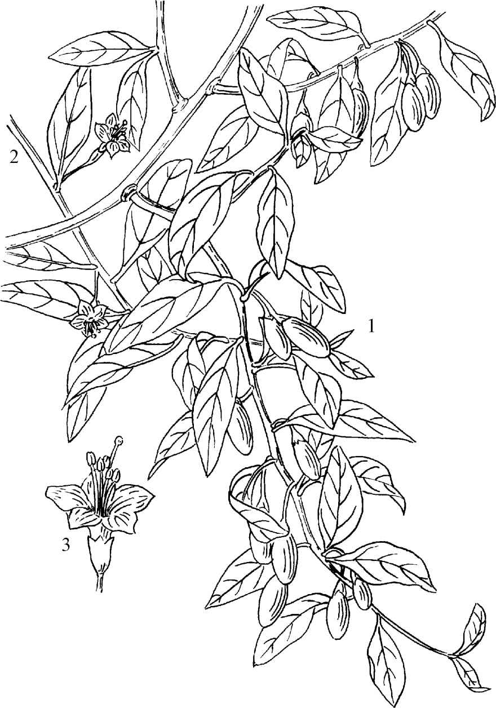
  - 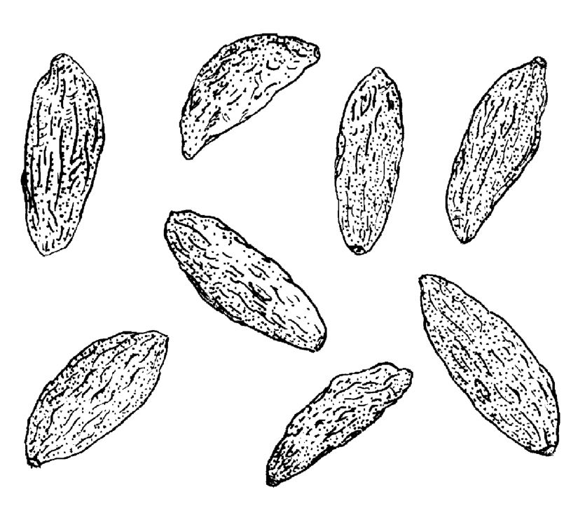
- 显微鉴别：中果皮薄壁细胞胞腔含红棕色或橙红色球形颗粒；种皮石细胞垂周壁深波状或微波状弯曲
  - 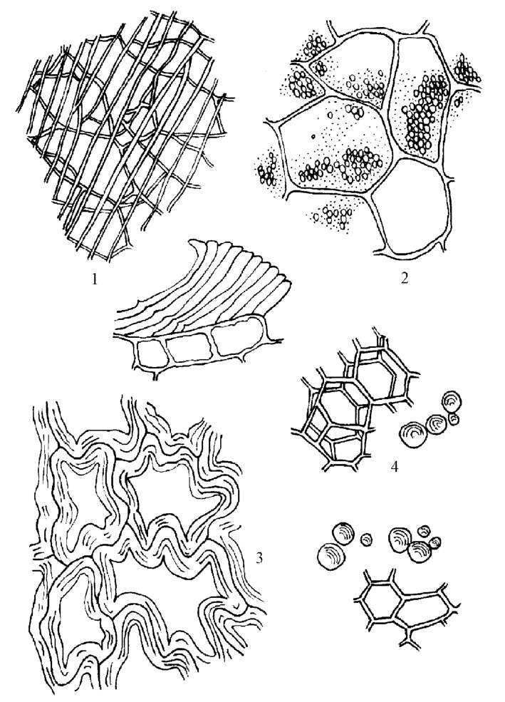
- 成分：甜菜碱约0.091%；胡萝卜素、玉蜀黄素；枸杞多糖
- 理化鉴别：薄层色谱与枸杞子对照药材比对
- 含量测定：含甜菜碱不得少于0.30%；含枸杞多糖（以葡萄糖计）不得少于1.8%
- 功效：性平，味甘。滋补肝肾，益精明目
- 附注：枸杞（土枸杞子）质量较次；甘枸杞（土库曼枸杞等）粒小无光泽，应注意鉴别

### 栀子 Gardeniae Fructus
- 来源：茜草科植物栀子 *Gardenia jasminoides* Ellis 的干燥成熟果实
- 产地：主产湖南、江西、湖北、浙江
- 采收加工：9～11月采摘红黄色成熟果实，蒸至上气或沸水略烫后干燥
- 性状鉴别：长卵圆形或椭圆形，表面红黄色或棕红色具6条翅状纵棱，棱间有明显纵脉纹；内表面具2～3条隆起假隔膜；种子多数扁卵圆形集结成团深红色或红黄色表面密具细小疣状突起；气微，味微酸而苦
  - 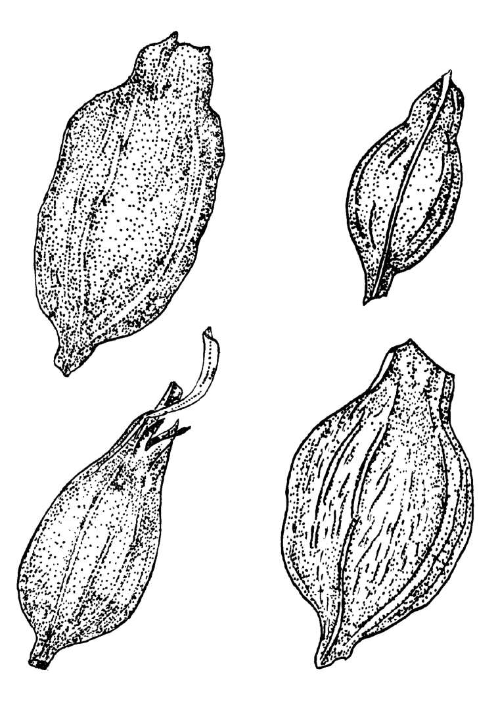
- 显微鉴别：内果皮纤维细长梭形常交错斜向镶嵌状排列；含晶石细胞胞腔含草酸钙方晶；种皮石细胞纹孔甚大
  - 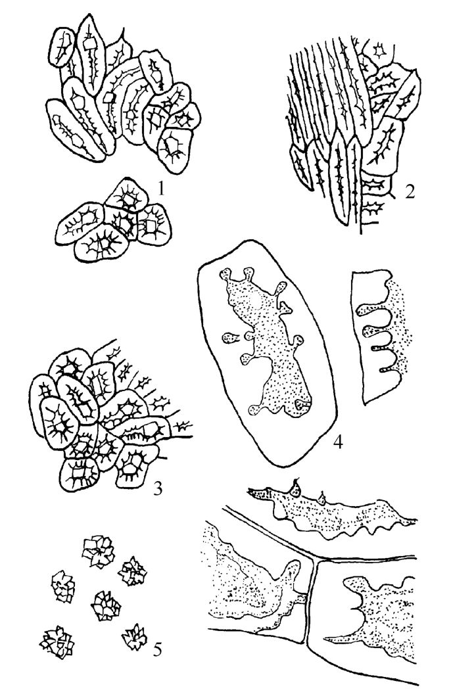
- 成分：环烯醚萜苷类（栀子苷、羟异栀子苷、栀子新苷）；黄酮类（栀子素）；藏红花素、藏红花酸
- 理化鉴别：薄层色谱与栀子对照药材和栀子苷对照品比对
- 含量测定：含栀子苷不得少于1.8%
- 功效：性寒，味苦。泻火除烦，清热利湿，凉血解毒；外用消肿止痛
- 附注：水栀子（大花栀子）非内服正品，主为染料供工业用

### 瓜蒌 Trichosanthis Fructus（附：瓜蒌皮、瓜蒌子）
- 来源：葫芦科植物栝楼 *Trichosanthes kirilowii* Maxim. 或双边栝楼 *T. rosthornii* Harms 的干燥成熟果实
- 产地：栝楼主产山东长清、肥城；双边栝楼主产江西、湖北、湖南
- 性状鉴别：类球形或宽椭圆形，表面橙红色或橙黄色皱缩或较光滑，内表面黄白色有红黄色丝络，果瓤橙黄色黏稠与多数种子黏结成团；具焦糖气，味微酸、甜；分"仁瓜蒌"（果皮厚有纵棱）和"糖瓜蒌"（果皮薄无纵棱）
  - 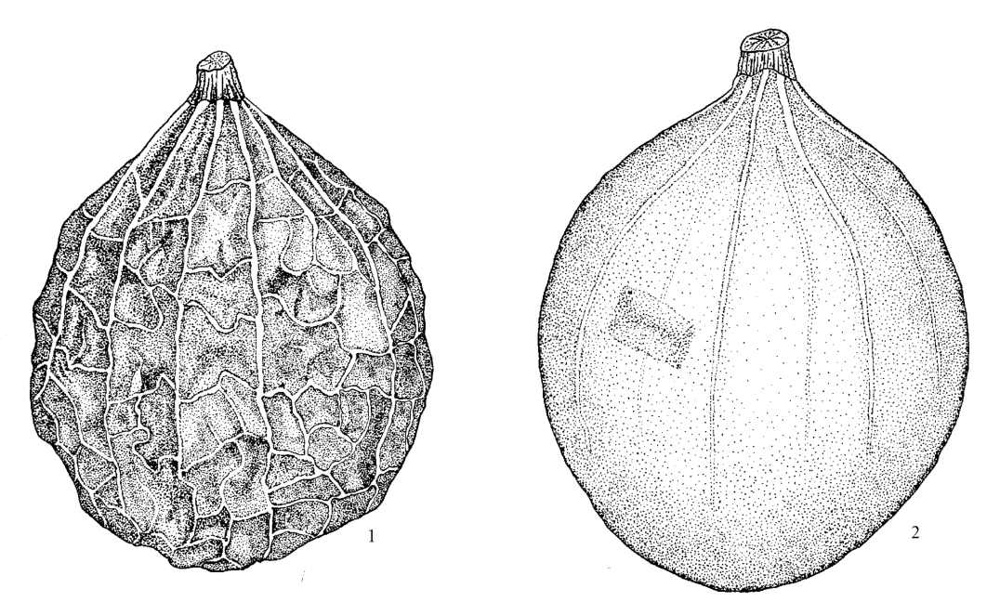
- 显微鉴别：石细胞环由数列石细胞组成；薄壁组织散有多数双韧型维管束
  - 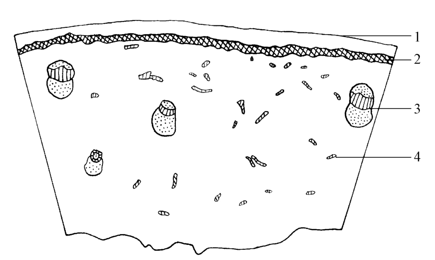
- 成分：三萜皂苷（栝楼仁二醇）；种子脂肪油约26%（栝楼酸为主）
- 功效：性寒，味甘、微苦。清热涤痰，宽胸散结，润燥滑肠
- 附注：王瓜果实（种子"带子缠腰"）混充瓜蒌；湖北栝楼果实毒性大不宜用
- 【附】瓜蒌皮：栝楼或双边栝楼的干燥成熟果皮，性寒味甘，清化热痰利气宽胸；大子栝楼、南方栝楼的果皮亦混作瓜蒌皮
- 【附】瓜蒌子：栝楼及双边栝楼的干燥成熟种子，性寒味甘，润肺化痰滑肠通便

### 车前子 Plantaginis Semen（附：车前草）
- 来源：车前科植物车前 *Plantago asiatica* L. 或平车前 *P. depressa* Willd. 的干燥成熟种子
- 产地：车前产于全国各地；平车前产于东北、华北、西北
- 性状鉴别：椭圆形、不规则长圆形或三角状长圆形略扁，表面黄棕色至黑褐色有细皱纹，一面有灰白色凹点状种脐；质硬，气微，味淡
- 显微鉴别：种皮外表皮细胞壁黏液质化；内胚乳细胞壁甚厚充满细小糊粉粒
  - 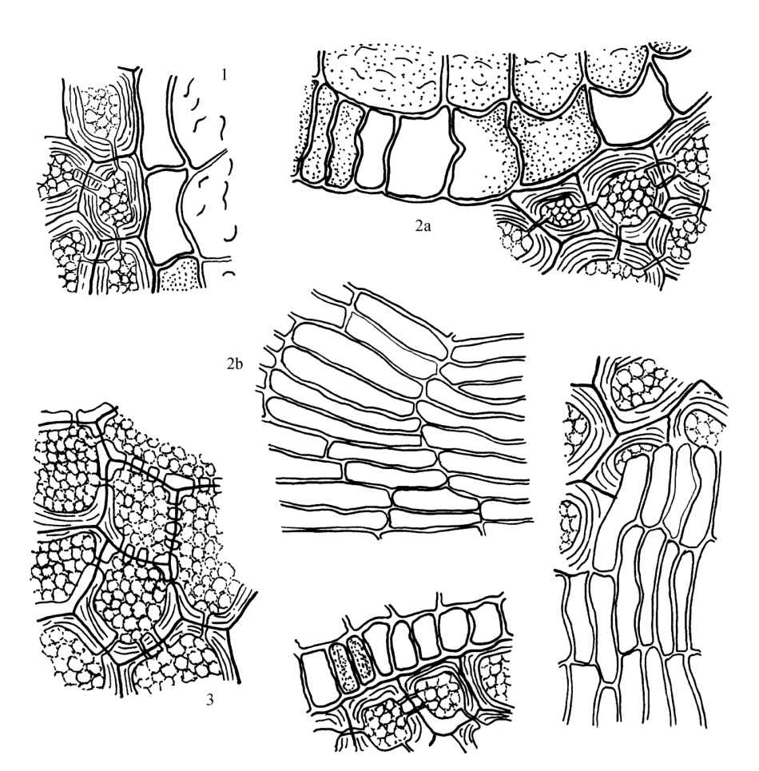
- 成分：车前黏液A（酸性多糖衍生物）；毛蕊花糖苷、京尼平苷酸；脂肪油10.43%
- 理化鉴别：薄层色谱与京尼平苷酸和毛蕊花糖苷对照品比对
- 含量测定：含京尼平苷酸不得少于0.50%，含毛蕊花糖苷不得少于0.40%；膨胀度不低于4.0
- 功效：性寒，味甘。清热利尿通淋，渗湿止泻，明目，祛痰
- 【附】车前草：车前或平车前的干燥全草，含车前苷、桃叶珊瑚苷，性寒味甘，清热利尿通淋祛痰凉血解毒

### 牛蒡子 Arctii Fructus
- 来源：菊科植物牛蒡 *Arctium lappa* L. 的干燥成熟果实
- 产地：主产东北及浙江，四川、湖北、河北、河南亦产
- 性状鉴别：长倒卵形略扁微弯曲，表面灰褐色散有紫黑色斑点具纵棱数条，顶端钝圆具圆环中间点状花柱残迹；果皮较硬子叶2淡黄白色富油性；气微，味苦后微辛而稍麻舌
  - 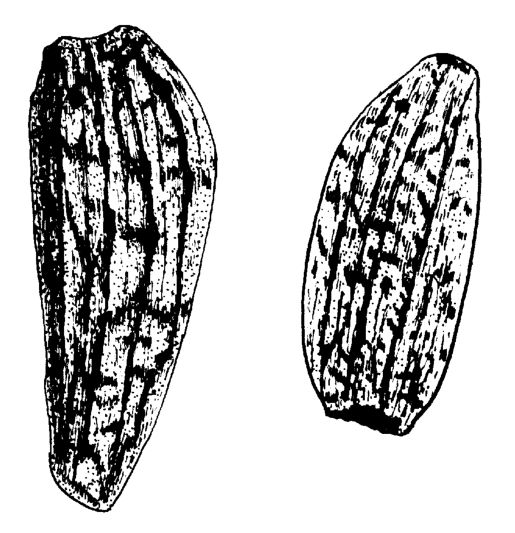
- 显微鉴别：内果皮石细胞镶嵌紧密纹孔横长；草酸钙方晶成片存在于黄色中果皮薄壁细胞中
  - 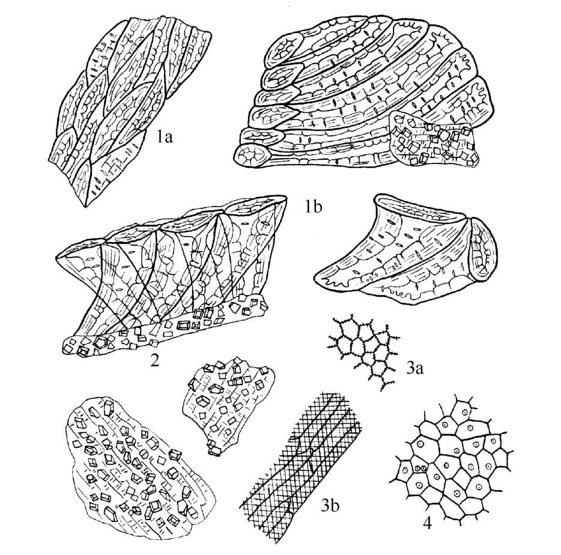
- 成分：牛蒡苷、牛蒡苷元；脂肪油25%～30%；牛蒡酚A～F
- 理化鉴别：薄层色谱与牛蒡子对照药材和牛蒡子苷对照品比对
- 含量测定：含牛蒡苷不得少于5.0%
- 功效：性寒，味辛、苦。疏散风热，宣肺透疹，解毒利咽
- 附注：大鳍蓟果实（"花牛子"）有时伪充牛蒡子，应注意鉴别

### 薏苡仁 Coicis Semen
- 来源：禾本科植物薏苡 *Coix lacryma-jobi* var. *mayuen* (Roman.) Stapf 的干燥成熟种仁
- 产地：主产河北、福建、辽宁，其他各省亦产，均系栽培
- 性状鉴别：宽卵形或长椭圆形，表面乳白色光滑，一端钝圆另端较宽而微凹有1淡棕色点状种脐，背面圆凸腹面有1条较宽而深纵沟；质坚实断面白色粉性；气微，味微甜
- 显微鉴别：淀粉粒极多单粒类圆形或多面形脐点星状，遇碘试液显棕红色
- 成分：薏苡仁酯、薏苡素、薏苡多糖A/B/C；亚油酸、棕榈酸
- 功效：性凉，味甘、淡。利水渗湿，健脾止泻，除痹，排脓，解毒散结

### 槟榔 Arecae Semen（附：大腹皮）
- 来源：棕榈科植物槟榔 *Areca catechu* L. 的干燥成熟种子
- 产地：主产海南、云南、广东，福建、广西、台湾南部亦有栽培
- 采收加工：春末至秋初采收成熟果实，水煮后干燥剥去果皮取出种子干燥
- 性状鉴别：扁球形或圆锥形，表面淡黄棕色或淡红棕色具稍凹下网状沟纹，底部中心有圆形凹陷珠孔旁边有明显疤痕状种脐；断面棕色种皮与白色胚乳相间大理石样花纹；质坚硬；气微，味涩、微苦
  - 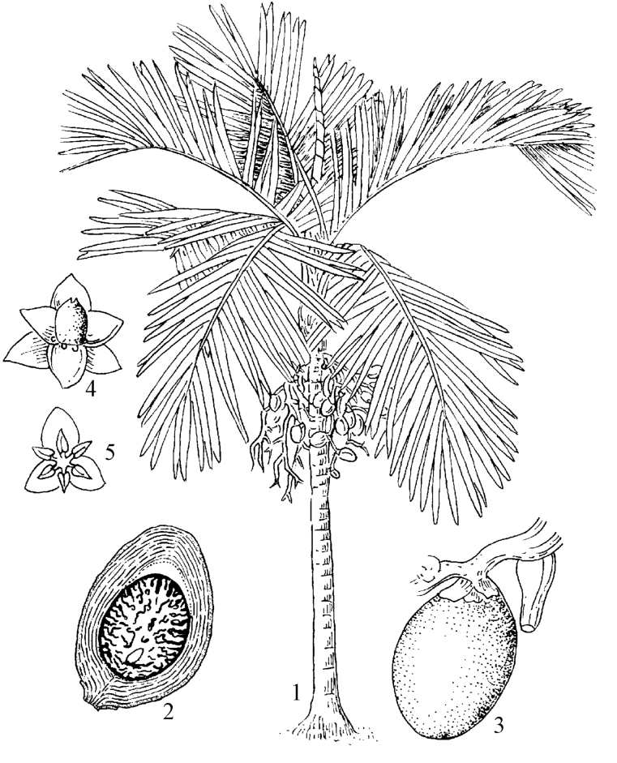
- 显微鉴别：种皮外层数列切向延长扁平石细胞内含红棕色物；种皮内层与外胚乳折合层不规则插入内胚乳形成错入组织
  - 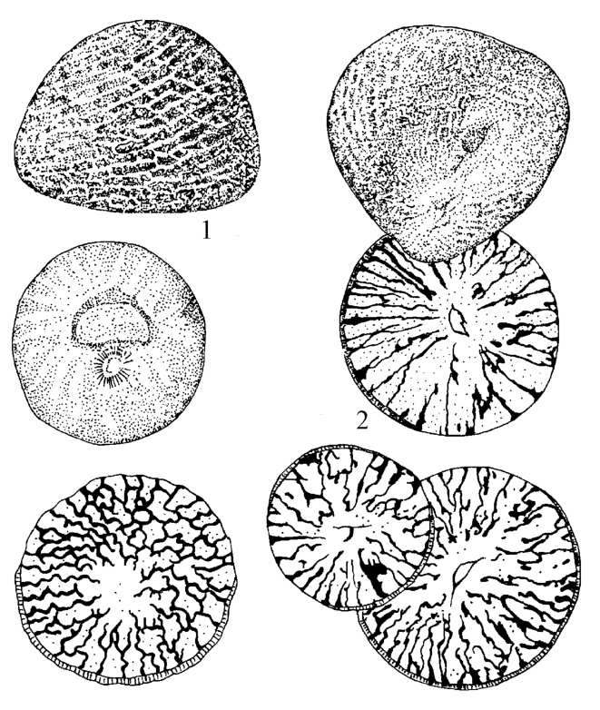
  - 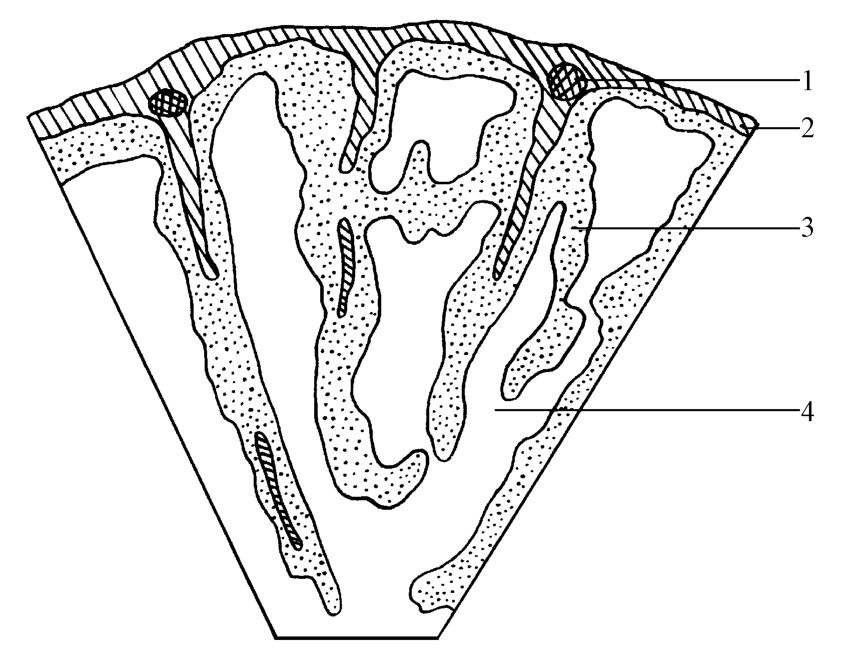
  - 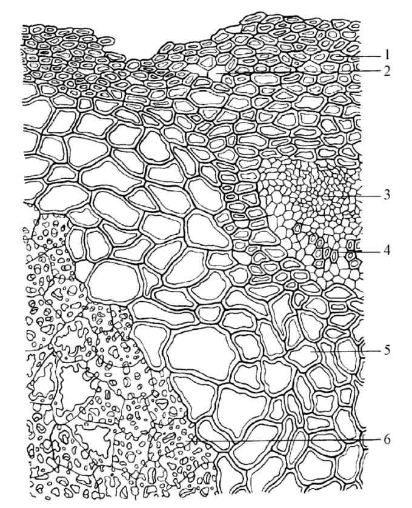
  - 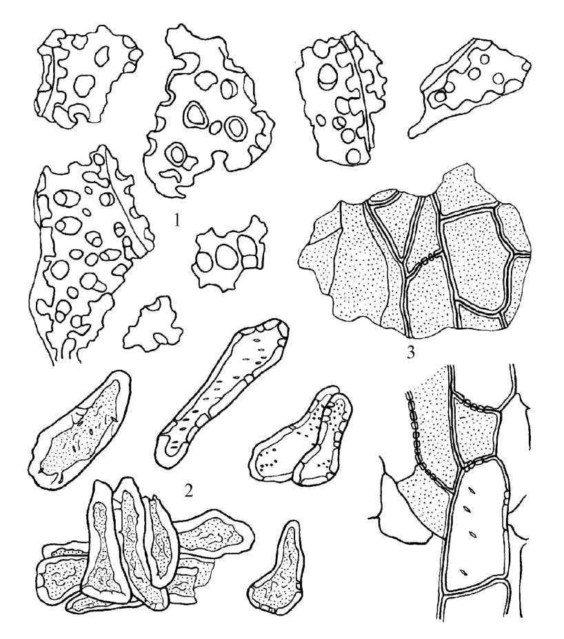
- 成分：总生物碱0.3%～0.7%（槟榔碱含量最高为有效成分）；鞣质约15%；脂肪油14%～18%
- 理化鉴别：滤液加碘化铋钾试液显石榴红色球晶或方晶（检查槟榔碱）；薄层色谱与槟榔对照药材及氢溴酸槟榔碱对照品比对
- 含量测定：含槟榔碱不得少于0.20%
- 功效：性温，味苦、辛。杀虫，消积，行气，利水，截疟
- 附注：枣儿槟为未成熟槟榔种子，药效较缓和
- 【附】大腹皮：槟榔的干燥果皮，未成熟果实加工称"大腹皮"，成熟果实加工打松称"大腹毛"，性微温味辛，行气宽中行水消肿；广东海南有用佛焰苞状总苞片"大腹胎"

### 砂仁 Amomi Fructus
- 来源：姜科植物阳春砂 *Amomum villosum* Lour.、绿壳砂 *A. villosum* var. *xanthioides* T.L.Wu et Senjen 或海南砂 *A. longiligulare* T.L.Wu 的干燥成熟果实
- 产地：阳春砂主产广东阳春、阳江；绿壳砂主产云南临沧、文山、景洪；海南砂主产海南
- 采收加工：夏秋果实成熟时采收，阳春砂海南砂连壳低温干燥；绿壳砂连壳晒干称"壳砂"，剥皮种子团上白粉称"砂仁"
- 性状鉴别：阳春砂绿壳砂呈椭圆形或卵圆形有不明显三棱，表面棕褐色密生刺状突起，种子团具三钝棱中有白色隔膜分成3瓣；海南砂有明显三棱表面被片状分枝状软刺；种子棕红色或暗褐色有细皱纹；气芳香而浓烈，味辛凉、微苦
  - 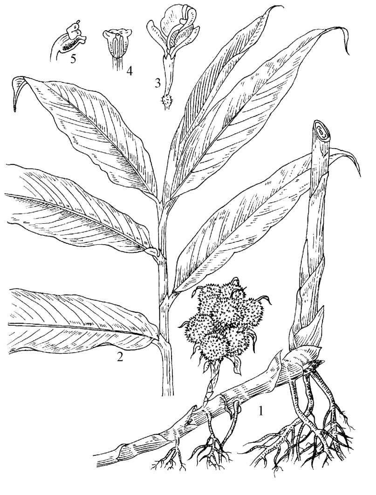
  - 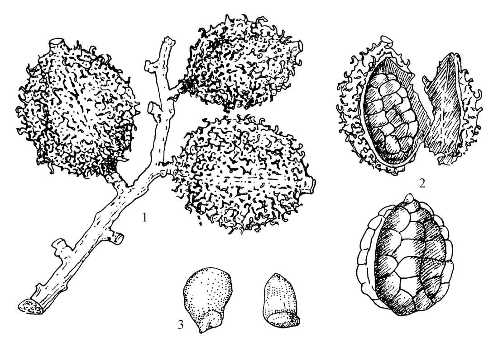
- 显微鉴别：内种皮为1列栅状厚壁细胞内含硅质块；油细胞层1列含黄色油滴
  - 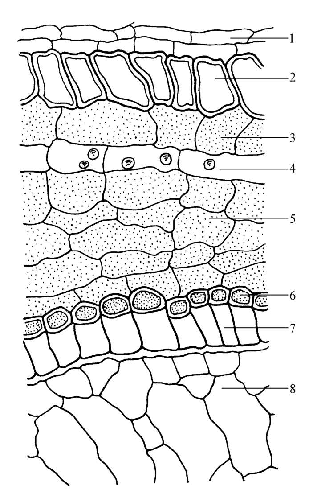
  - 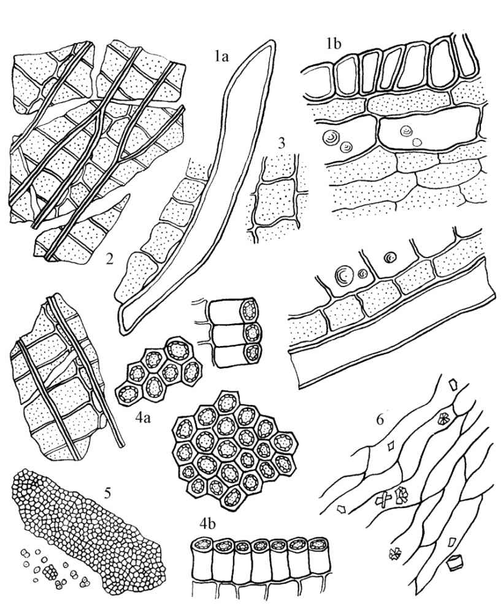
- 成分：挥发油3%以上（乙酸龙脑酯、芳樟醇、橙花叔醇）；皂苷约0.69%
- 理化鉴别：薄层色谱与乙酸龙脑酯对照品比对
- 含量测定：阳春砂绿壳砂含挥发油不得少于3.0%(mL/g)，海南砂不得少于1.0%(mL/g)；含乙酸龙脑酯不得少于0.90%
- 功效：性温，味辛。化湿开胃，温脾止泻，理气安胎
- 附注：进口砂仁原植物与绿壳砂一致；红壳砂仁及山姜属"土砂仁/建砂仁/川砂仁"均不宜代用

### 草果 Tsaoko Fructus
- 来源：姜科植物草果 *Amomum tsao-ko* Crevost et Lemaire 的干燥成熟果实
- 产地：主产云南、广西、贵州，多为栽培
- 性状鉴别：长椭圆形具三钝棱，表面灰棕色至红棕色有纵沟及棱线，顶端圆形突起柱基；果皮质坚韧易纵向撕裂；种子团3瓣每瓣种子8～11粒，种子圆锥状多面体表面红棕色外被灰白色膜质假种皮；具特异香气，味辛、微苦
- 成分：挥发油（1,8-桉油精约33.94%、牻牛儿醛）
- 含量测定：种子团含挥发油不得少于1.4%(mL/g)
- 功效：性温，味辛。燥湿温中，截疟除痰

### 豆蔻 Amomi Fructus Rotundus
- 来源：姜科植物白豆蔻 *Amomum kravanh* Pierre ex Gagnep. 或爪哇白豆蔻 *A. compactum* Soland ex Maton 的干燥成熟果实，按产地分"原豆蔻"和"印尼白蔻"
- 产地：白豆蔻由柬埔寨、泰国、越南、缅甸进口，海南、云南南部有少量栽培；爪哇白豆蔻多由印度尼西亚进口
- 性状鉴别：原豆蔻类球形表面黄白色至淡黄棕色有3条较深纵向槽纹，果皮薄体轻质脆易纵向裂开，种子不规则多面体暗棕色有皱纹；印尼白蔻个略小种子瘦瘪气味较弱；气芳香，味辛凉略似樟脑
  - 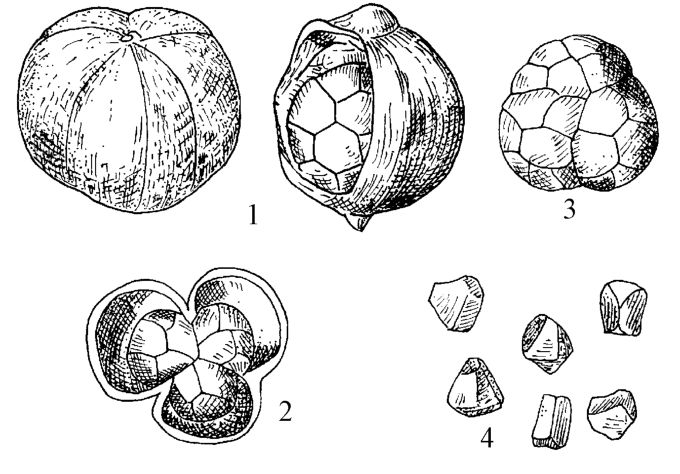
- 显微鉴别：内种皮为1列石细胞内壁及侧壁极厚胞腔偏外侧；油细胞层1列类方形含油滴
  - 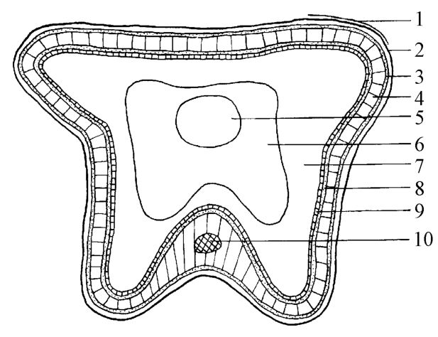
  - 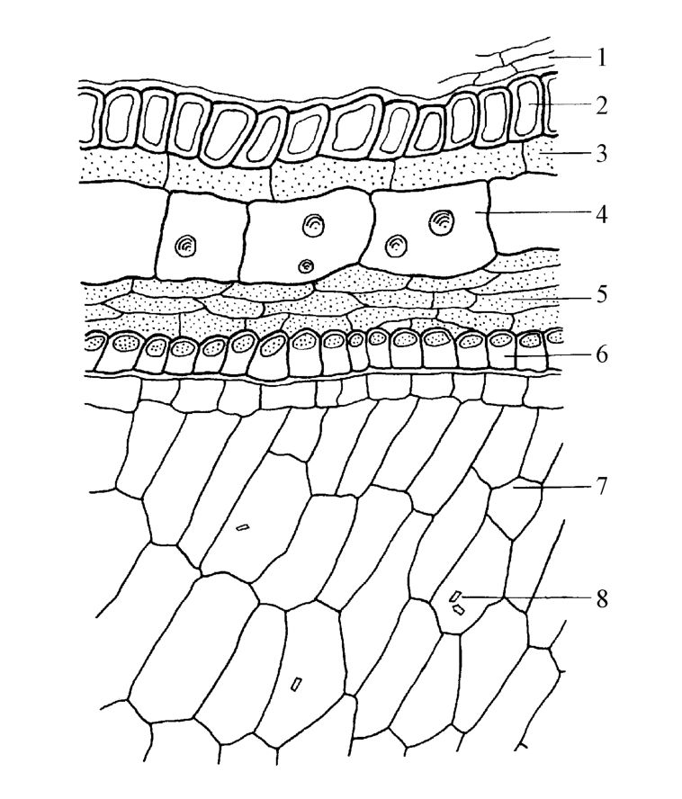
  - 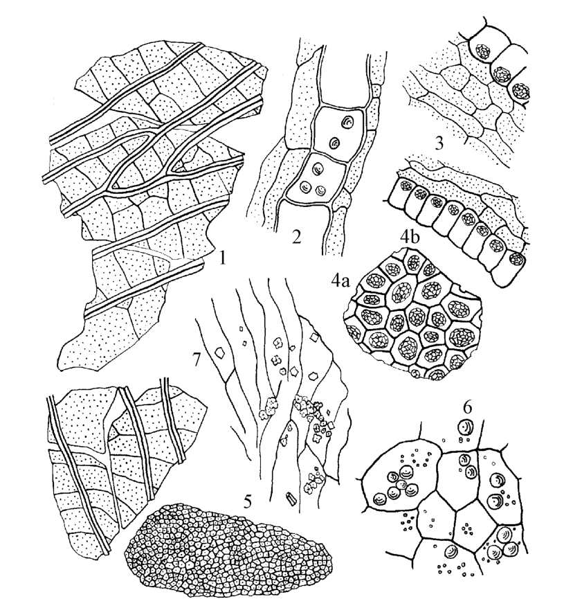
- 成分：挥发油（原豆蔻含1,8-桉油精为主；印尼白蔻含1,8-桉油精、葛缕酮、α-松油醇）
- 理化鉴别：薄层色谱与桉油精对照品比对
- 含量测定：原豆蔻仁含挥发油不得少于5.0%(mL/g)，印尼白蔻仁不得少于4.0%(mL/g)；含桉油精不得少于3.0%
- 功效：性温，味辛。化湿行气，温中止呕，开胃消食

### 红豆蔻 Galangae Fructus
- 来源：姜科植物大高良姜 *Alpinia galanga* Willd. 的干燥成熟果实
- 产地：主产广东、广西、海南、云南，马来西亚、印度等国也有分布
- 性状鉴别：长球形中部略细，表面红棕色或暗红色略皱缩，顶端有黄白色管状宿萼；种子6扁圆形或三角状多面体形黑棕色或红棕色外被黄白色膜质假种皮；气香，味辛辣
- 显微鉴别：内种皮为1列栅状厚壁细胞内壁及靠内方侧壁极厚胞腔偏外侧含硅胶块
- 成分：挥发油（1'-乙酰氧基胡椒酚乙酸酯、金合欢醇）；槲皮素、高良姜素
- 含量测定：种子含挥发油不得少于0.40%(mL/g)
- 功效：性温，味辛。散寒燥湿，醒脾消食

### 草豆蔻 Alpiniae Katsumadai Semen
- 来源：姜科植物草豆蔻 *Alpinia katsumadai* Hayata 的干燥近成熟种子
- 产地：主产广东、广西
- 性状鉴别：种子团类球形，表面灰褐色略光滑，中间黄白色隔膜分成3瓣；种子卵圆状多面体形外被淡棕色膜质假种皮，种脊为一条纵沟；质硬纵剖面呈斜心形；胚乳灰白色；气香，味辛、微苦
- 显微鉴别：内种皮厚壁细胞断面观1列栅状内壁及侧壁极厚胞腔偏外侧含硅质块
- 成分：挥发油约4%（1,8-桉油精、α-蛇麻烯）；山姜素、小豆蔻明
- 含量测定：含挥发油不得少于1.0%(mL/g)；含山姜素、乔松素和小豆蔻明总量不得少于1.35%，含桤木酮不得少于0.50%
- 功效：性温，味辛。燥湿行气，温中止呕

### 益智 Alpiniae Oxyphyllae Fructus
- 来源：姜科植物益智 *Alpinia oxyphylla* Miq. 的干燥成熟果实
- 产地：主产海南山区，广东雷州半岛、广西亦产
- 性状鉴别：椭圆形两端略尖，表面棕色或灰棕色有纵向凹凸不平突起棱线13～20条；种子团中央隔膜分3瓣每瓣种子6～11粒，种子不规则扁圆形表面灰褐色或灰黄色外被淡棕色膜质假种皮；具特异香气，味辛、微苦
- 显微鉴别：内种皮厚壁细胞断面观1列栅状内壁和侧壁极厚胞腔偏外侧含硅质块
- 成分：挥发油约0.7%（桉油精、圆柚酮、姜烯、姜醇）
- 含量测定：种子含挥发油不得少于1.0%(mL/g)
- 功效：性温，味辛。暖肾固精缩尿，温脾止泻摄唾
