---
markmap:
  colorFreezeLevel: 2
  initialExpandLevel: 1
---

# 第十一章 全草类中药
- 全草(herba)类中药又称草类中药材：用植物全体的一类中药，大多为干燥草本植物地上部分（广藿香、益母草），亦有少数带根或根茎（蒲公英）、小灌木草质茎（麻黄）、常绿寄生小灌木（槲寄生），均列入全草类

## 第一节 概述

### 一、性状鉴别
- 应按所包括的根、茎、叶、花、果实、种子等器官分别处理，依靠原植物形态与植物分类的鉴定更为重要，但要注意颜色和形状的改变情况

### 二、显微鉴别
- 双子叶植物草质茎组织构造从外向内分表皮、皮层、维管柱三部分：①表皮注意毛茸气孔角质层蜡被；②皮层薄壁细胞大壁薄排列疏松嫩茎呈绿色，注意有无纤维石细胞分泌组织；③维管柱占较大比例，束间区域宽呈环状排列，髓部发达
- 单子叶植物草质茎：最外表皮，向内基本薄壁组织散布多数有限外韧型维管束，无皮层和髓及髓射线之分
- 全草类粉末鉴别应注意：保护组织及毛茸、气孔轴式、叶肉组织、机械组织、厚壁组织、分泌组织、后含物（草酸钙/碳酸钙晶体/淀粉粒）及带花药材花粉粒等

## 第二节 药材（饮片）鉴定

### 麻黄 Ephedrae Herba（附：麻黄根）
- 来源：麻黄科植物草麻黄 *Ephedra sinica* Stapf、中麻黄 *E. intermedia* Schrenk et C.A.Mey. 或木贼麻黄 *E. equisetina* Bge. 的干燥草质茎
- 产地：主产内蒙古、山西、陕西、宁夏
- 采收加工：秋季采割绿色草质茎晒干
- 性状鉴别：草麻黄细长圆柱形少分枝，表面淡绿色至黄绿色有细纵脊线触之微粗糙，节上膜质鳞叶裂片2先端灰白色反曲；断面髓部红棕色近圆形；中麻黄裂片3断面髓部三角状圆形；木贼麻黄无粗糙感裂片2先端不反曲；气微香，味涩、微苦
  - 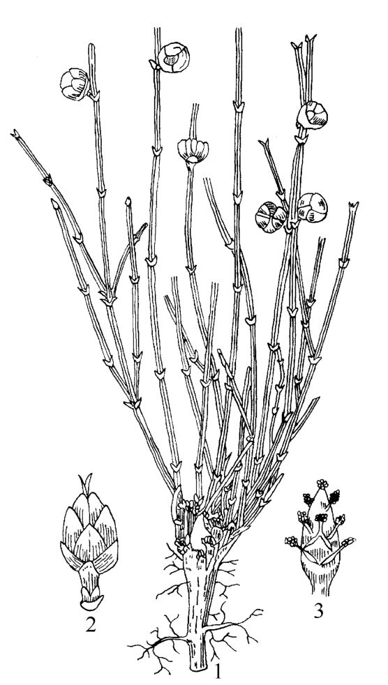
- 显微鉴别：草麻黄维管束外韧型8～10个，形成层环类圆形，髓部薄壁细胞含棕色块；中麻黄维管束12～15个形成层环类三角形有环髓纤维；木贼麻黄维管束8～10个无环髓纤维
  - 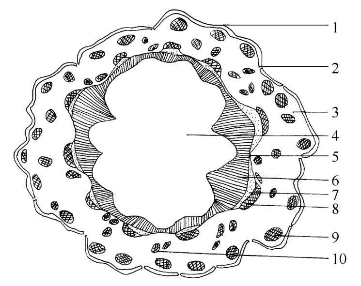
  - 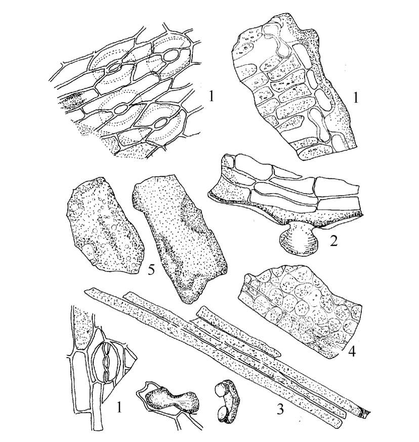
- 成分：生物碱约1.315%（左旋麻黄碱、右旋伪麻黄碱为主要有效成分）；木贼麻黄生物碱含量最高1.02%～3.33%；中麻黄含量最低0.25%～0.89%
- 理化鉴别：粉末提取液加氨制氯化铜及二硫化碳显深黄色；纵剖面紫外灯下边缘显亮白色荧光中心显亮棕色荧光；薄层色谱与盐酸麻黄碱对照品比对
- 含量测定：含盐酸麻黄碱和盐酸伪麻黄碱总量不得少于0.80%
- 功效：性温，味辛、微苦。发汗散寒，宣肺平喘，利水消肿
- 【附】麻黄根：草麻黄或中麻黄的干燥根和根茎，功效与麻黄相反有止汗作用，含麻黄考宁（弱降压）及麻黄新碱A/B/C（显著降压）

### 槲寄生 Visci Herba（附：桑寄生）
- 来源：桑寄生科植物槲寄生 *Viscum coloratum* (Komar.) Nakai 的干燥带叶茎枝
- 产地：主产东北、华北，陕西、甘肃、山东、河南亦产
- 采收加工：冬季至次春采割，除去粗茎切段干燥
- 性状鉴别：茎枝圆柱形2～5叉状分枝，表面黄绿色、金黄色或黄棕色有纵皱纹节膨大；断面皮部黄色木部色浅射线放射状髓部偏向一边；叶对生长椭圆状披针形革质主脉5出；气微，味微苦，嚼之有黏性
  - 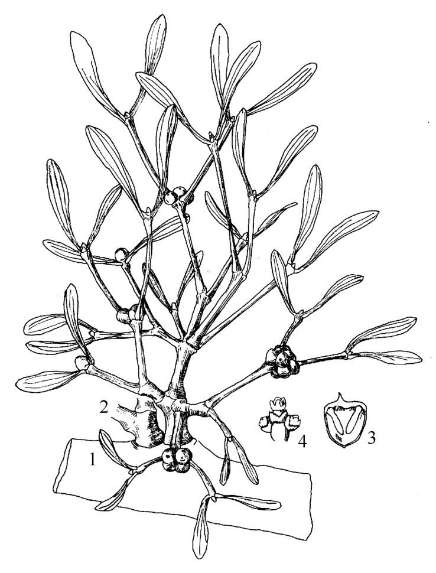
- 显微鉴别：老茎石细胞甚多；薄壁细胞含草酸钙簇晶及少数方晶
  - 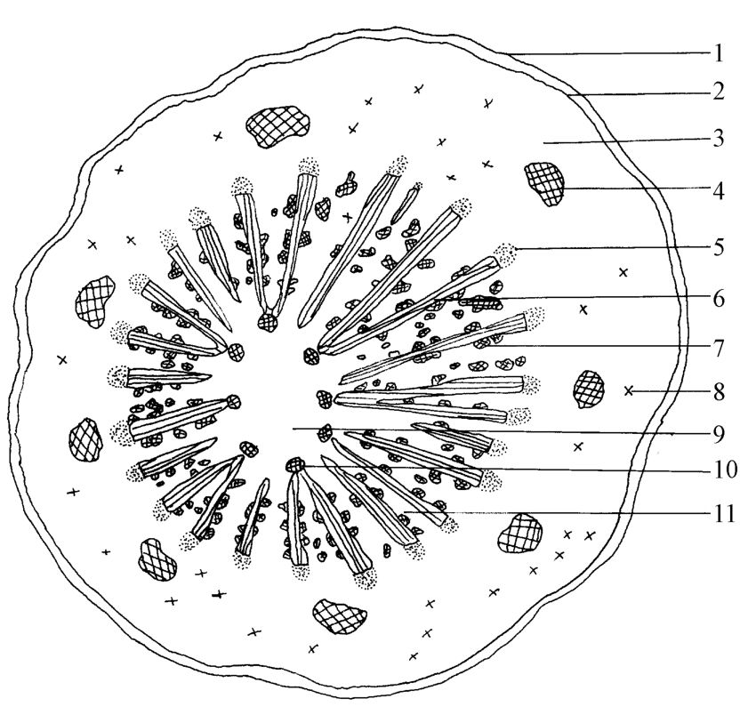
  - 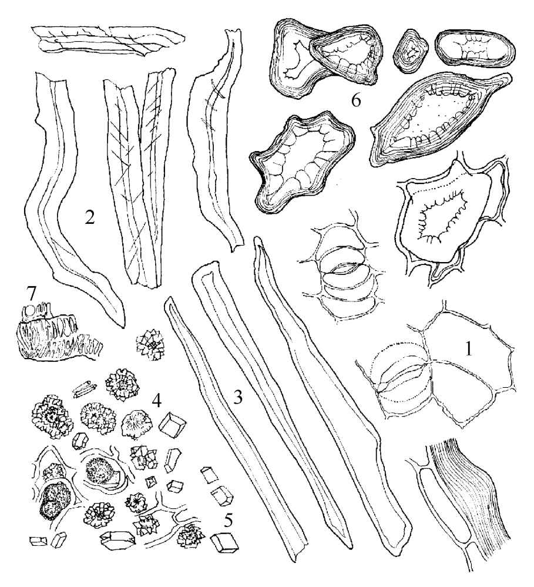
- 成分：三萜类（齐墩果酸）；黄酮类（槲寄生新苷Ⅰ～Ⅶ）；紫丁香苷（总苷有抗血小板聚集作用，多糖及总生物碱有抗肿瘤活性）
- 理化鉴别：薄层色谱与槲寄生对照药材及齐墩果酸对照品比对
- 含量测定：含紫丁香苷不得少于0.040%；饮片不得少于0.025%
- 功效：性平，味苦。祛风湿，补肝肾，强筋骨，安胎元
- 【附】桑寄生：桑寄生科植物桑寄生的干燥带叶茎枝，含槲皮素及萹蓄苷，性平味苦甘，功效同槲寄生

### 仙鹤草 Agrimoniae Herba
- 来源：蔷薇科植物龙芽草 *Agrimonia pilosa* Ledeb. 的干燥地上部分
- 产地：主产浙江、江苏、湖北，全国大部分地区亦产
- 性状鉴别：全体被白色柔毛，茎下部圆柱形红棕色上部方柱形绿褐色有纵沟及棱线节明显；单数羽状复叶互生暗绿色皱缩卷曲，叶片大小两种相间生于叶轴上；总状花序，花萼下部筒状萼筒上部有钩刺；气微，味微苦
- 显微鉴别：栅栏组织2列不通过中脉；草酸钙簇晶甚多；非腺毛单细胞具疣状突起
- 成分：仙鹤草酚A～G（间苯三酚缩合体类）；黄酮类；鞣质、仙鹤草内酯；仙鹤草素甲乙丙
- 功效：性平，味苦、涩。收敛止血，截疟，止痢，解毒，补虚
- 附注：鹤草芽（仙鹤草鲜根茎上的芽）含鹤草酚为驱绦虫有效成分，遇热失效不宜煎服宜粉末冲服

### 紫花地丁 Violae Herba（附：甜地丁、苦地丁）
- 来源：堇菜科植物紫花地丁 *Viola yedoensis* Makino 的干燥全草
- 产地：主产江苏、浙江、西北及东北
- 性状鉴别：多皱缩成团，主根长圆锥形淡黄棕色有细纵皱纹；叶基生灰绿色披针形或卵状披针形叶柄具明显狭翅；花瓣5紫堇色花距细管状；蒴果椭圆形或3裂；气微，味微苦，稍黏
  - 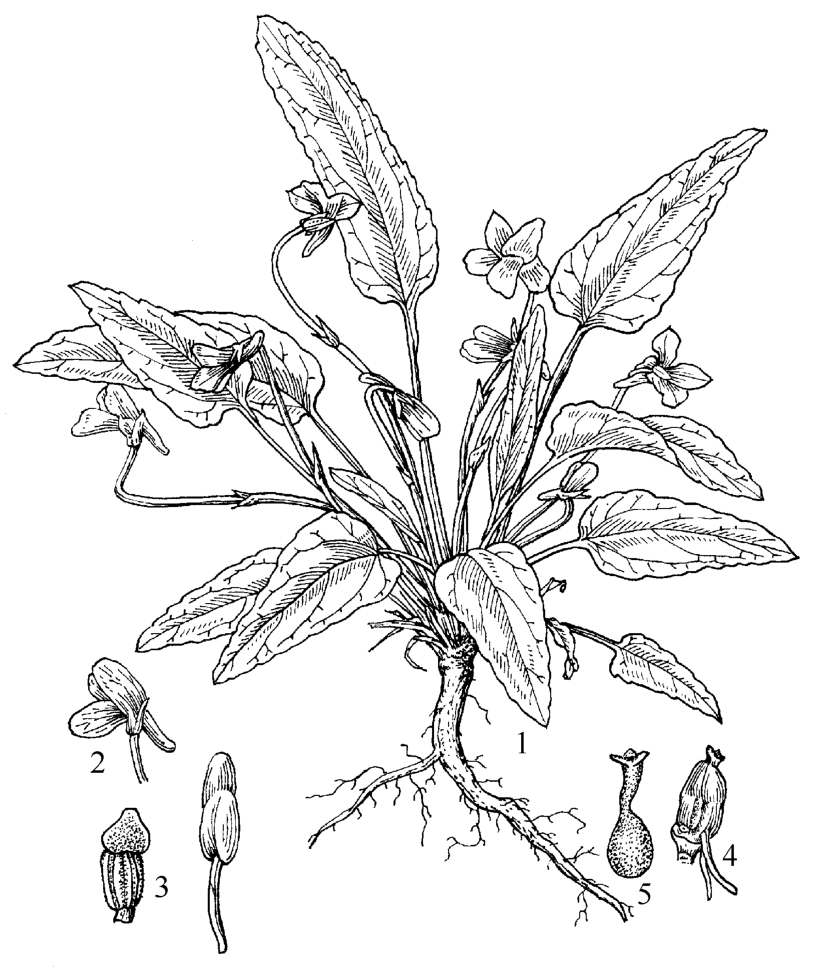
- 显微鉴别：上表皮细胞内壁黏液化常膨胀呈半圆形；海绵细胞含草酸钙簇晶；非腺毛单细胞具角质短线纹
  - 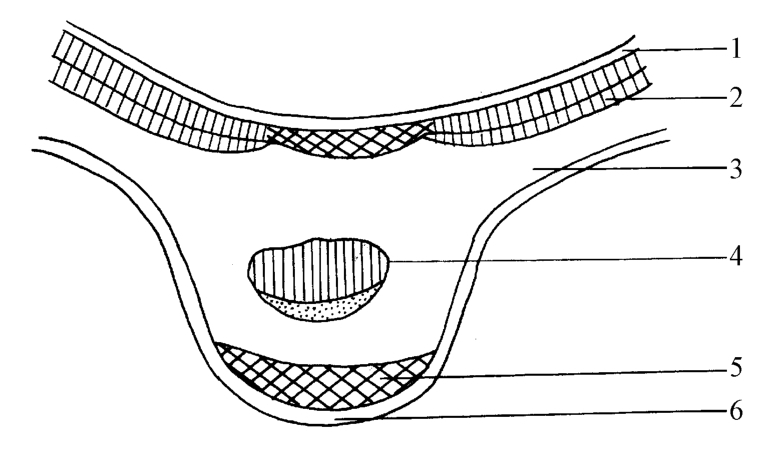
  - 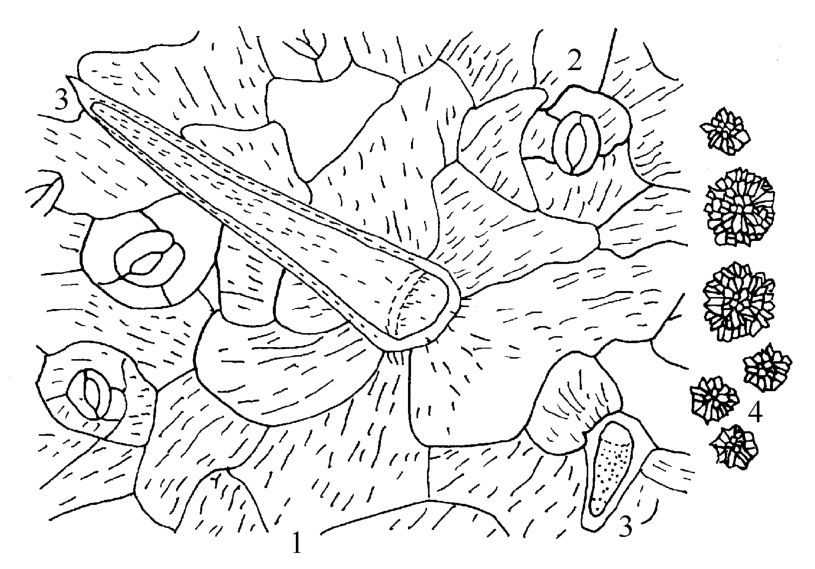
- 成分：黄酮类（芥菜素、木犀草素）；香豆素类（七叶内酯）
- 理化鉴别：薄层色谱与紫花地丁对照药材比对，显3个相同荧光主斑点
- 功效：性寒，味辛、苦。清热解毒，凉血消肿
- 【附】甜地丁：豆科植物米口袋的干燥全草，性寒味甘微苦，清热解毒消肿止痛
- 【附】苦地丁：罂粟科植物紫堇的干燥全草，含紫堇灵等生物碱，性寒味苦，清热解毒散结消肿

### 金钱草 Lysimachiae Herba（附：广金钱草）
- 来源：报春花科植物过路黄 *Lysimachia christinae* Hance 的干燥全草
- 产地：主产四川，长江流域及山西、陕西、云南、贵州亦产
- 性状鉴别：常缠结成团，茎扭曲表面棕色或暗棕红色有纵纹断面实心；叶对生展平呈宽卵形或心形，水浸后对光透视可见黑色或褐色条纹；有的带花黄色单生叶腋；气微，味淡
  - 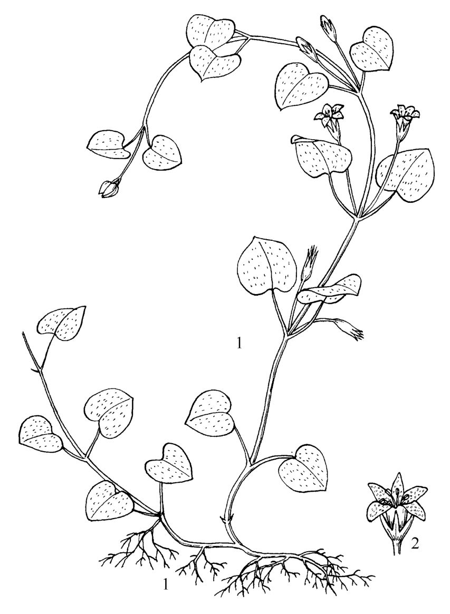
- 显微鉴别：栓内层宽广分泌道周围分泌细胞5～10个含红棕色块状分泌物；中柱鞘部位纤维断续排列成环
  - 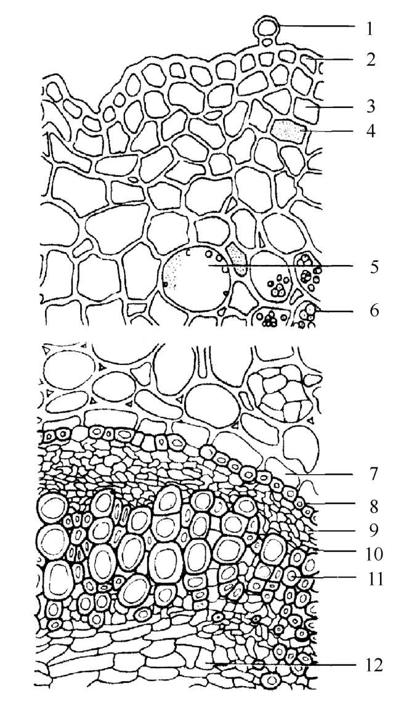
- 成分：酚性成分、甾醇、黄酮类（槲皮素、山柰素）
- 含量测定：含槲皮素和山柰素总量不得少于0.10%
- 功效：性微寒，味甘、咸。利湿退黄，利尿通淋，解毒消肿
- 附注：全国各地"金钱草"名称繁多，江苏金钱草（连钱草，唇形科活血丹）、江西金钱草（伞形科天胡荽）易混淆；点腺过路黄、聚花过路黄、巴东过路黄部分地区混用
- 【附】广金钱草：豆科植物广金钱草的干燥地上部分，主产广东，含木犀草素，性凉味甘淡，利湿退黄利尿通淋

### 广藿香 Pogostemonis Herba
- 来源：唇形科植物广藿香 *Pogostemon cablin* (Blanco) Benth. 的干燥地上部分，按产地分石牌广藿香及海南广藿香
- 产地：主产广东广州石牌，海南、台湾、广西、云南亦有栽培
- 采收加工：夏秋枝叶茂盛时采割，日晒夜闷反复至干
- 性状鉴别：茎略呈方柱形多分枝表面被柔毛断面有髓；叶对生皱缩成团两面被灰白色茸毛；石牌广藿香枝条瘦小叶片小而厚；海南广藿香枝条粗壮叶片大而薄；气香特异，味微苦
  - 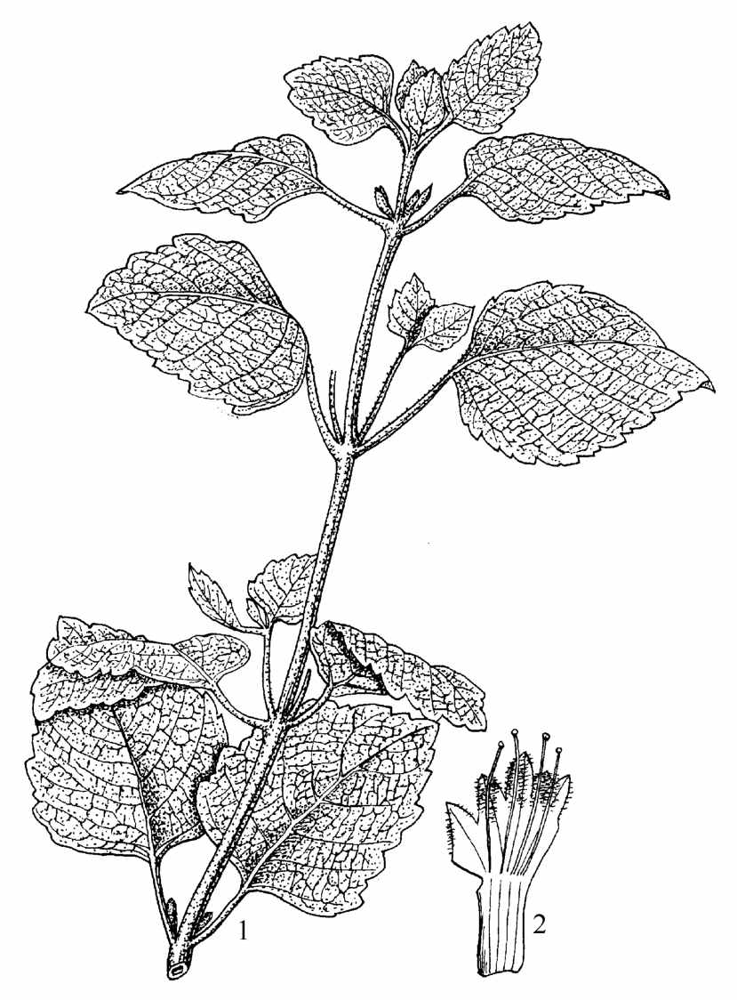
- 显微鉴别：腺鳞头部扁球形8个细胞；间隙腺毛存在于栅栏组织或薄壁组织细胞间隙中
  - 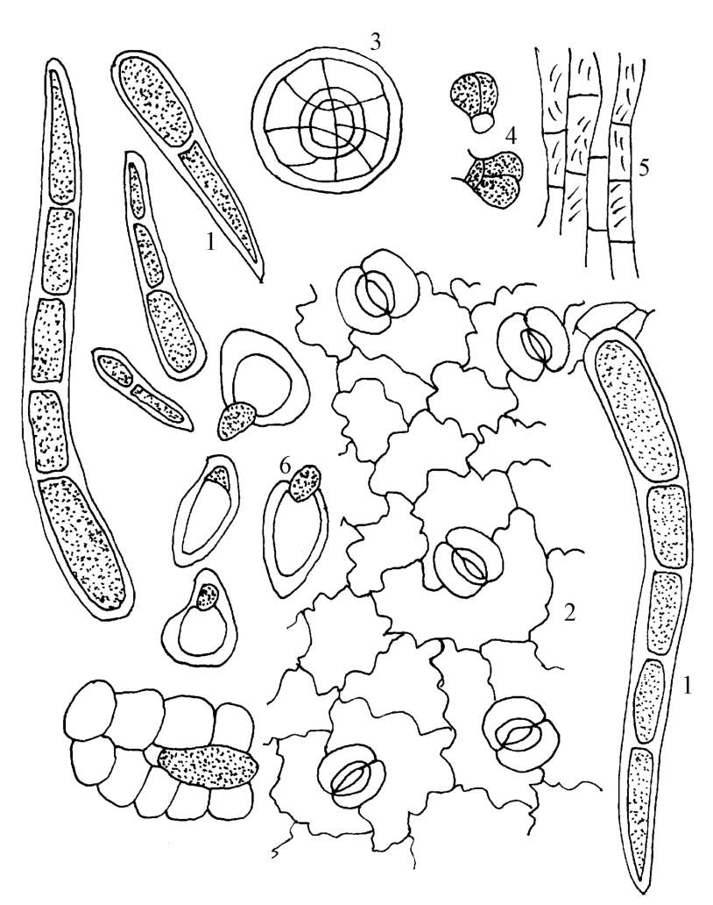
- 成分：挥发油（百秋李醇占52%～57%；广藿香酮为主要抗真菌成分）；海南广藿香挥发油含量高于石牌产但广藿香酮含量低
- 理化鉴别：挥发油加溴的氯仿液石牌显绿色海南显紫色；加醋酸铜显微镜下结晶不同；薄层色谱与百秋李醇对照品比对
- 含量测定：含百秋李醇不得少于0.10%
- 功效：性微温，味辛。芳香化浊，和中止呕，发表解暑

### 半枝莲 Scutellariae Barbatae Herba
- 来源：唇形科植物半枝莲 *Scutellaria barbata* D.Don 的干燥全草
- 产地：主产河北、河南、山西、陕西
- 性状鉴别：茎丛生四棱形表面暗紫色或棕绿色；叶对生三角状卵形或披针形；花冠二唇形棕黄色或浅蓝紫色被毛；小坚果扁球形浅棕色；气微，味微苦
  - 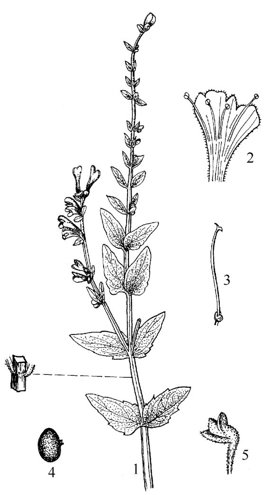
- 显微鉴别：非腺毛1～2细胞圆锥形具疣状突起；腺鳞腺头圆球形7～8细胞
  - 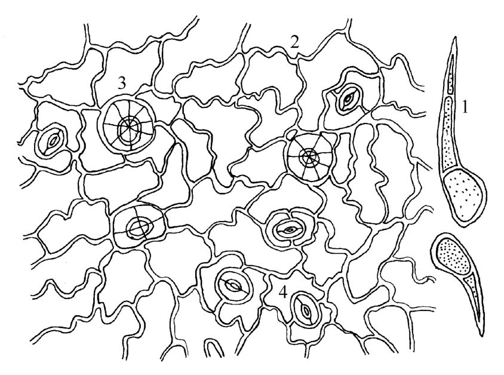
- 成分：黄酮类（黄芩素、野黄芩苷）；齐墩果酸
- 含量测定：含总黄酮（以野黄芩苷计）不得少于1.50%；含野黄芩苷不得少于0.20%
- 功效：性寒，味辛、苦。清热解毒，化瘀利尿

### 荆芥 Schizonepetae Herba（附：荆芥穗）
- 来源：唇形科植物荆芥 *Schizonepeta tenuifolia* Briq. 的干燥地上部分
- 产地：主产江苏、浙江、河南、河北，多为栽培
- 采收加工：夏秋花开到顶花穗绿色时采收，北方将穗与梗分开称荆芥穗与荆芥梗
- 性状鉴别：茎方柱形上部有分枝，表面淡黄绿色或淡紫红色被短柔毛断面类白色；叶对生多已脱落；穗状轮伞花序顶生宿萼钟状先端5齿裂；小坚果棕黑色；气芳香，味微涩而辛凉
  - 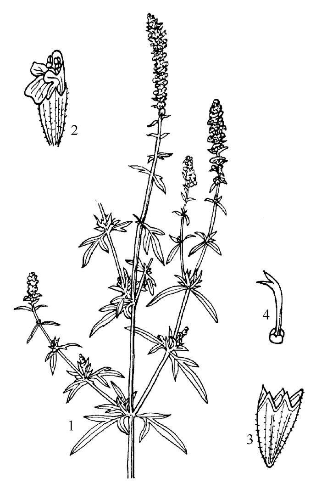
- 显微鉴别：腺鳞头部8细胞；非腺毛1～6细胞具壁疣；内果皮石细胞垂周壁深波状弯曲密具纹孔
  - 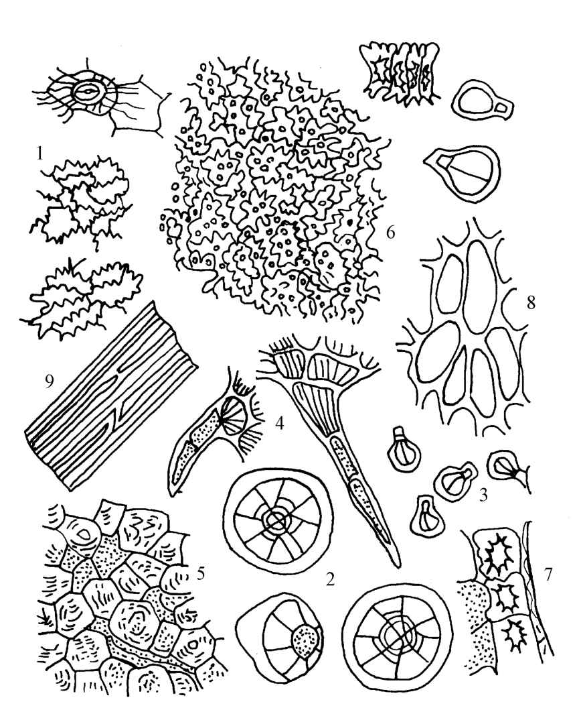
- 成分：挥发油1%～2%（穗约4.11%，右旋薄荷酮、左旋胡薄荷酮）；荆芥苷A～E、荆芥内酯
- 含量测定：含挥发油不得少于0.60%(mL/g)；含胡薄荷酮不得少于0.020%
- 功效：性微温，味辛。解表散风，透疹，消疮
- 【附】荆芥穗：荆芥的干燥花穗，性微温味辛，解表散风透疹消疮

### 益母草 Leonuri Herba（附：茺蔚子）
- 来源：唇形科植物益母草 *Leonurus japonicus* Houtt. 的新鲜或干燥地上部分
- 产地：全国各地均有野生或栽培
- 采收加工：鲜品春季幼苗期至初夏花前期采割；干品夏季花未开或初开时采割
- 性状鉴别：鲜益母草茎方柱形上部多分枝四面凹下成纵沟表面青绿色；干益母草茎表面灰绿色或黄绿色断面中部有髓；下部茎生叶掌状3裂上部叶羽状深裂；轮伞花序腋生花萼筒状花冠二唇形；气微，味微苦
  - 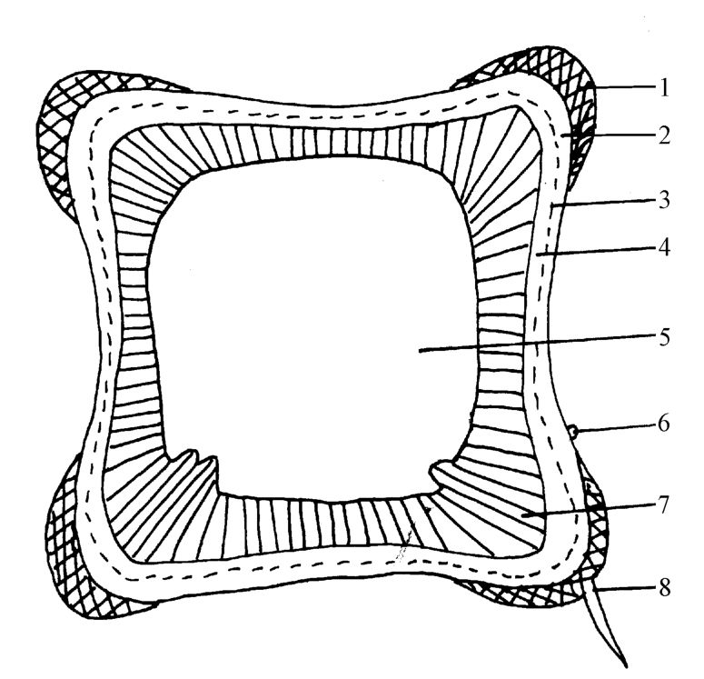
- 显微鉴别：腺鳞头部4/6或8细胞；薄壁细胞含细小草酸钙针晶及小方晶
- 成分：益母草碱（开花初期微量中期增高）、益母草啶、水苏碱
- 理化鉴别：薄层色谱与盐酸水苏碱对照品比对
- 含量测定：含盐酸水苏碱不得少于0.50%；含盐酸益母草碱不得少于0.05%
- 功效：性微寒，味苦、辛。活血调经，利尿消肿，清热解毒
- 【附】茺蔚子：益母草干燥成熟的果实，含益母草次碱及脂肪油约37%，性微寒味辛甘，活血调经清肝明目

### 薄荷 Menthae Haplocalycis Herba
- 来源：唇形科植物薄荷 *Mentha haplocalyx* Briq. 的干燥地上部分
- 产地：主产江苏太仓及浙江、湖南，江苏为主产区
- 采收加工：夏秋茎叶茂盛或花开至三轮时分次采割晒干或阴干
- 性状鉴别：茎方柱形有对生分枝表面紫棕色或淡绿色棱角处具茸毛断面白色髓部中空；叶对生皱缩卷曲上表面深绿色下表面灰绿色有凹陷点状腺鳞；轮伞花序腋生；揉后有特殊清凉香气，味辛凉
  - 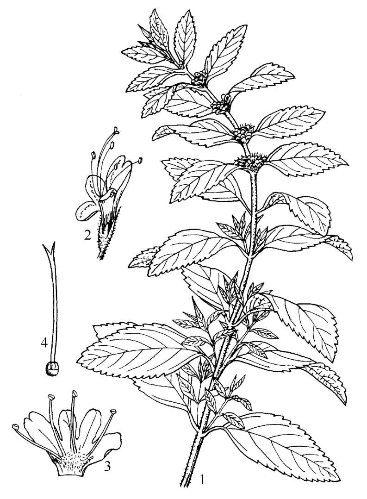
- 显微鉴别：腺鳞腺头扁圆球形8个分泌细胞排列成辐射状；表皮细胞、叶肉细胞及导管中有时含橙皮苷结晶
  - 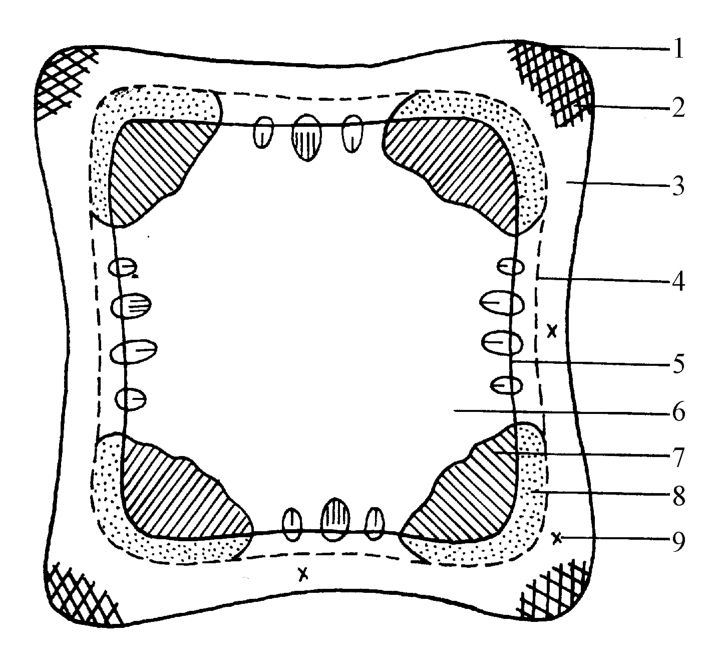
  - 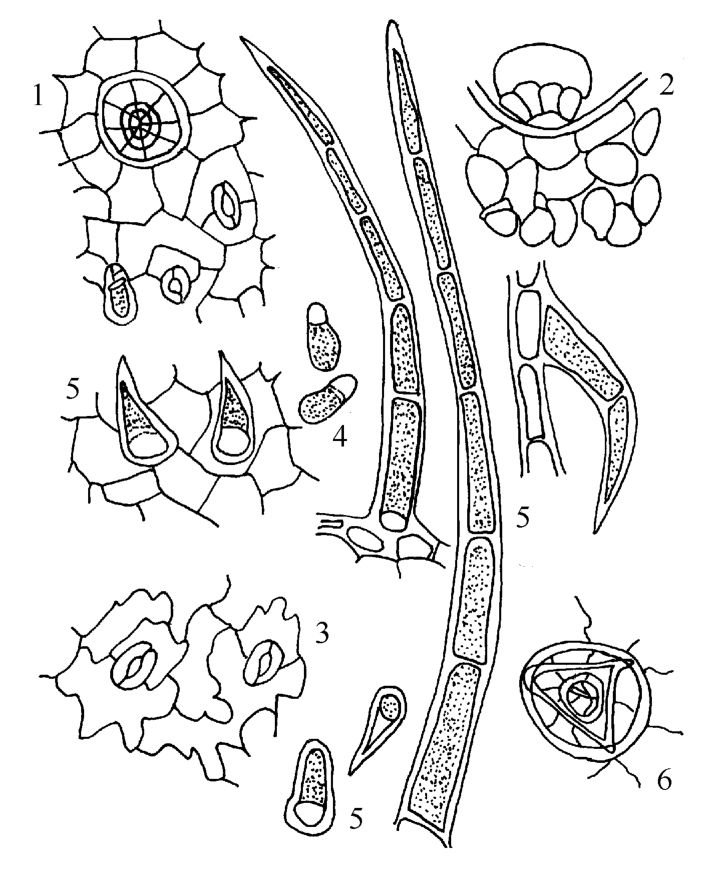
- 成分：挥发油1.3%～2.0%（l-薄荷脑62.3%～87.2%为主，l-薄荷酮约12%）；叶片含油量盛蕾期最高，薄荷脑含量盛花期最高
- 理化鉴别：粉末微量升华加硫酸及香草醛初显黄色至橙黄色加水变紫红色；薄层色谱与薄荷对照药材及薄荷脑对照品比对
- 含量测定：含挥发油不得少于0.80%(mL/g)
- 功效：性凉，味辛。疏散风热，清利头目，利咽，透疹，疏肝行气

### 泽兰 Lycopi Herba
- 来源：唇形科植物毛叶地瓜儿苗 *Lycopus lucidus* Turcz. var. *hirtus* Regel 的干燥地上部分
- 产地：全国大部分地区均产
- 性状鉴别：茎方柱形少分枝四面均有浅纵沟表面黄绿色或带紫色节处紫色明显有白色茸毛，断面黄白色髓部中空；叶对生披针形或长圆形密具腺点两面具短毛；轮伞花序腋生花萼钟形5齿；气微，味淡
- 成分：挥发油、葡萄糖苷、鞣质和树脂、黄酮苷
- 功效：性微温，味苦、辛。活血调经，祛瘀消痈，利水消肿

### 香薷 Moslae Herba
- 来源：唇形科植物石香薷 *Mosla chinensis* Maxim. 或江香薷 *M. chinensis* 'Jiangxiangru' 的干燥地上部分，前者习称"青香薷"后者习称"江香薷"
- 产地：青香薷主产广东、广西、福建、湖南；江香薷主产江西、浙江
- 性状鉴别：青香薷基部紫红色上部黄绿色或淡黄色全体密被白色茸毛，茎方柱形节明显；叶对生边缘有3～5疏浅锯齿；穗状花序顶生及腋生苞片圆卵形花萼宿存钟状密被茸毛；小坚果4近圆球形具网纹；江香薷较长质较柔软叶边缘疏浅锯齿5～9；气清香而浓，味微辛而凉
- 显微鉴别：腺鳞头部8细胞；青香薷非腺毛疣突明显，江香薷疣突不明显
- 成分：挥发油（青香薷含香荆芥酚约72%、麝香草酚；江香薷含量较低）
- 含量测定：含麝香草酚和香荆芥酚总量不得少于0.16%
- 功效：性微温，味辛。发汗解表，化湿和中

### 肉苁蓉 Cistanches Herba
- 来源：列当科植物肉苁蓉 *Cistanche deserticola* Y.C.Ma 或管花肉苁蓉 *C. tubulosa* (Schenk) Wight 的干燥带鳞叶的肉质茎
- 产地：肉苁蓉主产内蒙古（产量最大）、新疆、陕西、甘肃；管花肉苁蓉主产新疆
- 采收加工：春季苗未出土或刚出土时采挖，沙土半埋半露晒干为"甜大芸"质佳；盐湖腌制为"盐大芸"质次需洗去盐分
- 性状鉴别：肉苁蓉呈扁圆柱形稍弯曲表面棕褐色或灰棕色密被覆瓦状排列肉质鳞叶，断面棕褐色有淡棕色点状维管束排列成波状环纹；管花肉苁蓉扁纺锤形鳞叶三角形断面颗粒状散生点状维管束；气微，味甜、微苦
  - 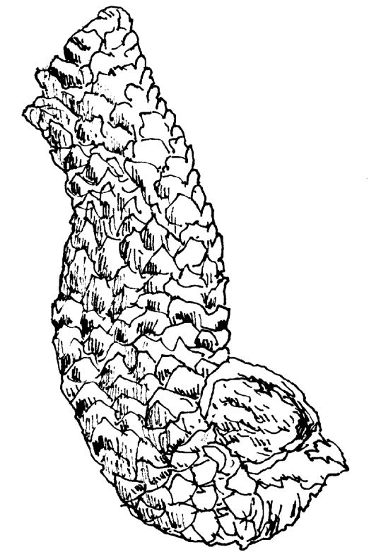
- 显微鉴别：中柱维管束排列成波状弯曲环；髓射线明显髓部呈星状；薄壁细胞充满淀粉粒；管花肉苁蓉维管束散生中心无髓
  - 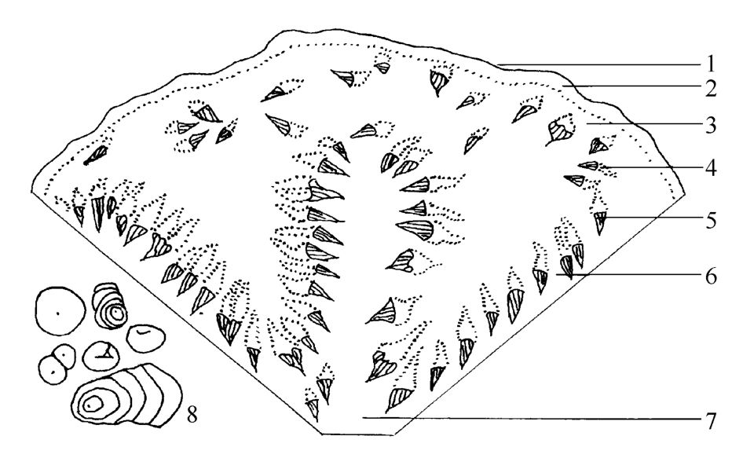
- 成分：苯乙基苷类（肉苁蓉苷A/B/C/H、松果菊苷、类叶升麻苷、毛蕊花糖苷）
- 理化鉴别：聚酰胺薄层与松果菊苷、毛蕊花糖苷对照品比对
- 含量测定：肉苁蓉含松果菊苷和毛蕊花糖苷总量不得少于0.30%；管花肉苁蓉不得少于1.5%
- 功效：性温，味甘、咸。补肾阳，益精血，润肠通便
- 附注：盐生肉苁蓉、沙苁蓉、草苁蓉在部分地区作肉苁蓉用，均非正品；伪品有红冬蛇菰、多蕊蛇菰全草

### 锁阳 Cynomorii Herba
- 来源：锁阳科植物锁阳 *Cynomorium songaricum* Rupr. 的干燥肉质茎
- 产地：主产内蒙古、宁夏、新疆、甘肃
- 性状鉴别：扁圆柱形微弯曲，表面棕色至棕褐色粗糙具明显纵沟及不规则凹陷，有的残存三角形黑棕色鳞片；体重质硬难折断断面浅棕色或棕褐色有黄色三角状维管束；气微，味甘而涩
- 显微鉴别：中柱宽广维管束众多排列极不规则常排成扇形、半圆形；薄壁细胞含众多淀粉粒及棕色物质
- 成分：三萜类（锁阳萜、熊果酸）；挥发油、花色苷、鞣质
- 功效：性温，味甘。补肾阳，益精血，润肠通便

### 穿心莲 Andrographis Herba
- 来源：爵床科植物穿心莲 *Andrographis paniculata* (Burm.f.) Nees 的干燥地上部分
- 产地：主要栽培于广东、广西、福建，云南、四川、江西、江苏亦有栽培
- 性状鉴别：茎方柱形多分枝节稍膨大质脆易折断；叶片皱缩易碎完整者披针形或卵状披针形上表面绿色下表面灰绿色两面光滑；气微，味极苦
  - 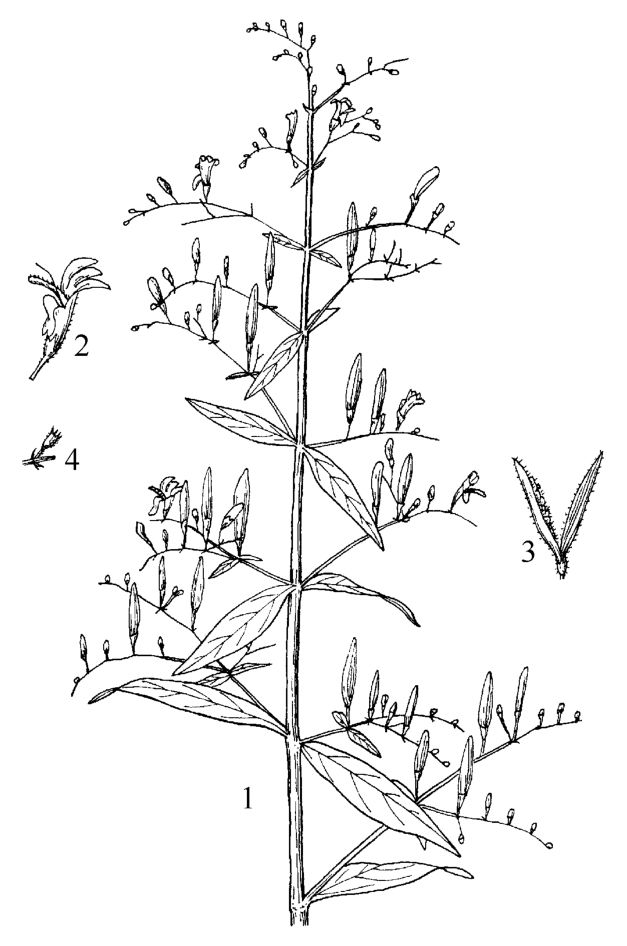
- 显微鉴别：上下表皮均含圆形长椭圆形或棒状钟乳体的晶细胞；栅栏组织1～2列贯穿主脉上方
  - 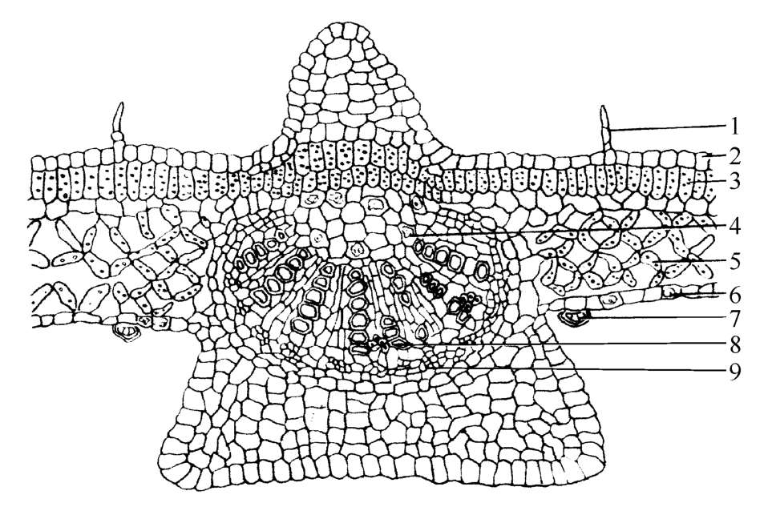
  - 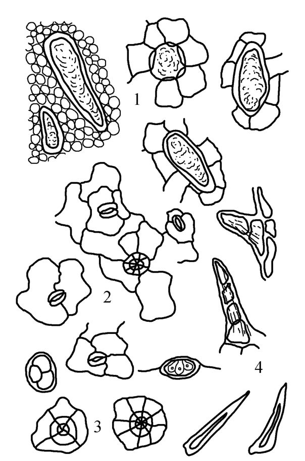
- 成分：二萜内酯类（穿心莲内酯含1.5%以上、新穿心莲内酯、脱水穿心莲内酯，为抗菌抗钩端螺旋体有效成分）；叶中含量2%～5%（10～11月开花前采收含量最高）
- 理化鉴别：薄层色谱与穿心莲对照药材及脱水穿心莲内酯、穿心莲内酯对照品比对
- 含量测定：含脱水穿心莲内酯和穿心莲内酯总量不得少于0.80%
- 功效：性寒，味苦。清热解毒，凉血，消肿

### 白花蛇舌草 Hedyotidis Diffusae Herba
- 来源：茜草科植物白花蛇舌草 *Hedyotis diffusa* Willd. 的干燥全草
- 产地：主产广东、广西、福建，长江以南其他各省亦产
- 性状鉴别：全草扭缠成团状灰绿色或灰棕色，主根1条须根纤细，茎细而卷曲具纵棱；叶对生多破碎完整叶片线形有托叶；花单生于叶腋；蒴果扁球形顶端具4枚宿存萼齿；气微，味淡
- 显微鉴别：皮层细胞含少量小油滴个别含草酸钙针晶束；髓部宽阔薄壁细胞中可见草酸钙针晶束
- 成分：齐墩果酸、熊果酸、对-香豆酸；多糖具增强免疫和抗肿瘤作用
- 功效：性凉，味甘、淡。清热解毒，利尿消肿，活血止痛
- 附注：水线草曾作白花蛇舌草入药；纤花耳草、漆姑草混入应注意鉴别（区别在托叶形状及花着生方式）

### 佩兰 Eupatorii Herba
- 来源：菊科植物佩兰 *Eupatorium fortunei* Turcz. 的干燥地上部分
- 产地：主产河北、山东、江苏、浙江
- 性状鉴别：茎圆柱形表面黄棕色或黄绿色有的带紫色有明显节及纵棱线，断面髓部白色或中空；叶对生多皱缩破碎完整叶3裂或不分裂；气芳香，味微苦
- 显微鉴别：非腺毛3～6细胞叶脉上较长7～8细胞；气孔不定式
- 成分：挥发油1.5%～2%（对-聚伞花素约20%、橙花醇乙酸酯约10%，对流感病毒有直接抑制作用）
- 功效：性平，味辛。芳香化湿，醒脾开胃，发表解暑
- 附注：泽兰（山佩兰）、地瓜儿苗、罗勒曾混称佩兰；三裂叶白头婆、华泽兰为常见混淆品，应注意区别

### 豨莶草 Siegesbeckiae Herba
- 来源：菊科植物豨莶 *Siegesbeckia orientalis* L.、腺梗豨莶 *S. pubescens* Makino 或毛梗豨莶 *S. glabrescens* Makino 的干燥地上部分
- 产地：全国大部分地区，主产湖南、福建、湖北、江苏
- 性状鉴别：茎略呈方柱形多分枝表面灰绿色、黄棕色或紫棕色有纵沟及细纵纹被灰色柔毛节明显略膨大，断面髓部宽广类白色中空；叶对生卵圆形边缘钝锯齿两面白色柔毛主脉3出；有的可见黄色头状花序；气微，味微苦
  - 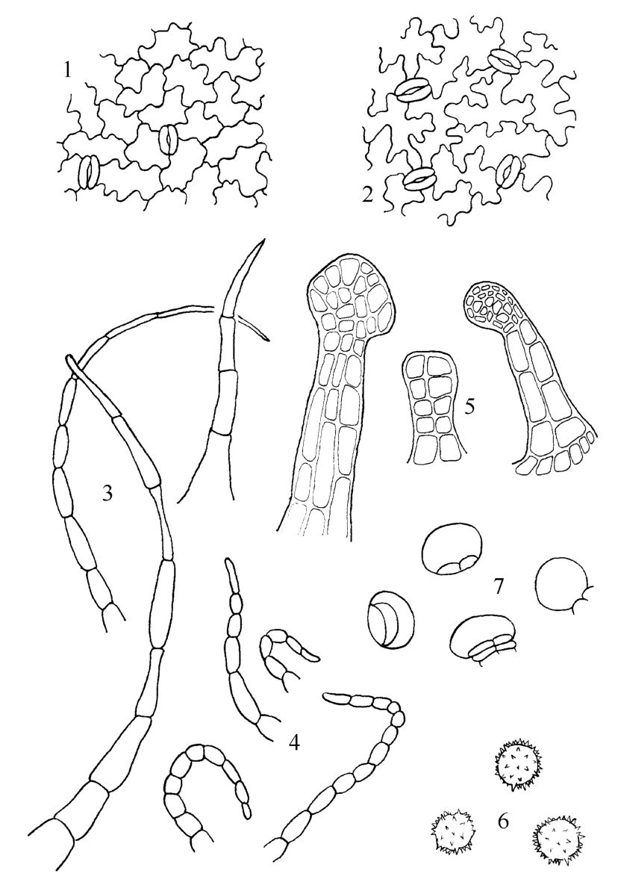
- 显微鉴别：腺梗豨莶花梗具两种腺毛；豨莶和毛梗豨莶花梗无腺毛，毛梗豨莶非腺毛较小而短
- 成分：豨莶苦味苷（均含）；腺梗豨莶含腺梗豨莶苷；毛梗豨莶含奇壬醇
- 理化鉴别：薄层色谱与奇壬醇对照品比对
- 含量测定：含奇壬醇不得少于0.050%
- 功效：性寒，味辛、苦。祛风湿，利关节，解毒
- 附注：防风草曾作豨莶草用，功效不同（祛风解表理气止痛）应注意鉴别

### 茵陈 Artemisiae Scopariae Herba
- 来源：菊科植物滨蒿 *Artemisia scoparia* Waldst. et Kit. 或茵陈蒿 *A. capillaris* Thunb. 的干燥地上部分，春季采收习称"绵茵陈"，秋季采收习称"花茵陈"
- 产地：滨蒿主产东北及河北、山东；茵陈蒿主产陕西、山西、安徽，陕西产者（西茵陈）质量最佳
- 采收加工：春季幼苗高6～10cm时采收或秋季花蕾长成至花初开时采割
- 性状鉴别：绵茵陈多卷曲成团状灰白色或灰绿色密被白色茸毛绵软如绒，气清香味微苦；花茵陈茎圆柱形表面淡紫色或紫色被短柔毛，头状花序卵形多数集成圆锥状，气芳香味微苦
  - 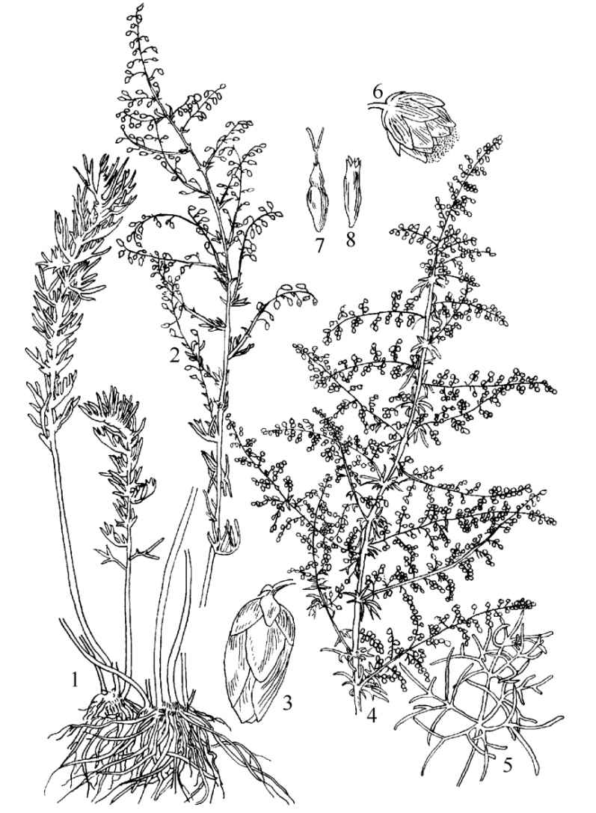
- 显微鉴别：表面密布"T"字形非腺毛臂细胞直线延伸两臂不等长；腺毛顶面观呈鞋底形
  - 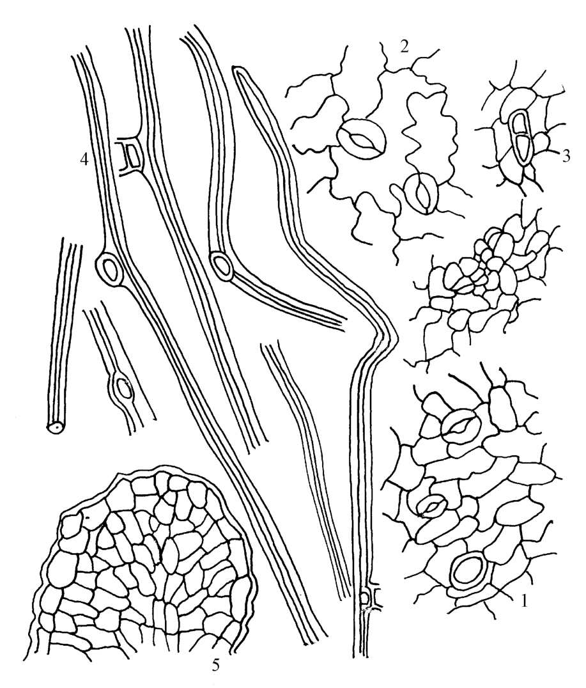
- 成分：滨蒿含滨蒿内酯（利胆有效成分，6,7-二甲氧基香豆素）；茵陈蒿含蒿属香豆素、绿原酸、茵陈色酮（利胆作用）
- 理化鉴别：水浸液三氯甲烷萃取加二硝基苯肼盐酸溶液，滨蒿显橘红色有沉淀，茵陈蒿显淡橘红色无沉淀（检查对羟基苯乙酮）；薄层色谱与滨蒿内酯或绿原酸对照品比对
- 含量测定：绵茵陈含绿原酸不得少于0.50%，花茵陈含滨蒿内酯不得少于0.20%
- 功效：性微寒，味苦、辛。清利湿热，利胆退黄
- 附注：阴行草、腺毛阴行草、松蒿及牛至全草曾作"土茵陈"或"草茵陈"入药，功效不同应注意鉴别

### 青蒿 Artemisiae Annuae Herba
- 来源：菊科植物黄花蒿 *Artemisia annua* L. 的干燥地上部分
- 产地：分布于全国各地
- 性状鉴别：茎圆柱形上部多分枝表面黄绿色或棕黄色具纵棱线，断面中部有髓；叶互生暗绿色或棕绿色卷缩易碎完整者三回羽状深裂；气香特异，味微苦
- 显微鉴别：腺毛椭圆形常充满黄色挥发油；表面密布丁字形非腺毛长240～480μm
  - 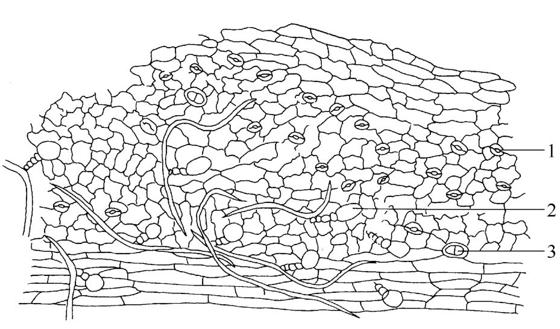
  - 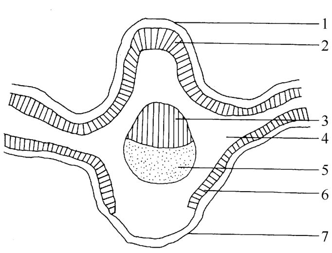
- 成分：挥发油0.3%～0.5%；倍半萜内酯（青蒿素为抗疟有效成分及青蒿甲～戊素）；黄酮类、香豆精类
- 理化鉴别：薄层色谱与青蒿素对照品比对
- 功效：性寒，味苦、辛。清虚热，除骨蒸，解暑热，截疟，退黄
- 附注：邪蒿全草曾作青蒿药用，不含青蒿素，应注意鉴别

### 大蓟 Cirsii Japonici Herba（附：小蓟）
- 来源：菊科植物蓟 *Cirsium japonicum* Fisch. ex DC. 的干燥地上部分
- 产地：主产江苏、浙江、四川
- 性状鉴别：茎圆柱形表面绿褐色或棕褐色有数条纵棱被丝状毛，断面灰白色髓部疏松或中空；叶皱缩多破碎完整叶倒披针形或倒卵状椭圆形羽状深裂边缘具不等长针刺两面灰白色丝状毛；头状花序顶生总苞黄褐色羽状冠毛灰白色；气微，味淡
- 成分：柳穿鱼叶苷（止血活性成分）；蒙花苷、β-谷甾醇（抗肿瘤细胞作用）
- 功效：性凉，味甘、苦。凉血止血，散瘀解毒消痈
- 【附】小蓟：菊科植物刺儿菜的干燥地上部分，含芦丁（止血主要有效成分）、咖啡酸、绿原酸（缩短血凝出血时间），儿茶酚胺类为升压成分，酪胺为降压成分，性凉味甘苦，凉血止血散瘀解毒消痈

### 蒲公英 Taraxaci Herba
- 来源：菊科植物蒲公英 *Taraxacum mongolicum* Hand.-Mazz.、碱地蒲公英 *T. borealisinense* Kitam. 或同属数种植物的干燥全草
- 产地：全国大部分地区均产，主产山西、河北、山东及东北
- 性状鉴别：皱缩卷曲团块，根圆锥状多弯曲表面棕褐色皱缩根头部有棕褐色或黄白色茸毛；叶基生多皱缩破碎完整叶倒披针形绿褐色或暗灰绿色边缘浅裂或羽状分裂；花茎顶生头状花序花冠黄褐色或淡黄白色；有的可见具白色冠毛的瘦果；气微，味微苦
- 显微鉴别：非腺毛3～9个细胞顶端细胞甚长皱缩呈鞭状；根横切面韧皮部乳管群断续排列成数轮
- 成分：蒲公英甾醇、蒲公英赛醇、蒲公英苦素、咖啡酸；全草含菊糖、果胶
- 含量测定：含咖啡酸不得少于0.020%
- 功效：性寒，味苦、甘。清热解毒，消肿散结，利尿通淋

### 淡竹叶 Lophatheri Herba
- 来源：禾本科植物淡竹叶 *Lophatherum gracile* Brongn. 的干燥茎叶
- 产地：产于浙江、江苏、湖南、湖北
- 采收加工：夏季未抽花穗前采割晒干
- 性状鉴别：带叶的茎圆柱形有节表面淡黄绿色断面中空；叶片披针形有的皱缩卷曲，叶脉平行具横行小脉形成长方形网格状下表面尤为明显；体轻质柔韧；气微，味淡
  - 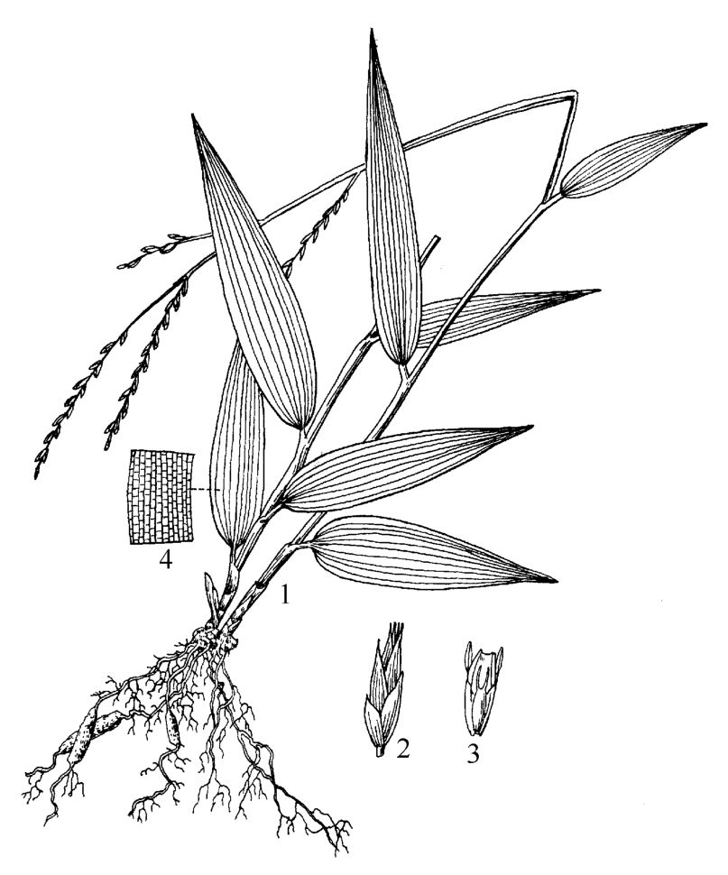
- 显微鉴别：上表皮主要为大型运动细胞；主脉中有一个较大圆形盾状有限外韧型维管束木质部排列成V形
  - 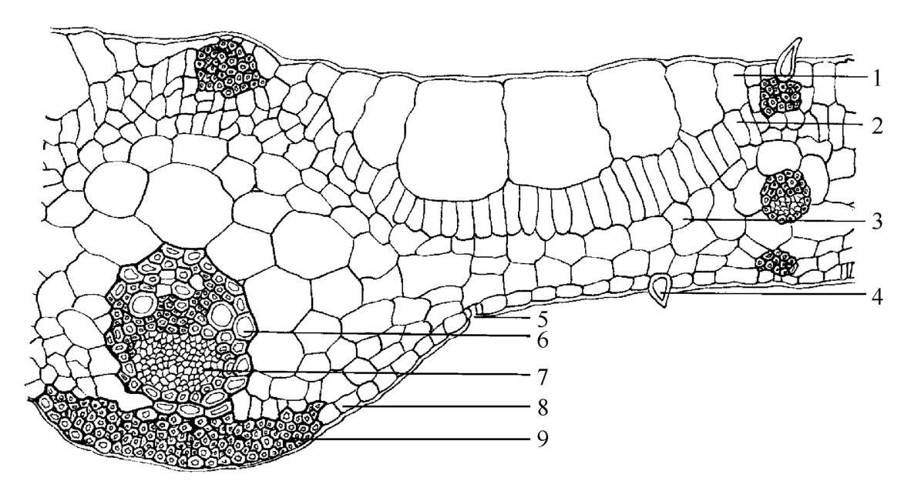
  - 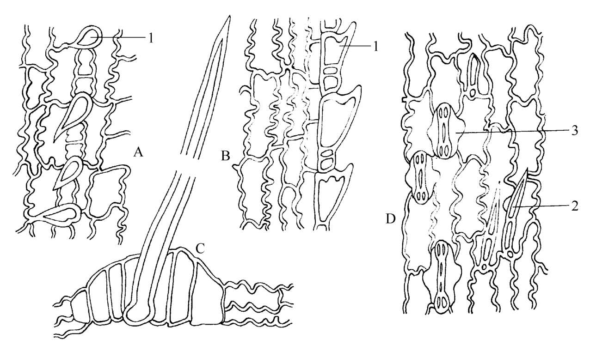
- 成分：三萜化合物（芦竹素、白茅素、蒲公英萜醇）
- 功效：性寒，味甘、淡。清热泻火，除烦止渴，利尿通淋

### 石斛 Dendrobii Caulis（附：铁皮石斛）
- 来源：兰科植物金钗石斛 *Dendrobium nobile* Lindl.、鼓槌石斛 *D. chrysotoxum* Lindl. 或流苏石斛 *D. fimbriatum* Hook. 的栽培品及其同属近似种的新鲜或干燥茎
- 产地：主产广西、贵州、广东、云南
- 性状鉴别：鲜石斛圆柱形或扁圆柱形表面黄绿色光滑或有纵纹节明显肉质多汁；金钗石斛扁圆柱形表面金黄色或黄中带绿有深纵沟质硬而脆味苦；鼓槌石斛粗纺锤形表面光滑金黄色有明显凸起棱质轻而松脆断面海绵状味淡嚼之有黏性；流苏石斛长圆锥形表面黄色至暗黄色有深纵槽质疏松
- 显微鉴别：金钗石斛基本组织散在多数外韧型维管束排成7～8圈含草酸钙针晶细胞多见于维管束旁
  - 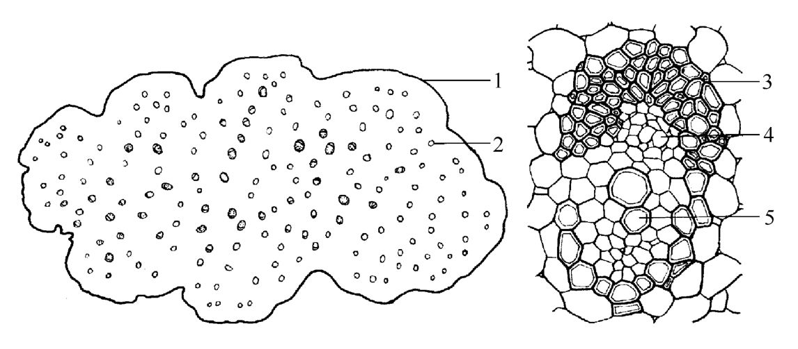
- 成分：金钗石斛含生物碱0.3%（石斛碱、石斛次碱）；鼓槌石斛含毛兰素（具抗肿瘤作用）
- 理化鉴别：薄层色谱分别与石斛碱、毛兰素或石斛酚对照品比对
- 含量测定：金钗石斛含石斛碱不得少于0.40%；鼓槌石斛含毛兰素不得少于0.030%
- 功效：性微寒，味甘。益胃生津，滋阴清热
- 【附】铁皮石斛：兰科植物铁皮石斛的干燥茎，加工成螺旋形"铁皮枫斗"（耳环石斛）或切段"铁皮石斛"，性微寒味甘，益胃生津滋阴清热