---
markmap:
  colorFreezeLevel: 2
  initialExpandLevel: 1
---

# 第十二章 藻、菌、地衣类中药
- 藻类(algae)、菌类(fungi)、地衣类(lichenes)合称低等植物或无胚植物：形态上无根茎叶分化，是单细胞或多细胞的叶状体或菌丝体，构造上一般无组织分化、无中柱和胚胎

## 第一节 概述

### 一、藻类
- 植物界最原始低等类群，称原植体植物；含叶绿素等色素能光合作用为自养原植体植物；约3万种，主要生长水中
- 绿藻：多生活淡水，蓝绿色，贮存淀粉，药用如石莼、孔石莼
- 红藻：绝大多数生长海水，红色至紫色，贮存红藻淀粉（遇碘变葡萄红色至紫色），药用如鹧鸪菜、海人草
- 褐藻：比较高级一大类群，生活海水，褐色，贮存褐藻淀粉和甘露醇，细胞含碘（海带含碘0.34%），药用如海带、海蒿子、羊栖菜

### 二、菌类
- 不含光合色素不能独立生活，为异养原植体植物；与药用关系密切是细菌门和真菌门
- 细菌：微小单细胞无细胞核；放线菌是抗生素主要产生菌（氯霉素、链霉素等2/3由其产生）
- 真菌：有细胞核细胞壁（成分多为几丁质），由菌丝交织组成菌丝体，贮藏肝糖油脂菌蛋白不含淀粉粒
  - 菌丝变态：根状菌索（绳索状似根）；子座（容纳子实体的褥座）；子实体（产生孢子的结构，如灵芝）；菌核（菌丝密结颜色深质地坚硬休眠体，如茯苓）
  - 分四纲：藻菌纲、子囊菌纲、担子菌纲、半知菌纲；与药用密切相关为子囊菌纲（冬虫夏草等）和担子菌纲（马勃、灵芝子实体；猪苓、茯苓、雷丸菌核）
  - 真菌多糖（灵芝多糖、茯苓多糖、猪苓多糖等）有增强免疫及抗肿瘤作用

### 三、地衣类
- 藻类和真菌高度结合的共生复合体；真菌绝大多数为子囊菌，藻类是蓝藻及绿藻
- 形态分三类：壳状地衣、叶状地衣、枝状地衣
- 解剖构造：上下皮层（致密菌丝）、髓层（疏松菌丝和藻类细胞）；藻细胞成层排列称异层地衣，散乱分布称同层地衣
- 含地衣酸、地衣色素、地衣多糖等；约50%地衣含抗菌活性物质（如松萝酸）

## 第二节 药材（饮片）鉴定

### 海藻 Sargassum
- 来源：马尾藻科植物羊栖菜 *Sargassum fusiforme* (Harv.) Setch. 或海蒿子 *S. pallidum* (Turn.) C.Ag. 的干燥藻体，前者习称"小叶海藻"后者习称"大叶海藻"
- 产地：羊栖菜主产浙江、福建、广东、海南沿海；海蒿子主产山东、辽宁沿海
- 性状鉴别：小叶海藻全体皱缩卷曲成团块状黑褐色，叶条形或细匙形先端常膨大中空，气囊腋生纺锤形或球形，质较硬，气腥味咸；大叶海藻主干呈圆柱状具圆锥形突起，初生叶披针形或倒卵形，气囊黑褐色球形，质脆潮润时柔软，气腥味微咸
  - 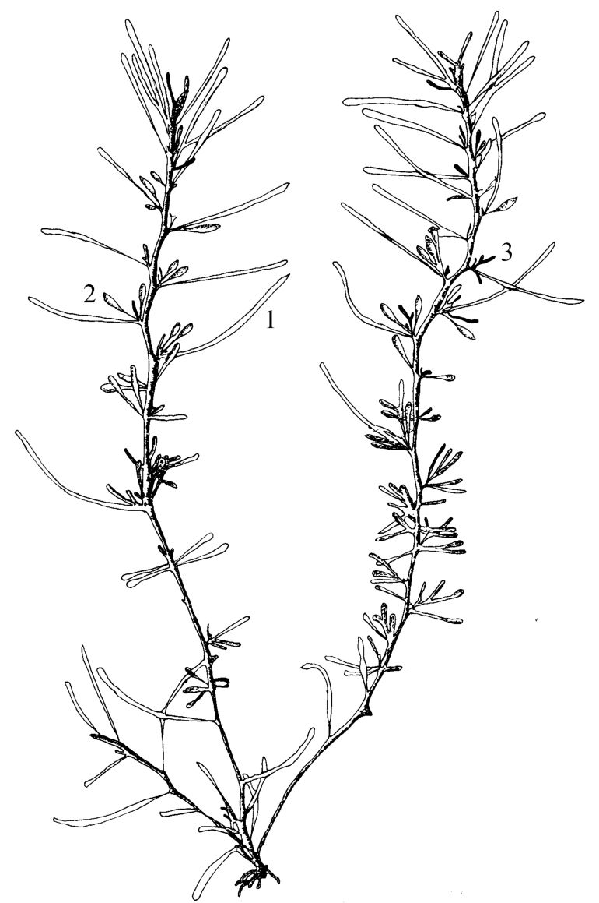
  - 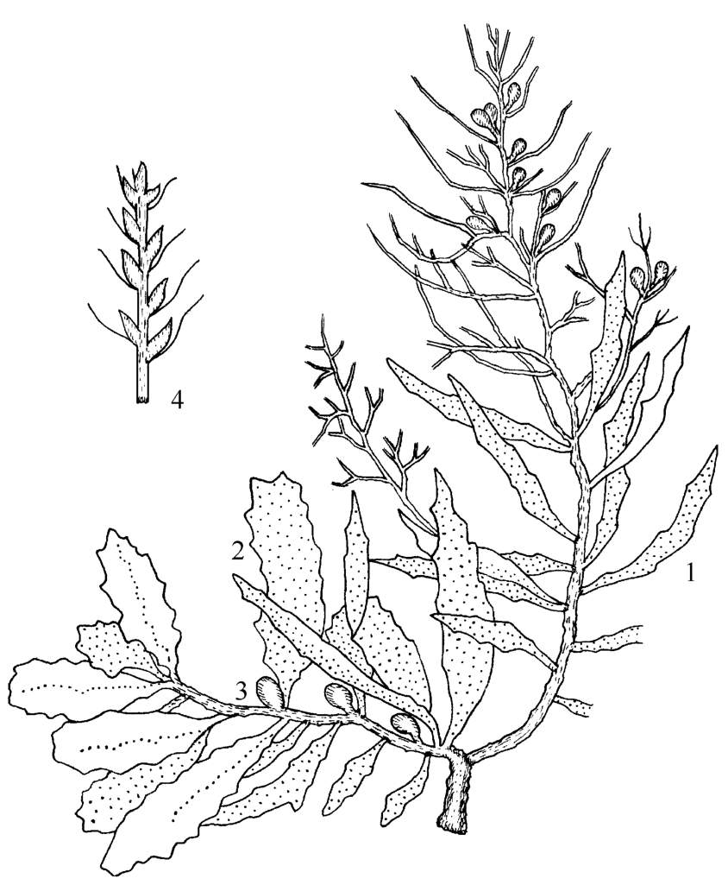
- 成分：藻胶酸约20%（冬季含量高）、甘露醇、马尾藻多糖；碘
- 理化鉴别：粉末水浸液浓缩加三氯化铁试液生成棕色沉淀
- 含量测定：含海藻多糖（以岩藻糖计）不得少于1.70%
- 功效：性寒，味苦、咸。消痰，软坚散结，利水消肿
- 附注：闽粤马尾藻、鼠尾藻、海黍子等"野海藻"在部分地区混充海藻用，均非正品

### 冬虫夏草 Cordyceps
- 来源：麦角菌科真菌冬虫夏草菌 *Cordyceps sinensis* (Berk.) Sacc. 寄生在蝙蝠蛾科昆虫幼虫上的子座及幼虫尸体的干燥复合体
- 产地：主产四川、青海、西藏、云南、甘肃
- 采收加工：夏初子座出土孢子未发散时挖取，晒至6～7成干后晒干或低温干燥
- 性状鉴别：虫体与从虫头部长出真菌子座相连而成，虫体似蚕外表深黄色至黄棕色环纹明显20～30条足8对（近头部3对中部4对近尾部1对），头部红棕色质脆断面淡黄白色；子座深棕色至棕褐色细长圆柱形比虫体长上部稍膨大尖端有不育顶端；气微腥，味微苦
  - 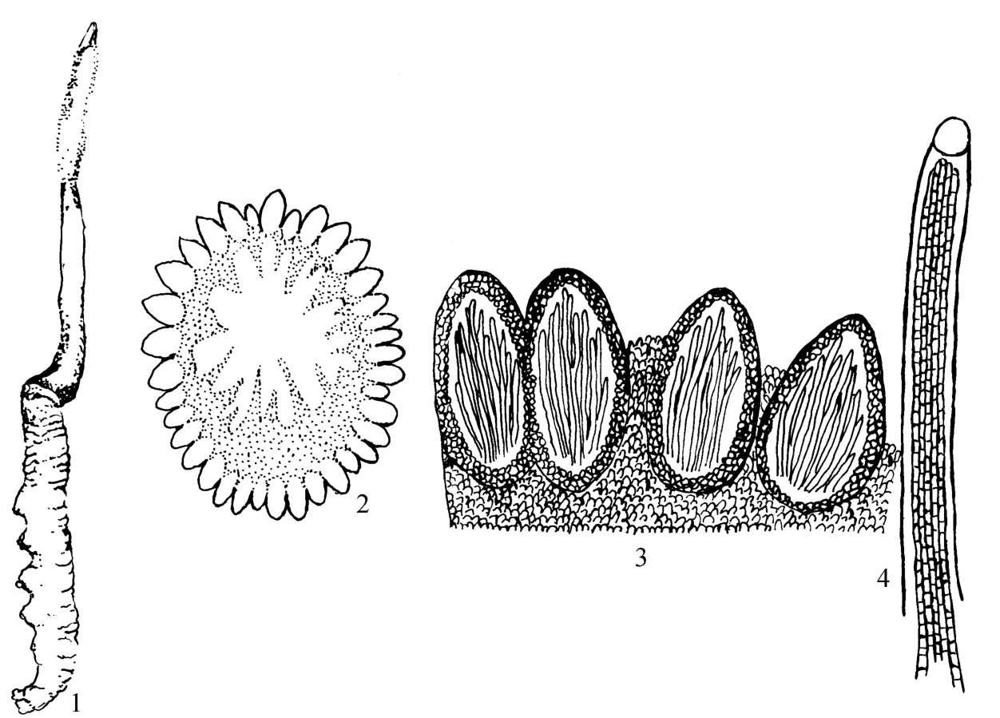
  - 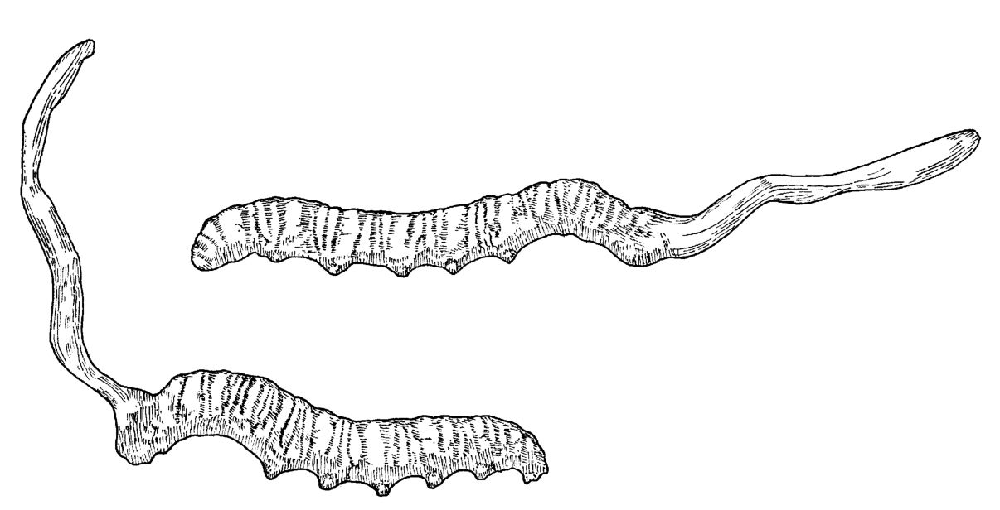
- 显微鉴别：子座周围1列子囊壳卵形至椭圆形；子座中央充满菌丝；虫体横切面躯壳上着生锐利毛和长绒毛
- 成分：粗蛋白25%～30%；D-甘露醇（虫草酸）、腺苷、虫草素（主要活性物质）；虫草多糖
- 含量测定：含腺苷不得少于0.01%
- 功效：性平，味甘。补肾益肺，止血化痰
- 附注：人工发酵虫草菌与天然品成分一致；伪品有蛹草（北虫草）、亚香棒虫草、凉山虫草及地蚕/草石蚕块茎，还有面粉玉米粉石膏加工品（遇碘液显蓝色）

### 灵芝 Ganoderma
- 来源：多孔菌科真菌赤芝 *Ganoderma lucidum* (Leyss. ex Fr.) Karst. 或紫芝 *G. sinense* Zhao, Xu et Zhang 的干燥子实体
- 产地：赤芝产华东、西南及河北、山西、江西、广西；紫芝产浙江、江西、湖南、广西，数量较赤芝少
- 性状鉴别：赤芝外形伞状菌盖半圆形肾形或近圆形皮壳坚硬黄褐色至红褐色有光泽具环状棱纹和辐射状皱纹，菌柄侧生红褐色至紫褐色光亮；紫芝皮壳紫黑色有漆样光泽菌肉锈褐色；气微香，味苦涩
  - 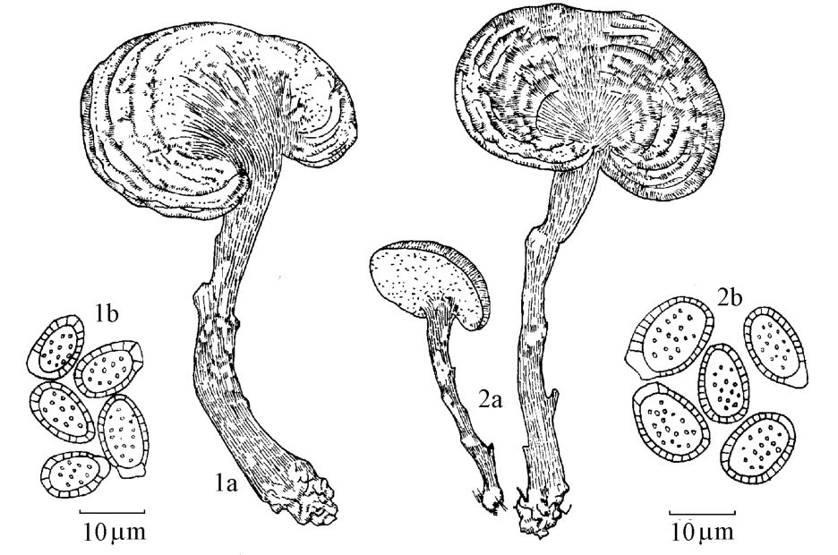
- 显微鉴别：菌丝散在或黏结成团细长稍弯曲有分枝；孢子褐色卵形顶端平截内壁有疣状突起
- 成分：麦角甾醇；三萜化合物（灵芝酸、赤芝酸）；灵芝多糖、灵芝多肽（明显抗衰老作用）
- 理化鉴别：水解后薄层色谱与半乳糖、葡萄糖、甘露糖、木糖对照品比对
- 含量测定：含灵芝多糖（以无水葡萄糖计）不得少于0.90%；含三萜及甾醇（以齐墩果酸计）不得少于0.50%
- 功效：性平，味甘。补气安神，止咳平喘
- 附注：密纹薄芝、薄树芝产量小；同科采绒革盖菌（云芝）除风湿止咳疗肺，具调节免疫防癌抗癌作用

### 茯苓 Poria（附：茯苓皮）
- 来源：多孔菌科真菌茯苓 *Poria cocos* (Schw.) Wolf 的干燥菌核，寄生于松科植物马尾松、赤松等树根上
- 产地：主产湖北、安徽、云南、贵州，野生者以云南产质优称"云苓"
- 采收加工：鲜茯苓"发汗"反复数次至外现皱纹后阴干为"茯苓个"；去皮切片为"茯苓片"；切方块为"茯苓块"；皮为"茯苓皮"；去皮内部淡红色为"赤茯苓"；白色部分为"白茯苓"；中有松根者为"茯神"
- 性状鉴别：茯苓个类球形椭圆形或不规则块状外皮薄而粗糙棕褐色至黑褐色有明显隆起皱纹，体重质坚实断面外层淡棕色内部白色显颗粒性；气微，味淡，嚼之黏牙
  - 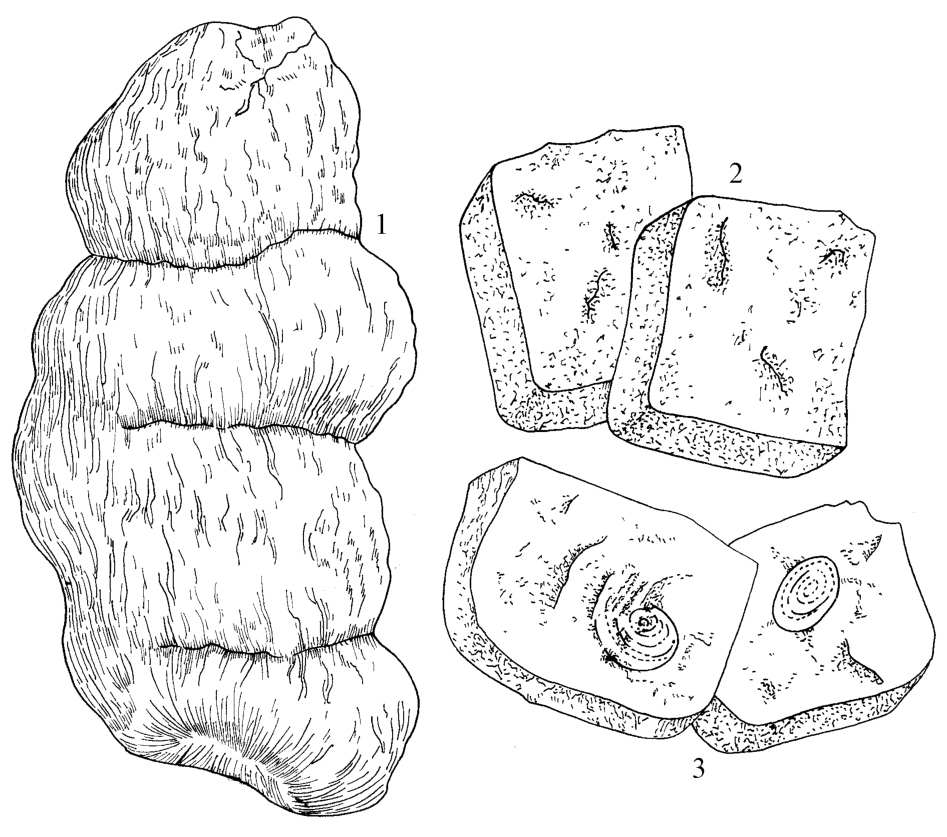
- 显微鉴别：菌丝细长稍弯曲有分枝无色或带棕色；不含淀粉粒及草酸钙晶体；加α-萘酚及浓硫酸团块物溶解显橙红色至深红色
  - 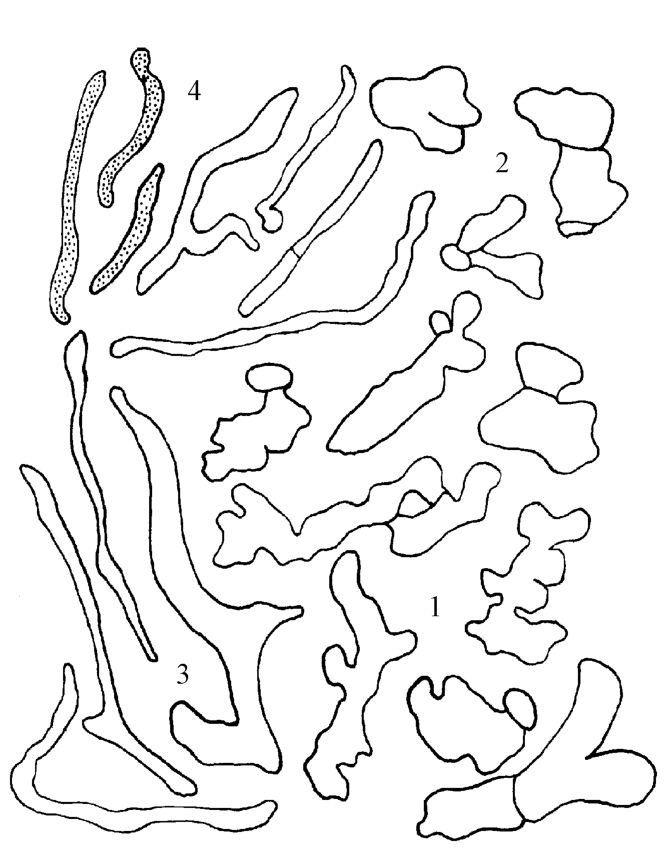
- 成分：β-茯苓聚糖（含量达75%，无抗肿瘤活性；切断支链成茯苓次聚糖才具抗肿瘤活性）；四环三萜酸类（茯苓酸、齿孔酸）
- 理化鉴别：加碘化钾碘试液显深红色（多糖类显色反应）；薄层色谱与茯苓对照药材比对
- 功效：性平，味甘、淡。利水渗湿，健脾，宁心
- 附注：有用茯苓粉末加黏合剂包埋松木块伪制"茯神"；淀粉加工伪制茯苓片遇稀碘液变蓝色，应注意鉴别
- 【附】茯苓皮：茯苓菌核的干燥外皮，性平味甘淡，利水消肿

### 猪苓 Polyporus
- 来源：多孔菌科真菌猪苓 *Polyporus umbellatus* (Pers.) Fries 的干燥菌核
- 产地：主产陕西、云南、河南、山西，野生，人工栽培已成功
- 性状鉴别：不规则条块状类圆形或扁块状有的有分枝，表面皱缩或有瘤状突起黑色灰黑色或棕黑色，质致密而体轻能浮于水面，断面细腻类白色或黄白色略呈颗粒状；气微，味淡
  - 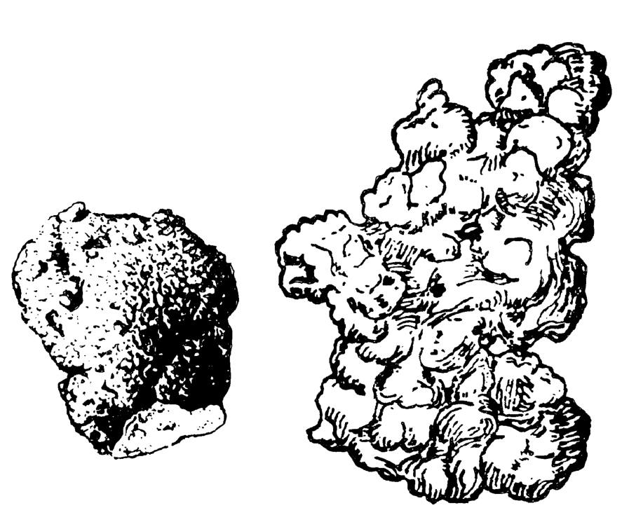
- 显微鉴别：菌丝团大多无色少数棕色；草酸钙结晶呈正八面体形或不规则多面体
  - 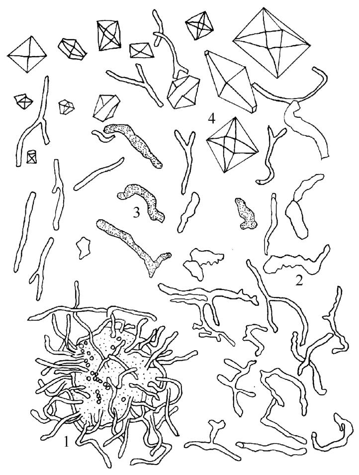
- 成分：猪苓聚糖Ⅰ（抗肿瘤、促进细胞免疫恢复）；麦角甾醇、猪苓酮A～G
- 理化鉴别：加稀盐酸水浴呈黏胶状，加氢氧化钠呈悬浮状不溶成黏胶（与茯苓区别）
- 含量测定：含麦角甾醇不得少于0.070%
- 功效：性平，味甘、淡。利水渗湿

### 雷丸 Omphalia
- 来源：白蘑科真菌雷丸 *Omphalia lapidescens* Schroet. 的干燥菌核
- 产地：主产四川、云南、广西、陕西
- 性状鉴别：不规则块状或类球形表面棕褐色或黑褐色有稍隆起网状皱纹，质坚实断面白色或浅灰黄色呈颗粒状或粉状常有黄棕色大理石样纹理；气微，味微苦，嚼之初有颗粒感久嚼无渣；断面色褐呈角质样者（加热所致）不可药用
- 显微鉴别：菌丝粘结成大小不一不规则团块；草酸钙方晶细小
- 成分：蛋白酶（雷丸素，约3%，驱绦虫有效成分，破坏绦虫头节，蒸煮高温或酸性溶液中无效）
- 理化鉴别：外层菌丝体加氢氧化钠试液显樱红色
- 含量测定：含雷丸素（以牛血清白蛋白计）不得少于0.60%
- 功效：性寒，味微苦。杀虫消积

### 马勃 Lasiosphaera/Calvatia
- 来源：灰包科真菌脱皮马勃 *Lasiosphaera fenzlii* Reich.、大马勃 *Calvatia gigantea* (Batsch ex Pers.) Lloyd 或紫色马勃 *C. lilacina* (Mont. et Berk.) Lloyd 的干燥子实体
- 产地：脱皮马勃主产辽宁、甘肃、江苏、安徽；大马勃主产内蒙古、青海、河北、甘肃；紫色马勃主产广东、广西、江苏、湖北
- 性状鉴别：脱皮马勃扁球形或类球形包被纸质常破碎成块片，孢体灰褐色紧密有弹性触之孢子尘土样飞扬；大马勃呈扁球形不孕基部很小或无包被光滑质硬而脆；紫色马勃呈陀螺形不孕基部发达包被薄两层紫褐色粗皱；置火焰上抖动可见微细火星飞扬熄灭后发生大量白色浓烟
  - 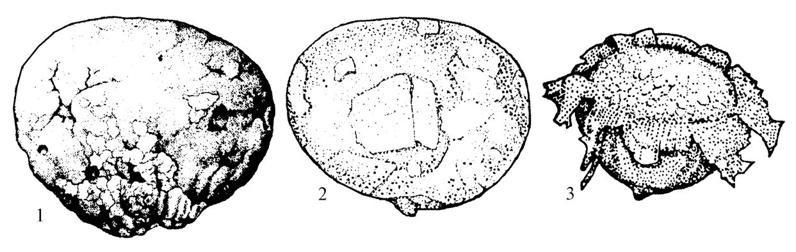
- 显微鉴别：脱皮马勃孢丝长有分枝相互交织，孢子球形有小刺；大马勃孢丝稍分枝有稀少横隔；紫色马勃孢丝有横隔
  - 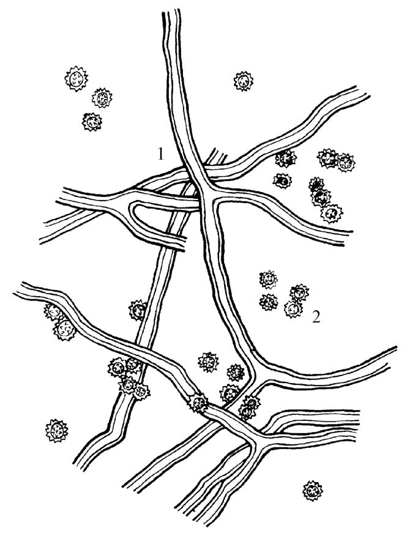
- 成分：脱皮马勃含马勃素；大马勃含秃马勃素（抗癌物质）；紫色马勃含马勃酸
- 理化鉴别：灼烧灰化后滤液显磷酸盐鉴别反应
- 功效：性平，味辛。清肺利咽，止血
- 附注：大口静灰球、长根静灰球、栓皮马勃在部分地区充马勃商品，均非正品

### 松萝 Usnea
- 来源：松萝科植物松萝 *Usnea diffracta* Vain. 和长松萝 *U. longissima* Ach. 的干燥地衣体
- 产地：松萝主产湖北、湖南、贵州、四川；长松萝主产广西、四川、云南
- 性状鉴别：松萝地衣体呈二叉状分枝表面灰绿色或黄绿色粗枝表面有明显环状裂纹（习称"节松萝"），质柔韧略有弹性断面中央有线状强韧中轴，气微味酸；长松萝呈丝状主轴单一两侧侧枝密生似蜈蚣足状（习称"蜈蚣松萝"）
  - 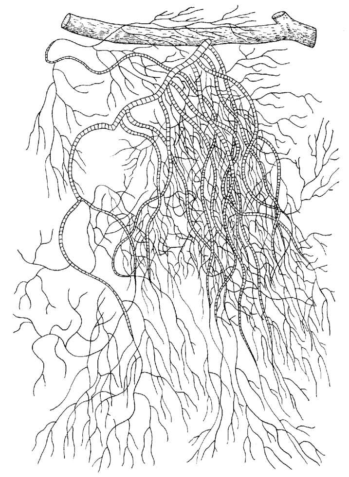
  - 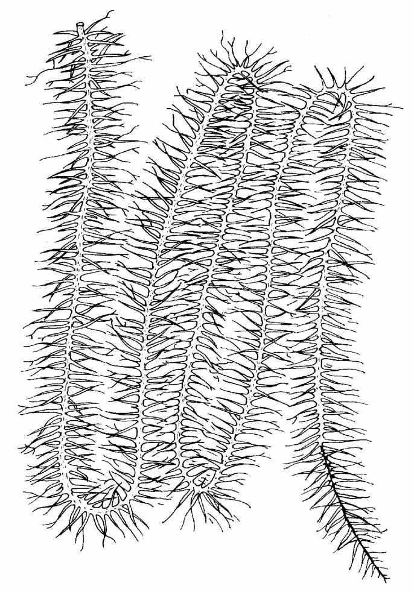
- 成分：松萝酸（主要成分，含量最多）、巴尔巴地衣酸、地衣酸；长松萝尚含拉马酸
- 功效：性平，味甘、苦。止咳平喘，活血通络，清热解毒
