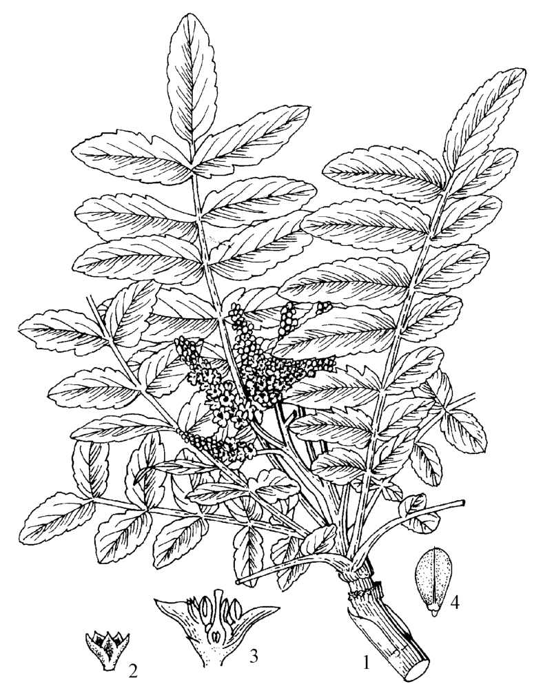
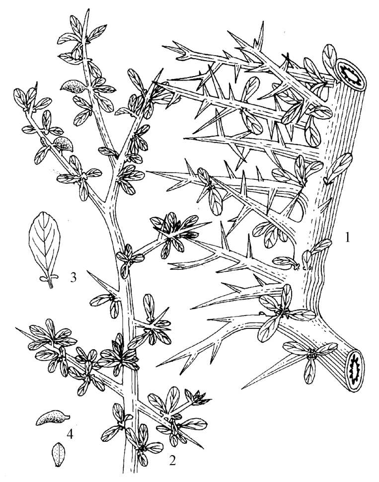
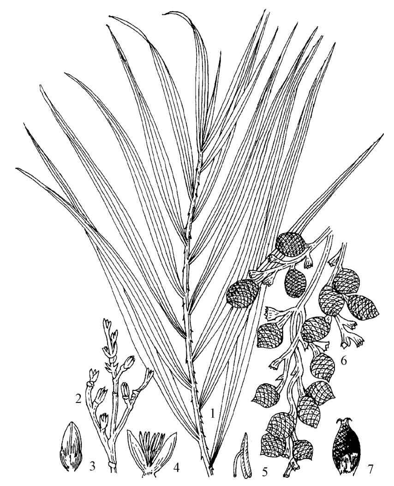

---
markmap:
  colorFreezeLevel: 2
  initialExpandLevel: 1
---

# 第十三章 树脂类中药
- 树脂(resina)类中药：从植物体内得到的正常代谢产物或割伤后分泌产物，具芳香开窍、活血祛瘀、抗菌消炎、防腐、消肿止痛、生肌、消积杀虫、祛痰等功效，常用于冠心病心绞痛中风癫痫跌打伤痛

## 第一节 概述

### 一、树脂的形成、分布和采取
- 树脂由植物体内挥发油成分（萜类）经氧化聚合缩合等化学变化形成，常与挥发油并存于树脂道或分泌细胞中
- 广泛存在于种子植物：松科（松油脂、松香）、豆科（秘鲁香、吐鲁香）、金缕梅科（苏合香、枫香脂）、橄榄科（乳香、没药）、漆树科（洋乳香）、伞形科（阿魏）、安息香科（安息香）、藤黄科（藤黄）、棕榈科（血竭）
- 采取通常切割树皮使树脂流出，自下而上等距离切口

### 二、树脂的化学组成和通性
- 1.化学组成：多数为二萜烯和三萜烯衍生物，分四类——①树脂酸（不挥发，能溶碱液成肥皂样乳液，如松香酸、乳香酸）；②树脂醇（树脂醇遇三氯化铁不显色；树脂鞣醇遇三氯化铁显蓝黑色）；③树脂酯（树脂醇与树脂酸或芳香酸化合而成）；④树脂烃（化学性质稳定不溶于碱不被水解氧化）
- 2.通性：多为无定形固体或半固体，不溶于水不吸水膨胀，易溶于醇乙醚氯仿，碱性溶液中可溶加酸沉淀；加热软化熔融冷却变硬；燃烧有浓烟及香气或臭气；树胶（多糖类，溶于水）与树脂化学组成完全不同，常被误称混淆

### 三、树脂类中药的分类和鉴定
- 1.分类：①单树脂类（酸树脂如松香、酯树脂如枫香脂/血竭、混合树脂如洋乳香）；②胶树脂类（树脂+树胶，如藤黄）；③油胶树脂（含较多挥发油，如乳香/没药/阿魏）；④油树脂（树脂+挥发油，如松油脂）；⑤香树脂（含多量游离芳香酸，如苏合香/安息香）
- 2.鉴定：依靠性状鉴别和化学定性反应，常测定酸值、皂化值、碘值、醇不溶物及香脂酸含量；酸价对真伪掺假鉴定有意义

## 第二节 药材（饮片）鉴定

### 苏合香 Styrax
- 来源：金缕梅科植物苏合香树 *Liquidambar orientalis* Mill. 树干渗出的香树脂经加工精制而成
- 产地：主产土耳其南部、叙利亚、埃及、索马里，我国广西、云南有引种
- 采收加工：击伤3～4年树龄树皮，秋季割下树皮和边材外层加水煮压榨过滤为天然品；溶于95%乙醇滤过蒸去乙醇为精制苏合香
- 性状鉴别：半流动性浓稠液体棕黄色或暗棕色半透明，质黏稠挑起呈胶样连绵不断；气芳香，味苦、辣，嚼之粘牙
- 成分：树脂约36%（苏合香树脂醇、齐墩果酮酸）；油状液体（苯乙烯、肉桂酸、桂皮醛）
- 理化鉴别：微温镜检有肉桂酸片状或小棒状结晶；加高锰酸钾微热有苯甲醛香气；石油醚层加醋酸铜不显绿色（检查掺松香）；薄层色谱与桂皮醛、肉桂酸对照品比对
- 含量测定：酸值52～76，皂化值160～190；含肉桂酸不得少于5.0%
- 功效：性温，味辛。开窍，辟秽，止痛
- 附注：天然苏合香与精制苏合香为正品；旧称"苏合油"总脂酸含量极低系误用，1977年起改进口精制苏合香

### 乳香 Olibanum
- 来源：橄榄科植物乳香树 *Boswellia carterii* Birdw. 及同属鲍达乳香树 *B. bhaw-dajiana* Birdw. 树皮渗出的树脂，分索马里乳香和埃塞俄比亚乳香，各分乳香珠和原乳香
- 产地：主产索马里、埃塞俄比亚及阿拉伯半岛南部
- 采收加工：春季皮部由下向上顺序切伤使树脂渗出流入沟中，数天后凝成硬块采取
- 性状鉴别：长卵形滴乳状、类圆形颗粒或不规则块状，表面黄白色半透明被黄白色粉末，质脆遇热软化破碎面有玻璃样或蜡样光泽；具特异香气，味微苦，嚼时碎成小块迅即软化成胶块样黏附牙齿
  - 
- 成分：树脂60%～70%（α/β-乳香酸约33%）；树胶27%～35%（多聚糖Ⅰ/Ⅱ、西黄芪胶黏素）；挥发油3%～8%（α-蒎烯）
- 理化鉴别：遇热变软烧之微有香气冒黑烟，与水共研形成白色或黄白色乳状液；气相色谱法鉴别索马里乳香（α-蒎烯）或埃塞俄比亚乳香（乙酸辛酯）
- 含量测定：索马里乳香含挥发油不得少于6.0%(mL/g)，埃塞俄比亚乳香不得少于2.0%(mL/g)
- 功效：性温，味苦、辛。活血定痛，消肿生肌
- 附注：洋乳香（漆树科粘胶乳香树树脂）颗粒较小而圆，咀嚼不粘牙与水共研不形成乳状液，可用作硬膏原料和填齿料

### 没药 Myrrha
- 来源：橄榄科植物地丁树 *Commiphora myrrha* Engl. 或哈地丁树 *C. molmol* Engl. 的干燥树脂，分天然没药和胶质没药
- 产地：主产非洲东北部索马里、埃塞俄比亚、阿拉伯半岛南部及印度，索马里产最佳
- 采收加工：11月至次年2月刺伤树干，树脂自然渗出初为淡黄白色液体空气中渐变红棕色硬块
- 性状鉴别：天然没药呈不规则颗粒性团块状表面黄棕色或红棕色近半透明部分棕黑色被黄色粉尘质坚脆破碎面不整齐无光泽；胶质没药不规则块状及颗粒多黏结表面棕黄色至棕褐色不透明质坚实或疏松；均有特异香气味苦而微辛（胶质没药味苦而有黏性）
  - 
- 成分：树脂25%～35%（没药脂酸、罕没药脂酚）；树胶57%～61%；挥发油7%～17%
- 理化鉴别：与水共研形成黄棕色乳状液粉末遇硝酸呈紫色；加香草醛试液天然没药显红色继变红紫色，胶质没药显紫红色继变蓝紫色；薄层色谱比对
- 含量测定：天然没药含挥发油不得少于4.0%(mL/g)，胶质没药不得少于2.0%(mL/g)
- 功效：性平，味辛、苦。散瘀定痛，消肿生肌

### 阿魏 Ferulae Resina
- 来源：伞形科植物新疆阿魏 *Ferula sinkiangensis* K.M.Shen 或阜康阿魏 *F. fukanensis* K.M.Shen 的树脂
- 产地：主产新疆伊犁州、阜康
- 采收加工：春末夏初盛花期至初果期分次斜割茎上部，收集渗出乳状树脂阴干
- 性状鉴别：不规则块状和脂膏状物表面蜡黄色至棕黄色质轻断面稍现孔隙；具强烈持久蒜样特异臭气，味辛辣如蒜嚼之有烧灼感；加水研磨成白色乳状液
- 成分：树脂约24.4%（阿魏树脂鞣醇、阿魏酸、阿魏内酯A/B/C）；挥发油3%～19.5%（仲丁基丙烯基二硫化物为特殊蒜臭原因）；树胶25%
- 理化鉴别：紫外-可见分光光度法在323nm波长处应有最大吸收
- 含量测定：含挥发油不得少于10.0%(mL/g)
- 功效：性温，味苦、辛。消积，化癥，散痞，杀虫
- 附注：进口阿魏为同属胶阿魏草的油胶树脂，产伊朗、阿富汗、印度，功用同新疆阿魏

### 安息香 Benzoinum
- 来源：安息香科植物白花树 *Styrax tonkinensis* (Pierre) Craib ex Hart. 的干燥树脂
- 产地：主产广西、云南、广东，进口安息香主产印度尼西亚、泰国
- 采收加工：4～9月选5～10年树干割三角形切口，分次收集渗出乳白色固体安息香
- 性状鉴别：不规则小块稍扁平常黏结成团表面橙黄色具蜡样光泽（自然出脂）或表面灰白色至淡黄白色（人工割脂）；质脆易碎断面平坦乳白色放置渐变淡黄棕色至红棕色；气芳香，味微辛，嚼之带沙粒感
- 成分：树脂70%～80%（总香脂酸28%，主成分泰国树脂酸、苯甲酸松柏醇酯）；苯甲酸11.7%；不含肉桂酸
- 理化鉴别：缓缓加热产生刺激性香气及棱柱状结晶升华物；加三氯化铁乙醇溶液显亮绿色后变黄绿色
- 含量测定：含总香脂酸（以苯甲酸计）不得少于27.0%
- 功效：性平，味苦、辛。开窍醒神，行气活血，止痛
- 附注：泰国安息香总香脂酸约39%（绝大部分苯甲酸）；苏门答腊安息香（安息香树）总香脂酸26%～35%（大部分肉桂酸），两者化学组成不同可资区别

### 血竭 Draconis Sanguis
- 来源：棕榈科植物麒麟竭 *Daemonorops draco* Bl. 果实中渗出的树脂经加工制成
- 产地：主产印度尼西亚加里曼丹和苏门答腊及印度、马来西亚
- 采收加工：果实鳞片间分泌红色树脂晒干后振摇脱落，热水软化成团为原装血竭；加达玛树脂等辅料为加工血竭
  - 
- 性状鉴别：原装血竭呈四方形或不定形块状表面铁黑色或红色断面黑红色研粉血红色气微味淡；加工血竭（手牌、皇冠牌）略呈扁圆四方形表面暗红色或黑红色有光泽质硬而脆破碎面红色粉末砖红色
- 成分：红色树脂酯约57%（血竭红素、血竭素为结晶形红色素）；松脂酸、去氢松香酸
- 理化鉴别：粉末火隔纸烘烤熔化对光照视呈鲜艳血红色燃烧产生呛鼻烟气；薄层色谱与血竭对照药材及血竭素高氯酸盐对照品比对；石油醚层加醋酸铜不显绿色（检查松香）
- 含量测定：含血竭素不得少于1.0%；醇不溶物不得过25.0%
- 功效：性平，味甘、咸。活血定痛，化瘀止血，生肌敛疮
- 附注：杂牌血竭质量低劣不准订购；国产血竭为百合科海南龙血树含脂木质部提取的树脂
