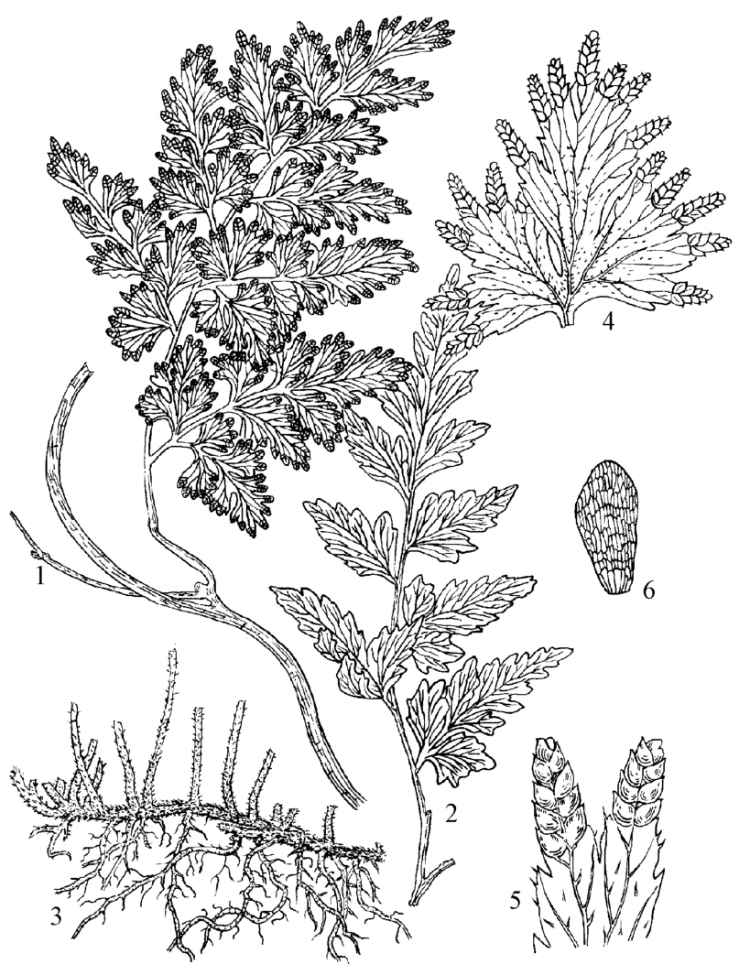
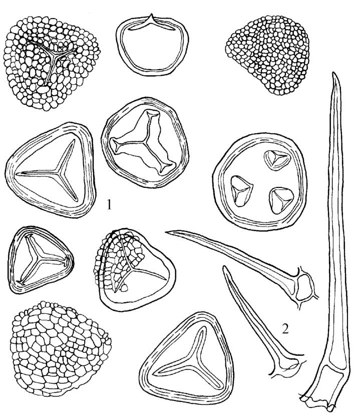
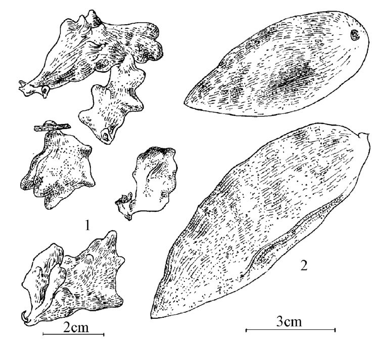
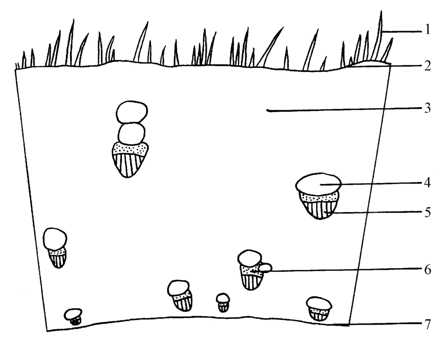
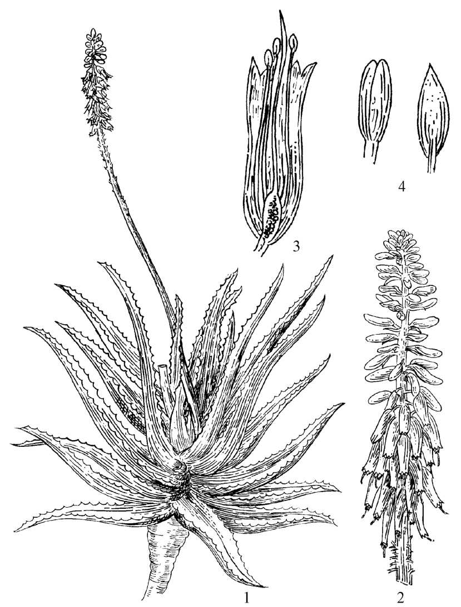

---
markmap:
  colorFreezeLevel: 2
  initialExpandLevel: 1
---

# 第十四章 其他类中药
- 其他类中药：指上述各章未能收载的中药，包括①植物体某部分或间接使用植物制品经加工处理所得产品（冰片、芦荟、青黛）；②蕨类植物成熟孢子（海金沙）；③植物器官因昆虫寄生形成的虫瘿（五倍子）；④植物体分泌或渗出的非树脂类混合物（天竺黄）
- 一般采用性状鉴别法，少数用显微鉴别法（海金沙、五倍子），理化鉴别法常用于加工品（青黛、芦荟、冰片）依据主要成分或有效成分定性鉴别

## 第二节 药材（饮片）鉴定

### 海金沙 Lygodii Spora
- 来源：海金沙科植物海金沙 *Lygodium japonicum* (Thunb.) Sw. 的干燥成熟孢子
- 产地：主产广东、浙江、江苏、湖北、湖南
- 采收加工：秋季孢子未脱落时采割藤叶晒干搓揉打下孢子
- 性状鉴别：粉末状棕黄色或浅棕黄色，体轻手捻有光滑感置手中易由指缝滑落；撒水面浮加热下沉；撒火上易燃烧发生爆鸣声且有闪光无残留灰渣；气微，味淡
  - 
- 显微鉴别：孢子四面体形三角状圆锥形外壁有颗粒状雕纹
  - 
- 成分：海金沙素；脂肪油（油酸、亚油酸）；反式-对-香豆酸和咖啡酸（利胆成分）
- 理化鉴别：聚酰胺薄膜薄层色谱与海金沙对照药材比对
- 功效：性寒，味甘、咸。清利湿热，通淋止痛
- 附注：全草为"海金沙藤"，功效同海金沙

### 青黛 Indigo Naturalis
- 来源：爵床科植物马蓝 *Baphicacanthus cusia* (Nees) Bremek.、蓼科植物蓼蓝 *Polygonum tinctorium* Ait. 或十字花科植物菘蓝 *Isatis indigotica* Fort. 的叶或茎叶经加工制得的干燥粉末、团块或颗粒
- 产地：主产福建、河北、江苏、云南、安徽
- 采收加工：夏秋采茎叶浸泡至叶腐烂茎脱皮，加石灰搅拌待浸液变紫红色后捞取液面蓝色泡沫状物晒干
- 性状鉴别：深蓝色粉末体轻易飞扬，或呈不规则多孔性团块、颗粒手搓捻即成细末；微有草腥气，味淡；以火烧产生紫红色烟雾时间长者为佳
- 成分：马蓝制青黛含靛玉红、靛蓝、异靛蓝；蓼蓝制青黛尚含靛苷、菘蓝苷；菘蓝制青黛尚含靛红
- 理化鉴别：微火灼烧有紫红色烟雾；滴加硝酸产生气泡显棕红色或黄棕色；薄层色谱与靛蓝、靛玉红对照品比对
- 含量测定：含靛蓝不得少于2.0%，含靛玉红不得少于0.13%
- 功效：性寒，味咸。清热解毒，凉血消斑，泻火定惊
- 附注：木蓝、野青树在部分地区亦为生产青黛的原植物，应注意鉴别

### 儿茶 Catechu
- 来源：豆科植物儿茶 *Acacia catechu* (L.f.) Willd. 去皮枝、干的干燥煎膏，商品习称"儿茶膏"或"黑儿茶"
- 产地：主产云南西双版纳，广东、广西、福建、海南亦产
- 采收加工：冬季采枝干去外皮加水煎煮浓缩干燥
- 性状鉴别：方块形或不规则块状表面棕褐色或黑褐色光滑而稍有光泽，质硬易碎断面不整齐具光泽有细孔遇潮有黏性；气微，味涩、苦，略回甜
- 显微鉴别：水装片可见针状结晶及黄棕色块状物
- 成分：儿茶鞣质20%～50%；儿茶素2%～20%；表儿茶素
- 理化鉴别：火柴杆浸水浸液干燥后浸盐酸烘烤显深红色；薄层色谱与儿茶素及表儿茶素对照品比对
- 含量测定：含儿茶素和表儿茶素总量不得少于21.0%
- 功效：性微寒，味苦、涩。活血止痛，止血生肌，收湿敛疮，清肺化痰
- 附注：儿茶钩藤带叶嫩枝的干燥煎膏习称"方儿茶"或"棕儿茶"，含儿茶鞣质约24%、儿茶素30%～35%，为另一来源

### 冰片（合成龙脑） Borneolum Syntheticum
- 来源：樟脑、松节油等经化学方法合成的结晶，又名"机制冰片"
- 性状鉴别：无色透明或白色半透明片状结晶表面有冰样裂纹，质松脆可剥离成薄片手捻即粉碎；气清香，味辛、凉，具挥发性；点燃发生浓烟并有带光火焰；熔点205℃～210℃
- 成分：主要为消旋龙脑
- 理化鉴别：加乙醇及新制香草醛硫酸溶液显紫色
- 含量测定：含龙脑不得少于55.0%，含樟脑不得过0.5%
- 功效：性微寒，味辛、苦。开窍醒神，清热止痛
- 附注：艾片为艾纳香叶提取结晶（左旋龙脑）；龙脑冰片（"龙脑片"或"梅片"）为龙脑树水蒸气蒸馏所得（右旋龙脑），印度尼西亚产；天然冰片为樟树枝叶提取加工制成（右旋龙脑，含量不得少于96.0%）

### 五倍子 Galla Chinensis
- 来源：漆树科植物盐肤木 *Rhus chinensis* Mill.、青麸杨 *R. potaninii* Maxim. 或红麸杨 *R. punjabensis* var. *sinica* (Diels) Rehd. et Wils. 叶上的虫瘿，主要由五倍子蚜寄生形成，按外形分"肚倍"和"角倍"
- 产地：主产四川、贵州、云南、陕西
- 采收加工：秋季采摘沸水略煮或蒸至表面灰色杀死蚜虫晒干
- 性状鉴别：肚倍呈长圆形或纺锤形囊状表面灰褐色或灰棕色微有柔毛质硬脆断面角质样有光泽内壁平滑有黑褐色死蚜虫及灰色粉末状排泄物；角倍呈菱形具不规则角状分枝柔毛较明显壁较薄；气特异，味涩
  - 
- 显微鉴别：内侧薄壁组织散有多数外韧型维管束维管束外侧有大型树脂道；薄壁细胞含糊化淀粉粒及少数草酸钙结晶
  - 
- 成分：五倍子鞣质（五倍子鞣酸）含量50%～70%最高达78%；没食子酸2%～4%
- 理化鉴别：薄层色谱与五倍子对照药材及没食子酸对照品比对
- 含量测定：含鞣质（以没食子酸计）不得少于50.0%
- 功效：性寒，味酸、涩。敛肺降火，涩肠止泻，敛汗，止血，收湿敛疮
- 附注：五倍子形成需三要素——寄主盐肤木类植物、五倍子蚜虫、过冬寄主提灯藓类植物

### 芦荟 Aloe
- 来源：百合科植物库拉索芦荟 *Aloe barbadensis* Miller、好望角芦荟 *Aloe ferox* Miller 或其他同属近缘植物叶的汁液浓缩干燥物，前者习称"老芦荟"后者习称"新芦荟"
- 产地：主产南美洲库拉索、阿律巴、博内耳及西印度群岛，我国南方部分省区有引种
- 采收加工：割取叶片切口向下放容器中取流出汁液蒸发浓缩冷却凝固
- 性状鉴别：库拉索芦荟呈不规则块状表面暗红褐色或深褐色无光泽体轻质硬不易破碎断面粗糙或显麻纹富吸湿性，有特殊臭气味极苦；好望角芦荟表面暗褐色略显绿色有光泽体轻质脆易碎断面玻璃样有层纹
  - 
- 显微鉴别：乳酸酚装片团块表面有细小针状结晶聚集成团
- 成分：芦荟总苷约25%（芦荟苷为主）；芦荟大黄素；树脂约12%；芦荟多糖
- 理化鉴别：水溶液加硼砂加热显绿色荧光紫外灯下显亮黄色荧光；加硝酸库拉索芦荟显棕红色好望角芦荟显黄绿色；薄层色谱与芦荟苷对照品比对
- 含量测定：库拉索芦荟含芦荟苷不得少于18.0%，好望角芦荟不得少于6.0%
- 功效：性寒，味苦。泻下通便，清肝泻火，杀虫疗疳
- 附注：我国栽培斑纹芦荟叶背面有斑纹含芦荟苷等成分；芦荟叶为各种芦荟新鲜叶片，清热消肿通便

### 天竺黄 Bambusae Concretio Silicea
- 来源：禾本科植物青皮竹 *Bambusa textilis* McClure 或华思劳竹 *Schizostachyum chinense* Rendle 等秆内分泌液干燥后的块状物
- 产地：主产云南，广东、广西亦产
- 性状鉴别：不规则片块或颗粒表面灰蓝色、灰黄色或灰白色有的洁白半透明略带光泽，体轻质硬脆易破碎吸湿性强；气微，味淡；置水中产生气泡原洁白色渐变淡绿色或天蓝色
- 成分：二氧化硅约90%；微量胆碱、甜菜碱、氰苷、核酸酶
- 理化鉴别：炽灼灰化后滤液加钼酸铵及硫酸亚铁试液显蓝色；体积比、吸水量检查
- 功效：性寒，味甘。清热豁痰，凉心定惊
- 附注：人工合成天竺黄表面玉石样质坚而重断面洁亮有光泽手搓有响声吸水性稍差，水浸液加酚酞试液显红色，可资区别
